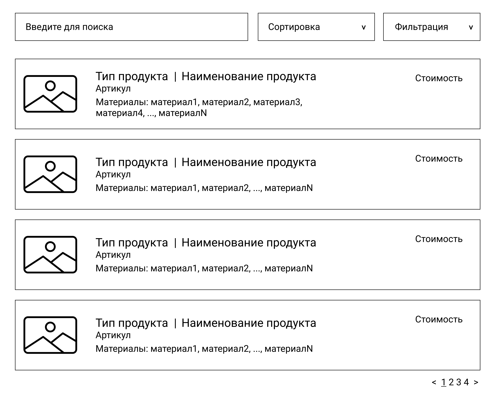

# Задание

# Критерии оценивания

Оценка 3 - Создать БД на сервере. Импортировать данные о товарах
Оценка 4 - В дополнении к первому пункут импортировать все данные, которые представлены в ресурсах
Оценка 5 - Разработать приложение согласно макету 

## Ресурсы для выполнение
[FINALTASK.ZIP](FINALTASK.ZIP)

1. Создайте БД.
2. Импортируйте данные предоставленные в ресурсах.
3. Разработайте приложение на основании представленного макета. 

Сортировка должна быть по возрастанию и убыванию стоимости товара.

Пользователь должен иметь  возможность  искать  товары,   используя  поисковую  строку.   
Поиск  должен  осуществляться  по  наименованию  товара.

В выпадающий список фильтрации подгрузите тип продукта.
Первым элементом списка должна быть строчка Все.

В  верхней  части  окна  необходимо 
показывать  количество  выведенных  данных  и  
общее  количество  записей  в  базе.   Например,   15 из 37 . 
В  случае,  если  данные  в  таблицу  выводятся  после  фильтрации  или  поиска,   количество  выведенных  данных  необходимо  обновить  исходя  из  размера  выборки.   