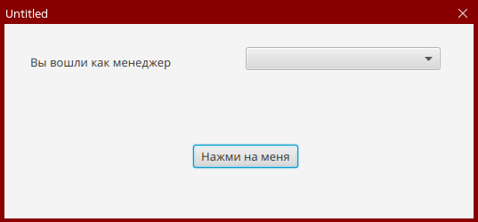
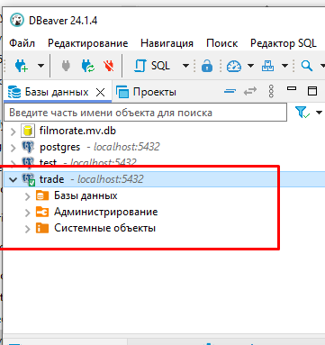
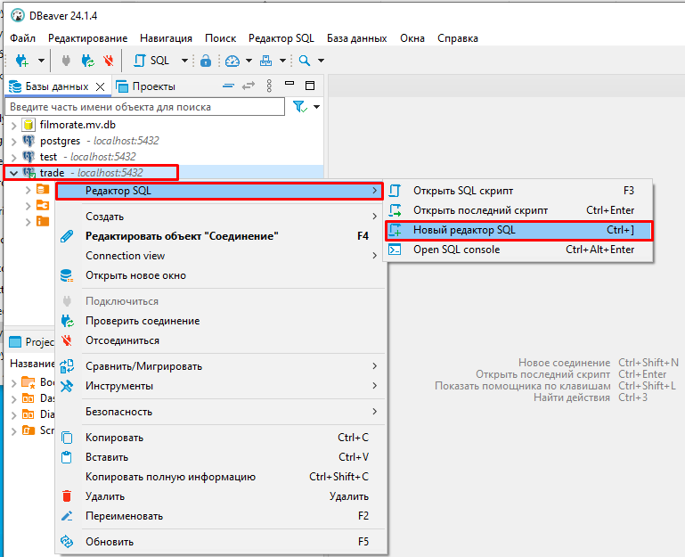
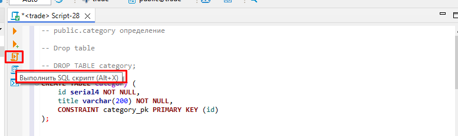
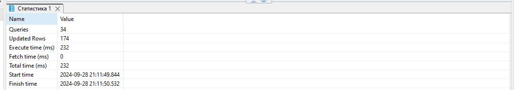
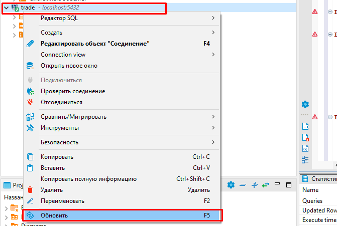
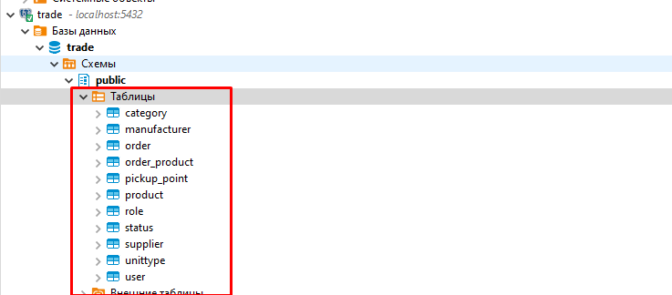
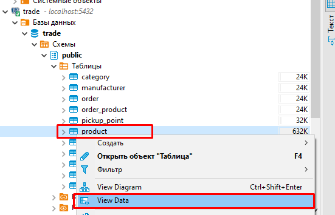
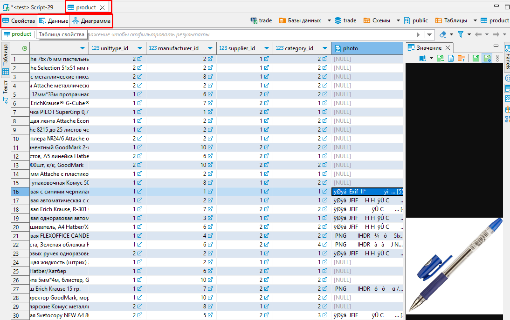

# Урок 1. Создание базы данных в Postgres

1. Запустите программу DBeaver

2. Нажмите на кнопку **Новое соединение**(Ctrl+Shift+N)

3. В появившемся окне нажмите на ярлык с изображением логотипа ```PostgreSQL``` и нажмите на кнопку **Далее**

4. В поле ```Хост``` укажите Ip-адрес сервера, на котором размещена ваша БД. Если БД располагается на вашем компьютере, то оставьте значение поля ```localhost```.  В поле ```База данных``` введите название БД, к которой выполяется подключение. Укажите имя пользователя в поле ```Пользователь``` и пароль в поле ```Пароль```. Затем нажмите на кнопку Тест соединения

5. Если учетные данные введены верно, то тест соединения пройдет успешно.


При необходимости скачайте драйвера, которые предложит DBeaver.

6. После успешного соединения слева в списках БД появится ваша с зеленой галочкой.

Это означает, что связь с БД установлена успешно.

## Создание таблиц БД из скрипта и загрузка данных.

1. Нажмите правой кнопкой мыши по ваше БД. В контекстном меню выберите пункт ```Редактор SQL``` и далее ```Новый редактор SQL```.

2. Вставьте в появишееся окно содержимое SQL скрипта [ScriptWithData.sql](ScriptWithData.sql)
3. Выполните скрипт, нажав на кнопку ```Выполнить SQL скрипт```

4. После выполнения скрипта в дополнительном окне ```Статистика``` отбразится информация

5. Нажмите правой кнопкой мыши на вашу БД в окне слева и выберите в контекстном меню пункт ```Обновить```.

6. Раскройте содержимое вашей БД. В списках таблиц должны появиться добавленные вами таблицы.

7. Просмотрите содержимое таблиц. Например, нажмите правой кнопкой мыши по таблицк **product**. В контекстном меню выберите пункт **View Data**. Справа появится вкладка с данной таблицей.

