Предыдущее занятие | &nbsp; | Следующее занятие
:----------------:|:----------:|:----------------:
[В начало](readme.md) | [Содержание](readme.md) | [Урок 2](Lesson2.md)

# Занятие 1.

## План
1. [Запуск и подключение к БД](#запуск-и-подключение-к-бд)
2. [Создание таблиц БД из скрипта и загрузка данных](#создание-таблиц-бд-из-скрипта-и-загрузка-данных)
3. [Словарь данных](#словарь-данных)
4. [Создание первого веб-приложения на Spring Boot](#создание-первого-веб-приложения-на-spring-boot)
5. [Задание](#задание)

---

## Запуск и подключение к БД

1. Запустите программу DBeaver
   
2. Нажмите на кнопку **Новое соединение** (Ctrl+Shift+N)
   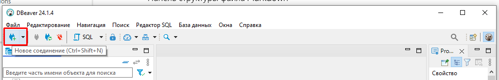
3. В появившемся окне нажмите на ярлык с изображением логотипа `PostgreSQL` и нажмите на кнопку **Далее**
   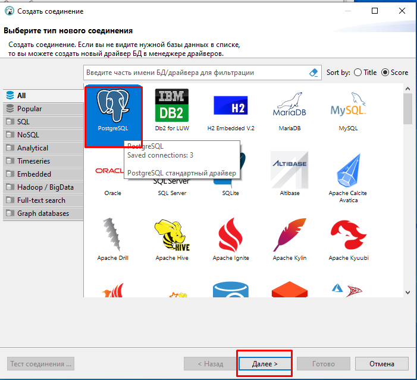
4. В поле `Хост` укажите Ip-адрес сервера, на котором размещена ваша БД. Если БД располагается на вашем компьютере, то оставьте значение поля `localhost`. В поле `База данных` введите название БД, к которой выполняется подключение. Укажите имя пользователя в поле `Пользователь` и пароль в поле `Пароль`. Затем нажмите на кнопку **Тест соединения**
   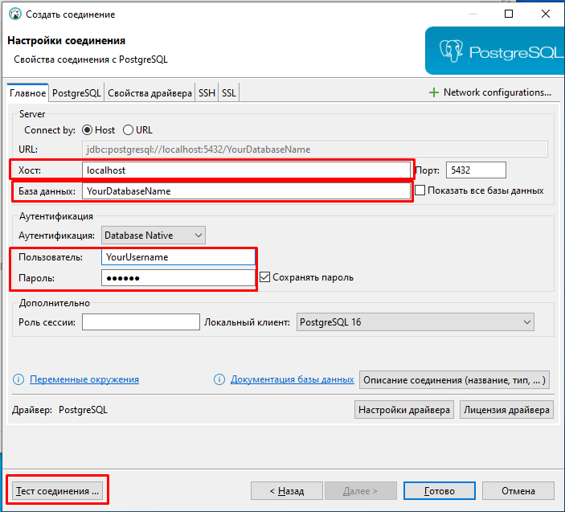
5. Если учетные данные введены верно, то тест соединения пройдет успешно.
   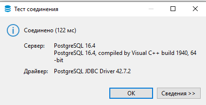

   При необходимости скачайте драйвера, которые предложит DBeaver.

6. После успешного соединения слева в списках БД появится ваша с зеленой галочкой.
   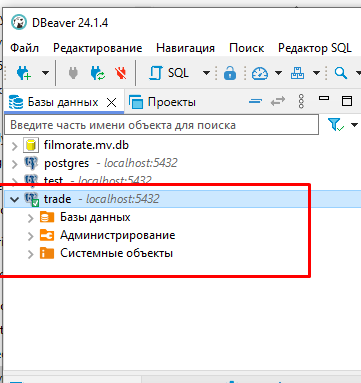

   Это означает, что связь с БД установлена успешно.

---

## Создание таблиц БД из скрипта и загрузка данных

1. Нажмите правой кнопкой мыши по вашей БД. В контекстном меню выберите пункт `Редактор SQL` и далее `Новый редактор SQL`.
   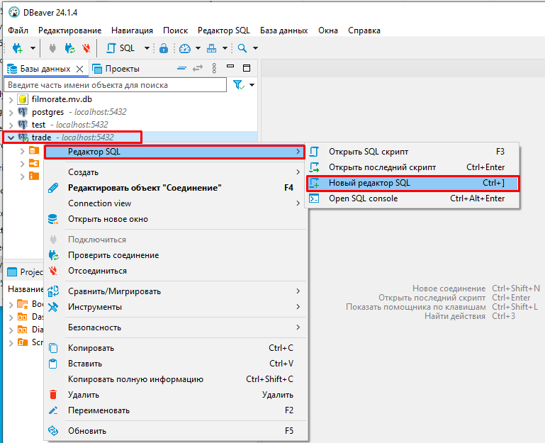
2. Вставьте в появившееся окно содержимое SQL скрипта [ScriptWithData.sql](ScriptWithData.sql)
3. Выполните скрипт, нажав на кнопку `Выполнить SQL скрипт`
   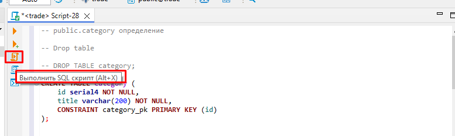
4. После выполнения скрипта в дополнительном окне `Статистика` отобразится информация
   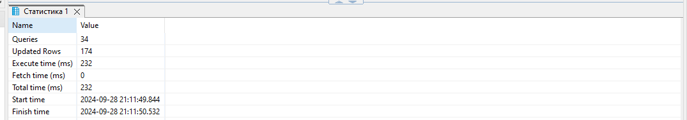
5. Нажмите правой кнопкой мыши на вашу БД в окне слева и выберите в контекстном меню пункт `Обновить`.
   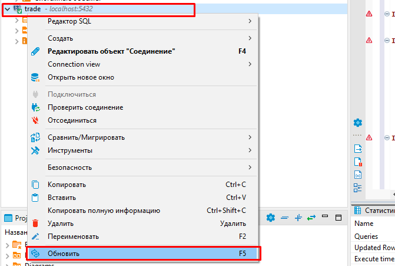
6. Раскройте содержимое вашей БД. В списках таблиц должны появиться добавленные вами таблицы.
   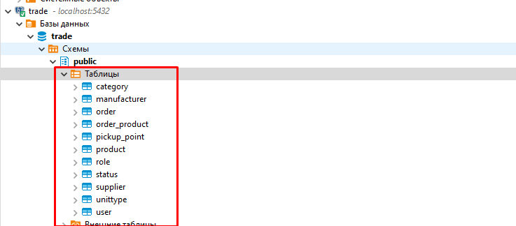
7. Просмотрите содержимое таблиц. Например, нажмите правой кнопкой мыши по таблице **product**. В контекстном меню выберите пункт **View Data**. Справа появится вкладка с данной таблицей.
   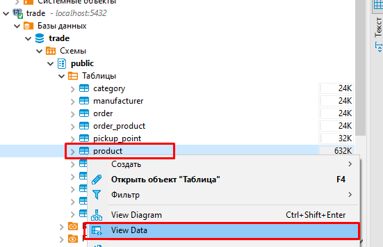
   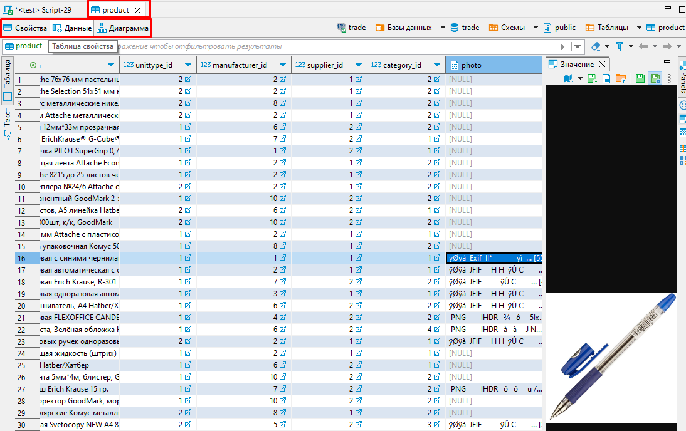
8. Нажмите правой кнопкой мыши по пункту **Таблицы**. Далее в контекстном меню выберите **View Diagram**.
   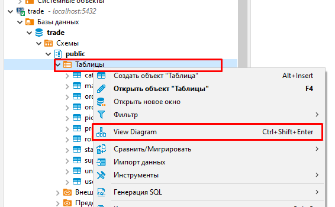

   Появится окно с диаграммой
   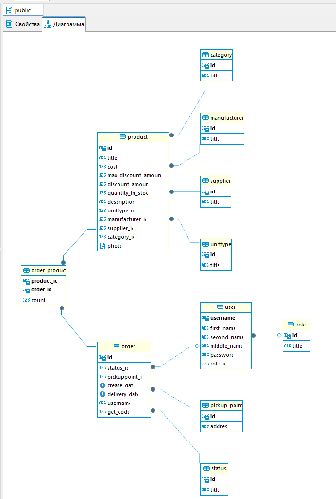

9. Нажмите в любом месте диаграммы правой кнопкой мыши, в контекстном меню выберите **Стили представления** и выберите еще два пункта **Показывать тип данных** и **Показывать допустимость значений NULL**.
   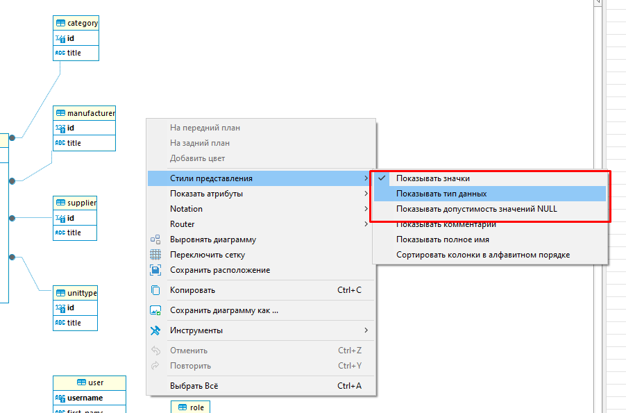

   Если все правильно будет настроено, получится вот такая схема.
   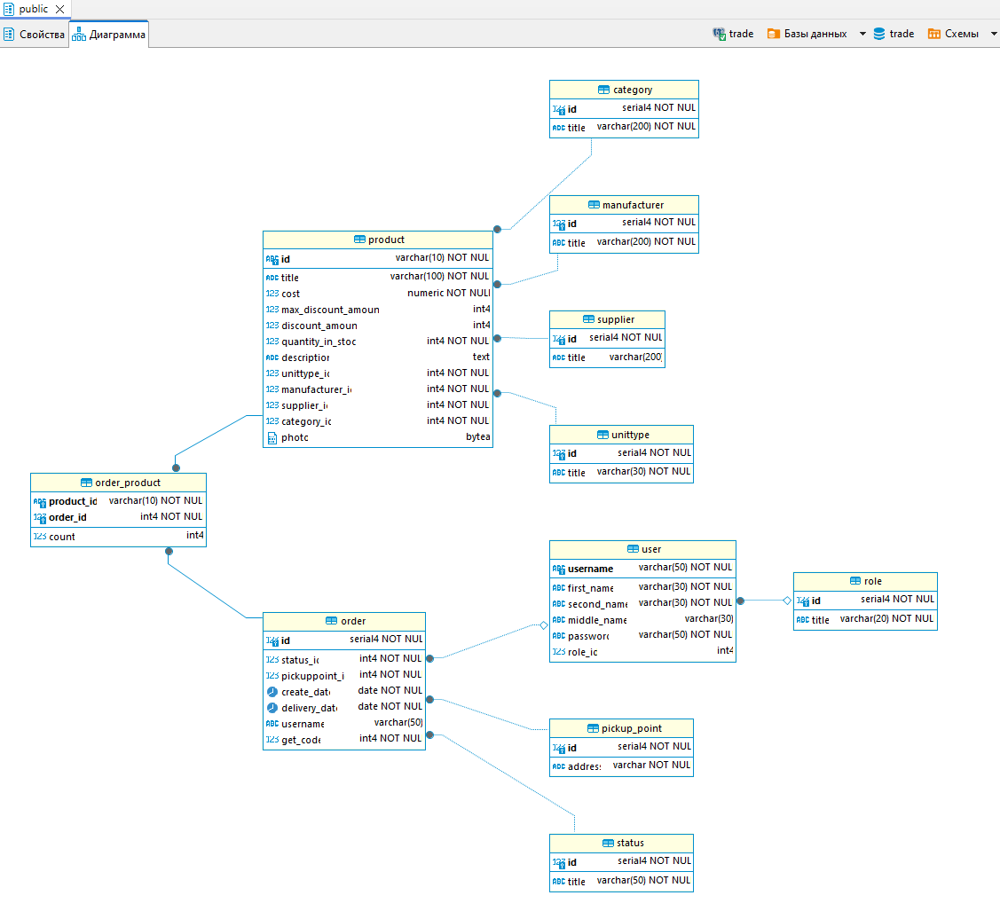

---

## Словарь данных

Недостатком ER-диаграмм является их недостаточная детализация данных, поэтому они часто дополняются более подробным описанием, которые собираются в словари данных.

> **Словарь данных** представляет собой определенным образом организованный список всех элементов данных системы с их точными определениями, что дает возможность различным категориям пользователей (от системного аналитика до программиста) иметь общее понимание всех входных и выходных потоков и компонентов хранилищ...

**Словарь данных** содержит описание сущностей (таблиц), включающее в себя определение атрибутов, а также дополнительные сведения, например, единицы измерения и диапазоны изменения атрибутов, цель определения такого объекта, сведения о его разработчике и времени создания и т.д.

В каталоге `docs` этого репозитория лежит [шаблон](docs/DataDictionary_Template.xlsx) словаря данных.

### Обозначения в словаре данных

* **Key** — признак, что поле является ключом. Для разных типов ключей приняты определенные обозначения:

    * **PK** — первичный ключ (primary key)
    * **FK** — внешний ключ (foreign key)
    * **IDX** — индекс (альтернативный ключ)

* **Field Name** — название атрибута (латиницей). Ещё раз напоминаю, что мы везде используем **CamelCase**

* **Data Type/Field Size** — тип данных / размерность поля

* **Required?** — вписывается "Y", если поле обязательное (для не обязательных ничего не пишем)

* **Notes** — примечание. Заполняется, если назначение поля не самоочевидно из названия или для поля есть *домен*

### Пример заполнения (учебный пример — «Клиенты»)

Возьмем описание предметной области одного из предыдущих демо-экзаменов и заполним словарь данных:

> **Подсистема работы с клиентами**
>
> Подсистема работы с клиентами включает в себя возможность добавления новых клиентов, отслеживание их посещений, а также контроль их бонусной программы.
>
> Запись о клиенте содержит следующие данные: фамилию, имя, отчество, дату рождения, телефон, электронную почту, пол, дату первого посещения (регистрации), фотографию клиента. В связи с тем что у компании большое количество клиентов, то их удобно собирать с помощью определенных ярлыков (тегов), которые позволят очень удобно помечать клиентов (например, новый, постоянный, проблемный, горячий). Теги помимо названия должны иметь еще и определенный цвет.
>
> Посещения клиента в рамках оказания услуг должны обязательно фиксироваться в БД.

Выделим из описания предметной области сущности:

* **Клиент**
* **Пол клиента**
* **Теги клиента**
* **Посещения клиента**

Заполним элемент *словаря данных* на примере таблицы **Клиент**:

| Key | Field Name | Data Type/Field Size | Required? | Notes |
|:---:|------------|----------------------|:---------:|-------|
| PK  | id         | INT                  | Y         | Синтетический первичный ключ, тип всегда INT (целое) |
|     | lastName   | varchar(30)          | Y         | Фамилия (строка), обязательное поле |
|     | firstName  | varchar(30)          | Y         | Имя (строка), обязательное поле |
|     | middleName | varchar(30)          |           | Отчество (строка), НЕ обязательное поле |
|     | birthDay   | DATE                 | Y         | Дата рождения |
|     | phone      | varchar(20)          | Y         | Телефон |
|     | eMail      | varchar(20)          | Y         | Электронная почта |
| FK  | genderId   | INT                  | Y         | Ссылка на словарь **Gender** |
|     | firstVisit | DATE                 |           | Дата первого посещения (регистрации). В принципе эту дату можно достать из таблицы «Посещения клиента» |
|     | photo      | BLOB                 |           | Фотографию клиента можно хранить в базе, но можно и в каком-либо каталоге на сервере |
| FK  | tagId      | INT                  |           | Ссылка на словарь **Теги клиента**. Причем тут опять же в зависимости от ТЗ может понадобиться промежуточная таблица, если у клиента может быть несколько тегов |

### Словарь данных для базы «Интернет-магазин канцтоваров»

Ниже — словарь для БД, которую вы только что создали из скрипта `ScriptWithData.sql`. Все 11 таблиц разобраны с указанием типов, обязательности и примечаний.

#### Таблица `category` — категории товаров

| Key | Field Name | Data Type/Field Size | Required? | Notes |
|:---:|------------|----------------------|:---------:|-------|
| PK  | id         | serial4 (INT)        | Y         | Синтетический первичный ключ, автоинкремент |
|     | title      | varchar(200)         | Y         | Название категории |

#### Таблица `manufacturer` — производители

| Key | Field Name | Data Type/Field Size | Required? | Notes |
|:---:|------------|----------------------|:---------:|-------|
| PK  | id         | serial4 (INT)        | Y         | Синтетический первичный ключ |
|     | title      | varchar(200)         | Y         | Название производителя |

#### Таблица `supplier` — поставщики

| Key | Field Name | Data Type/Field Size | Required? | Notes |
|:---:|------------|----------------------|:---------:|-------|
| PK  | id         | serial4 (INT)        | Y         | Синтетический первичный ключ |
|     | title      | varchar(200)         |           | Название поставщика |

#### Таблица `unittype` — единицы измерения

| Key | Field Name | Data Type/Field Size | Required? | Notes |
|:---:|------------|----------------------|:---------:|-------|
| PK  | id         | serial4 (INT)        | Y         | Синтетический первичный ключ |
|     | title      | varchar(30)          | Y         | Например, «шт.», «уп.» |

#### Таблица `role` — роли пользователей

| Key | Field Name | Data Type/Field Size | Required? | Notes |
|:---:|------------|----------------------|:---------:|-------|
| PK  | id         | serial4 (INT)        | Y         | Синтетический первичный ключ |
|     | title      | varchar(20)          | Y         | «Клиент», «Админист», «Менеджер» |

#### Таблица `status` — статусы заказов

| Key | Field Name | Data Type/Field Size | Required? | Notes |
|:---:|------------|----------------------|:---------:|-------|
| PK  | id         | serial4 (INT)        | Y         | Синтетический первичный ключ |
|     | title      | varchar(50)          | Y         | «Новый», «Завершен» |

#### Таблица `pickup_point` — пункты выдачи

| Key | Field Name | Data Type/Field Size | Required? | Notes |
|:---:|------------|----------------------|:---------:|-------|
| PK  | id         | serial4 (INT)        | Y         | Синтетический первичный ключ |
|     | address    | varchar              | Y         | Полный адрес пункта выдачи |

#### Таблица `user` — пользователи

| Key | Field Name | Data Type/Field Size | Required? | Notes |
|:---:|------------|----------------------|:---------:|-------|
|     | firstName  | varchar(30)          | Y         | Имя |
|     | secondName | varchar(30)          | Y         | Фамилия |
|     | middleName | varchar(30)          |           | Отчество |
| PK  | username   | varchar(50)          | Y         | Логин (первичный ключ, а не синтетический id) |
|     | password   | varchar(50)          | Y         | Пароль. В реальных системах должен храниться в виде хеша (BCrypt) |
| FK  | roleId     | INT                  |           | Ссылка на таблицу `role`. Может быть NULL |

#### Таблица `product` — товары

| Key | Field Name | Data Type/Field Size | Required? | Notes |
|:---:|------------|----------------------|:---------:|-------|
| PK  | id         | varchar(10)          | Y         | Артикул товара (например, `N592T4`). Первичный ключ — строка, а не INT |
|     | title      | varchar(100)         | Y         | Название товара |
|     | cost       | numeric              | Y         | Цена |
|     | maxDiscountAmount | int4          |           | Максимальный размер скидки |
|     | discountAmount    | int4          |           | Текущая скидка |
|     | quantityInStock   | int4          | Y         | Количество на складе |
|     | description       | text          |           | Описание товара |
| FK  | unittypeId        | int4          | Y         | Ссылка на `unittype` |
| FK  | manufacturerId    | int4          | Y         | Ссылка на `manufacturer` |
| FK  | supplierId        | int4          | Y         | Ссылка на `supplier` |
| FK  | categoryId        | int4          | Y         | Ссылка на `category` |
|     | photo             | bytea         |           | Фото товара (бинарные данные). На практике лучше хранить в файловом хранилище, а в БД — путь |

#### Таблица `order` — заказы

| Key | Field Name | Data Type/Field Size | Required? | Notes |
|:---:|------------|----------------------|:---------:|-------|
| PK  | id         | serial4 (INT)        | Y         | Синтетический первичный ключ |
| FK  | statusId   | int4                 | Y         | Ссылка на `status` |
| FK  | pickuppointId | int4              | Y         | Ссылка на `pickup_point` |
|     | createDate | date                 | Y         | Дата оформления заказа |
|     | deliveryDate | date               | Y         | Дата выдачи |
| FK  | username   | varchar(50)          |           | Ссылка на `user`. Может быть NULL (если пользователь удалён) |
|     | getCode    | int4                 | Y         | Код выдачи заказа |

#### Таблица `order_product` — состав заказа (связь M:M)

| Key | Field Name | Data Type/Field Size | Required? | Notes |
|:---:|------------|----------------------|:---------:|-------|
| PK, FK | productId | varchar(10)       | Y         | Ссылка на `product` |
| PK, FK | orderId   | int4              | Y         | Ссылка на `order` |
|     | count     | int4                 |           | Количество единиц товара в заказе |

### Как заполнять словарь данных

1. Откройте [шаблон](docs/DataDictionary_Template.xlsx).
2. Для **каждой** таблицы вашей БД создайте отдельный лист (по образцу).
3. Заполните колонки `Key`, `Field Name`, `Data Type/Field Size`, `Required?`, `Notes`.
4. Для внешних ключей в `Notes` указывайте, на какую таблицу и поле ссылается FK.
5. Для полей с ограничениями (например, `serial4`, `ON DELETE CASCADE`) — тоже пишите в `Notes`.
6. Сохраните файл под именем **`DataDictionaryOfФамилияИмя`** (например, `DataDictionaryOfIvanovIvan.xlsx`).

> 💡 В шаблоне уже есть пример заполнения — используйте его как ориентир.

---

## Создание первого веб-приложения на Spring Boot

> 🎯 **Цель раздела:** убедиться, что БД, которую вы только что создали, действительно связана с Java-приложением. Мы создадим минимальное Spring Boot приложение, которое:
> - подключается к вашей БД `demoN`,
> - отдаёт JSON со списком товаров,
> - отдаёт HTML-страницу со списком товаров.

Это первый шаг к полноценному веб-приложению интернет-магазина канцтоваров, данные которого уже лежат в вашей БД.

### 5.1. Что понадобится

| Инструмент | Где взять |
|------------|-----------|
| JDK 21 | [adoptium.net](https://adoptium.net/) |
| IntelliJ IDEA Community | [jetbrains.com/idea](https://www.jetbrains.com/idea/download/) |
| Spring Initializr | [start.spring.io](https://start.spring.io) |
| Ваши учётные данные | из файла [215.md](215.md) |

### 5.2. Создание проекта через Spring Initializr

1. Откройте [start.spring.io](https://start.spring.io).
2. Заполните поля:

| Параметр | Значение |
|----------|----------|
| Project | Maven |
| Language | Java |
| Spring Boot | 3.x (последняя стабильная) |
| Group | `com.example` |
| Artifact | `shop` |
| Name | `shop` |
| Package name | `com.example.shop` |
| Packaging | Jar |
| Java | 21 |

3. Нажмите **Add Dependencies** и добавьте:

| Зависимость | Назначение |
|-------------|------------|
| Spring Web | REST + MVC контроллеры |
| Spring Data JPA | Работа с БД |
| PostgreSQL Driver | Драйвер PostgreSQL |
| Thymeleaf | HTML-шаблоны |
| Lombok | Сокращение кода |
| Spring Boot DevTools | Автоперезагрузка |

4. Нажмите **Generate** → распакуйте архив в `C:\projects\shop`.
5. В IntelliJ: **File → Open** → выберите папку `shop` → дождитесь загрузки Maven.

### 5.3. Настройка `application.properties`

Откройте `src/main/resources/application.properties` и впишите свои данные из карточки:

```properties
# ===== Database =====
spring.datasource.url=jdbc:postgresql://192.168.2.202:5432/demoN
spring.datasource.username=userN
spring.datasource.password=ВАШ_ПАРОЛЬ
spring.datasource.driver-class-name=org.postgresql.Driver

# ===== JPA / Hibernate =====
spring.jpa.hibernate.ddl-auto=validate
spring.jpa.properties.hibernate.dialect=org.hibernate.dialect.PostgreSQLDialect
spring.jpa.show-sql=true

# ===== App =====
server.port=8080
spring.application.name=shop
```

> ⚠️ **Важно:** `ddl-auto=validate`, а **не** `update`. Схема уже создана скриптом, Hibernate не должен её менять. Если поставить `update`, Hibernate может «дописать» свои колонки и сломать структуру.

Замените:
- `demoN` → своя БД (например, `demo5`)
- `userN` → свой логин (например, `user5`)
- `ВАШ_ПАРОЛЬ` → свой пароль

### 5.4. Запуск приложения

В IntelliJ нажмите зелёную стрелку рядом с `ShopApplication.java`.

В консоли ищите:

```
HikariPool-1 - Starting...
HikariPool-1 - Start completed.
```

Если `HikariPool` появился — **подключение к БД успешно**.

Откройте `http://localhost:8080` — должна открыться страница Whitelabel Error Page (это нормально — контроллеров ещё нет).

### 5.5. Первый REST-контроллер

Создайте файл `src/main/java/com/example/shop/ProductController.java`:

```java
package com.example.shop;

import org.springframework.beans.factory.annotation.Autowired;
import org.springframework.jdbc.core.JdbcTemplate;
import org.springframework.web.bind.annotation.GetMapping;
import org.springframework.web.bind.annotation.RestController;

import java.util.List;
import java.util.Map;

@RestController
public class ProductController {

    @Autowired
    private JdbcTemplate jdbcTemplate;

    @GetMapping("/products")
    public List<Map<String, Object>> products() {
        return jdbcTemplate.queryForList(
            "SELECT id, title, cost, quantity_in_stock FROM product LIMIT 10"
        );
    }
}
```

Перезапустите приложение и откройте `http://localhost:8080/products`.

**Ожидаемый результат:** JSON-массив с 10 товарами из вашей БД.

Пример:

```json
[
  {"id":"N592T4","title":"Стикеры","cost":34,"quantity_in_stock":17},
  {"id":"N459R6","title":"Стикеры","cost":194,"quantity_in_stock":9}
]
```

> ✅ Если вы видите этот JSON — **БД + Spring Boot работают вместе**.

### 5.6. Первый HTML-шаблон (Thymeleaf)

Теперь сделаем то же самое, но в виде HTML-страницы.

1. Создайте файл `src/main/resources/templates/products.html`:

```html
<!DOCTYPE html>
<html xmlns:th="http://www.thymeleaf.org">
<head>
    <meta charset="UTF-8">
    <title>Товары</title>
    <style>
        body { font-family: Arial, sans-serif; margin: 20px; }
        table { border-collapse: collapse; width: 100%; }
        th, td { border: 1px solid #ccc; padding: 8px; text-align: left; }
        th { background: #f4f4f4; }
    </style>
</head>
<body>
    <h1>Список товаров</h1>
    <table>
        <thead>
            <tr>
                <th>ID</th>
                <th>Название</th>
                <th>Цена</th>
                <th>Остаток</th>
            </tr>
        </thead>
        <tbody>
            <tr th:each="p : ${products}">
                <td th:text="${p.id}"></td>
                <td th:text="${p.title}"></td>
                <td th:text="${p.cost}"></td>
                <td th:text="${p.quantity_in_stock}"></td>
            </tr>
        </tbody>
    </table>
</body>
</html>
```

2. Создайте файл `src/main/java/com/example/shop/ProductViewController.java`:

```java
package com.example.shop;

import org.springframework.beans.factory.annotation.Autowired;
import org.springframework.jdbc.core.JdbcTemplate;
import org.springframework.stereotype.Controller;
import org.springframework.ui.Model;
import org.springframework.web.bind.annotation.GetMapping;

@Controller
public class ProductViewController {

    @Autowired
    private JdbcTemplate jdbcTemplate;

    @GetMapping("/products-page")
    public String productsPage(Model model) {
        model.addAttribute("products", jdbcTemplate.queryForList(
            "SELECT id, title, cost, quantity_in_stock FROM product LIMIT 20"
        ));
        return "products";
    }
}
```

3. Перезапустите и откройте `http://localhost:8080/products-page`.

**Ожидаемый результат:** HTML-таблица со списком товаров.

> ✅ Теперь у вас есть и REST-API, и HTML-страница — основа будущего интернет-магазина.

### 5.7. Типичные ошибки

| Ошибка | Причина | Решение |
|--------|---------|---------|
| `Connection refused` | Неверный host/port | Проверить `192.168.2.202:5432` |
| `password authentication failed` | Неверный пароль | Взять из карточки |
| `database "demoN" does not exist` | Неверное имя БД | Уточнить у преподавателя |
| `Schema-validation: missing table` | `ddl-auto=validate`, но таблиц нет | Выполнить скрипт из шага 2 |
| `Port 8080 already in use` | Занят порт | `server.port=8081` |
| `Whitelabel Error Page` на `/` | Нет контроллера для `/` | Это нормально, откройте `/products` |

### 5.8. Что мы получили

| Что | Где | Результат |
|-----|-----|-----------|
| Приложение | `http://localhost:8080` | Работает |
| REST-API | `/products` | JSON со списком товаров |
| HTML-страница | `/products-page` | Таблица с товарами |
| БД | `demoN` в PostgreSQL | 11 таблиц, ~100 товаров |

> 📌 На следующих занятиях мы заменим `JdbcTemplate` на нормальные **Entity** и **Repository** (Spring Data JPA), добавим **навигацию**, **форму добавления**, **фильтры** и **аутентификацию**.

---

## Задание

Выполните все шаги урока:

1. **Подключение к БД** — DBeaver, шаги 1–6.
2. **Создание таблиц** — запуск `ScriptWithData.sql`, проверка (View Data, View Diagram).
3. **Словарь данных** — изучите структуру БД, которую вы создали. На основе [шаблона](docs/DataDictionary_Template.xlsx) создайте словарь данных. Назовите его **`DataDictionaryOfФамилияИмя`** (например, `DataDictionaryOfIvanovIvan.xlsx`). В словаре должны быть **все 11 таблиц** вашей БД с описанием каждого поля.
4. **Веб-приложение** — создайте Spring Boot проект `shop`, настройте подключение к своей БД, запустите приложение, добейтесь работоспособности:
   - `http://localhost:8080/products` → JSON с товарами
   - `http://localhost:8080/products-page` → HTML-таблица с товарами

Загрузите на gogs-сервер, создав репозиторий с названием **`Lesson1`**, используя свои учетные данные из файла [215.md](215.md). В репозиторий положите:
- словарь данных (`DataDictionaryOfФамилияИмя.xlsx`);
- папку `shop` с исходным кодом приложения;
- `.gitignore` (не забудьте исключить `target/`, `.idea/`, `application.properties`);
- `application.properties.example` вместо реального `application.properties`.

---

| Предыдущее занятие | &nbsp; | Следующее занятие |
|:----------------:|:----------:|:----------------:|
| [В начало](readme.md) | [Содержание](readme.md) | [Урок 2](Lesson2.md) |

---

## 💡 Что дальше (анонс урока 2)

На следующем занятии:
- Заменим `JdbcTemplate` на **Spring Data JPA** (`@Entity`, `@Repository`).
- Создадим сущности `Product`, `Category`, `Manufacturer`.
- Добавим **навигацию** между страницами.
- Начнём делать **форму добавления товара**.
