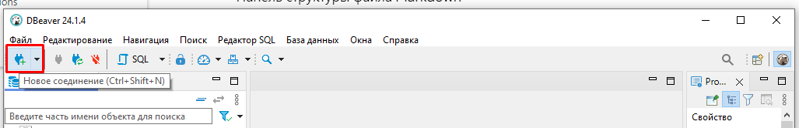

# Урок 1. Создание базы данных в Postgres

1. Запустите программу DBeaver

2. Нажмите на кнопку **Новое соединение**(Ctrl+Shift+N)

3. В появившемся окне нажмите на ярлык с изображением логотипа ```PostgreSQL``` и нажмите на кнопку **Далее**

4. В поле ```Хост``` укажите Ip-адрес сервера, на котором размещена ваша БД. Если БД располагается на вашем компьютере, то оставьте значение поля ```localhost```.  В поле ```База данных``` введите название БД, к которой выполяется подключение. Укажите имя пользователя в поле ```Пользователь``` и пароль в поле ```Пароль```. Затем нажмите на кнопку Тест соединения

5. Если учетные данные введены верно, то тест соединения пройдет успешно.


При необходимости скачайте драйвера, которые предложит DBeaver.

6. После успешного соединения слева в списках БД появится ваша с зеленой галочкой.

Это означает, что связь с БД установлена успешно.


----

## Создание таблиц БД из скрипта и загрузка данных.

1. Нажмите правой кнопкой мыши по ваше БД. В контекстном меню выберите пункт ```Редактор SQL``` и далее ```Новый редактор SQL```.

2. Вставьте в появишееся окно содержимое SQL скрипта [ScriptWithData.sql](ScriptWithData.sql)
3. Выполните скрипт, нажав на кнопку ```Выполнить SQL скрипт```

4. После выполнения скрипта в дополнительном окне ```Статистика``` отбразится информация

5. Нажмите правой кнопкой мыши на вашу БД в окне слева и выберите в контекстном меню пункт ```Обновить```.

6. Раскройте содержимое вашей БД. В списках таблиц должны появиться добавленные вами таблицы.

7. Просмотрите содержимое таблиц. Например, нажмите правой кнопкой мыши по таблицк **product**. В контекстном меню выберите пункт **View Data**. Справа появится вкладка с данной таблицей.


8. Нажмите правой кнопкой мыши по пункту **Таблицы**. Далее в контекстном меню выберите **View Diagram**.

Появится окно с диаграммой

9. Нажмите в любом месте диаграммы правой кнопкой мыши, в контекстном меню выберите **Стили представления** и выберите еще два пункта **Показывать тип данных** и **Показывать допустимость значений NULL**. 


Если все правильно будет настроено получится вот такая схема.


## Создание словаря данных

# Словарь данных

Недостатком ER-диаграмм является их недостаточная детализация данных, поэтому они часто дополняются более подробным описанием, которые собираются в словари данных.

>**Словарь данных** представляет собой определенным образом организованный список всех элементов данных системы с их точными определениями, что дает возможность различным категориям пользователей (от системного аналитика до программиста) иметь общее понимание всех входных и выходных потоков и компонентов хранилищ...

**Словарь данных** содержит описание сущностей (таблиц), включающее в себя определение атрибутов, а также дополнительные сведения, например, единицы измерения и диапазоны изменения атрибутов, цель определения такого объекта, сведения о его разработчике и времени создания и т.д.

В каталоге `docs` этого репозитория лежит [шаблон](docs/DataDictionary_Template.xlsx) словаря данных.

Возьмем описание предметной области одного из предыдущих демо-экзаменов и заполним словарь данных:

>**Подсистема работы с клиентами**
>
>Подсистема работы с клиентами включает в себя возможность добавления новых клиентов, отслеживание их посещений, а также контроль их бонусной программы.
>
>Запись о клиенте содержит следующие данные: фамилию, имя, отчество, дату рождения, телефон, электронную почту, пол, дату первого посещения (регистрации), фотографию клиента. В связи с тем что у компании большое количество клиентов, то их удобно собирать с помощью определенных ярлыков (тегов), которые позволят очень удобно помечать клиентов (например, новый, постоянный, проблемный, горячий). Теги помимо названия должны иметь еще и определенный цвет.
>
>Посещения клиента в рамках оказания услуг должны обязательно фиксироваться в БД.

Для начала, разберёмся какие параметры заносятся в *словарь данных*

* **Key** - признак, что поле является ключём. Для разных типов ключей приняты определенные обозначения:

    * **PK** - первичный ключ (primary key)
    * **FK** - внешний ключ (foreign key)
    * **IDX** - индекс (альтернативный ключ)

* **Field Name** - название атрибута (латиницей). Ещё раз напоминаю, что мы везде используем **CamelCase**

* **Data Type/Field Size** - тип данных / размерность поля

* **Required?** - вписывается "Y", если поле обязательное (для не обязательных ничего не пишем)

* **Notes** - примечание. Заполняется, если назначение поля не самоочевидно из названия или для поля есть *домен* 

Пример заполнения элемента *словаря данных*

**Во-первых**, Выделим из описания предметной области сущности:

* **Клиент**
* **Пол клиента**
* **Теги клиента**
* **Посещения клиента**

Заполним элемент *словаря данных* на примере таблицы **Клиент**

Key | Field Name | Data Type/Field Size | Required? | Notes | Мои примечания 
:-:|----|-----|:-:|---|---
PK | id | INT | Y |   | Синтетический первичный ключ, тип всегда INT (целое)
&nbsp;| lastName | varchar(30) | Y | | Фамилия (строка), обязательное поле
&nbsp;| firstName | varchar(30) | Y | | Имя (строка), обязательное поле
&nbsp;| middleName | varchar(30) | | | Отчество (строка), НЕ обязательное поле
&nbsp;| birthDay | DATE | Y | | Дата рождения 
&nbsp;| phone | varchar(20) | Y | | Телефон (тут тип данных может быть INT)
&nbsp;| eMail | varchar(20) | Y | | Электронная почта
FK | GenderId | INT | Y | | Ссылка на словарь **Gender**
&nbsp;| firstVisit | DATE | | | Дата первого посещения (регистрации). В принципе эту дату можно достать из таблицы "Посещения клиента"
&nbsp;| photo | BLOB | | | Фотографию клиента можно хранить в базе, но можно и в каком-либо каталоге на сервере
FK | tagId | INT | | | Ссылка на словарь **Теги клиента**. Причем тут опять же в зависимости от ТЗ может понадобиться промежуточная таблица, если у клиента может быть несколько тегов


# Задание
Изучите структуру БД, которую вы создали в Postgres. На основе [шаблона](docs/DataDictionary_Template.xlsx) словаря данных создайте словарь данных(Назовите его **DataDictionaryOfIvanovIvan**) для данной базы данных. 
Загрузите словарь данных на gogs-сервер создав репозиторий с названием "```Lesson1```" используя свои учетные данные из файла [215.md](215.md). 