Предыдущее занятие | &nbsp; | Следующее занятие
:----------------:|:----------:|:----------------:
[Урок 1](Lesson1.md) | [Содержание](readme.md) | [Урок 3](Lesson3.md)

# Урок 2. Создание Java FX приложения и подключение к БД

## План
1. [Создание проекта](#создание-проекта)
2. [Настройка проекта](#настройка-проекта)
   * [pom.xml](#pomxml)
   * [checkstyle.xml](#checkstylexml)
   * [suppressions.xml](#suppressionsxml)
3. [Настройка подключения к БД](#настройка-подключения-к-бд)
   * [hibernate.cfg.xml](#hibernatecfgxml)
   * [module-info.java](#module-infojava)
   * [Настройка стилей base-styles.css](#base-stylescss)
   * [Класс User](#User.java)
4. [package util]()
   * [класс HibernateSessionFactoryUtil.java](#класс-hibernatesessionfactoryutiljava)
   * [класс MakeCaptcha.java](#класс-makecaptchajava)
   * [Класс Manager.java](#класс-managerjava)
5. [package controllers]()
   * [LoginController.java](#logincontrollerjava)
   * [MainWindowController.java](#mainwindowcontrollerjava)
6. [package resources.ru.demo.tradeapp]()
   * [login-view.fxml](#login-viewfxml)
   * [main-view.fxml](#main-viewfxml)
7. [Файл TradeApp.java](#tradeappjava)
4. [Запуск приложения](#запуск-приложения)

## Создание проекта

1. Запустите IntelliJ IDEA.
2. Выберите слева вкладку **Projects**  и нажмите на кнопку **New Project**.
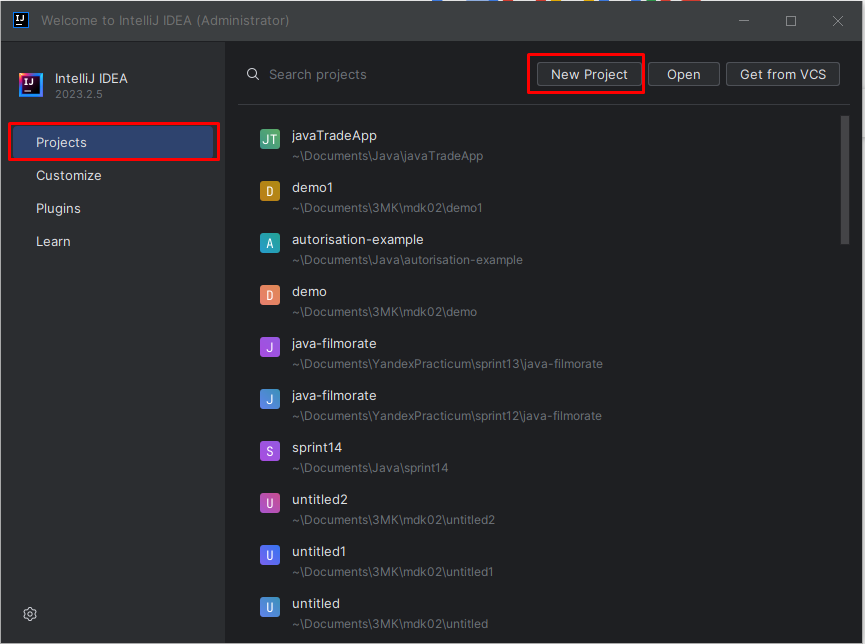
3. В появившемся окне выберите тип приложения JavaFX. Дайте имя проекту **trade-app**. 
Language - **Java**, Build system - **Maven**,  Group - **ru.demo**. В качестве JDK используйте Amazon Coretto 22. Нажмите **Next**.
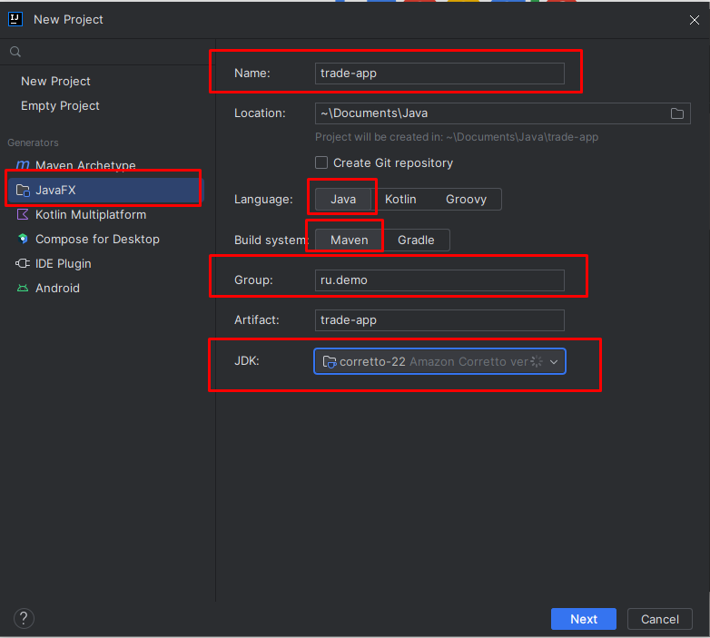
4. В следующем окне ничего не выбираем и нажимаем **Create**.
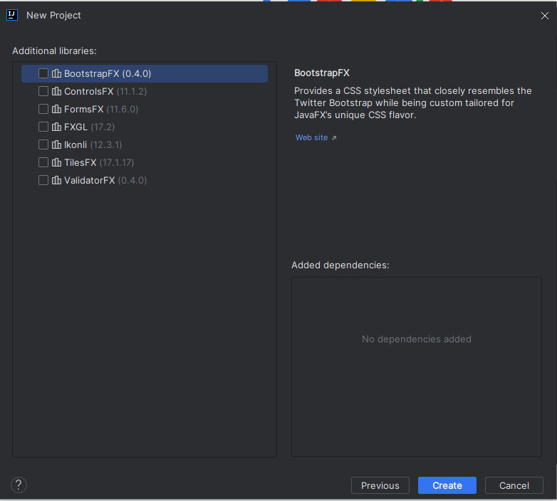
5. Если все настройки пройдены успещно появится окно с вашим проектом.
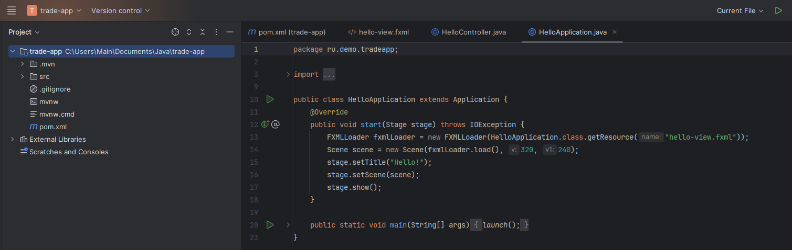
6. Откройте файл **HelloApplication.java**. Нажмите правой кнопкой мыши в любом месте программного кода и выберите в контекстном меню пункт Run HelloApplication.main()
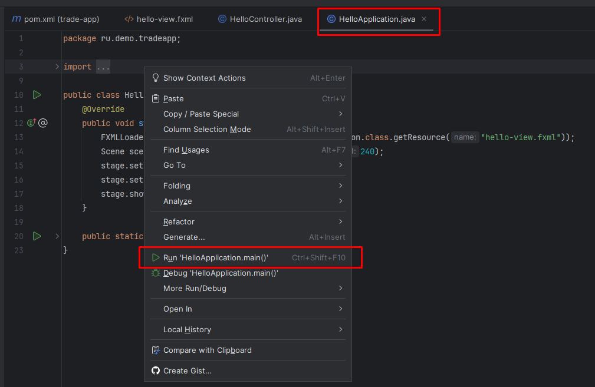
7. После этого запустится форма с одной кнопкой.
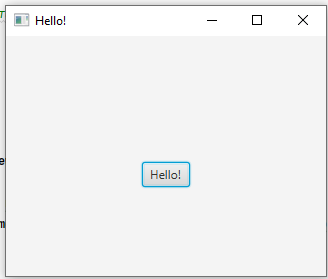

Проект успешно создан.

## Настройка проекта

1. Выделите слева в окне файл HelloApplication.java. Нажмите правой кнопкой мыши и в контекстном меню выберите пункт Refactor/Rename.
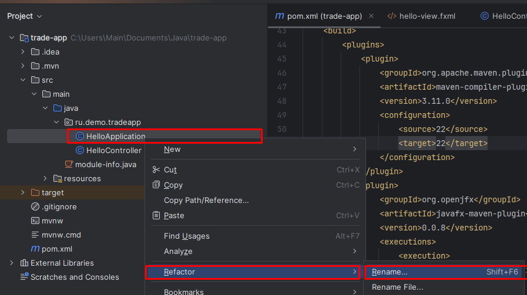
2. В открывшемся окне в поле названия проекта вместо HelloApplication напишите TradeApp  и нажмите на кнопку Refactor.
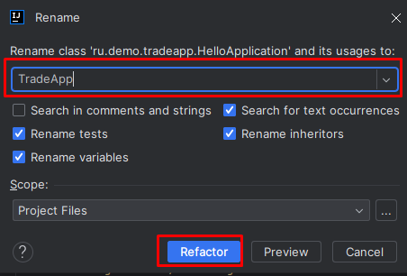
3. Аналогичным образом переименуйте файлы HelloController в LoginController, а файл hello-view.fxml в login-view.fxml.

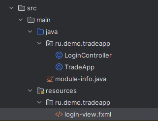

4. Откройте pom.xml файл 

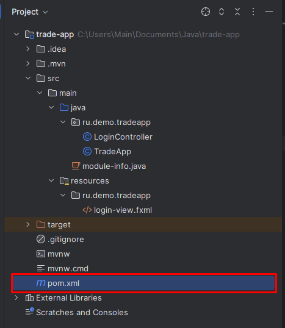

5. замените его код на следующий.

### pom.xml
```xml
<?xml version="1.0" encoding="UTF-8"?>
<project xmlns="http://maven.apache.org/POM/4.0.0"
         xmlns:xsi="http://www.w3.org/2001/XMLSchema-instance"
         xsi:schemaLocation="http://maven.apache.org/POM/4.0.0 https://maven.apache.org/xsd/maven-4.0.0.xsd">
    <modelVersion>4.0.0</modelVersion>

    <groupId>ru.trade</groupId>
    <artifactId>trade-app</artifactId>
    <version>1.0-SNAPSHOT</version>
    <name>trade-app</name>

    <properties>
        <project.build.sourceEncoding>UTF-8</project.build.sourceEncoding>
        <junit.version>5.9.2</junit.version>
    </properties>

    <dependencies>
        <!-- https://mvnrepository.com/artifact/com.gluonhq/charm-glisten -->
        <dependency>
            <groupId>org.hibernate.orm</groupId>
            <artifactId>hibernate-core</artifactId>
            <version>6.2.7.Final</version>
        </dependency>
        <dependency>
            <groupId>org.postgresql</groupId>
            <artifactId>postgresql</artifactId>
            <version>42.7.4</version>
        </dependency>
        <dependency>
            <groupId>org.openjfx</groupId>
            <artifactId>javafx-controls</artifactId>
            <version>21-ea+24</version>
        </dependency>
        <dependency>
            <groupId>org.openjfx</groupId>
            <artifactId>javafx-swing</artifactId>
            <version>13.0.2</version>
        </dependency>
        <dependency>
            <groupId>org.openjfx</groupId>
            <artifactId>javafx-fxml</artifactId>
            <version>21-ea+24</version>
        </dependency>
        <dependency>
            <groupId>org.junit.jupiter</groupId>
            <artifactId>junit-jupiter-api</artifactId>
            <version>${junit.version}</version>
            <scope>test</scope>
        </dependency>
        <dependency>
            <groupId>org.junit.jupiter</groupId>
            <artifactId>junit-jupiter-engine</artifactId>
            <version>${junit.version}</version>
            <scope>test</scope>
        </dependency>

    </dependencies>

    <build>
        <plugins>
            <plugin>
                <groupId>org.apache.maven.plugins</groupId>
                <artifactId>maven-compiler-plugin</artifactId>
                <version>3.11.0</version>
                <configuration>
                    <source>22</source>
                    <target>22</target>
                </configuration>
            </plugin>
            <plugin>
                <groupId>org.openjfx</groupId>
                <artifactId>javafx-maven-plugin</artifactId>
                <version>0.0.8</version>
                <executions>
                    <execution>
                        <!-- Default configuration for running with: mvn clean javafx:run -->
                        <id>default-cli</id>
                        <configuration>
                            <mainClass>ru.trade.tradeapp/ru.trade.tradeapp.TradeApp</mainClass>
                            <launcher>app</launcher>
                            <jlinkZipName>app</jlinkZipName>
                            <jlinkImageName>app</jlinkImageName>
                            <noManPages>true</noManPages>
                            <stripDebug>true</stripDebug>
                            <noHeaderFiles>true</noHeaderFiles>
                        </configuration>
                    </execution>
                </executions>
            </plugin>
            <plugin>
                <groupId>org.apache.maven.plugins</groupId>
                <artifactId>maven-checkstyle-plugin</artifactId>
                <version>3.3.1</version>
                <configuration>
                    <configLocation>checkstyle.xml</configLocation>
                    <includeTestSourceDirectory>true</includeTestSourceDirectory>
                    <failOnViolation>true</failOnViolation>
                    <logViolationsToConsole>true</logViolationsToConsole>
                </configuration>
                <executions>
                    <execution>
                        <goals>
                            <goal>check</goal>
                        </goals>
                        <phase>compile</phase>
                    </execution>
                </executions>
            </plugin>
        </plugins>
    </build>
</project>
```

6. Далее справа нажмите на кнопку M

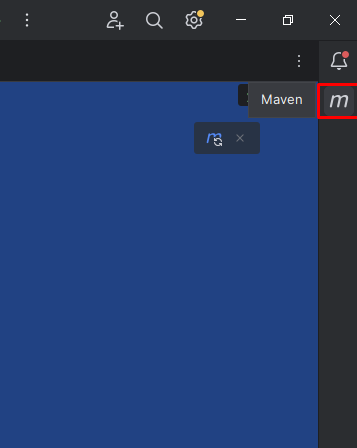
7. Далее в новом окошке нажмите на кнопку Reload All Maven Projects. Это нужно для того чтобы скачать пакеты в ваш проект.
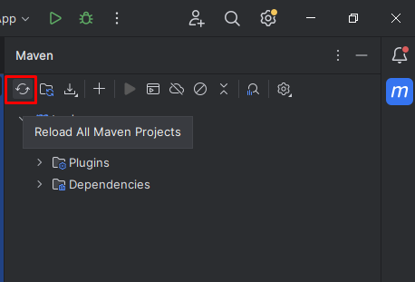

8. Добавьте в корень вашего проекта файл checkstyle.xml(этот файл позволит автоматически проверять codestyle проекта) и suppressions.xml со следующим содержимым

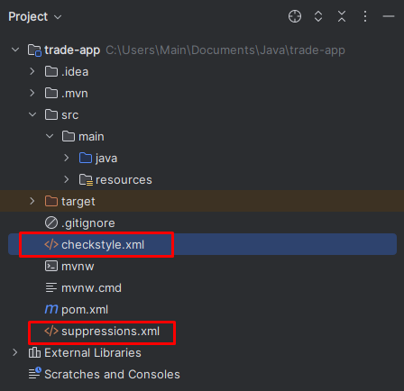
### checkstyle.xml
```xml
<?xml version="1.0" encoding="UTF-8"?>
<!DOCTYPE module PUBLIC "-//Puppy Crawl//DTD Check Configuration 1.3//EN"
		"http://www.puppycrawl.com/dtds/configuration_1_3.dtd">
<module name="Checker">
	<property name="severity" value="error"/>
	<property name="charset" value="UTF-8"/>
	<property name="fileExtensions" value="java, properties, xml"/>
	<module name="LineLength">
		<property name="severity" value="ignore"/>
		<property name="ignorePattern" value="^package.*|^import.*|a href|href|http://|https://|ftp://"/>
		<property name="max" value="120"/>
		<metadata name="net.sf.eclipsecs.core.lastEnabledSeverity" value="inherit"/>
	</module>
	<module name="TreeWalker">
		<module name="IllegalImport">
			<property name="regexp" value="true"/>
			<property name="illegalPkgs" value=".*\.shaded\..*"/>
		</module>
		<module name="OuterTypeFilename"/>
		<module name="IllegalTokenText">
			<property name="tokens" value="STRING_LITERAL, CHAR_LITERAL"/>
			<property name="format" value="\\u00(09|0(a|A)|0(c|C)|0(d|D)|22|27|5(C|c))|\\(0(10|11|12|14|15|42|47)|134)"/>
			<property name="message" value="Consider using special escape sequence instead of octal value or Unicode escaped value."/>
		</module>
		<!--		<module name="AvoidStarImport"/>-->
		<module name="OneTopLevelClass"/>
		<module name="NoLineWrap"/>
		<module name="EmptyBlock">
			<property name="option" value="TEXT"/>
			<property name="tokens" value="LITERAL_TRY, LITERAL_FINALLY, LITERAL_IF, LITERAL_ELSE, LITERAL_SWITCH"/>
		</module>
		<module name="RegexpSinglelineJava">
			<property name="format" value="^[ \t]*[{]"/>
			<property name="ignoreComments" value="true"/>
			<property name="message" value="Leading braces"/>
		</module>

		<module name="LeftCurly"/>
		<module name="RightCurly">
			<property name="id" value="RightCurlySame"/>
			<property name="tokens" value="LITERAL_TRY, LITERAL_CATCH, LITERAL_FINALLY, LITERAL_IF, LITERAL_ELSE, LITERAL_DO"/>
		</module>
		<module name="RightCurly">
			<property name="id" value="RightCurlyAlone"/>
			<property name="option" value="alone"/>
			<property name="tokens" value="CLASS_DEF, METHOD_DEF, CTOR_DEF, LITERAL_FOR, LITERAL_WHILE, STATIC_INIT, INSTANCE_INIT"/>
		</module>
		<module name="WhitespaceAround">
			<property name="allowEmptyConstructors" value="true"/>
			<property name="allowEmptyMethods" value="true"/>
			<property name="allowEmptyTypes" value="true"/>
			<property name="allowEmptyLoops" value="true"/>
			<message key="ws.notPreceded" value="WhitespaceAround: ''{0}'' is not preceded with whitespace."/>
			<message key="ws.notFollowed"
					 value="WhitespaceAround: ''{0}'' is not followed by whitespace. Empty blocks may only be represented as '{}' when not part of a multi-block statement (4.1.3)"/>
		</module>
		<module name="ArrayTypeStyle"/>
		<module name="MissingSwitchDefault">
			<property name="severity" value="ignore"/>
			<metadata name="net.sf.eclipsecs.core.lastEnabledSeverity" value="inherit"/>
		</module>
		<module name="UpperEll"/>
		<module name="ModifierOrder"/>
		<module name="EmptyLineSeparator">
			<property name="tokens"
					  value="IMPORT,CLASS_DEF,ENUM_DEF,INTERFACE_DEF,CTOR_DEF,METHOD_DEF,STATIC_INIT,INSTANCE_INIT,VARIABLE_DEF"/>
			<property name="allowNoEmptyLineBetweenFields" value="true"/>
		</module>
		<module name="SeparatorWrap">
			<property name="id" value="SeparatorWrapDot"/>
			<property name="option" value="nl"/>
			<property name="tokens" value="DOT"/>
		</module>
		<module name="SeparatorWrap">
			<property name="id" value="SeparatorWrapComma"/>
			<property name="option" value="EOL"/>
			<property name="tokens" value="COMMA"/>
		</module>
		<module name="SeparatorWrap">
			<property name="id" value="SeparatorWrapEllipsis"/>
			<property name="option" value="EOL"/>
			<property name="tokens" value="ELLIPSIS"/>
		</module>
		<module name="SeparatorWrap">
			<property name="id" value="SeparatorWrapArrayDeclarator"/>
			<property name="option" value="EOL"/>
			<property name="tokens" value="ARRAY_DECLARATOR"/>
		</module>
		<module name="SeparatorWrap">
			<property name="id" value="SeparatorWrapMethodRef"/>
			<property name="option" value="nl"/>
			<property name="tokens" value="METHOD_REF"/>
		</module>
		<module name="PackageName">
			<!--<property name="format" value="^[a-z]+(\.[a-z][a-z0-9]*)*$"/>-->
			<message key="name.invalidPattern" value="Package name ''{0}'' must match pattern ''{1}''."/>
		</module>
		<module name="TypeName">
			<message key="name.invalidPattern" value="Type name ''{0}'' must match pattern ''{1}''."/>
		</module>
		<module name="MemberName">
			<message key="name.invalidPattern" value="Member name ''{0}'' must match pattern ''{1}''."/>
		</module>
		<module name="ParameterName">
			<property name="format" value="^[a-z]([a-zA-Z0-9]*)?$"/>
			<property name="accessModifiers" value="public"/>
			<message key="name.invalidPattern" value="Parameter name ''{0}'' must match pattern ''{1}''."/>
		</module>
		<module name="CatchParameterName">
			<property name="format" value="^[a-z]([a-z0-9][a-zA-Z0-9]*)?$"/>
			<message key="name.invalidPattern" value="Catch parameter name ''{0}'' must match pattern ''{1}''."/>
		</module>
		<module name="LocalVariableName">
			<property name="format" value="^[a-z]([a-zA-Z0-9]*)?$"/>
			<property name="tokens" value="VARIABLE_DEF"/>
			<message key="name.invalidPattern" value="Local variable name ''{0}'' must match pattern ''{1}''."/>
		</module>
		<module name="ClassTypeParameterName">
			<property name="format" value="(^[A-Z][0-9]?)$|([A-Z][a-zA-Z0-9]*[T]$)"/>
			<message key="name.invalidPattern" value="Class type name ''{0}'' must match pattern ''{1}''."/>
		</module>
		<module name="MethodTypeParameterName">
			<property name="format" value="(^[A-Z][0-9]?)$|([A-Z][a-zA-Z0-9]*[T]$)"/>
			<message key="name.invalidPattern" value="Method type name ''{0}'' must match pattern ''{1}''."/>
		</module>
		<module name="InterfaceTypeParameterName">
			<property name="format" value="(^[A-Z][0-9]?)$|([A-Z][a-zA-Z0-9]*[T]$|[ID]$)"/>
			<message key="name.invalidPattern" value="Interface type name ''{0}'' must match pattern ''{1}''."/>
		</module>
		<module name="NoFinalizer">
			<property name="severity" value="ignore"/>
			<metadata name="net.sf.eclipsecs.core.lastEnabledSeverity" value="inherit"/>
		</module>
		<module name="GenericWhitespace">
			<message key="ws.notPreceded" value="GenericWhitespace ''{0}'' is not preceded with whitespace."/>
			<message key="ws.followed" value="GenericWhitespace ''{0}'' is followed by whitespace."/>
			<message key="ws.preceded" value="GenericWhitespace ''{0}'' is preceded with whitespace."/>
			<message key="ws.illegalFollow" value="GenericWhitespace ''{0}'' should followed by whitespace."/>
		</module>
		<!-- No trailing whitespace -->
		<module name="Regexp">
			<property name="format" value="[ \t]+$"/>
			<property name="illegalPattern" value="true"/>
			<property name="message" value="Trailing whitespace"/>
		</module>
		<module name="Indentation">
			<property name="severity" value="ignore"/>
			<property name="caseIndent" value="2"/>
			<property name="arrayInitIndent" value="2"/>
			<metadata name="net.sf.eclipsecs.core.lastEnabledSeverity" value="inherit"/>
		</module>
		<module name="AbbreviationAsWordInName">
			<property name="severity" value="ignore"/>
			<property name="allowedAbbreviationLength" value="1"/>
			<property name="ignoreFinal" value="false"/>
			<metadata name="net.sf.eclipsecs.core.lastEnabledSeverity" value="inherit"/>
		</module>
		<module name="VariableDeclarationUsageDistance">
			<property name="severity" value="ignore"/>
			<metadata name="net.sf.eclipsecs.core.lastEnabledSeverity" value="inherit"/>
		</module>
		<module name="UnusedImports"/>
		<module name="MethodParamPad"/>
		<module name="NoWhitespaceBefore">
			<property name="allowLineBreaks" value="true"/>
			<property name="tokens" value="COMMA, SEMI, POST_INC, POST_DEC, DOT, ELLIPSIS, METHOD_REF"/>
		</module>
		<module name="ParenPad"/>
		<module name="OperatorWrap">
			<property name="severity" value="ignore"/>
			<property name="option" value="NL"/>
			<property name="tokens"
					  value="BAND, BOR, BSR, BXOR, DIV, EQUAL, GE, GT, LAND, LE, LITERAL_INSTANCEOF, LOR, LT, MINUS, MOD, NOT_EQUAL, PLUS, QUESTION, SL, SR, STAR, METHOD_REF "/>
			<metadata name="net.sf.eclipsecs.core.lastEnabledSeverity" value="inherit"/>
		</module>
		<module name="AnnotationLocation">
			<property name="id" value="AnnotationLocationMostCases"/>
			<property name="tokens" value="CLASS_DEF, INTERFACE_DEF, ENUM_DEF, METHOD_DEF, CTOR_DEF"/>
		</module>
		<module name="AnnotationLocation">
			<property name="id" value="AnnotationLocationVariables"/>
			<property name="tokens" value="VARIABLE_DEF"/>
			<property name="allowSamelineMultipleAnnotations" value="true"/>
		</module>
		<module name="NonEmptyAtclauseDescription">
			<property name="severity" value="ignore"/>
			<metadata name="net.sf.eclipsecs.core.lastEnabledSeverity" value="inherit"/>
		</module>
		<module name="JavadocTagContinuationIndentation">
			<property name="severity" value="ignore"/>
			<metadata name="net.sf.eclipsecs.core.lastEnabledSeverity" value="inherit"/>
		</module>
		<module name="SummaryJavadoc">
			<property name="severity" value="ignore"/>
			<property name="forbiddenSummaryFragments" value="^@return the *|^This method returns |^A [{]@code [a-zA-Z0-9]+[}]( is a )"/>
			<metadata name="net.sf.eclipsecs.core.lastEnabledSeverity" value="inherit"/>
		</module>
		<module name="JavadocParagraph">
			<property name="severity" value="ignore"/>
			<metadata name="net.sf.eclipsecs.core.lastEnabledSeverity" value="inherit"/>
		</module>
		<module name="AtclauseOrder">
			<property name="severity" value="ignore"/>
			<property name="target" value="CLASS_DEF, INTERFACE_DEF, ENUM_DEF, METHOD_DEF, CTOR_DEF, VARIABLE_DEF"/>
			<property name="tagOrder" value="@param, @return, @throws, @deprecated"/>
			<metadata name="net.sf.eclipsecs.core.lastEnabledSeverity" value="inherit"/>
		</module>
		<module name="JavadocMethod">
			<property name="severity" value="ignore"/>
			<property name="allowedAnnotations" value="Override, Test"/>
			<property name="allowMissingParamTags" value="true"/>
			<property name="allowMissingReturnTag" value="true"/>
			<metadata name="net.sf.eclipsecs.core.lastEnabledSeverity" value="inherit"/>
		</module>
		<module name="MethodName">
			<property name="format" value="^[a-z][a-zA-Z0-9_]*|NVL$"/>
			<message key="name.invalidPattern" value="Method name ''{0}'' must match pattern ''{1}''."/>
		</module>
		<module name="SingleLineJavadoc">
			<property name="severity" value="ignore"/>
			<property name="ignoreInlineTags" value="false"/>
			<metadata name="net.sf.eclipsecs.core.lastEnabledSeverity" value="inherit"/>
		</module>
		<module name="EmptyCatchBlock">
			<property name="exceptionVariableName" value="expected|ignore"/>
		</module>
		<module name="JavadocStyle">
			<property name="severity" value="ignore"/>
			<property name="checkFirstSentence" value="false"/>
			<metadata name="net.sf.eclipsecs.core.lastEnabledSeverity" value="inherit"/>
		</module>
		<module name="JavadocStyle">
			<property name="severity" value="ignore"/>
			<property name="checkHtml" value="false"/>
			<metadata name="net.sf.eclipsecs.core.lastEnabledSeverity" value="inherit"/>
		</module>
		<module name="SummaryJavadoc">
			<property name="severity" value="ignore"/>
			<metadata name="net.sf.eclipsecs.core.lastEnabledSeverity" value="inherit"/>
		</module>
		<module name="SuppressWarningsHolder"/>
		<module name="SuppressionCommentFilter"/>
	</module>
	<module name="SuppressWarningsFilter"/>
	<module name="SuppressionFilter">
		<property name="file" value="suppressions.xml"/>
		<property name="optional" value="false"/>
	</module>
</module>

```

### suppressions.xml
```xml
<?xml version="1.0" encoding="UTF-8"?>
<!DOCTYPE suppressions PUBLIC
		"-//Checkstyle//DTD SuppressionFilter Configuration 1.2//EN"
		"https://checkstyle.org/dtds/suppressions_1_2.dtd">
<suppressions>
	<suppress checks=".*" files="target[\\/]generated-sources[\\/]"/>
</suppressions>
```

## Настройка подключения к БД
1. Добавьте в папку resourses файл ```hibernate.cfg.xml```

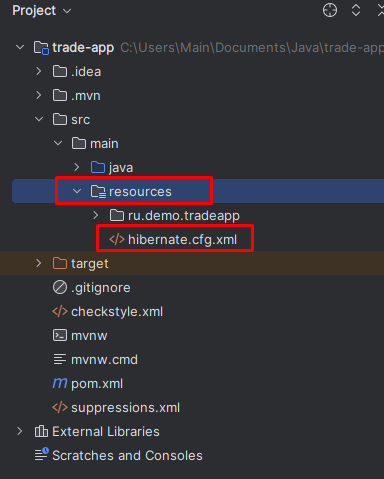

добавьте в него следующий код

### hibernate.cfg.xml
```xml
<?xml version = "1.0" encoding = "utf-8"?>
<!DOCTYPE hibernate-configuration PUBLIC
        "-//Hibernate/Hibernate Configuration DTD 3.0//EN"
        "http://www.hibernate.org/dtd/hibernate-configuration-3.0.dtd">
<hibernate-configuration>
    <session-factory>
        <!-- Set URL -->
        <property name = "hibernate.connection.url">jdbc:postgresql://192.168.2.202:5432/databasename</property>
        <!-- Set User Name -->
        <property name = "hibernate.connection.username">myusername</property>
        <!-- Set Password -->
        <property name = "hibernate.connection.password">mypassword</property>
        <!-- Set Driver Name -->
        <property name = "hibernate.connection.driver_class">org.postgresql.Driver</property>
        <property name = "hibernate.show_sql">true</property>
        <!-- Optional: Auto-generate schema -->
        <!-- <property name = "hibernate.hbm2ddl.auto">create</property> -->
        <mapping class="ru.demo.tradeapp.models.User" />
    </session-factory>
</hibernate-configuration>

```
Вместо **databasename** - укажите название БД, с которой вы работаете. Вместо **myusername** и **mypassword** укажите логин и пароль соответственно.
Строка ```<mapping class="ru.trade.tradeapp.models.User" />``` указывает название файла класса, который будет ассоциирован с таблицей **users** из бд.
В дальнейшем по мере разработки приложения, мы будем добавлять в этот файл новые классы.

2. Добавим в пакет ru.demo.tradeapp пакет controllers. Для этого нажмите правой кнопкой мыши по пакету  ru.demo.tradeapp. Далее в контекстном меню выберите New/Package
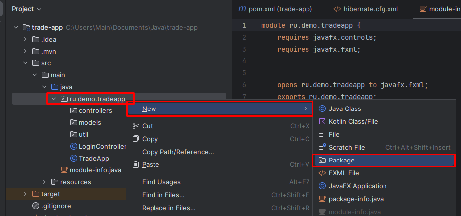
3. Укажите название пакета controllers  и нажмите Enter.

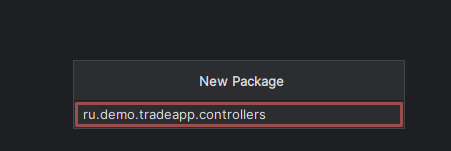
4. Аналогичным образом добавьте езе два пакета models и util.

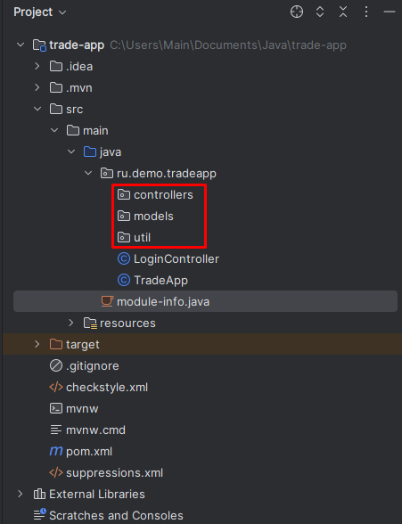
5. Простым перетаскиванием(выделите файл и удерживая левой кнопкой мыши) переместите файл LoginController.java в пакет controllers.

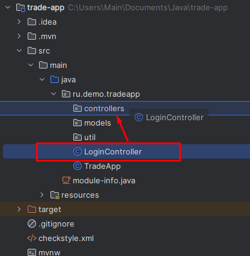
6. Подтвердите перемещение нажав на кнопку **Refactor**

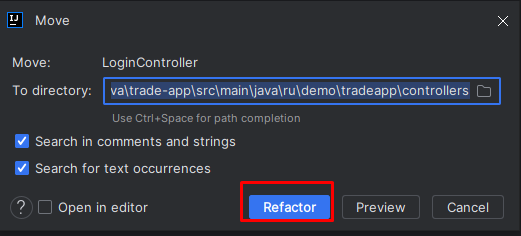
Должна получиться вот такая структура файлов

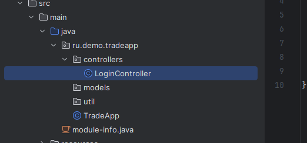
7. Откройте файл module-info.java.

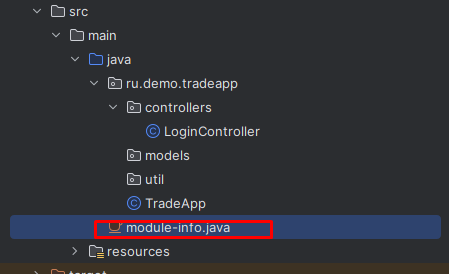

8. Замените содержимое файла на следующий код

### module-info.java
```java
module ru.demo.tradeapp {
    requires javafx.controls;
    requires javafx.fxml;
    requires jakarta.persistence;
    requires org.hibernate.orm.core;
    requires java.naming;
    requires java.desktop;
    requires javafx.swing;
    opens ru.demo.tradeapp to javafx.fxml;
    opens ru.demo.tradeapp.models to org.hibernate.orm.core;
    exports ru.demo.tradeapp;
    exports ru.demo.tradeapp.controllers;
    opens ru.demo.tradeapp.controllers to javafx.fxml;
}
```
9. Добавьте в папку resources файл base-styles.css

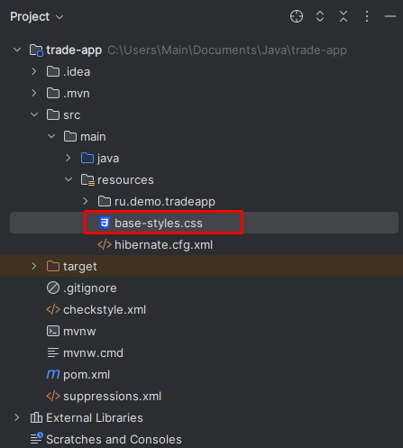

10. Добавьте в него следующий программный код.

### base-styles.css
```css
.root {
     -fx-main-bg-color: #FFF;
     -fx-additional-bg-color: #04AA6D;
     -fx-akcent-bg-color: #04AA6D;
 }


.button {

  -fx-border-style: solid; /* Green */
  -fx-border-color: -fx-additional-bg-color;
  -fx-background-color: #FFF;
  -fx-padding: 5px 5x;
  -fx-text-fill: #04AA6D;
  -fx-text-align: center;
  -fx-display: inline-block;
  -fx-font-size: 16px;
  -fx-font-weight: bold;
}

.button:hover {
  -fx-background-color: white; /* Green */
  -fx-border-color: none;
  -fx-text-color: #04AA6D;
}

.text-field
{
  -fx-border-style: solid; /* Green */
  -fx-border-width: 0.1px; /* Green */
  -fx-border-color: black;

}

.header-label
{

    -fx-font-size: 18px;
    -fx-font-weight: bold;
    -fx-background-color: -fx-akcent-bg-color; /* Green */
    -fx-text-fill: #FFF;
}
```
11. Добавьте в папку ru.demo.tradeapp, которая располагается в папке resources две картинки

 
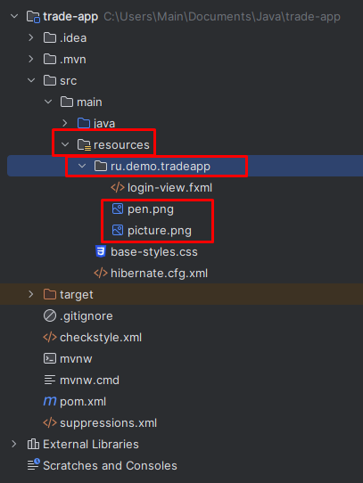

12. В пакет models добавьте класс User

### User.java
```java
package ru.demo.tradeapp.models;

// Java Program to Illustrate Creation of Simple POJO Class

// Importing required classes

import jakarta.persistence.Column;
import jakarta.persistence.Entity;
import jakarta.persistence.Id;
import jakarta.persistence.Table;

@Entity
@Table(name = "users", schema = "public")
// POJO class
public class User {
    @Id
    @Column(name = "username")
    private String username;

    @Column(name = "first_name")
    private String firstName;
    @Column(name = "second_name")
    private String secondName;
    @Column(name = "middle_name")
    private String middleName;

    @Column(name = "password")
    private String password;

    @Column(name = "role_id")
    private Long roleId;

    public String getUsername() {
        return username;
    }

    public void setUsername(String username) {
        this.username = username;
    }

    public String getFirstName() {
        return firstName;
    }

    public void setFirstName(String firstName) {
        this.firstName = firstName;
    }

    public String getSecondName() {
        return secondName;
    }

    public void setSecondName(String secondName) {
        this.secondName = secondName;
    }

    public String getMiddleName() {
        return middleName;
    }

    public void setMiddleName(String middleName) {
        this.middleName = middleName;
    }

    public String getPassword() {
        return password;
    }

    public void setPassword(String password) {
        this.password = password;
    }

    public Long getRoleId() {
        return roleId;
    }

    public void setRoleId(Long roleId) {
        this.roleId = roleId;
    }


}

```

13. Добавьте в пакет util следующие классы.

### класс HibernateSessionFactoryUtil.java
```java
package ru.demo.tradeapp.util;

import org.hibernate.SessionFactory;
import org.hibernate.cfg.Configuration;
import ru.demo.tradeapp.models.User;

public class HibernateSessionFactoryUtil {

private static SessionFactory sessionFactory;

private HibernateSessionFactoryUtil() {}

public static SessionFactory getSessionFactory() {
    if (sessionFactory == null) {
        try {
            Configuration configuration = new Configuration();
            configuration.configure("hibernate.cfg.xml");
            sessionFactory = configuration.buildSessionFactory();

        } catch (Exception e) {
            System.out.println("Исключение!" + e);
        }
    }
    return sessionFactory;
}
}
```

### класс MakeCaptcha.java

```java
package ru.demo.tradeapp.util;

import javafx.embed.swing.SwingFXUtils;
import javafx.scene.image.Image;

import java.awt.*;
import java.awt.image.BufferedImage;
import java.io.IOException;
import java.util.Random;


public class MakeCaptcha {

    private static String captchaCode;

    public static Image CreateImage(int width, int height, int symbolCount) throws IOException {
        Random rnd = new Random();
        //Создадим изображение
        BufferedImage result = new BufferedImage(width, height, BufferedImage.TYPE_INT_RGB);
        Graphics2D g2d = result.createGraphics();
        g2d.setColor(Color.lightGray);
        g2d.fillRect(0, 0, width, height);
        //draw a string

        //Сгенерируем текст
        char symbol;
        // нбор допустимых символов
        String alphabet = "23456789QWERTYUPASDFGHJKLZXCVBNM";
        // текст капчи
        String captcha = "";
        // размер поля для одного символа
        int h = width / symbolCount;
        for (int i = 0; i < symbolCount; ++i) {
            // генерируем размер буквы
            int size = rnd.nextInt(20) + 20;
            g2d.setFont(new Font("Arial", Font.BOLD, size));
            // выбираем любой символ из допустимого набора
            symbol = alphabet.charAt(rnd.nextInt(alphabet.length()));

            g2d.setPaint(getRandomColor());
            // текст капчи
            captcha += symbol;
            // генерируем позиции рисования символа
            int Xpos = rnd.nextInt(h / 2) + h * i;
            int Ypos = rnd.nextInt(height / 2) + 20;
            g2d.drawString(String.valueOf(symbol), Xpos, Ypos);
        }
        // add lines
        for (int i = 0; i < 10; ++i) {
            g2d.setPaint(getRandomColor());
            int x1 = rnd.nextInt(width / 10);
            int y1 = rnd.nextInt(height);

            int x2 = rnd.nextInt(width);
            int y2 = rnd.nextInt(height);
            g2d.drawLine(x1, y1, x2, y2);
        }

        for (int i = 0; i < 100; ++i) {
            g2d.setPaint(getRandomColor());
            int x1 = rnd.nextInt(width);
            int y1 = rnd.nextInt(height);
            g2d.draw(new Rectangle(x1, y1, 1, 1));
        }

        captchaCode = captcha;
        //disposes of this graphics context and releases any system resources that it is using
        g2d.dispose();
        return SwingFXUtils.toFXImage(result, null);
    }

    public static String captchaCode() {
        return captchaCode;
    }

    public static Color getRandomColor()
    {
        Random rnd = new Random();
        int red = rnd.nextInt(256);
        int green = rnd.nextInt(256);
        int blue = rnd.nextInt(256);
        return  new Color(red, green, blue);
    }
}
```

### Класс Manager.java
```java
package ru.demo.tradeapp.util;

import javafx.application.Platform;
import javafx.scene.control.Alert;
import javafx.scene.control.ButtonType;
import javafx.stage.Stage;
import ru.demo.tradeapp.models.User;

import java.util.Optional;

public class Manager {
    public static User currentUser = null;
    public static Stage mainStage;

    public static void ShowPopup() {
        Alert alert = new Alert(Alert.AlertType.CONFIRMATION);
        alert.setTitle("Закрыть приложение");
        alert.setHeaderText("Вы хотите выйти из приложения?");
        alert.setContentText("Все несохраненные данные, будут утеряны");

        Optional<ButtonType> result = alert.showAndWait();
        if (result.get() == ButtonType.OK) {
            Platform.exit();
        }
    }

    public static void ShowErrorMessageBox(String message) {
        Alert alert = new Alert(Alert.AlertType.ERROR);
        alert.setTitle("Ошибка");
        alert.setHeaderText(message);
        alert.showAndWait();

    }
}

```

14. Замените код файла LoginController.java на этот код.
### LoginController.java
```java
package ru.demo.tradeapp.controllers;

import jakarta.persistence.Query;
import javafx.event.ActionEvent;
import javafx.fxml.FXML;
import javafx.fxml.FXMLLoader;
import javafx.fxml.Initializable;
import javafx.scene.Scene;
import javafx.scene.control.Button;
import javafx.scene.control.PasswordField;
import javafx.scene.control.TextField;
import javafx.scene.image.ImageView;
import javafx.scene.layout.RowConstraints;
import javafx.stage.Stage;
import org.hibernate.Session;
import ru.demo.tradeapp.TradeApp;
import ru.demo.tradeapp.models.User;
import ru.demo.tradeapp.util.HibernateSessionFactoryUtil;
import ru.demo.tradeapp.util.MakeCaptcha;
import ru.demo.tradeapp.util.Manager;

import java.io.IOException;
import java.net.URL;
import java.util.*;

import static ru.demo.tradeapp.util.Manager.ShowErrorMessageBox;

public class LoginController implements Initializable {

    boolean isWrongCaptha;
    boolean isShowCaptha;
    String captchaCode;
    int secondsLeft;
    @FXML
    private Button BtnCancel;
    @FXML
    RowConstraints ThirdRow;
    @FXML
    private Button BtnOk;
    @FXML
    private PasswordField PasswordField;
    @FXML
    private TextField TextFieldUsername;
    @FXML
    private TextField TextFieldCaptcha;
    @FXML
    private ImageView ImageViewCaptcha;
    @FXML Button BtnRenewCaptcha;


    @Override
    public void initialize(URL url, ResourceBundle resourceBundle) {
        initController();
    }

    @FXML
    void BtnRenewCaptchaAction(ActionEvent event) {
        generateCaptcha();
    }
    @FXML
    void BtnCancelAction(ActionEvent event) {
        Manager.ShowPopup();
    }

    @FXML
    void BtnOkActon(ActionEvent event) {
        try (Session session = HibernateSessionFactoryUtil.getSessionFactory().openSession()) {
            Query query = session.createQuery("from User", User.class);
            List<User> users = query.getResultList();
            Optional<User> person = users.stream().filter(user -> user.getUsername().equals(TextFieldUsername.getText()) &&
                    user.getPassword().equals(PasswordField.getText())).findFirst();

            if (person.isEmpty() && isShowCaptha && !TextFieldCaptcha.getText().equals(captchaCode)) {
                System.out.println("Bad error");
                ShowErrorMessageBox("Не верный логин, пароль или текст капчи");
                blockButtons();
                return;
            }
            if (person.isEmpty() && (!isShowCaptha)) {
                System.out.println("Bad error");
                generateCaptcha();
                isShowCaptha = true;
                ThirdRow.setPrefHeight(50);
                ImageViewCaptcha.setVisible(true);
                TextFieldCaptcha.setVisible(true);
                BtnRenewCaptcha.setVisible(true);
                ShowErrorMessageBox("Не верный логин или пароль");
                return;
            }
            if (person.isPresent() && isShowCaptha && !TextFieldCaptcha.getText().equals(captchaCode)) {
                blockButtons();
                ShowErrorMessageBox("Не верный логин, пароль или текст капчи");
                return;
            }

            if (person.isPresent() && isShowCaptha && TextFieldCaptcha.getText().equals(captchaCode)) {
                showMainWindow(person.get());
                return;
            }

            if (person.isPresent() && !isShowCaptha) {
                showMainWindow(person.get());
            }
        }
    }

    public void generateCaptcha() {
        try {
            ImageViewCaptcha.setImage(MakeCaptcha.CreateImage(150,40, 4));
            captchaCode = MakeCaptcha.captchaCode();
            System.out.println(captchaCode);
        } catch (IOException e) {
            System.out.println(e.getMessage());
        }
    }


    public void showMainWindow(User person) {
        Manager.currentUser = person;
        System.out.println(Manager.currentUser);
        Manager.mainStage.hide();
        Stage newWindow = new Stage();
        FXMLLoader fxmlLoader = new FXMLLoader(TradeApp.class.getResource("main-view.fxml"));
        Scene scene = null;
        try {
            scene = new Scene(fxmlLoader.load());
        } catch (IOException e) {
            throw new RuntimeException(e);
        }
        newWindow.setTitle("Вы вошли как " + Manager.currentUser.getFirstName());
        newWindow.setScene(scene);
        newWindow.setOnCloseRequest(e -> {
            Manager.mainStage.show();
        });

        newWindow.show();
    }

    public void initTimer() {
        TimerTask task = new TimerTask() {
            public void run() {
                System.out.println("Task performed on: " + new Date() + "n" +
                        "Thread's name: " + Thread.currentThread().getName());
                secondsLeft--;
                if (secondsLeft == 0) ;
                {
                    BtnOk.setDisable(false);
                    BtnCancel.setDisable(false);
                    this.cancel();
                }
            }
        };
        Timer timer = new Timer("Timer");

        long delay = 10000L;
        timer.schedule(task, delay);
    }

    public void blockButtons()
    {
        initTimer();
        secondsLeft = 10;
        BtnOk.setDisable(true);
        BtnCancel.setDisable(true);
    }
    public void initController()
    {
        this.isWrongCaptha = false;
        this.isShowCaptha = false;
        ThirdRow.setPrefHeight(0);
        TextFieldCaptcha.setVisible(false);
        BtnRenewCaptcha.setVisible(false);
        ImageViewCaptcha.setVisible(false);
        isWrongCaptha = false;
        isShowCaptha = false;
        captchaCode = "";
        secondsLeft = 0;
    }


}
```
15. Добавьте в пакет **controllers** новый класс **MainWindowController.java**
### MainWindowController.java
```java
package ru.demo.tradeapp.controllers;

import javafx.fxml.FXML;
import javafx.fxml.Initializable;
import javafx.scene.control.TitledPane;
import ru.demo.tradeapp.util.Manager;

import java.net.URL;
import java.util.ResourceBundle;

public class MainWindowController implements Initializable {

    @FXML
    private TitledPane TitledPaneHeader;

    @Override
    public void initialize(URL url, ResourceBundle resourceBundle) {
        TitledPaneHeader.setText(Manager.currentUser.getFirstName());
    }
}
```

16. Замените код файла login-view.fxml на
### login-view.fxml
```fxml
<?xml version="1.0" encoding="UTF-8"?>

<?import javafx.geometry.Insets?>
<?import javafx.scene.control.Button?>
<?import javafx.scene.control.Label?>
<?import javafx.scene.control.PasswordField?>
<?import javafx.scene.control.TextField?>
<?import javafx.scene.image.Image?>
<?import javafx.scene.image.ImageView?>
<?import javafx.scene.layout.AnchorPane?>
<?import javafx.scene.layout.ColumnConstraints?>
<?import javafx.scene.layout.GridPane?>
<?import javafx.scene.layout.HBox?>
<?import javafx.scene.layout.RowConstraints?>

<AnchorPane maxHeight="200.0" maxWidth="350.0" minHeight="200.0" minWidth="350.0" prefHeight="200.0" prefWidth="350.0" xmlns="http://javafx.com/javafx/22" xmlns:fx="http://javafx.com/fxml/1" fx:controller="ru.demo.tradeapp.controllers.LoginController">
    <children>
        <GridPane layoutX="25.0" layoutY="34.0" AnchorPane.bottomAnchor="0.0" AnchorPane.leftAnchor="0.0" AnchorPane.rightAnchor="0.0" AnchorPane.topAnchor="0.0">
            <columnConstraints>
                <ColumnConstraints hgrow="SOMETIMES" maxWidth="100.0" minWidth="100.0" prefWidth="100.0" />
                <ColumnConstraints hgrow="SOMETIMES" minWidth="10.0" prefWidth="100.0" />
            </columnConstraints>
            <rowConstraints>
                <RowConstraints maxHeight="40.0" minHeight="40.0" prefHeight="40.0" vgrow="SOMETIMES" />
                <RowConstraints maxHeight="30.0" minHeight="30.0" prefHeight="30.0" vgrow="SOMETIMES" />
                <RowConstraints maxHeight="30.0" minHeight="30.0" prefHeight="30.0" vgrow="SOMETIMES" />
                <RowConstraints fx:id="ThirdRow" maxHeight="-Infinity" minHeight="0.0" prefHeight="50.0" vgrow="SOMETIMES" />
                <RowConstraints maxHeight="1.7976931348623157E308" minHeight="50.0" prefHeight="50.0" vgrow="SOMETIMES" />
            </rowConstraints>
            <children>
                <HBox alignment="CENTER" fillHeight="false" nodeOrientation="LEFT_TO_RIGHT" prefHeight="100.0" prefWidth="200.0" spacing="10.0" GridPane.columnSpan="2" GridPane.hgrow="ALWAYS" GridPane.rowIndex="4" GridPane.vgrow="SOMETIMES">
                    <children>
                        <Button fx:id="BtnOk" alignment="CENTER" defaultButton="true" maxHeight="-Infinity" maxWidth="-Infinity" mnemonicParsing="false" onAction="#BtnOkActon" prefHeight="34.0" prefWidth="100.0" text="OK" textAlignment="CENTER" HBox.hgrow="ALWAYS" />
                        <Button fx:id="BtnCancel" alignment="CENTER" cancelButton="true" maxHeight="-Infinity" maxWidth="-Infinity" mnemonicParsing="false" onAction="#BtnCancelAction" prefHeight="34.0" prefWidth="100.0" text="Cancel" textAlignment="CENTER" HBox.hgrow="ALWAYS" />
                    </children>
                    <opaqueInsets>
                        <Insets bottom="5.0" left="5.0" right="5.0" top="5.0" />
                    </opaqueInsets>
                    <padding>
                        <Insets bottom="5.0" left="5.0" right="5.0" top="5.0" />
                    </padding>
                    <GridPane.margin>
                        <Insets />
                    </GridPane.margin>
                </HBox>
                <Label alignment="CENTER" prefHeight="40.0" prefWidth="374.0" styleClass="header-label" text="ООО СПОРТ" textAlignment="CENTER" GridPane.columnSpan="2" GridPane.vgrow="SOMETIMES" />
                <PasswordField fx:id="PasswordField" promptText="Пароль" GridPane.columnSpan="2" GridPane.rowIndex="2" GridPane.vgrow="ALWAYS">
                    <GridPane.margin>
                        <Insets left="30.0" right="30.0" />
                    </GridPane.margin></PasswordField>
                <TextField fx:id="TextFieldUsername" promptText="Логин" GridPane.columnSpan="2" GridPane.rowIndex="1" GridPane.vgrow="ALWAYS">
                    <GridPane.margin>
                        <Insets left="30.0" right="30.0" />
                    </GridPane.margin></TextField>
                <ImageView fitHeight="33.0" fitWidth="85.0" pickOnBounds="true" preserveRatio="true" GridPane.halignment="CENTER" GridPane.valignment="CENTER">
                    <image>
                        <Image url="@pen.png" />
                    </image>
                </ImageView>
                <ImageView fx:id="ImageViewCaptcha" fitHeight="40.0" fitWidth="150.0" pickOnBounds="true" preserveRatio="true" GridPane.columnSpan="2" GridPane.rowIndex="3">
                    <GridPane.margin>
                        <Insets bottom="5.0" left="60.0" top="5.0" />
                    </GridPane.margin></ImageView>
                <TextField fx:id="TextFieldCaptcha" maxHeight="-Infinity" maxWidth="-Infinity" prefHeight="26.0" prefWidth="125.0" promptText="Введите капчу" GridPane.columnIndex="1" GridPane.rowIndex="3">
                    <GridPane.margin>
                        <Insets left="130.0" right="5.0" />
                    </GridPane.margin>
                </TextField>
                <Button fx:id="BtnRenewCaptcha" alignment="CENTER" contentDisplay="CENTER" mnemonicParsing="false" onAction="#BtnRenewCaptchaAction" prefHeight="41.0" prefWidth="21.0" text="O" textAlignment="CENTER" GridPane.rowIndex="3">
                    <GridPane.margin>
                        <Insets bottom="5.0" left="5.0" top="5.0" />
                    </GridPane.margin></Button>
            </children>
        </GridPane>
    </children>
</AnchorPane>


```

17. в пакет ru.demo.tradeapp в папке recources добавьте файл main-view.fxml.
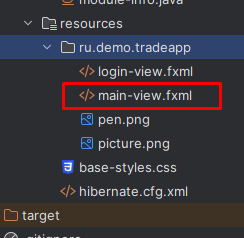
18. Откройте этот файл и измените его код на 
### main-view.fxml.
```fxml
<?xml version="1.0" encoding="UTF-8"?>
<?import javafx.scene.control.TitledPane?>
<?import javafx.scene.layout.AnchorPane?>

<TitledPane fx:id="TitledPaneHeader" animated="false" maxHeight="-Infinity"
            maxWidth="-Infinity" minHeight="-Infinity" minWidth="-Infinity"
            prefHeight="400.0" prefWidth="600.0" text="Main" xmlns:fx="http://javafx.com/fxml/1"
            xmlns="http://javafx.com/javafx/21"
            fx:controller="ru.demo.tradeapp.controllers.MainWindowController">
    <content>
        <AnchorPane minHeight="0.0" minWidth="0.0" prefHeight="180.0" prefWidth="200.0" />
    </content>
</TitledPane>

```

19. Откройте файл TradeApp.java И замените его код на следующий
### TradeApp.java
```java
package ru.demo.tradeapp;

import javafx.application.Application;
import javafx.fxml.FXMLLoader;
import javafx.scene.Scene;
import javafx.scene.image.Image;
import javafx.stage.Stage;
import ru.demo.tradeapp.models.User;
import ru.demo.tradeapp.util.Manager;

import java.io.IOException;


public class TradeApp extends Application {

    public User currentUser;

    public static void main(String[] args) {
        launch();


    }

    @Override
    public void start(Stage stage) throws IOException {

        stage.getIcons().add(new Image(TradeApp.class.getResourceAsStream("pen.png")));
        stage.setScene(getNewScene());
        stage.setTitle("Авторизация!");
        stage.setResizable(false);
        stage.setOnCloseRequest(event -> {
            Manager.ShowPopup();
        });
        stage.setOnShown(windowEvent -> {
            try {
                stage.setScene(getNewScene());
            } catch (IOException e) {
                throw new RuntimeException(e);
            }
        });

        Manager.mainStage = stage;
        stage.show();
    }

    Scene getNewScene() throws IOException {
        FXMLLoader fxmlLoader = new FXMLLoader(TradeApp.class.getResource("login-view.fxml"));
        Scene scene = new Scene(fxmlLoader.load());
        scene.getStylesheets().add("base-styles.css");
        return scene;
    }
}
```

### Финальная структура проекта

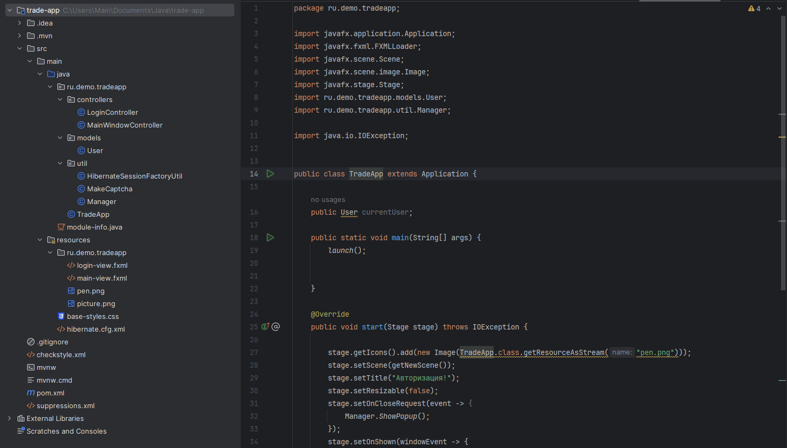

## Запуск приложения

1. Откройте файл TradeApp.java и нажмите на Зеленый треугольник слева от строчки 
```public class TradeApp extends Application```
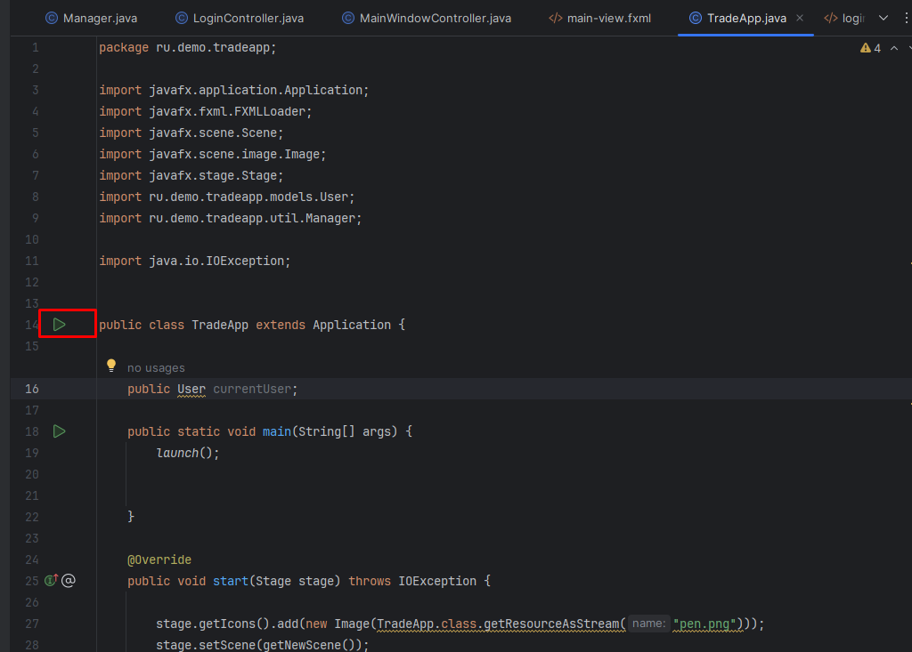
2. Если все предыдущие шаги выполнены корректно, то запустится форма авторизации, стилизованная с использованием файла css.

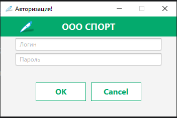
3. Если неправильно ввести учетные данные, то выйдет окно с ошибкой и отобразится капча с полем для ввода капчи.

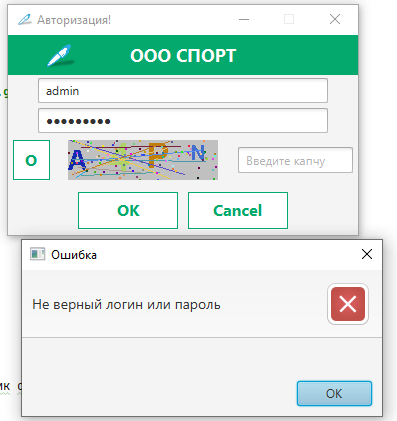
4. Если теперь мы введем некорректные учетные данные или неправильно введем капчу, то произойдет блокировка кнопок на 10 секунд.

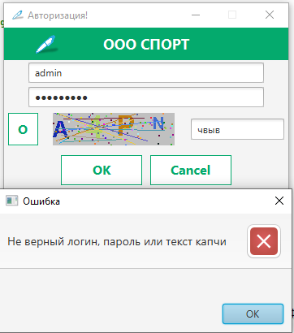
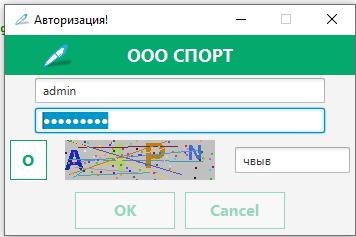
5. Если вход успешен, то выйдет простая форма с заголовком, где будет написано имя пользователя, вошедшего в систему.
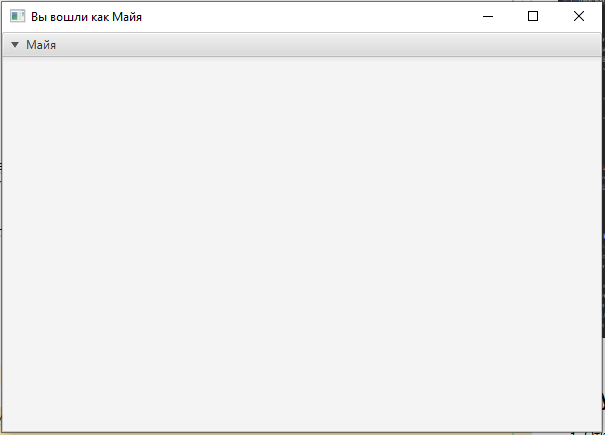


## Задание

Предыдущее занятие | &nbsp; | Следующее занятие
:----------------:|:----------:|:----------------:
[Урок 1](Lesson1.md) | [Содержание](readme.md) | [Урок 3](Lesson3.md)