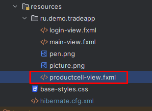
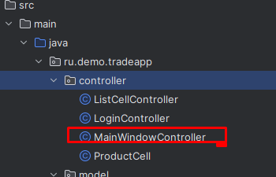

Предыдущее занятие | &nbsp; | Следующее занятие
:----------------:|:----------:|:----------------:
[Урок 2](Lesson2.md) | [Содержание](readme.md) | [Урок 4](Lesson4.md)

# Урок 3. Отображение товаров и фильтрация

1. [Добавление сущностей](#добавление-сущностей)
   * [Category](#класс-category-)
   * [Manufacturer](#класс-manufacturer-)
   * [Supplier](#класс-supplier-)
   * [Unittype](#класс-unittype-)
   * [Product](#класс-product)
2. [Создание DAO-классов](#создание-dao-классов)
   * [BaseDao](#класс-basedao)
   * [CategoryDao](#класс-categorydao)
3. [Создание Service-классов](#создание-service-классов)
   * [CategoryService](#класс-categoryservice)
   * [ManufacturerService](#класс-manufacturerservice)
   * [ProductService](#класс-productservice)
   * [SupplierService](#класс-supplierservice)
   * [UnittypeService](#класс-unittypeservice)
   * [UserService](#класс-userservice)
4. [Создание макета каталога товаров](#создание-макета-каталога-товаров)
   * [main-view.fxml](#main-viewfxml)
   * [productcell-view.fxml](#productcell-viewfxml)
5. [Созддание контроллеров](#создание-контроллеров)
   * [MainWindowController](#класс-mainwindowcontroller)
   * [ProductCell](#класс-productcell)
   * [ListCellController](#класс-listcellcontroller)
6. [Запуск приложения](#запуск-приложения)
7. [Задания](#задания)

## Добавление сущностей

1. Измените структуру пакетов приложения в папку ru.demo.tradeapp на следующую


Все пакеты должны называться в единственном числе. Плюс был добавлен новый пакет service. Будем реализовывать бизнес-логику распредения приложения на уровни.
* controller - пакет в котором лежат классы для взаимодействия с интерфейсом
* model - здесь будут храниться классы-сущности.
* repository - тут будут лежать классы DAO для взаимодействия с БД.
* service - здесь будут лежать классы которые, будут проверять поступающие на вход в контроллеры данные, обрабатывать и передавать в классы DAO. Также преобразовывают информацию для передачи контроллерам для отображения.

2. Переименуйте поля и базы в соответствии со [Style Guide SQL](SQLStyleGuide.MD)

3. В папке models создайте следующие классы

### класс Category 

```java
package ru.demo.tradeapp.model;


import jakarta.persistence.*;

@Entity
@Table(name = "categories", schema = "public")
public class Category {


    @Id
    @Column(name = "category_id")
    @GeneratedValue(strategy = GenerationType.IDENTITY)
    private Long categoryId;

    @Column(name = "title", nullable = false, length = 200)
    private String title;

    public Category() {

    }

    public Category(Long categoryId, String title) {
        this.categoryId = categoryId;
        this.title = title;

    }

    public Long getCategoryId() {
        return categoryId;
    }

    public void setCategoryId(Long categoryId) {
        this.categoryId = categoryId;
    }

    public String getTitle() {
        return title;
    }

    public void setTitle(String title) {
        this.title = title;
    }

    @Override
    public String toString() {
        return title;
    }
}
```

### класс Manufacturer 

```java
package ru.demo.tradeapp.model;


import jakarta.persistence.*;

@Entity
@Table(name = "manufacturers", schema = "public")
public class Manufacturer {


    @Id
    @Column(name = "manufacturer_id")
    @GeneratedValue(strategy = GenerationType.IDENTITY)
    private Long manufacturerId;

    @Column(name = "title", nullable = false, length = 200)
    private String title;

    public Manufacturer() {

    }

    public Manufacturer(Long manufacturerId, String title) {
        this.manufacturerId = manufacturerId;
        this.title = title;

    }

    public Long getManufacturerId() {
        return manufacturerId;
    }

    public void setManufacturerId(Long manufacturerId) {
        this.manufacturerId = manufacturerId;
    }

    public String getTitle() {
        return title;
    }

    public void setTitle(String title) {
        this.title = title;
    }

    @Override
    public String toString() {
        return title;
    }
}


```

### класс Supplier 

```java
package ru.demo.tradeapp.model;


import jakarta.persistence.*;

@Entity
@Table(name = "suppliers", schema = "public")
public class Supplier {


    @Id
    @Column(name = "supplier_id")
    @GeneratedValue(strategy = GenerationType.IDENTITY)
    private Long supplierId;

    @Column(name = "title", nullable = false, length = 200)
    private String title;

    public Supplier() {

    }
    public Supplier(Long supplierId, String title) {
        this.supplierId = supplierId;
        this.title = title;

    }

    public Long getSupplierId() {
        return supplierId;
    }

    public void setSupplierId(Long supplierId) {
        this.supplierId = supplierId;
    }

    public String getTitle() {
        return title;
    }

    public void setTitle(String title) {
        this.title = title;
    }

    @Override
    public String toString() {
        return title;
    }
}


```

### класс Unittype 

```java
package ru.demo.tradeapp.model;

import jakarta.persistence.*;

@Entity
@Table(name = "unittypes", schema = "public")
public class Unittype {


    @Id
    @Column(name = "unittype_id")
    @GeneratedValue(strategy = GenerationType.IDENTITY)
    private Long unittypeId;

    @Column(name = "title", nullable = false, length = 200)
    private String title;

    public Unittype() {

    }

    public Unittype(Long unittypeId, String title) {
        this.unittypeId = unittypeId;
        this.title = title;

    }

    public Long getUnittypeId() {
        return unittypeId;
    }

    public void setUnittypeId(Long categoryId) {
        this.unittypeId = unittypeId;
    }

    public String getTitle() {
        return title;
    }

    public void setTitle(String title) {
        this.title = title;
    }

    @Override
    public String toString() {
        return title;
    }
}
```

### класс Product
```java
package ru.demo.tradeapp.model;


import jakarta.persistence.*;
import javafx.embed.swing.SwingFXUtils;
import javafx.scene.image.Image;
import ru.demo.tradeapp.TradeApp;

import javax.imageio.ImageIO;
import java.awt.image.BufferedImage;
import java.io.ByteArrayInputStream;
import java.io.IOException;

@Entity
@Table(name = "products", schema = "public")

public class Product {

    @Id
    @Column(name = "id", nullable = false, length = 100)
    private String productId;
    @Column(name = "title", nullable = false, length = 100)
    private String title;
    @Column(name = "description")
    private String description;
    @Column(name = "cost", nullable = false)
    private Double cost;
    @Column(name = "max_discount_amount")
    private Integer maxDiscountAmount;
    @Column(name = "discount_amount")
    private Integer discountAmount;
    @Column(name = "quantity_in_stock", nullable = false)
    private Integer quantityInStock;


    @ManyToOne(fetch = FetchType.EAGER)
    @JoinColumn(name = "unittype_id", nullable = false)
    private Unittype unittype;

    @ManyToOne(fetch = FetchType.EAGER)
    @JoinColumn(name = "manufacturer_id", nullable = false)
    private Manufacturer manufacturer;

    @ManyToOne(fetch = FetchType.EAGER)
    @JoinColumn(name = "supplier_id", nullable = false)
    private Supplier supplier;


    @ManyToOne(fetch = FetchType.EAGER)
    @JoinColumn(name = "category_id", nullable = false)
    private Category category;

    @Column(name = "photo")
    private byte[] photo;

    public String getProductId() {
        return productId;
    }

    public void setProductId(String productId) {
        this.productId = productId;
    }

    public String getTitle() {
        return title;
    }

    public void setTitle(String title) {
        this.title = title;
    }

    public String getDescription() {
        return description;
    }

    public void setDescription(String description) {
        this.description = description;
    }

    public Double getCost() {
        return cost;
    }

    public void setCost(Double cost) {
        this.cost = cost;
    }

    public Integer getMaxDiscountAmount() {
        return maxDiscountAmount;
    }

    public void setMaxDiscountAmount(Integer maxDiscountAmount) {
        this.maxDiscountAmount = maxDiscountAmount;
    }

    public Integer getDiscountAmount() {
        return discountAmount;
    }

    public void setDiscountAmount(Integer discountAmount) {
        this.discountAmount = discountAmount;
    }

    public Integer getQuantityInStock() {
        return quantityInStock;
    }

    public void setQuantityInStock(Integer quantityInStock) {
        this.quantityInStock = quantityInStock;
    }

    public Unittype getUnittype() {
        return unittype;
    }

    public void setUnittype(Unittype unittype) {
        this.unittype = unittype;
    }

    public Manufacturer getManufacturer() {
        return manufacturer;
    }

    public void setManufacturer(Manufacturer manufacturer) {
        this.manufacturer = manufacturer;
    }

    public Supplier getSupplier() {
        return supplier;
    }

    public void setSupplier(Supplier supplier) {
        this.supplier = supplier;
    }

    public Category getCategory() {
        return category;
    }

    public void setCategory(Category category) {
        this.category = category;
    }

    public Image getPhoto() throws IOException {
        if (photo == null)
            return new Image(TradeApp.class.getResourceAsStream("picture.png"));
        BufferedImage capture = ImageIO.read(new ByteArrayInputStream(photo));
        return SwingFXUtils.toFXImage(capture, null);
    }

    public void setPhoto(byte[] photo) {
        this.photo = photo;
    }
}

```
4. Измените содержимое файла hibernate.cfg.xml(Мы добавили mapping на новые добавленные классы)
```xml
<?xml version = "1.0" encoding = "utf-8"?>
<!DOCTYPE hibernate-configuration PUBLIC
        "-//Hibernate/Hibernate Configuration DTD 3.0//EN"
        "http://www.hibernate.org/dtd/hibernate-configuration-3.0.dtd">
<hibernate-configuration>
    <session-factory>
        <!-- Set URL -->
        <property name = "hibernate.connection.url">jdbc:postgresql://192.168.2.202:5432/trade</property>
        <!-- Set User Name -->
        <property name = "hibernate.connection.username">postgres</property>
        <!-- Set Password -->
        <property name = "hibernate.connection.password">root</property>
        <!-- Set Driver Name -->
        <property name = "hibernate.connection.driver_class">org.postgresql.Driver</property>
        <property name = "hibernate.show_sql">true</property>
        <!-- Optional: Auto-generate schema -->
        <!-- <property name = "hibernate.hbm2ddl.auto">create</property> -->
        <mapping class="ru.demo.tradeapp.model.User" />
        <mapping class="ru.demo.tradeapp.model.Category" />
        <mapping class="ru.demo.tradeapp.model.Manufacturer" />
        <mapping class="ru.demo.tradeapp.model.Product" />
        <mapping class="ru.demo.tradeapp.model.Supplier" />
        <mapping class="ru.demo.tradeapp.model.Unittype" />
    </session-factory>
</hibernate-configuration>
```

## Создание DAO-классов

1. В папке repository добавьте класс ```BaseDao```. Класс ```BaseDao``` будет обобщенным классом, который реализует базовые методы для работы с БД для каждой сущности.
### Класс BaseDao
```java
package ru.demo.tradeapp.repository;

import org.hibernate.Session;
import org.hibernate.Transaction;
import ru.demo.tradeapp.util.HibernateSessionFactoryUtil;

import java.util.List;

public abstract class BaseDao<T>  {
    private Class<T> clazz;

    public BaseDao(Class<T> clazz) {
        this.clazz = clazz;
    }

    protected Session getCurrentSession() {
        return HibernateSessionFactoryUtil.getSessionFactory().openSession();
    }


    public void save(final T entity) {
        Session session = getCurrentSession();
        Transaction tx1 = session.beginTransaction();
        session.save(entity);
        tx1.commit();
        session.close();
    }

    public void update(final T entity) {
        Session session = getCurrentSession();
        Transaction tx1 = session.beginTransaction();
        session.update(entity);
        tx1.commit();
        session.close();
    }

    public void delete(final T entity) {
        Session session = getCurrentSession();
        Transaction tx1 = session.beginTransaction();
        session.delete(entity);
        tx1.commit();
        session.close();
    }

    public void deleteById(final long entityId) {
        final T entity = findOne(entityId);
        delete(entity);
    }

    public T findOne(final long id) {
        return getCurrentSession().get(clazz, id);
    }


    public List<T> findAll() {
        List<T> items = (List<T>) HibernateSessionFactoryUtil.getSessionFactory().openSession().createQuery("from " + clazz.getName()).list();
        return items;
    }
}
```
2. Далее в папке repository создайте класс CategoryDao, который будет дочерним по отношению к **BaseDao**
## Класс CategoryDao
```java
    package ru.demo.tradeapp.repository;
    
    import ru.demo.tradeapp.model.Category;
    
    public class CategoryDao extends BaseDao<Category> {
        public CategoryDao() {
            super(Category.class);
        }
    }

```
3. Далее добавьте аналогичным образом в папку repository дочерние для **BaseDao** классы **ManufacturerDao**, **ProductDao**, **SupplierDao**, **UnittypeDao** и **UserDao**.


# Создание Service-классов
1. Создайте в папке service
### класс CategoryService
```java
package ru.demo.tradeapp.service;

import ru.demo.tradeapp.model.Category;
import ru.demo.tradeapp.repository.CategoryDao;

import java.util.List;

public class CategoryService {
    private CategoryDao categoryDao = new CategoryDao();

    public CategoryService() {
    }

    public List<Category> findAll() {
        return categoryDao.findAll();
    }

    public Category findOne(final long id) {
        return categoryDao.findOne(id);
    }

    public void save(final Category entity)
    {
        if (entity == null)
            return;
        categoryDao.save(entity);
    }

    public void update(final Category entity)
    {
        if (entity == null)
            return;
        categoryDao.update(entity);
    }

    public void delete(final Category entity)
    {
        if (entity == null)
            return;
        categoryDao.delete(entity);
    }

    public void deleteById(final Long id)
    {
        if (id == null)
            return;
        categoryDao.deleteById(id);
    }
}

```

### класс ManufacturerService
```java
package ru.demo.tradeapp.service;

import ru.demo.tradeapp.model.Manufacturer;
import ru.demo.tradeapp.repository.ManufacturerDao;

import java.util.List;

public class ManufacturerService {
    private ManufacturerDao manufacturerDao = new ManufacturerDao();

    public ManufacturerService() {
    }

    public List<Manufacturer> findAll() {
        return manufacturerDao.findAll();
    }

    public Manufacturer findOne(final long id) {
        return manufacturerDao.findOne(id);
    }

    public void save(final Manufacturer entity) {
        if (entity == null)
            return;
        manufacturerDao.save(entity);
    }

    public void update(final Manufacturer entity) {
        if (entity == null)
            return;
        manufacturerDao.update(entity);
    }

    public void delete(final Manufacturer entity) {
        if (entity == null)
            return;
        manufacturerDao.delete(entity);
    }

    public void deleteById(final Long id) {
        if (id == null)
            return;
        manufacturerDao.deleteById(id);
    }
}

```

### класс ProductService
```java
package ru.demo.tradeapp.service;

import ru.demo.tradeapp.model.Product;
import ru.demo.tradeapp.repository.ProductDao;

import java.util.List;

public class ProductService {
    private ProductDao productDao = new ProductDao();

    public ProductService() {
    }

    public List<Product> findAll() {
        return productDao.findAll();
    }

    public Product findOne(final long id) {
        return productDao.findOne(id);
    }

    public void save(final Product entity)
    {
        if (entity == null)
            return;
        productDao.save(entity);
    }

    public void update(final Product entity)
    {
        if (entity == null)
            return;
        productDao.update(entity);
    }

    public void delete(final Product entity)
    {
        if (entity == null)
            return;
        productDao.delete(entity);
    }

    public void deleteById(final Long id)
    {
        if (id == null)
            return;
        productDao.deleteById(id);
    }
}
```

### класс SupplierService
```java
package ru.demo.tradeapp.service;

import ru.demo.tradeapp.model.Supplier;
import ru.demo.tradeapp.repository.SupplierDao;

import java.util.List;

public class SupplierService {
    private SupplierDao supplierDao = new SupplierDao();

    public SupplierService() {
    }

    public List<Supplier> findAll() {
        return supplierDao.findAll();
    }

    public Supplier findOne(final long id) {
        return supplierDao.findOne(id);
    }

    public void save(final Supplier entity) {
        if (entity == null)
            return;
        supplierDao.save(entity);
    }

    public void update(final Supplier entity) {
        if (entity == null)
            return;
        supplierDao.update(entity);
    }

    public void delete(final Supplier entity) {
        if (entity == null)
            return;
        supplierDao.delete(entity);
    }

    public void deleteById(final Long id) {
        if (id == null)
            return;
        supplierDao.deleteById(id);
    }
}
```
### класс UnittypeService
```java

package ru.demo.tradeapp.service;

import ru.demo.tradeapp.model.Unittype;
import ru.demo.tradeapp.repository.UnittypeDao;

import java.util.List;

public class UnittypeService {
    private UnittypeDao unittypeDao = new UnittypeDao();

    public UnittypeService() {
    }

    public List<Unittype> findAll() {
        return unittypeDao.findAll();
    }

    public Unittype findOne(final long id) {
        return unittypeDao.findOne(id);
    }

    public void save(final Unittype entity) {
        if (entity == null)
            return;
        unittypeDao.save(entity);
    }

    public void update(final Unittype entity) {
        if (entity == null)
            return;
        unittypeDao.update(entity);
    }

    public void delete(final Unittype entity) {
        if (entity == null)
            return;
        unittypeDao.delete(entity);
    }

    public void deleteById(final Long id) {
        if (id == null)
            return;
        unittypeDao.deleteById(id);
    }
}


```
### класс UserService
```java
package ru.demo.tradeapp.service;

import ru.demo.tradeapp.model.User;
import ru.demo.tradeapp.repository.UserDao;

import java.util.List;

public class UserService {
    private UserDao userDao = new UserDao();

    public UserService() {
    }

    public List<User> findAll() {
        return userDao.findAll();
    }

    public User findOne(final long id) {
        return userDao.findOne(id);
    }

    public void save(final User entity) {
        if (entity == null)
            return;
        userDao.save(entity);
    }

    public void update(final User entity) {
        if (entity == null)
            return;
        userDao.update(entity);
    }

    public void delete(final User entity) {
        if (entity == null)
            return;
        userDao.delete(entity);
    }

    public void deleteById(final Long id) {
        if (id == null)
            return;
        userDao.deleteById(id);
    }
}

```

## Создание макета каталога товаров
1. откройте файл main-view.fxml
2. замените код файла на следующий
### main-view.fxml
```fxml
   <?xml version="1.0" encoding="UTF-8"?>
   
   <?import javafx.scene.control.Button?>
   <?import javafx.scene.control.ComboBox?>
   <?import javafx.scene.control.Label?>
   <?import javafx.scene.control.ListView?>
   <?import javafx.scene.control.Separator?>
   <?import javafx.scene.control.SplitPane?>
   <?import javafx.scene.control.TextField?>
   <?import javafx.scene.control.ToolBar?>
   <?import javafx.scene.layout.AnchorPane?>
   <?import javafx.scene.layout.BorderPane?>
   <?import javafx.scene.layout.FlowPane?>
   
   <AnchorPane maxHeight="-Infinity" maxWidth="-Infinity" minHeight="-Infinity" minWidth="-Infinity" prefHeight="400.0" prefWidth="600.0" xmlns="http://javafx.com/javafx/22" xmlns:fx="http://javafx.com/fxml/1" fx:controller="ru.demo.tradeapp.controller.MainWindowController">
      <children>
         <BorderPane prefHeight="200.0" prefWidth="200.0" AnchorPane.bottomAnchor="0.0" AnchorPane.leftAnchor="0.0" AnchorPane.rightAnchor="0.0" AnchorPane.topAnchor="0.0">
            <center>
               <SplitPane dividerPositions="0.1" orientation="VERTICAL" prefHeight="200.0" prefWidth="160.0" BorderPane.alignment="CENTER">
                 <items>
                   <AnchorPane minHeight="0.0" minWidth="0.0" prefHeight="100.0" prefWidth="160.0">
                        <children>
                           <FlowPane layoutX="-10.0" layoutY="-53.0" nodeOrientation="LEFT_TO_RIGHT" prefHeight="200.0" prefWidth="200.0" rowValignment="TOP" AnchorPane.bottomAnchor="0.0" AnchorPane.leftAnchor="0.0" AnchorPane.rightAnchor="0.0" AnchorPane.topAnchor="0.0">
                              <children>
                                 <TextField fx:id="TextFieldSearch" onAction="#TextFieldSearchAction" prefHeight="25.0" prefWidth="262.0" promptText="Введите название для поиска" />
                                 <ComboBox fx:id="CmboBoxProductType" onAction="#CmboBoxProductTypeAction" prefWidth="150.0" promptText="тип продукта" />
                                 <ComboBox fx:id="ComboboxSort" onAction="#ComboboxSortAction" prefWidth="150.0" promptText="сортировка" />
                              </children>
                           </FlowPane>
                        </children>
                     </AnchorPane>
                   <AnchorPane minHeight="0.0" minWidth="0.0" prefHeight="100.0" prefWidth="160.0">
                        <children>
                           <ListView fx:id="ListViewProducts" layoutX="79.0" layoutY="14.0" prefHeight="200.0" prefWidth="200.0" AnchorPane.bottomAnchor="0.0" AnchorPane.leftAnchor="0.0" AnchorPane.rightAnchor="0.0" AnchorPane.topAnchor="0.0" />
                        </children>
                     </AnchorPane>
                 </items>
               </SplitPane>
            </center>
            <top>
               <ToolBar prefHeight="40.0" prefWidth="200.0" BorderPane.alignment="CENTER_RIGHT">
                 <items>
                     <Separator halignment="LEFT" maxWidth="1.7976931348623157E308" prefHeight="30.0" prefWidth="320.0" />
                     <Label fx:id="LabelUser" prefWidth="120.0" text="Label" />
                     <Button fx:id="BtnProducts" mnemonicParsing="false" onAction="#BtnProductsAction" text="Товары" />
                   <Button fx:id="BtnBack" alignment="CENTER_RIGHT" mnemonicParsing="false" onAction="#BtnBackAction" text="Назад" textAlignment="RIGHT" />
                 </items>
               </ToolBar>
            </top>
            <bottom>
               <Label fx:id="LabelInfo" text="Label" BorderPane.alignment="CENTER_LEFT" />
            </bottom>
         </BorderPane>
      </children>
   </AnchorPane>
```
Макет этого файла без стилей будет иметь такой вид.


3. В папке resources.ru.demo.tradeapp создайте новый файл **productcell-view.fxml**(это макет элементов списка, поскольку нам нужно отобразить сложный объект в компоненте ListView)



4. Добавьте в него следующий код
### productcell-view.fxml
```fxml
   <?xml version="1.0" encoding="UTF-8"?>

<?import javafx.geometry.Insets?>
<?import javafx.scene.control.Label?>
<?import javafx.scene.image.ImageView?>
<?import javafx.scene.layout.AnchorPane?>
<?import javafx.scene.layout.ColumnConstraints?>
<?import javafx.scene.layout.GridPane?>
<?import javafx.scene.layout.RowConstraints?>
<?import javafx.scene.text.Font?>

<AnchorPane maxHeight="-Infinity" maxWidth="1.7976931348623157E308" minHeight="-Infinity" minWidth="-Infinity" prefHeight="142.0" prefWidth="600.0" xmlns="http://javafx.com/javafx/22" xmlns:fx="http://javafx.com/fxml/1" fx:controller="ru.demo.tradeapp.controller.ListCellController">
   <children>
      <GridPane layoutY="14.0" AnchorPane.bottomAnchor="0.0" AnchorPane.leftAnchor="0.0" AnchorPane.rightAnchor="0.0" AnchorPane.topAnchor="0.0">
        <columnConstraints>
          <ColumnConstraints minWidth="100.0" prefWidth="100.0" />
            <ColumnConstraints hgrow="ALWAYS" maxWidth="1.7976931348623157E308" minWidth="10.0" prefWidth="100.0" />
          <ColumnConstraints hgrow="SOMETIMES" minWidth="10.0" prefWidth="100.0" />
        </columnConstraints>
        <rowConstraints>
          <RowConstraints maxHeight="-Infinity" minHeight="10.0" prefHeight="30.0" vgrow="SOMETIMES" />
          <RowConstraints maxHeight="-Infinity" minHeight="10.0" prefHeight="30.0" vgrow="SOMETIMES" />
            <RowConstraints maxHeight="-Infinity" minHeight="10.0" prefHeight="30.0" vgrow="SOMETIMES" />
          <RowConstraints minHeight="10.0" prefHeight="30.0" vgrow="SOMETIMES" />
        </rowConstraints>
         <children>
            <ImageView fx:id="ImageViewPhoto" fitHeight="150.0" fitWidth="100.0" pickOnBounds="true" preserveRatio="true" GridPane.rowSpan="3" />
            <Label fx:id="LabelPercent" alignment="CENTER" maxHeight="1.7976931348623157E308" maxWidth="1.7976931348623157E308" text="Label" textAlignment="CENTER" GridPane.columnIndex="2" GridPane.rowSpan="4">
               <font>
                  <Font name="System Bold" size="28.0" />
               </font></Label>
            <Label fx:id="LabelTitle" maxHeight="1.7976931348623157E308" maxWidth="1.7976931348623157E308" text="Label" GridPane.columnIndex="1" GridPane.hgrow="ALWAYS">
               <padding>
                  <Insets left="10.0" />
               </padding>
               <font>
                  <Font size="16.0" />
               </font>
            </Label>
            <Label fx:id="LabelDescription" maxHeight="1.7976931348623157E308" maxWidth="1.7976931348623157E308" text="Label" GridPane.columnIndex="1" GridPane.rowIndex="1">
               <padding>
                  <Insets left="10.0" />
               </padding>
               <font>
                  <Font size="16.0" />
               </font>
            </Label>
            <Label fx:id="LabelManufacturer" maxHeight="1.7976931348623157E308" maxWidth="1.7976931348623157E308" text="Label" GridPane.columnIndex="1" GridPane.rowIndex="2">
               <padding>
                  <Insets left="10.0" />
               </padding>
               <font>
                  <Font size="16.0" />
               </font>
            </Label>
         </children>
      </GridPane>
   </children>
</AnchorPane>

```
Макет элемента списка


## Создание контроллеров
1. в папке откройте файл MainWindowController. Замените его код на следующий

### Класс MainWindowController
```java
package ru.demo.tradeapp.controller;

import javafx.collections.FXCollections;
import javafx.collections.ObservableList;
import javafx.fxml.FXML;
import javafx.fxml.Initializable;

import javafx.event.ActionEvent;
import javafx.scene.control.*;

import ru.demo.tradeapp.model.Category;
import ru.demo.tradeapp.model.Product;
import ru.demo.tradeapp.service.CategoryService;
import ru.demo.tradeapp.service.ProductService;
import ru.demo.tradeapp.util.Manager;

import java.net.URL;
import java.util.List;
import java.util.ResourceBundle;
import java.util.stream.Collectors;

public class MainWindowController implements Initializable {

    private CategoryService categoryService = new CategoryService();
    private ProductService productService = new ProductService();
    @FXML
    private Button BtnBack;
    @FXML
    private ListView<Product> ListViewProducts;
    @FXML
    private Button BtnProducts;

    @FXML
    private ComboBox<Category> CmboBoxProductType;

    @FXML
    private ComboBox<?> ComboboxSort;

    @FXML
    private Label LabelInfo;

    @FXML
    private Label LabelUser;

    @FXML
    private TextField TextFieldSearch;

    @FXML
    void BtnBackAction(ActionEvent event) {

    }

    @FXML
    void BtnProductsAction(ActionEvent event) {

    }

    @FXML
    void CmboBoxProductTypeAction(ActionEvent event) {
        Category category = CmboBoxProductType.getValue();
        if (category.getCategoryId() == 0) {
            loadProducts(null);
        } else {
            loadProducts(category);
        }
        System.out.println(category);
    }

    @FXML
    void ComboboxSortAction(ActionEvent event) {

    }

    @FXML
    void TextFieldSearchAction(ActionEvent event) {

    }


    @Override
    public void initialize(URL url, ResourceBundle resourceBundle) {
        LabelUser.setText(Manager.currentUser.getFirstName());
        List<Category> categoryList = categoryService.findAll();
        categoryList.add(0, new Category(0L, "Все"));
        ObservableList<Category> categories = FXCollections.observableArrayList(categoryList);
        CmboBoxProductType.setItems(categories);
        loadProducts(null);

    }

    public void loadProducts(Category category) {
        ListViewProducts.getItems().clear();
        List<Product> products = productService.findAll();
        if (category != null) {
            products = products.stream().filter(product -> product.getCategory().getCategoryId().equals(category.getCategoryId())).collect(Collectors.toList());
        }
        for (Product product : products) {
            ListViewProducts.getItems().add(product);
        }
        ListViewProducts.setCellFactory(lv -> new ProductCell());
    }
}

```
2. Добавьте в папку controller класс ProductCell и замените код/
### Класс ProductCell
```java
package ru.demo.tradeapp.controller;

import java.io.IOException;

import javafx.fxml.FXMLLoader;
import javafx.scene.Parent;
import javafx.scene.control.ListCell;
import ru.demo.tradeapp.TradeApp;
import ru.demo.tradeapp.model.Product;

public class ProductCell extends ListCell<Product> {

    private final Parent root ;
    private ListCellController controller ;

    public ProductCell() {
        try {
            FXMLLoader loader = new FXMLLoader(TradeApp.class.getResource("productcell-view.fxml"));
            root = loader.load();
            controller = loader.getController() ;
        } catch (IOException exc) {
            throw new RuntimeException(exc);
        }
    }

    @Override
    protected void updateItem(Product product, boolean empty) {
        super.updateItem(product, empty);
        if (empty || product==null) {
            setGraphic(null);
        } else {
            try {
                controller.setProduct(product);
            } catch (IOException e) {
                throw new RuntimeException(e);
            }
            setGraphic(root);
        }
    }
}

```
3Добавьте в папку controller класс ListCellController и замените код.
### Класс ListCellController
```java
package ru.demo.tradeapp.controller;

import javafx.fxml.FXML;
import javafx.scene.control.Label;
import javafx.scene.image.Image;
import javafx.scene.image.ImageView;
import ru.demo.tradeapp.model.Product;

import java.io.IOException;

public class ListCellController {

    @FXML
    private ImageView ImageViewPhoto;

    @FXML
    private Label LabelDescription;

    @FXML
    private Label LabelManufacturer;

    @FXML
    private Label LabelPercent;

    @FXML
    private Label LabelTitle;

    public void setProduct(Product product) throws IOException {
        ImageViewPhoto.setImage(product.getPhoto());
        LabelPercent.setText(product.getDiscountAmount().toString());
        LabelTitle.setText(product.getTitle());
        LabelManufacturer.setText(product.getManufacturer().getTitle());

    }

}


```
# Запуск приложения
1. Запуcтите приложение. Введите учетные данные, например логин: ```maia``` , пароль: ```1```.

2. Просмотрите работу приложения.

3. На данный момент функционал просмотра каталога товаров реализован на 60%. 

# Задания
1. Доработайте функционал:
   * Дополните макет вывыда элемента списка в соответсвии с картинкой(не отображается цена.)
   
   * Необходимо  подсвечивать  строки  с  данными  о  конкретном  товаре  в  зависимости  от  размера скидки.   В  случае  если  размер скидки превышает 15%,   в  качестве  фона  необходимо  применить  цвет  #7fff00.  Если у товара снижена стоимость, то основная цена должна быть перечеркнута, и рядом с ней указана итоговая стоимость.
   * Пользователь  должен  иметь  возможность  отсортировать  товары  (по  возрастанию  и  убыванию)   по  стоимости.
   * Кроме  этого,   пользователь  должен  иметь  возможность  отфильтровать  данные  по  размеру скидки в диапазонах: 0-9,99%, 10-14,99%, 15% и более.   Первым элементом в  выпадающем  списке  должен  быть  “Все  диапазоны”,   при  выборе  которого  настройки  фильтра  сбрасываются.   
   * Пользователь  должен  иметь  возможность  искать  товары,   используя  поисковую  строку.   Поиск  должен  осуществляться  по  наименованию  товара.   
   * Поиск,   сортировка  и  фильтрация  должны  происходить  в  реальном  времени,   без  необходимости  нажатия  кнопки  “найти”/ ”отфильтровать”  и  т.п.   Фильтрация  и  поиск  должны  применяться  совместно.   Параметры  сортировки,   выбранные  ранее  пользователем,   должны  сохраняться  и  во  время  фильтрации  с  поиском.   
   * В  нижней  части  окна  необходимо  показывать  количество  выведенных  данных  и  общее  количество  записей  в  базе.   Например,   15 из 37 .   В  случае,  если  данные  в  таблицу  выводятся  после  фильтрации  или  поиска,   количество  выведенных  данных  необходимо  обновить  исходя  из  размера  выборки. 
2. Добавьте стили к элементам макета.


Предыдущее занятие | &nbsp; | Следующее занятие
:----------------:|:----------:|:----------------:
[Урок 2](Lesson2.md) | [Содержание](readme.md) | [Урок 4](Lesson4.md)