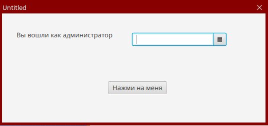
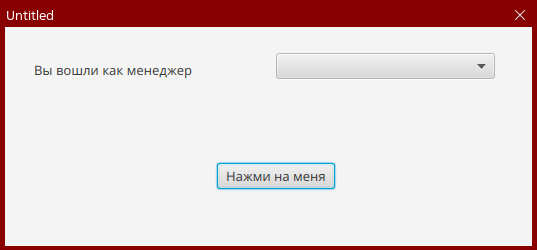

Предыдущее занятие | &nbsp; | Следующее занятие
:----------------:|:----------:|:----------------:
[Урок 3](Lesson3.md) | [Содержание](readme.md) | [Урок 5](Lesson5.md)

# Урок 4. CRUD товары

1. [Добавление и изменение сущностей](#добавление-и-изменение-сущностей)
   * [Order](#класс-order-)
   * [OrderProduct](#класс-orderproduct-)
   * [OrderProductId](#класс-orderproductid-)
   * [Product](#класс-product)
2. [Создание макета каталога товаров](#создание-макета-каталога-товаров)
   * [main-view.fxml](#main-viewfxml)
   * [products-table-view.fxml](#products-table-viewfxml)
   * [products-edit-view.fxml](#products-edit-viewfxml)
3. [Создание контроллеров](#создание-контроллеров)
   * [MainWindowController](#класс-mainwindowcontroller)
   * [ProductTableViewController](#класс-producttableviewcontroller)
   * [ProductEditViewController](#класс-producteditviewcontroller)
   * [Manager](#managerjava)
   * [module-info.java](#module-infojava)
4. [Запуск приложения](#запуск-приложения)
5. [Задания](#задания)

## Добавление и изменение сущностей

1. В папке models создайте следующие классы

### класс Order 

```java
package ru.demo.tradeapp.model;

import jakarta.persistence.*;

import java.time.LocalDate;

@Entity
@Table(name = "orders", schema = "public")

public class Order {

    @Id
    @Column(name = "order_id")
    private Long orderId;

    @Column(name = "status_id", nullable = false)
    private Long statusId;

    @Column(name = "pickuppoint_id", nullable = false)
    private Long pickuppointId;

    @Column(name = "create_date", nullable = false)
    private LocalDate create_date;

    @Column(name = "delivery_date", nullable = false)
    private LocalDate deliveryDate;

    @Column(name = "username", nullable = true, length = 50)
    private Long username;

    @Column(name = "get_code", nullable = false)
    private Integer getCode;


    public Long getOrderId() {
        return orderId;
    }

    public void setOrderId(Long orderId) {
        this.orderId = orderId;
    }

    public Long getStatusId() {
        return statusId;
    }

    public void setStatusId(Long statusId) {
        this.statusId = statusId;
    }

    public Long getPickuppointId() {
        return pickuppointId;
    }

    public void setPickuppointId(Long pickuppointId) {
        this.pickuppointId = pickuppointId;
    }

    public LocalDate getCreate_date() {
        return create_date;
    }

    public void setCreate_date(LocalDate create_date) {
        this.create_date = create_date;
    }

    public LocalDate getDeliveryDate() {
        return deliveryDate;
    }

    public void setDeliveryDate(LocalDate deliveryDate) {
        this.deliveryDate = deliveryDate;
    }

    public Long getUsername() {
        return username;
    }

    public void setUsername(Long username) {
        this.username = username;
    }

    public Integer getGetCode() {
        return getCode;
    }

    public void setGetCode(Integer getCode) {
        this.getCode = getCode;
    }
}

```

### класс OrderProduct 

```java
package ru.demo.tradeapp.model;

import jakarta.persistence.*;


@Entity
@IdClass(OrderProductId.class)
@Table(name = "order_products", schema = "public")
public class OrderProduct {

    @Id
    @Column(name = "order_id", nullable = false)
    private Long orderId;

    @Id
    @Column(name = "product_id", nullable = false)
    private String productId;

    @Column(name = "count", nullable = false)
    private Long count;

    public Long getOrderId() {
        return orderId;
    }

    public void setOrderId(Long orderId) {
        this.orderId = orderId;
    }

    public String getProductId() {
        return productId;
    }

    public void setProductId(String productId) {
        this.productId = productId;
    }

    public Long getCount() {
        return count;
    }

    public void setCount(Long count) {
        this.count = count;
    }
}

```

### класс OrderProductId 

```java
package ru.demo.tradeapp.model;

import java.io.Serializable;
import java.util.Objects;

public class OrderProductId implements Serializable {
    private Long orderId;

    private String productId;

    public OrderProductId() {
    }

    public OrderProductId(Long orderId, String productId) {
        this.orderId = orderId;
        this.productId = productId;
    }

    @Override
    public boolean equals(Object o) {
        if (this == o) return true;
        if (!(o instanceof OrderProductId that)) return false;
        return Objects.equals(orderId, that.orderId) && Objects.equals(productId, that.productId);
    }

    @Override
    public int hashCode() {
        return Objects.hash(orderId, productId);
    }

    // equals() and hashCode()
}

```

2. Измените содержимое класса Product
### класс Product
```java
package ru.demo.tradeapp.model;


import jakarta.persistence.*;
import javafx.embed.swing.SwingFXUtils;
import javafx.scene.image.Image;
import javafx.scene.image.ImageView;
import ru.demo.tradeapp.TradeApp;

import javax.imageio.ImageIO;
import java.awt.image.BufferedImage;
import java.io.ByteArrayInputStream;
import java.io.ByteArrayOutputStream;
import java.io.IOException;
import java.util.HashSet;
import java.util.Set;

@Entity
@Table(name = "products", schema = "public")

public class Product {

    @Id
    @Column(name = "product_id", nullable = false, length = 100)
    private String productId;
    @Column(name = "title", nullable = false, length = 100)
    private String title;
    @Column(name = "description")
    private String description;
    @Column(name = "cost", nullable = false)
    private Double cost;
    @Column(name = "max_discount_amount")
    private Integer maxDiscountAmount;
    @Column(name = "discount_amount")
    private Integer discountAmount;
    @Column(name = "quantity_in_stock", nullable = false)
    private Integer quantityInStock;

    @OneToMany
    @JoinColumn(name = "product_id")
    private Set<OrderProduct> orderProducts = new HashSet<OrderProduct>();
    @ManyToOne(fetch = FetchType.EAGER)
    @JoinColumn(name = "unittype_id", nullable = false)
    private Unittype unittype;
    @ManyToOne(fetch = FetchType.EAGER)
    @JoinColumn(name = "manufacturer_id", nullable = false)
    private Manufacturer manufacturer;
    @ManyToOne(fetch = FetchType.EAGER)
    @JoinColumn(name = "supplier_id", nullable = false)
    private Supplier supplier;
    @ManyToOne(fetch = FetchType.EAGER)
    @JoinColumn(name = "category_id", nullable = false)
    private Category category;
    @Column(name = "photo")
    private byte[] photo;


    public Set<OrderProduct> getOrderProducts() {
        return orderProducts;
    }


    public String getProductId() {
        return productId;
    }

    public void setProductId(String productId) {
        this.productId = productId;
    }

    public String getTitle() {
        return title;
    }

    public void setTitle(String title) {
        this.title = title;
    }

    public String getDescription() {
        return description;
    }

    public void setDescription(String description) {
        this.description = description;
    }

    public Double getCost() {
        return cost;
    }

    public void setCost(Double cost) {
        this.cost = cost;
    }

    public Integer getMaxDiscountAmount() {
        return maxDiscountAmount;
    }

    public void setMaxDiscountAmount(Integer maxDiscountAmount) {
        this.maxDiscountAmount = maxDiscountAmount;
    }

    public Integer getDiscountAmount() {
        return discountAmount;
    }

    public void setDiscountAmount(Integer discountAmount) {
        this.discountAmount = discountAmount;
    }

    public Integer getQuantityInStock() {
        return quantityInStock;
    }

    public void setQuantityInStock(Integer quantityInStock) {
        this.quantityInStock = quantityInStock;
    }

    public Unittype getUnittype() {
        return unittype;
    }

    public void setUnittype(Unittype unittype) {
        this.unittype = unittype;
    }

    public Manufacturer getManufacturer() {
        return manufacturer;
    }

    public void setManufacturer(Manufacturer manufacturer) {
        this.manufacturer = manufacturer;
    }

    public Supplier getSupplier() {
        return supplier;
    }

    public void setSupplier(Supplier supplier) {
        this.supplier = supplier;
    }

    public Category getCategory() {
        return category;
    }

    public void setCategory(Category category) {
        this.category = category;
    }

    public boolean isHasPhoto() {
        return photo != null;
    }

    public Image getPhoto() throws IOException {
        if (photo == null)
            return new Image(TradeApp.class.getResourceAsStream("picture.png"));
        BufferedImage capture = ImageIO.read(new ByteArrayInputStream(photo));
        return SwingFXUtils.toFXImage(capture, null);
    }

    public void setPhoto(Image img) throws IOException {
        BufferedImage buf = SwingFXUtils.fromFXImage(img, null);
        ByteArrayOutputStream baos = new ByteArrayOutputStream();
        ImageIO.write(buf, "jpg", baos);
        byte[] bytes = baos.toByteArray();
        this.photo = bytes;
    }

    public ImageView getImage() throws IOException {
        ImageView image = new ImageView();
        image.setImage(getPhoto());
        image.setFitHeight(60);
        image.setPreserveRatio(true);
        return image;
    }

    public Double getPriceWithDiscount() {
        return cost * (1 - discountAmount / 100.0);
    }
}


```
4. Измените содержимое файла hibernate.cfg.xml(Мы добавили mapping на новые добавленные классы)
```xml
<?xml version = "1.0" encoding = "utf-8"?>
<!DOCTYPE hibernate-configuration PUBLIC
        "-//Hibernate/Hibernate Configuration DTD 3.0//EN"
        "http://www.hibernate.org/dtd/hibernate-configuration-3.0.dtd">
<hibernate-configuration>
    <session-factory>
        <!-- Set URL -->
        <property name = "hibernate.connection.url">jdbc:postgresql://192.168.2.202:5432/trade</property>
        <!-- Set User Name -->
        <property name = "hibernate.connection.username">postgres</property>
        <!-- Set Password -->
        <property name = "hibernate.connection.password">root</property>
        <!-- Set Driver Name -->
        <property name = "hibernate.connection.driver_class">org.postgresql.Driver</property>
        <property name = "hibernate.show_sql">true</property>
        <!-- Optional: Auto-generate schema -->
        <!-- <property name = "hibernate.hbm2ddl.auto">create</property> -->
        <mapping class="ru.demo.tradeapp.model.User" />
        <mapping class="ru.demo.tradeapp.model.Category" />
        <mapping class="ru.demo.tradeapp.model.Manufacturer" />
        <mapping class="ru.demo.tradeapp.model.Product" />
        <mapping class="ru.demo.tradeapp.model.Supplier" />
        <mapping class="ru.demo.tradeapp.model.Unittype" />
        <mapping class="ru.demo.tradeapp.model.Order" />
        <mapping class="ru.demo.tradeapp.model.OrderProduct" />
    </session-factory>
</hibernate-configuration>

```

## Создание и изменение существующих макетов

1. Откройте файл main-view.fxml и замените его код

### main-view.fxml
```fxml
<?xml version="1.0" encoding="UTF-8"?>

<?import javafx.scene.control.*?>
<?import javafx.scene.layout.*?>

<AnchorPane maxHeight="-Infinity" maxWidth="-Infinity" minHeight="-Infinity" minWidth="-Infinity" prefHeight="400.0" prefWidth="600.0" xmlns="http://javafx.com/javafx/17.0.2-ea" xmlns:fx="http://javafx.com/fxml/1" fx:controller="ru.demo.tradeapp.controller.MainWindowController">
   <children>
      <BorderPane prefHeight="200.0" prefWidth="200.0" AnchorPane.bottomAnchor="0.0" AnchorPane.leftAnchor="0.0" AnchorPane.rightAnchor="0.0" AnchorPane.topAnchor="0.0">
         <center>
            <BorderPane fx:id="BorderPaneMainFrame" BorderPane.alignment="CENTER">
               <top>
                  <FlowPane minHeight="-Infinity" nodeOrientation="LEFT_TO_RIGHT" prefHeight="50.0" prefWidth="200.0" rowValignment="TOP" BorderPane.alignment="CENTER">
                     <children>
                        <TextField fx:id="TextFieldSearch" onAction="#TextFieldSearchAction" onInputMethodTextChanged="#TextFieldTextChanged" prefHeight="25.0" prefWidth="262.0" promptText="Введите название для поиска" />
                        <ComboBox fx:id="ComboBoxProductType" onAction="#ComboBoxProductTypeAction" prefWidth="150.0" promptText="тип продукта" />
                        <ComboBox fx:id="ComboBoxDiscount" onAction="#ComboBoxDiscountAction" prefHeight="26.0" prefWidth="143.0" promptText="скидка" />
                        <ComboBox fx:id="ComboBoxSort" onAction="#ComboBoxSortAction" prefWidth="150.0" promptText="сортировка" />
                     </children>
                  </FlowPane>
               </top>
               <center>
                  <ListView fx:id="ListViewProducts" maxHeight="1.7976931348623157E308" maxWidth="1.7976931348623157E308" prefHeight="201.0" prefWidth="600.0" BorderPane.alignment="CENTER" />
               </center>
            </BorderPane>
         </center>
         <top>
            <ToolBar prefHeight="40.0" prefWidth="200.0" BorderPane.alignment="CENTER_RIGHT">
              <items>
                  <Separator halignment="LEFT" maxWidth="1.7976931348623157E308" prefHeight="30.0" prefWidth="320.0" />
                  <Label fx:id="LabelUser" prefWidth="120.0" text="Label" />
                  <Button fx:id="BtnProducts" mnemonicParsing="false" onAction="#BtnProductsAction" text="Товары" />
                <Button fx:id="BtnBack" alignment="CENTER_RIGHT" mnemonicParsing="false" onAction="#BtnBackAction" text="Заказы" textAlignment="RIGHT" />
              </items>
            </ToolBar>
         </top>
         <bottom>
            <Label fx:id="LabelInfo" text="Label" BorderPane.alignment="CENTER_LEFT" />
         </bottom>
      </BorderPane>
   </children>
</AnchorPane>

```

2. В папке с ресурсами создайте новый файл products-table-view.fxml добавьте в него этот код.
### products-table-view.fxml
```fxml
<?xml version="1.0" encoding="UTF-8"?>

<?import javafx.scene.control.*?>
<?import javafx.scene.layout.*?>

<AnchorPane maxHeight="-Infinity" maxWidth="-Infinity" minHeight="-Infinity" minWidth="-Infinity" prefHeight="400.0" prefWidth="600.0" xmlns="http://javafx.com/javafx/17.0.2-ea" xmlns:fx="http://javafx.com/fxml/1" fx:controller="ru.demo.tradeapp.controller.ProductTableViewController">
   <children>
      <BorderPane prefHeight="200.0" prefWidth="200.0" AnchorPane.bottomAnchor="0.0" AnchorPane.leftAnchor="0.0" AnchorPane.rightAnchor="0.0" AnchorPane.topAnchor="0.0">
         <top>
            <ToolBar prefHeight="40.0" prefWidth="200.0" BorderPane.alignment="CENTER_RIGHT">
               <items>
                  <Separator halignment="LEFT" maxWidth="1.7976931348623157E308" prefHeight="30.0" prefWidth="225.0" />
                  <Label fx:id="LabelUser" prefWidth="120.0" text="Label" />
                  <Button fx:id="BtnAdd" mnemonicParsing="false" onAction="#BtnAddAction" text="Добавить" />
                  <Button fx:id="BtnUpdate" mnemonicParsing="false" onAction="#BtnUpdateAction" text="Изменить" />
                  <Button fx:id="BtnDelete" mnemonicParsing="false" onAction="#BtnDeleteAction" text="Удалить" />
                  <Button fx:id="BtnBack" alignment="CENTER_RIGHT" mnemonicParsing="false" onAction="#BtnBackAction" text="Назад" textAlignment="RIGHT" />
               </items>
            </ToolBar>
         </top>
         <center>
            <BorderPane BorderPane.alignment="CENTER">
               <top>
                  <FlowPane minHeight="-Infinity" nodeOrientation="LEFT_TO_RIGHT" prefHeight="50.0" prefWidth="200.0" rowValignment="TOP" BorderPane.alignment="CENTER">
                     <children>
                        <TextField fx:id="TextFieldSearch" onAction="#TextFieldSearchAction" onInputMethodTextChanged="#TextFieldTextChanged" prefHeight="25.0" prefWidth="262.0" promptText="Введите название для поиска" />
                        <ComboBox fx:id="ComboBoxProductType" onAction="#ComboBoxProductTypeAction" prefWidth="150.0" promptText="тип продукта" />
                        <ComboBox fx:id="ComboBoxDiscount" onAction="#ComboBoxDiscountAction" prefHeight="26.0" prefWidth="143.0" promptText="скидка" />
                        <ComboBox fx:id="ComboBoxSort" onAction="#ComboBoxSortAction" prefWidth="150.0" promptText="сортировка" />
                     </children>
                  </FlowPane>
               </top>
               <center>
                  <TableView fx:id="TableViewProducts" fixedCellSize="120.0" prefHeight="200.0" prefWidth="200.0" tableMenuButtonVisible="true" BorderPane.alignment="CENTER">
                    <columns>
                        <TableColumn id="TableColumnPhoto" fx:id="TableColumnPhoto" prefWidth="96.0" resizable="false" text="Фото" />
                      <TableColumn id="TableColumnProductId" fx:id="TableColumnProductId" minWidth="0.0" prefWidth="93.0" text="Артикул" />
                      <TableColumn id="TableColumnTitle" fx:id="TableColumnTitle" maxWidth="1.7976931348623157E308" prefWidth="121.0" resizable="false" text="Наименование" />
                        <TableColumn id="TableColumnCountInStock" fx:id="TableColumnCountInStock" prefWidth="82.0" text="Количество на складе" />
                        <TableColumn fx:id="TableColumnDiscount" prefWidth="50.0" text="Скидка" />
                        <TableColumn fx:id="TableColumnCost" prefWidth="139.0" text="Цена со скидкой" />
                    </columns>
                  </TableView>
               </center>
            </BorderPane>
         </center>
         <bottom>
            <Label fx:id="LabelInfo" text="Label" BorderPane.alignment="CENTER_LEFT" />
         </bottom>
      </BorderPane>
   </children>
</AnchorPane>

```

3В папке с ресурсами создайте новый файл product-edit-view.fxml добавьте в него этот код.
### product-edit-view.fxml
```fxml
<?xml version="1.0" encoding="UTF-8"?>

<?import javafx.geometry.Insets?>
<?import javafx.scene.control.Button?>
<?import javafx.scene.control.ButtonBar?>
<?import javafx.scene.control.ComboBox?>
<?import javafx.scene.control.Label?>
<?import javafx.scene.control.TextArea?>
<?import javafx.scene.control.TextField?>
<?import javafx.scene.image.ImageView?>
<?import javafx.scene.layout.AnchorPane?>
<?import javafx.scene.layout.BorderPane?>
<?import javafx.scene.layout.ColumnConstraints?>
<?import javafx.scene.layout.GridPane?>
<?import javafx.scene.layout.RowConstraints?>

<AnchorPane maxHeight="-Infinity" maxWidth="-Infinity" minHeight="-Infinity" minWidth="-Infinity" prefHeight="600.0" prefWidth="800.0" xmlns="http://javafx.com/javafx/22" xmlns:fx="http://javafx.com/fxml/1" fx:controller="ru.demo.tradeapp.controller.ProductEditViewController">
   <children>
      <BorderPane layoutX="170.0" layoutY="47.0" prefHeight="200.0" prefWidth="200.0" AnchorPane.bottomAnchor="0.0" AnchorPane.leftAnchor="0.0" AnchorPane.rightAnchor="0.0" AnchorPane.topAnchor="0.0">
         <bottom>
            <ButtonBar prefHeight="40.0" prefWidth="200.0" BorderPane.alignment="CENTER">
              <buttons>
                <Button fx:id="BtnSave" defaultButton="true" mnemonicParsing="false" onAction="#BtnSaveAction" text="Сохранить" />
                  <Button fx:id="BtnCancel" cancelButton="true" mnemonicParsing="false" onAction="#BtnCancelAction" text="Отмена" />
              </buttons>
               <padding>
                  <Insets right="20.0" />
               </padding>
            </ButtonBar>
         </bottom>
         <center>
            <GridPane BorderPane.alignment="CENTER">
              <columnConstraints>
                <ColumnConstraints hgrow="SOMETIMES" maxWidth="190.0" minWidth="10.0" prefWidth="190.0" />
                <ColumnConstraints hgrow="SOMETIMES" maxWidth="680.0" minWidth="10.0" prefWidth="610.0" />
              </columnConstraints>
              <rowConstraints>
                <RowConstraints minHeight="10.0" prefHeight="30.0" />
                  <RowConstraints minHeight="10.0" prefHeight="30.0" vgrow="ALWAYS" />
                <RowConstraints minHeight="10.0" prefHeight="30.0" />
                  <RowConstraints minHeight="10.0" prefHeight="30.0" />
                  <RowConstraints minHeight="10.0" prefHeight="100.0" />
                  <RowConstraints minHeight="10.0" prefHeight="30.0" />
                  <RowConstraints minHeight="10.0" prefHeight="30.0" />
                <RowConstraints minHeight="10.0" prefHeight="30.0" />
                  <RowConstraints minHeight="10.0" prefHeight="30.0" />
                  <RowConstraints minHeight="10.0" prefHeight="30.0" />
                  <RowConstraints minHeight="10.0" prefHeight="30.0" />
                  <RowConstraints minHeight="10.0" prefHeight="30.0" />
              </rowConstraints>
               <children>
                  <TextField fx:id="TextFieldArtikul" GridPane.columnIndex="1" />
                  <Label maxHeight="1.7976931348623157E308" maxWidth="1.7976931348623157E308" text="Артикул" />
                  <Label maxHeight="1.7976931348623157E308" maxWidth="1.7976931348623157E308" text="Название" GridPane.rowIndex="2" />
                  <TextField fx:id="TextFieldTitle" GridPane.columnIndex="1" GridPane.rowIndex="2" />
                  <TextArea fx:id="TextAreaDescription" prefHeight="200.0" prefWidth="200.0" GridPane.columnIndex="1" GridPane.rowIndex="4" />
                  <Label maxHeight="1.7976931348623157E308" maxWidth="1.7976931348623157E308" text="Описание" GridPane.rowIndex="4" />
                  <Label maxHeight="1.7976931348623157E308" maxWidth="1.7976931348623157E308" text="Стоимость за единицу" GridPane.rowIndex="5" />
                  <TextField fx:id="TextFieldCost" GridPane.columnIndex="1" GridPane.rowIndex="5" />
                  <ComboBox fx:id="ComboBoxCategory" prefHeight="25.0" prefWidth="300.0" GridPane.columnIndex="1" GridPane.rowIndex="3" />
                  <Label maxHeight="1.7976931348623157E308" maxWidth="1.7976931348623157E308" text="Категория товара" GridPane.rowIndex="3" />
                  <ComboBox fx:id="ComboBoxUnittype" prefHeight="25.0" prefWidth="300.0" GridPane.columnIndex="1" GridPane.rowIndex="7" />
                  <Label maxHeight="1.7976931348623157E308" maxWidth="1.7976931348623157E308" text="Единицы измерения" GridPane.rowIndex="7" />
                  <ComboBox fx:id="ComboBoxManufacturer" prefHeight="25.0" prefWidth="300.0" GridPane.columnIndex="1" GridPane.rowIndex="8" />
                  <Label maxHeight="1.7976931348623157E308" maxWidth="1.7976931348623157E308" text="Производитель" GridPane.rowIndex="8" />
                  <Label maxHeight="1.7976931348623157E308" maxWidth="1.7976931348623157E308" text="Поставщик" GridPane.rowIndex="9" />
                  <ComboBox fx:id="ComboBoxSupplier" prefHeight="25.0" prefWidth="300.0" GridPane.columnIndex="1" GridPane.rowIndex="9" />
                  <Label maxHeight="1.7976931348623157E308" maxWidth="1.7976931348623157E308" prefHeight="17.0" prefWidth="184.0" text="Размер максимальной скидки" GridPane.rowIndex="10" />
                  <Label maxHeight="1.7976931348623157E308" maxWidth="1.7976931348623157E308" text="Количество на складе" GridPane.rowIndex="6" />
                  <Label maxHeight="1.7976931348623157E308" maxWidth="1.7976931348623157E308" text="Изображение" GridPane.rowIndex="1" />
                  <Label maxHeight="1.7976931348623157E308" maxWidth="1.7976931348623157E308" prefHeight="17.0" prefWidth="184.0" text="Размер действующей скидки" GridPane.rowIndex="11" />
                  <ImageView fx:id="ImageViewPhoto" fitHeight="150.0" fitWidth="200.0" pickOnBounds="true" preserveRatio="true" GridPane.columnIndex="1" GridPane.rowIndex="1" />
                  <Button fx:id="BtnLoadImage" mnemonicParsing="false" onAction="#BtnLoadImageAction" text="Загрузить" GridPane.columnIndex="1" GridPane.rowIndex="1" GridPane.valignment="BOTTOM">
                     <GridPane.margin>
                        <Insets left="200.0" />
                     </GridPane.margin>
                  </Button>
                  <TextField fx:id="TextFieldCountInStock" GridPane.columnIndex="1" GridPane.rowIndex="6" />
                  <TextField fx:id="TextFieldDiscountAmountMax" GridPane.columnIndex="1" GridPane.rowIndex="10" />
                  <TextField fx:id="TextFieldDiscountAmount" GridPane.columnIndex="1" GridPane.rowIndex="11" />
               </children>
            </GridPane>
         </center>
      </BorderPane>
   </children>
</AnchorPane>

```

## Создание контроллеров
1. в папке откройте файл MainWindowController. Замените его код на следующий

### Класс MainWindowController
```java
package ru.demo.tradeapp.controller;

import javafx.collections.FXCollections;
import javafx.collections.ObservableList;
import javafx.event.ActionEvent;
import javafx.fxml.FXML;
import javafx.fxml.FXMLLoader;
import javafx.fxml.Initializable;
import javafx.scene.Scene;
import javafx.scene.control.*;
import javafx.scene.layout.BorderPane;
import ru.demo.tradeapp.TradeApp;
import ru.demo.tradeapp.model.Category;
import ru.demo.tradeapp.model.Product;
import ru.demo.tradeapp.service.CategoryService;
import ru.demo.tradeapp.service.ProductService;
import ru.demo.tradeapp.util.Manager;

import java.io.IOException;
import java.net.URL;
import java.util.Comparator;
import java.util.List;
import java.util.ResourceBundle;
import java.util.stream.Collectors;

public class MainWindowController implements Initializable {

    @FXML
    ComboBox<String> ComboBoxDiscount;
    private int itemsCount;
    private CategoryService categoryService = new CategoryService();
    private ProductService productService = new ProductService();
    @FXML
    private Button BtnBack;
    @FXML
    private ListView<Product> ListViewProducts;
    @FXML
    private Button BtnProducts;
    @FXML
    private ComboBox<Category> ComboBoxProductType;
    @FXML
    private ComboBox<String> ComboBoxSort;
    @FXML
    private Label LabelInfo;

    @FXML
    private Label LabelUser;

    @FXML
    private TextField TextFieldSearch;

    @FXML
    private BorderPane BorderPaneMainFrame;

    @FXML
    void BtnBackAction(ActionEvent event) {

    }

    @FXML
    void TextFieldTextChanged(ActionEvent event) {
        filterData();
    }

    @FXML
    void ComboBoxProductTypeAction(ActionEvent event) {
        filterData();
    }

    @FXML
    void ComboBoxDiscountAction(ActionEvent event) {
        filterData();
    }

    @FXML
    void BtnProductsAction(ActionEvent event) {
        FXMLLoader fxmlLoader = new FXMLLoader(TradeApp.class.getResource("products-table-view.fxml"));

        Scene scene = null;
        try {
            scene = new Scene(fxmlLoader.load());
            scene.getStylesheets().add("base-styles.css");
            Manager.secondStage.setScene(scene);

            //Manager.mainStage.show();

        } catch (IOException e) {
            throw new RuntimeException(e);
        }
    }

    @FXML
    void ComboBoxSortAction(ActionEvent event) {
        filterData();
    }

    @FXML
    void TextFieldSearchAction(ActionEvent event) {
        filterData();
    }


    @Override
    public void initialize(URL url, ResourceBundle resourceBundle) {
        LabelUser.setText(Manager.currentUser.getFirstName());
        List<Category> categoryList = categoryService.findAll();
        categoryList.add(0, new Category(0L, "Все"));
        ObservableList<Category> categories = FXCollections.observableArrayList(categoryList);
        ComboBoxProductType.setItems(categories);
        ObservableList<String> discounts = FXCollections.observableArrayList("Все товары", "0-9.99%", "10-14.99%", "15% и более");
        ComboBoxDiscount.setItems(discounts);
        ObservableList<String> orders = FXCollections.observableArrayList("по возрастанию цены", "по убыванию цены");
        ComboBoxSort.setItems(orders);
        filterData();
    }

    public void loadProducts(Category category) {
        ListViewProducts.getItems().clear();
        List<Product> products = productService.findAll();
        itemsCount = products.size();
        LabelInfo.setText("Всего записей " + itemsCount + " из " + itemsCount);
        if (category != null) {
            products = products.stream().filter(product -> product.getCategory().getCategoryId().equals(category.getCategoryId())).collect(Collectors.toList());
            int filteredItemsCount = products.size();
            LabelInfo.setText("Всего записей " + filteredItemsCount + " из " + itemsCount);
        }
        for (Product product : products) {
            ListViewProducts.getItems().add(product);
        }
        ListViewProducts.setCellFactory(lv -> new ProductCell());
    }

    void filterData() {
        List<Product> products = productService.findAll();
        itemsCount = products.size();
        if (!ComboBoxProductType.getSelectionModel().isEmpty()) {
            Category category = ComboBoxProductType.getValue();
            if (category.getCategoryId() != 0) {
                products = products.stream().filter(product -> product.getCategory().getCategoryId().equals(category.getCategoryId())).collect(Collectors.toList());
            }
        }
        if (!ComboBoxDiscount.getSelectionModel().isEmpty()) {
            String discount = ComboBoxDiscount.getValue();
            if (discount.equals("0-9.99%")) {
                products = products.stream().filter(product -> product.getDiscountAmount() < 10).collect(Collectors.toList());
            }
            if (discount.equals("10-14.99%")) {
                products = products.stream().filter(product -> product.getDiscountAmount() >= 10 && product.getDiscountAmount() < 15).collect(Collectors.toList());
            }
            if (discount.equals("15% и более")) {
                products = products.stream().filter(product -> product.getDiscountAmount() >= 15).collect(Collectors.toList());
            }
        }
        if (!ComboBoxSort.getSelectionModel().isEmpty()) {
            String order = ComboBoxSort.getValue();
            if (order.equals("по возрастанию цены")) {
                products = products.stream().sorted(Comparator.comparing(Product::getPriceWithDiscount)).collect(Collectors.toList());
            }
            if (order.equals("по убыванию цены")) {
                products = products.stream().sorted(Comparator.comparing(Product::getPriceWithDiscount)).collect(Collectors.toList()).reversed();
            }
        }

        String searchText = TextFieldSearch.getText();
        if (!searchText.isEmpty()) {
            products = products.stream().filter(product -> product.getTitle().toLowerCase().contains(searchText.toLowerCase())).collect(Collectors.toList());
        }
        ListViewProducts.getItems().clear();
        for (Product product : products) {
            ListViewProducts.getItems().add(product);
        }
        ListViewProducts.setCellFactory(lv -> new ProductCell());
        int filteredItemsCount = products.size();
        LabelInfo.setText("Всего записей " + filteredItemsCount + " из " + itemsCount);
    }
}

```
2. Добавьте в папку controller класс ProductTableViewController и замените код/
### Класс ProductTableViewController
```java
package ru.demo.tradeapp.controller;

import javafx.beans.property.SimpleIntegerProperty;
import javafx.beans.property.SimpleObjectProperty;
import javafx.beans.property.SimpleStringProperty;
import javafx.collections.FXCollections;
import javafx.collections.ObservableList;
import javafx.event.ActionEvent;
import javafx.fxml.FXML;
import javafx.fxml.FXMLLoader;
import javafx.fxml.Initializable;
import javafx.scene.Scene;
import javafx.scene.control.*;
import javafx.scene.image.ImageView;
import javafx.scene.input.InputMethodEvent;
import javafx.stage.Modality;
import javafx.stage.Stage;
import ru.demo.tradeapp.TradeApp;
import ru.demo.tradeapp.model.Category;
import ru.demo.tradeapp.model.Product;
import ru.demo.tradeapp.service.CategoryService;
import ru.demo.tradeapp.service.ProductService;
import ru.demo.tradeapp.util.Manager;

import java.io.IOException;
import java.net.URL;
import java.util.Comparator;
import java.util.List;
import java.util.Optional;
import java.util.ResourceBundle;
import java.util.stream.Collectors;

import static ru.demo.tradeapp.util.Manager.*;

public class ProductTableViewController implements Initializable {

    private int itemsCount;
    private CategoryService categoryService = new CategoryService();
    private ProductService productService = new ProductService();
    @FXML
    private ComboBox<String> ComboBoxDiscount;

    @FXML
    private ComboBox<Category> ComboBoxProductType;

    @FXML
    private ComboBox<String> ComboBoxSort;
    @FXML
    private Button BtnBack;

    @FXML
    private TableColumn<Product, ImageView> TableColumnPhoto;

    @FXML
    private TableColumn<Product, Integer> TableColumnCountInStock;

    @FXML
    private TableColumn<Product, Integer> TableColumnDiscount;

    @FXML
    private TableColumn<Product, String> TableColumnCost;

    @FXML
    private TableColumn<Product, String> TableColumnProductId;
    @FXML
    private Button BtnAdd;

    @FXML
    private Button BtnDelete;

    @FXML
    private Button BtnUpdate;

    @FXML
    private TableColumn<Product, String> TableColumnTitle;
    @FXML
    private Label LabelInfo;
    @FXML
    private Label LabelUser;
    @FXML
    private TextField TextFieldSearch;


    @FXML
    private TableView<Product> TableViewProducts;

    @FXML
    void ComboBoxDiscountAction(ActionEvent event) {
        filterData();
    }

    @FXML
    void ComboBoxProductTypeAction(ActionEvent event) {
        filterData();
    }

    @FXML
    void ComboBoxSortAction(ActionEvent event) {
        filterData();
    }

    @FXML
    void TextFieldSearchAction(ActionEvent event) {
        filterData();
    }

    @FXML
    void BtnBackAction(ActionEvent event) {
        FXMLLoader fxmlLoader = new FXMLLoader(TradeApp.class.getResource("main-view.fxml"));
        Scene scene = null;
        try {
            scene = new Scene(fxmlLoader.load());
            scene.getStylesheets().add("base-styles.css");
            Manager.secondStage.setScene(scene);
            //Manager.mainStage.show();

        } catch (IOException e) {
            throw new RuntimeException(e);
        }
    }

    @FXML
    void BtnAddAction(ActionEvent event) {
        Product product = TableViewProducts.getSelectionModel().getSelectedItem();
        Manager.currentProduct = null;
        ShowEditProductWindow();
        filterData();
    }

    @FXML
    void BtnDeleteAction(ActionEvent event) {
        Product product = TableViewProducts.getSelectionModel().getSelectedItem();
        if (!product.getOrderProducts().isEmpty())
        {
            ShowErrorMessageBox("Ошибка целостности данных, у данного товара есть зависимые заказы");
            return;
        }

        Optional<ButtonType> result = ShowConfirmPopup();
        if (result.get() == ButtonType.OK) {
            productService.delete(product);
            filterData();
        }

    }

    @FXML
    void BtnUpdateAction(ActionEvent event) {
        Product product = TableViewProducts.getSelectionModel().getSelectedItem();
        Manager.currentProduct = product;
        ShowEditProductWindow();
        filterData();
    }

    void ShowEditProductWindow() {
        Stage newWindow = new Stage();
        FXMLLoader fxmlLoader = new FXMLLoader(TradeApp.class.getResource("product-edit-view.fxml"));

        Scene scene = null;
        try {
            scene = new Scene(fxmlLoader.load());
            scene.getStylesheets().add("base-styles.css");
        } catch (IOException e) {
            throw new RuntimeException(e);
        }
        newWindow.setTitle("Изменить данные");
        newWindow.initOwner(Manager.secondStage);
        newWindow.initModality(Modality.WINDOW_MODAL);
        newWindow.setScene(scene);
        Manager.currentStage = newWindow;
        newWindow.showAndWait();
        Manager.currentStage = null;
        filterData();
    }

    @FXML
    void TextFieldTextChanged(InputMethodEvent event) {

    }

    @Override
    public void initialize(URL url, ResourceBundle resourceBundle) {
        initController();
    }

    public void initController() {
        LabelUser.setText(Manager.currentUser.getFirstName());
        List<Category> categoryList = categoryService.findAll();
        categoryList.add(0, new Category(0L, "Все"));
        ObservableList<Category> categories = FXCollections.observableArrayList(categoryList);
        ComboBoxProductType.setItems(categories);
        ObservableList<String> discounts = FXCollections.observableArrayList("Все товары", "0-9.99%", "10-14.99%", "15% и более");
        ComboBoxDiscount.setItems(discounts);
        ObservableList<String> orders = FXCollections.observableArrayList("по возрастанию цены", "по убыванию цены");
        ComboBoxSort.setItems(orders);
        setCellValueFactories();
        filterData();
    }

    void filterData() {
        List<Product> products = productService.findAll();
        itemsCount = products.size();
        if (!ComboBoxProductType.getSelectionModel().isEmpty()) {
            Category category = ComboBoxProductType.getValue();
            if (category.getCategoryId() != 0) {
                products = products.stream().filter(product -> product.getCategory().getCategoryId().equals(category.getCategoryId())).collect(Collectors.toList());
            }
        }
        if (!ComboBoxDiscount.getSelectionModel().isEmpty()) {
            String discount = ComboBoxDiscount.getValue();
            if (discount.equals("0-9.99%")) {
                products = products.stream().filter(product -> product.getDiscountAmount() < 10).collect(Collectors.toList());
            }
            if (discount.equals("10-14.99%")) {
                products = products.stream().filter(product -> product.getDiscountAmount() >= 10 && product.getDiscountAmount() < 15).collect(Collectors.toList());
            }
            if (discount.equals("15% и более")) {
                products = products.stream().filter(product -> product.getDiscountAmount() >= 15).collect(Collectors.toList());
            }
        }
        if (!ComboBoxSort.getSelectionModel().isEmpty()) {
            String order = ComboBoxSort.getValue();
            if (order.equals("по возрастанию цены")) {
                products = products.stream().sorted(Comparator.comparing(Product::getPriceWithDiscount)).collect(Collectors.toList());
            }
            if (order.equals("по убыванию цены")) {
                products = products.stream().sorted(Comparator.comparing(Product::getPriceWithDiscount)).collect(Collectors.toList()).reversed();
            }
        }

        String searchText = TextFieldSearch.getText();
        if (!searchText.isEmpty()) {
            products = products.stream().filter(product -> product.getTitle().toLowerCase().contains(searchText.toLowerCase())).collect(Collectors.toList());
        }
        TableViewProducts.getItems().clear();
        for (Product product : products) {
            TableViewProducts.getItems().add(product);
        }
        int filteredItemsCount = products.size();
        LabelInfo.setText("Всего записей " + filteredItemsCount + " из " + itemsCount);
    }

    private void setCellValueFactories() {

        TableColumnPhoto.setCellValueFactory(cellData -> {
            try {
                return new SimpleObjectProperty<ImageView>(cellData.getValue().getImage());
            } catch (IOException e) {
                throw new RuntimeException(e);
            }
        });
        TableColumnProductId.setCellValueFactory(cellData -> new SimpleStringProperty(cellData.getValue().getProductId()));
        TableColumnTitle.setCellValueFactory(cellData -> new SimpleStringProperty(cellData.getValue().getTitle()));
        TableColumnCountInStock.setCellValueFactory(cellData -> new SimpleIntegerProperty(cellData.getValue().getQuantityInStock()).asObject());
        TableColumnCost.setCellValueFactory(cellData -> new SimpleStringProperty(String.format(String.format("%.2f", cellData.getValue().getCost()) + " руб.")));
        TableColumnDiscount.setCellValueFactory(cellData -> new SimpleIntegerProperty(cellData.getValue().getDiscountAmount()).asObject());
    }
}

```
3. Добавьте в папку controller класс ProductEditViewController и замените код.
### Класс ProductEditViewController
```java
package ru.demo.tradeapp.controller;

import javafx.collections.FXCollections;
import javafx.event.ActionEvent;
import javafx.fxml.FXML;
import javafx.fxml.Initializable;
import javafx.scene.control.*;
import javafx.scene.image.Image;
import javafx.scene.image.ImageView;
import javafx.stage.FileChooser;
import javafx.stage.Stage;
import ru.demo.tradeapp.model.*;
import ru.demo.tradeapp.service.*;
import ru.demo.tradeapp.util.Manager;

import java.io.File;
import java.io.IOException;
import java.net.MalformedURLException;
import java.net.URL;
import java.util.ResourceBundle;

import static ru.demo.tradeapp.util.Manager.MessageBox;

public class ProductEditViewController implements Initializable {
    boolean imageLoaded = false;
    @FXML
    private Button BtnCancel;
    @FXML
    private Button BtnLoadImage;
    @FXML
    private Button BtnSave;
    private CategoryService categoryService = new CategoryService();
    private ManufacturerService manufacturerService = new ManufacturerService();
    private SupplierService supplierService = new SupplierService();
    private UnittypeService unittypeService = new UnittypeService();
    private ProductService productService = new ProductService();
    @FXML
    private ComboBox<Category> ComboBoxCategory;

    @FXML
    private ComboBox<Manufacturer> ComboBoxManufacturer;

    @FXML
    private ComboBox<Supplier> ComboBoxSupplier;

    @FXML
    private ComboBox<Unittype> ComboBoxUnittype;
    @FXML
    private ImageView ImageViewPhoto;
    @FXML
    private TextArea TextAreaDescription;

    @FXML
    private TextField TextFieldArtikul;

    @FXML
    private TextField TextFieldCost;

    @FXML
    private TextField TextFieldCountInStock;

    @FXML
    private TextField TextFieldDiscountAmount;

    @FXML
    private TextField TextFieldDiscountAmountMax;

    @FXML
    private TextField TextFieldTitle;

    @FXML
    void BtnLoadImageAction(ActionEvent event) throws MalformedURLException {
        FileChooser fileChooser = new FileChooser();
        fileChooser.getExtensionFilters().addAll(
                new FileChooser.ExtensionFilter("JPG", "*.jpg")
        );
        Stage stage = (Stage) BtnLoadImage.getScene().getWindow();
        File file = fileChooser.showOpenDialog(stage);

        if (file != null) {
            String imageUrl = file.toURI().toURL().toExternalForm();
            ImageViewPhoto.setImage(new Image(imageUrl));
            imageLoaded = true;
        }
    }

    @Override
    public void initialize(URL url, ResourceBundle resourceBundle) {
        ComboBoxCategory.setItems(FXCollections.observableArrayList(categoryService.findAll()));
        ComboBoxSupplier.setItems(FXCollections.observableArrayList(supplierService.findAll()));
        ComboBoxManufacturer.setItems(FXCollections.observableArrayList(manufacturerService.findAll()));
        ComboBoxUnittype.setItems(FXCollections.observableArrayList(unittypeService.findAll()));
        if (Manager.currentProduct != null) {
            TextFieldArtikul.setEditable(false);
            TextFieldArtikul.setText(Manager.currentProduct.getProductId());
            TextFieldTitle.setText(Manager.currentProduct.getTitle());
            TextAreaDescription.setText(Manager.currentProduct.getDescription());
            TextFieldCost.setText(String.format("%.2f", Manager.currentProduct.getCost()));
            TextFieldCountInStock.setText(Manager.currentProduct.getQuantityInStock().toString());
            TextFieldDiscountAmount.setText(Manager.currentProduct.getDiscountAmount().toString());
            TextFieldDiscountAmountMax.setText(Manager.currentProduct.getMaxDiscountAmount().toString());
            try {
                ImageViewPhoto.setImage(Manager.currentProduct.getPhoto());
            } catch (IOException e) {
                throw new RuntimeException(e);
            }
            ComboBoxCategory.setValue(Manager.currentProduct.getCategory());
            ComboBoxSupplier.setValue(Manager.currentProduct.getSupplier());
            ComboBoxManufacturer.setValue(Manager.currentProduct.getManufacturer());
            ComboBoxUnittype.setValue(Manager.currentProduct.getUnittype());
        } else {
            Manager.currentProduct = new Product();
        }
    }

    @FXML
    void BtnCancelAction(ActionEvent event) {
        Stage stage = (Stage) BtnCancel.getScene().getWindow();
        // do what you have to do
        stage.close();
    }

    @FXML
    void BtnSaveAction(ActionEvent event) throws IOException {
        String error = checkFields().toString();
        if (!error.isEmpty()) {
            MessageBox("Ошибка", "Заполните поля", error, Alert.AlertType.ERROR);
            return;
        }
        Manager.currentProduct.setTitle(TextFieldTitle.getText());
        Manager.currentProduct.setCategory(ComboBoxCategory.getValue());
        Manager.currentProduct.setSupplier(ComboBoxSupplier.getValue());
        Manager.currentProduct.setUnittype(ComboBoxUnittype.getValue());
        Manager.currentProduct.setManufacturer(ComboBoxManufacturer.getValue());
        if (imageLoaded) {
            Manager.currentProduct.setPhoto(ImageViewPhoto.getImage());
        }
        String number = TextFieldCost.getText();
        number = number.replace(',', '.');
        Manager.currentProduct.setCost(Double.parseDouble(number));
        Manager.currentProduct.setDiscountAmount(Integer.parseInt(TextFieldDiscountAmount.getText()));
        Manager.currentProduct.setMaxDiscountAmount(Integer.parseInt(TextFieldDiscountAmountMax.getText()));
        Manager.currentProduct.setQuantityInStock(Integer.parseInt(TextFieldCountInStock.getText()));
        if (Manager.currentProduct.getProductId() == null) {
            Manager.currentProduct.setProductId(TextFieldArtikul.getText());
            productService.save(Manager.currentProduct);
            MessageBox("Информация", "", "Данные сохранены успешно", Alert.AlertType.INFORMATION);
        } else {
            productService.update(Manager.currentProduct);
            MessageBox("Информация", "", "Данные обновлены успешно", Alert.AlertType.INFORMATION);
        }
    }

    StringBuilder checkFields() {
        StringBuilder error = new StringBuilder();
        if (TextFieldArtikul.getText().isEmpty()) {
            error.append("Укажите артикул товара\n");
        }
        if (TextFieldTitle.getText().isEmpty()) {
            error.append("Укажите название товара\n");
        }
        if (TextFieldCost.getText().isEmpty()) {
            error.append("Укажите стоимость товара\n");
        }
        if (ComboBoxCategory.getValue() == null) {
            error.append("Выберите категорию\n");
        }
        if (ComboBoxManufacturer.getValue() == null) {
            error.append("Выберите производителя\n");
        }
        if (ComboBoxSupplier.getValue() == null) {
            error.append("Выберите поставщика\n");
        }
        if (ComboBoxUnittype.getValue() == null) {
            error.append("Выберите единицу измерения\n");
        }

        if (!IsInteger(TextFieldDiscountAmount.getText())) {
            error.append("Действующая скидка должна быть целым числом в диапазоне от 0% до 100%\n");
        }
        if (IsInteger(TextFieldDiscountAmount.getText()) && (Integer.parseInt(TextFieldDiscountAmount.getText()) < 0 || Integer.parseInt(TextFieldDiscountAmount.getText()) > 100)) {
            error.append("Действующая скидка должна быть целым числом в диапазоне от 0% до 100%\n");
        }
        if (!IsInteger(TextFieldDiscountAmountMax.getText())) {
            error.append("Максимальная скидка должна быть целым числом в диапазоне от 0% до 100%\n");
        }
        if (IsInteger(TextFieldDiscountAmountMax.getText()) && (Integer.parseInt(TextFieldDiscountAmountMax.getText()) < 0 || Integer.parseInt(TextFieldDiscountAmountMax.getText()) > 100)) {
            error.append("Максимальная скидка должна быть целым числом в диапазоне от 0% до 100%\n");
        }
        if (IsInteger(TextFieldDiscountAmountMax.getText()) && IsInteger(TextFieldDiscountAmount.getText())) {
            int maxDiscount = Integer.parseInt(TextFieldDiscountAmountMax.getText());
            int discount = Integer.parseInt(TextFieldDiscountAmount.getText());
            if (discount > maxDiscount)
                error.append("Действующая скидка не может быть больше максимальной\n");
        }
        if (!IsInteger(TextFieldCountInStock.getText())) {
            error.append("Количество товара на складе должно быть целым числом\n");
        }
        if (IsInteger(TextFieldCountInStock.getText()) && Integer.parseInt(TextFieldCountInStock.getText()) < 0) {
            error.append("Количество товара на складе должно быть положительным целым числом\n");
        }

        if (!IsDouble(TextFieldCost.getText())) {
            error.append("Стоимость должна быть положительным числом\n");
        }
        if (IsDouble(TextFieldCost.getText()) && Double.parseDouble(TextFieldCost.getText().replace(',', '.')) < 0) {
            error.append("Стоимость должна быть положительным числом\n");
        }

        return error;
    }

    boolean IsInteger(String number) {
        if (number == null) {
            return false;
        }
        try {
            int d = Integer.parseInt(number);
        } catch (NumberFormatException nfe) {
            return false;
        }
        return true;
    }

    boolean IsDouble(String number) {
        if (number == null) {
            return false;
        }
        try {
            number = number.replace(',', '.');
            double d = Double.parseDouble(number);
        } catch (NumberFormatException nfe) {
            return false;
        }
        return true;
    }

}

```

4. Из пакета util откройте файл Manager и замените код


### Manager.java
```java
package ru.demo.tradeapp.util;

import javafx.application.Platform;
import javafx.scene.control.Alert;
import javafx.scene.control.ButtonType;
import javafx.stage.Stage;
import ru.demo.tradeapp.model.Product;
import ru.demo.tradeapp.model.User;

import java.util.Optional;

public class Manager {
    public static User currentUser = null;
    public static Stage mainStage;
    public static Stage secondStage;
    public static Stage currentStage;
    public static Product currentProduct;

    public static void ShowPopup() {
        Alert alert = new Alert(Alert.AlertType.CONFIRMATION);
        alert.setTitle("Закрыть приложение");
        alert.setHeaderText("Вы хотите выйти из приложения?");
        alert.setContentText("Все несохраненные данные, будут утеряны");

        Optional<ButtonType> result = alert.showAndWait();
        if (result.get() == ButtonType.OK) {
            Platform.exit();
        }
    }

    public static void ShowErrorMessageBox(String message) {
        Alert alert = new Alert(Alert.AlertType.ERROR);
        alert.setTitle("Ошибка");
        alert.setHeaderText(message);
        alert.showAndWait();
    }

    public static void MessageBox(String title, String header, String message, Alert.AlertType alertType) {
        Alert alert = new Alert(alertType);
        alert.setTitle(title);
        alert.setHeaderText(header);
        alert.setContentText(message);
        alert.showAndWait();

    }

    public static Optional<ButtonType> ShowConfirmPopup() {
        Alert alert = new Alert(Alert.AlertType.CONFIRMATION);
        alert.setTitle("Удаление");
        alert.setHeaderText("Вы действительно хотите удалить запись?");
        alert.setContentText("Также будут удалены все зависимые от этой записи данные");
        Optional<ButtonType> result = alert.showAndWait();
        return result;
    }
}

```

5. Откройте файл module-info.java замените в нем код

### module-info.java
```java
module ru.trade.tradeapp {
    requires javafx.controls;
    requires javafx.fxml;
    requires jakarta.persistence;
    requires org.hibernate.orm.core;
    requires java.naming;
    requires java.desktop;
    requires javafx.swing;
    requires org.hibernate.validator;
    requires org.postgresql.jdbc;
    opens ru.demo.tradeapp to javafx.fxml;
    opens ru.demo.tradeapp.model to org.hibernate.orm.core, javafx.base;
    exports ru.demo.tradeapp;
    exports ru.demo.tradeapp.controller;
    opens ru.demo.tradeapp.controller to javafx.fxml;
    opens ru.demo.tradeapp.util to org.hibernate.orm.core;
}
```


# Запуск приложения
1. Запуcтите приложение. Введите учетные данные, например логин: ```maia``` , пароль: ```1```.

2. Просмотрите работу приложения.


# Задания
1. Доработайте функционал:
   * Добавьте при выводе таблицы дополнительные поля: Цену без скидки, производителя и категорию товара.
   * Задайте окнам ограничения на минимальный размер
   * Добавьте стили к новым элементам.
2. На основе макета CRUD с товарами создайте формы для просмотра, добавления, удаления и редактирования следуюущих сущностей:
   * Category
   * Supplier
   * Manufacturer
   * Unittype
   * User

   


Предыдущее занятие | &nbsp; | Следующее занятие
:----------------:|:----------:|:----------------:
[Урок 3](Lesson3.md) | [Содержание](readme.md) | [Урок 5](Lesson5.md)