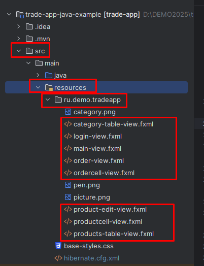
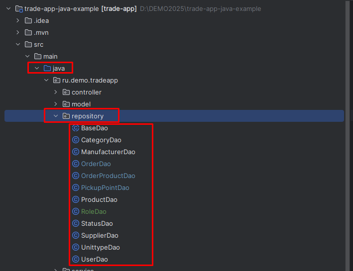

Предыдущее занятие | &nbsp; | Следующее занятие
:----------------:|:----------:|:----------------:
[Урок 5](Lesson5.md) | [Содержание](readme.md) | [Урок 7](Lesson7.md)

# Урок 6. Реализация работы с корзиной, сохранение заказа, просмотр и печать заказов.
1. [Добавление нового артефакта](#добавление-нового-артефакта)
   * [pom.xml](#pomxml)
   * [module-info.java](#module-infojava)
2. [Добавление и изменение сущностей](#добавление-и-изменение-сущностей)
   * [Category](#класс-category)
   * [Manufacturer](#класс-manufacturer)
   * [Order](#класс-order)
   * [OrderProduct](#класс-orderproduct)
   * [OrderProductId](#класс-orderproductid)
   * [PickupPoint](#класс-pickuppoint)
   * [Product](#класс-product)
   * [Status](#класс-status)
   * [Role](#класс-role)
   * [Supllier](#класс-supllier)
   * [Unittype](#класс-unittype-)
   * [User](#класс-user-)
   * [hibernate.cfg.xml](#hibernatecfgxml)
3. [Создание макета каталога товаров](#создание-и-изменение-существующих-макетов)
   * [main-view.fxml](#main-viewfxml)
   * [order-view.fxml](#order-viewfxml)
   * [orders-table-view.fxml](#orders-table-viewfxml)
4. [Создание и изменение существующих контроллеров](#создание-и-изменение-существующих-контроллеров)
   * [OrderTableViewController](#класс-ordertableviewcontroller)
   * [MainWindowController](#класс-mainwindowcontroller)
   * [ListCellController](#класс-listcellcontroller)
   * [OrderCellController](#класс-ordercellcontroller)
   * [OrderViewController](#класс-orderviewcontroller)
   * [ProductTableViewController](#класс-producttableviewcontroller)
5. [Пакет util](#пакет-util)
   * [Manager](#managerjava)
6. [Добавление репозиториев](#добавление-репозиториев)
   * [BaseDao](#класс-basedao)
   * [OrderDao](#класс-orderdao)
   * [OrderProductDao](#класс-orderproductdao)
   * [ProductDao](#класс-productdao)
7. [Изменение сервисов](#изменение-сервисов)
   * [OrderProductService](#класс-orderproductservice)
8. [Добавление файла шрифта](#файл-шрифта-arialttf)
9. [Запуск приложения](#запуск-приложения)
10. [Задания](#задания)

## Добавление нового артефакта
1. Откройте файл pom.xml и замените его содержимое.
### pom.xml
```xml
<?xml version="1.0" encoding="UTF-8"?>
<project xmlns="http://maven.apache.org/POM/4.0.0"
         xmlns:xsi="http://www.w3.org/2001/XMLSchema-instance"
         xsi:schemaLocation="http://maven.apache.org/POM/4.0.0 https://maven.apache.org/xsd/maven-4.0.0.xsd">
    <modelVersion>4.0.0</modelVersion>

    <groupId>ru.trade</groupId>
    <artifactId>trade-app</artifactId>
    <version>1.0-SNAPSHOT</version>
    <name>trade-app</name>

    <properties>
        <project.build.sourceEncoding>UTF-8</project.build.sourceEncoding>
        <junit.version>5.9.2</junit.version>
    </properties>

    <dependencies>
        <!-- https://mvnrepository.com/artifact/com.gluonhq/charm-glisten -->
        <dependency>
            <groupId>org.hibernate.validator</groupId>
            <artifactId>hibernate-validator</artifactId>
            <version>8.0.1.Final</version>
        </dependency>
        <dependency>
            <groupId>com.itextpdf</groupId>
            <artifactId>itextpdf</artifactId>
            <version>5.5.13.4</version>
        </dependency>
        <dependency>
            <groupId>org.hibernate.orm</groupId>
            <artifactId>hibernate-core</artifactId>
            <version>6.2.7.Final</version>
        </dependency>
        <dependency>
            <groupId>org.postgresql</groupId>
            <artifactId>postgresql</artifactId>
            <version>42.7.4</version>
        </dependency>
        <dependency>
            <groupId>org.openjfx</groupId>
            <artifactId>javafx-controls</artifactId>
            <version>21-ea+24</version>
        </dependency>
        <dependency>
            <groupId>org.openjfx</groupId>
            <artifactId>javafx-swing</artifactId>
            <version>13.0.2</version>
        </dependency>
        <dependency>
            <groupId>org.openjfx</groupId>
            <artifactId>javafx-fxml</artifactId>
            <version>21-ea+24</version>
        </dependency>
        <dependency>
            <groupId>org.junit.jupiter</groupId>
            <artifactId>junit-jupiter-api</artifactId>
            <version>${junit.version}</version>
            <scope>test</scope>
        </dependency>
        <dependency>
            <groupId>org.junit.jupiter</groupId>
            <artifactId>junit-jupiter-engine</artifactId>
            <version>${junit.version}</version>
            <scope>test</scope>
        </dependency>

    </dependencies>

    <build>
        <plugins>
            <plugin>
                <groupId>org.apache.maven.plugins</groupId>
                <artifactId>maven-compiler-plugin</artifactId>
                <version>3.11.0</version>
                <configuration>
                    <source>22</source>
                    <target>22</target>
                </configuration>
            </plugin>
            <plugin>
                <groupId>org.openjfx</groupId>
                <artifactId>javafx-maven-plugin</artifactId>
                <version>0.0.8</version>
                <executions>
                    <execution>
                        <!-- Default configuration for running with: mvn clean javafx:run -->
                        <id>default-cli</id>
                        <configuration>
                            <mainClass>ru.trade.tradeapp/ru.trade.tradeapp.TradeApp</mainClass>
                            <launcher>app</launcher>
                            <jlinkZipName>app</jlinkZipName>
                            <jlinkImageName>app</jlinkImageName>
                            <noManPages>true</noManPages>
                            <stripDebug>true</stripDebug>
                            <noHeaderFiles>true</noHeaderFiles>
                        </configuration>
                    </execution>
                </executions>
            </plugin>
            <plugin>
                <groupId>org.apache.maven.plugins</groupId>
                <artifactId>maven-checkstyle-plugin</artifactId>
                <version>3.3.1</version>
                <configuration>
                    <configLocation>checkstyle.xml</configLocation>
                    <includeTestSourceDirectory>true</includeTestSourceDirectory>
                    <failOnViolation>true</failOnViolation>
                    <logViolationsToConsole>true</logViolationsToConsole>
                </configuration>
                <executions>
                    <execution>
                        <goals>
                            <goal>check</goal>
                        </goals>
                        <phase>compile</phase>
                    </execution>
                </executions>
            </plugin>
        </plugins>
    </build>
</project>
```

2. Откройте файл module-info.java и замените его содержимое

### module-info.java
```java
module ru.trade.tradeapp {
    requires javafx.controls;
    requires javafx.fxml;
    requires jakarta.persistence;
    requires org.hibernate.orm.core;
    requires java.naming;
    requires java.desktop;
    requires javafx.swing;
    requires org.hibernate.validator;
    requires org.postgresql.jdbc;
    requires itextpdf;
    opens ru.demo.tradeapp to javafx.fxml;
    opens ru.demo.tradeapp.model to org.hibernate.orm.core, javafx.base;
    exports ru.demo.tradeapp;
    exports ru.demo.tradeapp.controller;
    opens ru.demo.tradeapp.controller to javafx.fxml;
    opens ru.demo.tradeapp.util to org.hibernate.orm.core;
}
```
## Добавление и изменение сущностей


1. В папке models создайте и замените следующие классы


### класс Category
```java
package ru.demo.tradeapp.model;


import jakarta.persistence.*;

import java.util.HashSet;
import java.util.Objects;
import java.util.Set;

@Entity
@Table(name = "categories", schema = "public")
public class Category {

    @Id
    @Column(name = "category_id")
    @GeneratedValue(strategy = GenerationType.IDENTITY)
    private Long categoryId;
    @Column(name = "title", nullable = false, length = 200)
    private String title;
    @OneToMany(mappedBy = "category")
    private Set<Product> products = new HashSet<Product>();

    public Category() {

    }

    public Category(Long categoryId, String title) {
        this.categoryId = categoryId;
        this.title = title;

    }

    public Set<Product> getProducts() {
        return products;
    }

    @Override
    public boolean equals(Object o) {
        if (this == o) return true;
        if (!(o instanceof Category category)) return false;
        return Objects.equals(categoryId, category.categoryId) && Objects.equals(title, category.title);
    }

    @Override
    public int hashCode() {
        final int hashCode = 17 * categoryId.hashCode() + 31 * title.hashCode();
        return hashCode;
    }

    public Long getCategoryId() {
        return categoryId;
    }

    public void setCategoryId(Long categoryId) {
        this.categoryId = categoryId;
    }

    public String getTitle() {
        return title;
    }

    public void setTitle(String title) {
        this.title = title;
    }

    @Override
    public String toString() {
        return title;
    }
}


```
### класс Manufacturer
```java
package ru.demo.tradeapp.model;


import jakarta.persistence.*;

import java.util.Objects;

@Entity
@Table(name = "manufacturers", schema = "public")
public class Manufacturer {


    @Id
    @Column(name = "manufacturer_id")
    @GeneratedValue(strategy = GenerationType.IDENTITY)
    private Long manufacturerId;

    @Column(name = "title", nullable = false, length = 200)
    private String title;


    public Manufacturer() {

    }

    public Manufacturer(Long manufacturerId, String title) {
        this.manufacturerId = manufacturerId;
        this.title = title;

    }

    @Override
    public boolean equals(Object o) {
        if (this == o) return true;
        if (!(o instanceof Manufacturer that)) return false;
        return Objects.equals(manufacturerId, that.manufacturerId) && Objects.equals(title, that.title);
    }

    @Override
    public int hashCode() {
        final int hashCode = 17 * manufacturerId.hashCode() + 31 * title.hashCode();
        return hashCode;
    }

    public Long getManufacturerId() {
        return manufacturerId;
    }

    public void setManufacturerId(Long manufacturerId) {
        this.manufacturerId = manufacturerId;
    }

    public String getTitle() {
        return title;
    }

    public void setTitle(String title) {
        this.title = title;
    }

    @Override
    public String toString() {
        return title;
    }
}


```
### класс Order
```java
package ru.demo.tradeapp.model;

import jakarta.persistence.*;

import java.time.LocalDate;
import java.util.*;

import static java.lang.Math.abs;

@Entity
@Table(name = "orders", schema = "public")

public class Order {

    @Id
    @Column(name = "order_id")
    private Long orderId;

    @Override
    public boolean equals(Object o) {
        if (this == o) return true;
        if (!(o instanceof Order order)) return false;
        return Objects.equals(orderId, order.orderId) && Objects.equals(status, order.status) && Objects.equals(pickupPoint, order.pickupPoint) && Objects.equals(createDate, order.createDate) && Objects.equals(deliveryDate, order.deliveryDate) && Objects.equals(user, order.user) && Objects.equals(getCode, order.getCode) && Objects.equals(orderProducts, order.orderProducts);
    }

    @Override
    public int hashCode() {


        return Objects.hash(orderId, status, pickupPoint, createDate, deliveryDate, user, getCode, orderProducts);
    }

    @ManyToOne(fetch = FetchType.EAGER)
    @JoinColumn(name = "status_id", nullable = false)
    private Status status;

    @ManyToOne(fetch = FetchType.EAGER)
    @JoinColumn(name = "pickuppoint_id", nullable = false)
    private PickupPoint pickupPoint;

    @Column(name = "create_date", nullable = false)
    private LocalDate createDate;

    @Column(name = "delivery_date", nullable = false)
    private LocalDate deliveryDate;

    @ManyToOne(fetch = FetchType.EAGER)
    @JoinColumn(name = "username", nullable = true)
    private User user;
    @Column(name = "get_code", nullable = false)
    private Integer getCode;

    @OneToMany(fetch = FetchType.EAGER, mappedBy = "order", cascade = CascadeType.PERSIST)
    private List<OrderProduct> orderProducts = new ArrayList<>();

    public Order() {
    }

    public Double getTotalCostWithDiscount() {
        double total = 0.;
        for (OrderProduct orderProduct : orderProducts) {
            total += orderProduct.getProduct().getPriceWithDiscount() * orderProduct.getCount();
        }
        return total;
    }
    public Double getTotalCostWithoutDiscount() {
        double total = 0.;
        for (OrderProduct orderProduct : orderProducts) {
            total += orderProduct.getProduct().getCost() * orderProduct.getCount();
        }
        return total;
    }

    public Double getTotalDiscount() {
        return abs(getTotalCostWithDiscount() - getTotalCostWithoutDiscount()) / getTotalCostWithoutDiscount() * 100;
    }

    public List<OrderProduct> getOrderProducts() {
        return orderProducts;
    }

    public void setOrderProducts(List<OrderProduct> orderProducts) {
        this.orderProducts = orderProducts;
    }

    public Long getOrderId() {
        return orderId;
    }

    public void setOrderId(Long orderId) {
        this.orderId = orderId;
    }

    public Status getStatus() {
        return status;
    }

    public void setStatus(Status status) {
        this.status = status;
    }

    public PickupPoint getPickupPoint() {
        return pickupPoint;
    }

    public void setPickupPoint(PickupPoint pickupPoint) {
        this.pickupPoint = pickupPoint;
    }

    public LocalDate getCreateDate() {
        return createDate;
    }

    public void setCreateDate(LocalDate createDate) {
        this.createDate = createDate;
    }

    public LocalDate getDeliveryDate() {
        return deliveryDate;
    }

    public void setDeliveryDate(LocalDate deliveryDate) {
        this.deliveryDate = deliveryDate;
    }

    public User getUser() {
        return user;
    }

    public void setUser(User user) {
        this.user = user;
    }

    public Integer getGetCode() {
        return getCode;
    }

    public void setGetCode(Integer getCode) {
        this.getCode = getCode;
    }
}

```
### класс OrderProduct
```java
package ru.demo.tradeapp.model;

import jakarta.persistence.*;

import java.util.Objects;


@Entity
@IdClass(OrderProductId.class)
@Table(name = "order_products", schema = "public")
public class OrderProduct {

    @Id
    @ManyToOne(fetch = FetchType.EAGER)
    @JoinColumn(name = "order_id", nullable = false)
    private Order order;

    @Id
    @ManyToOne(fetch = FetchType.EAGER)
    @JoinColumn(name = "product_id", nullable = false)
    private Product product;

    @Column(name = "count", nullable = false)
    private Long count;

    public OrderProduct(Order order, Product product, Long count) {
        this.order = order;
        this.product = product;
        this.count = count;
    }

    public OrderProduct(Product product, Long count) {
        this.product = product;
        this.count = count;
    }
    public OrderProduct() {
        this.product = product;
        this.count = count;
    }

    public Order getOrder() {
        return order;
    }

    public void setOrder(Order order) {
        this.order = order;
    }

    public Product getProduct() {
        return product;
    }

    public void setProduct(Product product) {
        this.product = product;
    }

    @Override
    public boolean equals(Object o) {
        if (this == o) return true;
        if (!(o instanceof OrderProduct that)) return false;
        return Objects.equals(order, that.order) && Objects.equals(product, that.product) && Objects.equals(count, that.count);
    }

    @Override
    public int hashCode() {
        return 17 * order.getOrderId().hashCode() +
                31 * product.getProductId().hashCode() +
                17 * count.hashCode();
    }

    public Long getCount() {
        return count;
    }

    public void setCount(Long count) {
        this.count = count;
    }
}

```
### класс OrderProductId
```java
package ru.demo.tradeapp.model;

import java.io.Serializable;
import java.util.Objects;

public class OrderProductId implements Serializable {
    private Order order;

    private Product product;

    public OrderProductId() {
    }

    public OrderProductId(Order order, Product product) {
        this.order = order;
        this.product = product;
    }

    @Override
    public boolean equals(Object o) {
        if (this == o) return true;
        if (!(o instanceof OrderProductId that)) return false;
        return Objects.equals(order, that.order) && Objects.equals(product, that.product);
    }

    @Override
    public int hashCode() {
        return Objects.hash(order, product);
    }

    // equals() and hashCode()
}


```
### класс PickupPoint
```java
package ru.demo.tradeapp.model;

import jakarta.persistence.*;

import java.util.Objects;


@Entity
@Table(name = "pickup_points", schema = "public")
public class PickupPoint {

    @Id
    @Column(name = "pickup_point_id")
    @GeneratedValue(strategy = GenerationType.IDENTITY)
    private Long pickupPointId;
    @Column(name = "address", nullable = false)
    private String address;

    public PickupPoint() {
    }

    public PickupPoint(Long pickupPointId, String address) {
        this.pickupPointId = pickupPointId;
        this.address = address;
    }

    @Override
    public boolean equals(Object o) {
        if (this == o) return true;
        if (!(o instanceof PickupPoint that)) return false;
        return Objects.equals(pickupPointId, that.pickupPointId) && Objects.equals(address, that.address);
    }

    @Override
    public int hashCode() {
        final int hashCode = 17 * pickupPointId.hashCode() + 31 * address.hashCode();
        return hashCode;
    }

    @Override
    public String toString() {
        return address;
    }

    public Long getPickupPointId() {
        return pickupPointId;
    }

    public void setPickupPointId(Long pickupPointId) {
        this.pickupPointId = pickupPointId;
    }

    public String getTitle() {
        return address;
    }

    public void setTitle(String address) {
        this.address = address;
    }
}


```
### класс Product
```java
package ru.demo.tradeapp.model;


import jakarta.persistence.*;
import javafx.beans.property.SimpleStringProperty;
import javafx.beans.property.StringProperty;
import javafx.embed.swing.SwingFXUtils;
import javafx.scene.image.Image;
import javafx.scene.image.ImageView;
import ru.demo.tradeapp.TradeApp;

import javax.imageio.ImageIO;
import java.awt.image.BufferedImage;
import java.io.ByteArrayInputStream;
import java.io.ByteArrayOutputStream;
import java.io.IOException;
import java.util.*;

@Entity
@Table(name = "products", schema = "public")

public class Product {

    @Id
    @Column(name = "product_id", nullable = false, length = 100)
    private String productId;
    @Column(name = "title", nullable = false, length = 100)
    private String title;
    @Column(name = "description")
    private String description;
    @Column(name = "cost", nullable = false)
    private Double cost;
    @Column(name = "max_discount_amount")
    private Integer maxDiscountAmount;
    @Column(name = "discount_amount")
    private Integer discountAmount;
    @Column(name = "quantity_in_stock", nullable = false)
    private Integer quantityInStock;
    @OneToMany(fetch = FetchType.EAGER, mappedBy = "product")
    private List<OrderProduct> orderProducts = new ArrayList<>();

    @ManyToOne(fetch = FetchType.EAGER)
    @JoinColumn(name = "unittype_id", nullable = false)
    private Unittype unittype;
    @ManyToOne(fetch = FetchType.EAGER)
    @JoinColumn(name = "manufacturer_id", nullable = false)
    private Manufacturer manufacturer;
    @ManyToOne(fetch = FetchType.EAGER)
    @JoinColumn(name = "supplier_id", nullable = false)
    private Supplier supplier;
    @ManyToOne(fetch = FetchType.EAGER)
    @JoinColumn(name = "category_id", nullable = false)
    private Category category;
    @Column(name = "photo")
    private byte[] photo;
    public Product() {
    }

    @Override
    public boolean equals(Object o) {
        if (this == o) return true;
        if (!(o instanceof Product product)) return false;
        return Objects.equals(productId, product.productId)
                && Objects.equals(title, product.title)
                && Objects.equals(description, product.description)
                && Objects.equals(cost, product.cost)
                && Objects.equals(maxDiscountAmount, product.maxDiscountAmount) && Objects.equals(discountAmount, product.discountAmount) && Objects.equals(quantityInStock, product.quantityInStock) && Objects.equals(unittype, product.unittype) && Objects.equals(manufacturer, product.manufacturer) && Objects.equals(supplier, product.supplier) && Objects.equals(category, product.category);
    }

    @Override
    public int hashCode() {
        return Objects.hash(productId,
                title, description, cost,
                maxDiscountAmount, discountAmount, quantityInStock, unittype, manufacturer, supplier, category);
    }

    public StringProperty getPropertyTitle() {
        return new SimpleStringProperty(this.title);
    }

    public List<OrderProduct> getOrderProducts() {
        return orderProducts;
    }

    public String getProductId() {
        return productId;
    }

    public void setProductId(String productId) {
        this.productId = productId;
    }

    public String getTitle() {
        return title;
    }

    public void setTitle(String title) {
        this.title = title;
    }

    public String getDescription() {
        return description;
    }

    public void setDescription(String description) {
        this.description = description;
    }

    public Double getCost() {
        return cost;
    }

    public void setCost(Double cost) {
        this.cost = cost;
    }

    public Integer getMaxDiscountAmount() {
        return maxDiscountAmount;
    }

    public void setMaxDiscountAmount(Integer maxDiscountAmount) {
        this.maxDiscountAmount = maxDiscountAmount;
    }

    public Integer getDiscountAmount() {
        return discountAmount;
    }

    public void setDiscountAmount(Integer discountAmount) {
        this.discountAmount = discountAmount;
    }

    public Integer getQuantityInStock() {
        return quantityInStock;
    }

    public void setQuantityInStock(Integer quantityInStock) {
        this.quantityInStock = quantityInStock;
        if (quantityInStock < 0)
            this.quantityInStock = 0;
    }

    public Unittype getUnittype() {
        return unittype;
    }

    public void setUnittype(Unittype unittype) {
        this.unittype = unittype;
    }

    public Manufacturer getManufacturer() {
        return manufacturer;
    }

    public void setManufacturer(Manufacturer manufacturer) {
        this.manufacturer = manufacturer;
    }

    public Supplier getSupplier() {
        return supplier;
    }

    public void setSupplier(Supplier supplier) {
        this.supplier = supplier;
    }

    public Category getCategory() {
        return category;
    }

    public void setCategory(Category category) {
        this.category = category;
    }

    public boolean isHasPhoto() {
        return photo != null;
    }

    public Image getPhoto() throws IOException {
        if (photo == null)
            return new Image(TradeApp.class.getResourceAsStream("picture.png"));
        BufferedImage capture = ImageIO.read(new ByteArrayInputStream(photo));
        return SwingFXUtils.toFXImage(capture, null);
    }

    public void setPhoto(Image img) throws IOException {
        BufferedImage buf = SwingFXUtils.fromFXImage(img, null);
        ByteArrayOutputStream baos = new ByteArrayOutputStream();
        ImageIO.write(buf, "jpg", baos);
        byte[] bytes = baos.toByteArray();
        this.photo = bytes;
    }

    public ImageView getImage() throws IOException {
        ImageView image = new ImageView();
        image.setImage(getPhoto());
        image.setFitHeight(60);
        image.setPreserveRatio(true);
        return image;
    }

    public Double getPriceWithDiscount() {
        return cost * (1 - discountAmount / 100.0);
    }
}


```
### класс Status
```java
package ru.demo.tradeapp.model;

import jakarta.persistence.*;

import java.util.HashSet;
import java.util.Objects;
import java.util.Set;

@Entity
@Table(name = "statuses", schema = "public")
public class Status {

    @Id
    @Column(name = "status_id")
    @GeneratedValue(strategy = GenerationType.IDENTITY)
    private Long statusId;
    @Column(name = "title", nullable = false, length = 200)
    private String title;
    @OneToMany
    @JoinColumn(name = "status_id")
    private Set<Order> orders = new HashSet<Order>();

    public Status() {

    }

    public Status(Long statusId, String title) {
        this.statusId = statusId;
        this.title = title;

    }

    @Override
    public String toString() {
        return title;
    }

    @Override
    public boolean equals(Object o) {
        if (this == o) return true;
        if (!(o instanceof Status status)) return false;
        return Objects.equals(statusId, status.statusId) && Objects.equals(title, status.title);
    }

    @Override
    public int hashCode() {
        final int hashCode = 17 * statusId.hashCode() + 31 * title.hashCode();
        return hashCode;
    }

    public Long getStatusId() {
        return statusId;
    }

    public void setStatusId(Long statusId) {
        this.statusId = statusId;
    }

    public String getTitle() {
        return title;
    }

    public void setTitle(String title) {
        this.title = title;
    }

    public Set<Order> getOrders() {
        return orders;
    }

    public void setOrders(Set<Order> orders) {
        this.orders = orders;
    }
}


```
### класс Role
```java
package ru.demo.tradeapp.model;

import jakarta.persistence.*;

import java.util.HashSet;
import java.util.Objects;
import java.util.Set;

@Entity
@Table(name = "roles", schema = "public")
public class Role {

    @Id
    @Column(name = "role_id")
    @GeneratedValue(strategy = GenerationType.IDENTITY)
    private Long roleId;
    @Column(name = "title", nullable = false, length = 200)
    private String title;
    @OneToMany
    @JoinColumn(name = "role_id")
    private Set<User> users = new HashSet<User>();

    public Role() {
    }

    public Role(Long categoryId, String title) {
        this.roleId = categoryId;
        this.title = title;
    }

    @Override
    public boolean equals(Object o) {
        if (this == o) return true;
        if (!(o instanceof Role role)) return false;
        return Objects.equals(roleId, role.roleId) && Objects.equals(title, role.title);
    }

    @Override
    public int hashCode() {
        final int hashCode = 17 * roleId.hashCode() + 31 * title.hashCode();
        return hashCode;
    }


    public Long getRoleId() {
        return roleId;
    }

    public void setRoleId(Long categoryId) {
        this.roleId = categoryId;
    }

    public String getTitle() {
        return title;
    }

    public void setTitle(String title) {
        this.title = title;
    }

    public Set<User> getUsers() {
        return users;
    }

    public void setUsers(Set<User> users) {
        this.users = users;
    }
}
```

### класс Supllier
```java
package ru.demo.tradeapp.model;


import jakarta.persistence.*;

import java.util.Objects;

@Entity
@Table(name = "suppliers", schema = "public")
public class Supplier {


    @Id
    @Column(name = "supplier_id")
    @GeneratedValue(strategy = GenerationType.IDENTITY)
    private Long supplierId;

    @Column(name = "title", nullable = false, length = 200)
    private String title;

    public Supplier() {

    }
    public Supplier(Long supplierId, String title) {
        this.supplierId = supplierId;
        this.title = title;

    }

    public Long getSupplierId() {
        return supplierId;
    }

    public void setSupplierId(Long supplierId) {
        this.supplierId = supplierId;
    }

    public String getTitle() {
        return title;
    }

    public void setTitle(String title) {
        this.title = title;
    }

    @Override
    public String toString() {
        return title;
    }

    @Override
    public boolean equals(Object o) {
        if (this == o) return true;
        if (!(o instanceof Supplier supplier)) return false;
        return Objects.equals(supplierId, supplier.supplierId) && Objects.equals(title, supplier.title);
    }

    @Override
    public int hashCode() {
        final int hashCode = 17 * supplierId.hashCode() + 31 * title.hashCode();
        return hashCode;
    }
}


```


### класс Unittype 

```java
package ru.demo.tradeapp.model;

import jakarta.persistence.*;

import java.util.Objects;

@Entity
@Table(name = "unittypes", schema = "public")
public class Unittype {


    @Id
    @Column(name = "unittype_id")
    @GeneratedValue(strategy = GenerationType.IDENTITY)
    private Long unittypeId;

    @Column(name = "title", nullable = false, length = 200)
    private String title;

    public Unittype() {

    }

    public Unittype(Long unittypeId, String title) {
        this.unittypeId = unittypeId;
        this.title = title;

    }

    public Long getUnittypeId() {
        return unittypeId;
    }

    public void setUnittypeId(Long categoryId) {
        this.unittypeId = unittypeId;
    }

    public String getTitle() {
        return title;
    }

    public void setTitle(String title) {
        this.title = title;
    }

    @Override
    public String toString() {
        return title;
    }

    @Override
    public boolean equals(Object o) {
        if (this == o) return true;
        if (!(o instanceof Unittype unittype)) return false;
        return Objects.equals(unittypeId, unittype.unittypeId) && Objects.equals(title, unittype.title);
    }

    @Override
    public int hashCode() {
        final int hashCode = 17 * unittypeId.hashCode() + 31 * title.hashCode();
        return hashCode;
    }
}
```

### класс User 

```java

package ru.demo.tradeapp.model;

// Java Program to Illustrate Creation of Simple POJO Class

// Importing required classes

import jakarta.persistence.*;

import java.util.Objects;

@Entity
@Table(name = "users", schema = "public")
// POJO class
public class User {
    @Id
    @Column(name = "username")
    private String username;

    @Column(name = "first_name")
    private String firstName;
    @Column(name = "second_name")
    private String secondName;
    @Column(name = "middle_name")
    private String middleName;

    @Column(name = "password")
    private String password;
    @ManyToOne(fetch = FetchType.LAZY)
    @JoinColumn(name = "role_id", nullable = false)
    private Role role;

    public String getUsername() {
        return username;
    }

    public void setUsername(String username) {
        this.username = username;
    }

    public String getFirstName() {
        return firstName;
    }

    public void setFirstName(String firstName) {
        this.firstName = firstName;
    }

    public String getSecondName() {
        return secondName;
    }

    public void setSecondName(String secondName) {
        this.secondName = secondName;
    }

    public String getMiddleName() {
        return middleName;
    }

    public void setMiddleName(String middleName) {
        this.middleName = middleName;
    }

    public String getPassword() {
        return password;
    }

    public void setPassword(String password) {
        this.password = password;
    }

    public Role getRole() {
        return role;
    }

    public void setRole(Role role) {
        this.role = role;
    }

    @Override
    public boolean equals(Object o) {
        if (this == o) return true;
        if (!(o instanceof User user)) return false;
        return Objects.equals(username, user.username) && Objects.equals(firstName, user.firstName) && Objects.equals(secondName, user.secondName) && Objects.equals(middleName, user.middleName) && Objects.equals(password, user.password);
    }

    @Override
    public int hashCode() {
        final int hashCode = 17 * username.hashCode() + 31 * firstName.hashCode() + 17 * secondName.hashCode() + 31 * middleName.hashCode() + 17 * password.hashCode();
        return hashCode;
    }


}

```

4. Измените содержимое файла hibernate.cfg.xml(Мы добавили mapping на новые добавленные классы)
### hibernate.cfg.xml
```xml
<?xml version = "1.0" encoding = "utf-8"?>
<!DOCTYPE hibernate-configuration PUBLIC
        "-//Hibernate/Hibernate Configuration DTD 3.0//EN"
        "http://www.hibernate.org/dtd/hibernate-configuration-3.0.dtd">
<hibernate-configuration>
    <session-factory>
        <!-- Set URL -->
        <property name="hibernate.connection.url">jdbc:postgresql://localhost:5432/trade</property>
        <!-- Set User Name -->
        <property name="hibernate.connection.username">postgres</property>
        <!-- Set Password -->
        <property name="hibernate.connection.password">root</property>
        <!-- Set Driver Name -->
        <property name="hibernate.connection.driver_class">org.postgresql.Driver</property>
        <property name="hibernate.current_session_context_class">thread</property>
        <property name="hibernate.show_sql">true</property>
        <!-- Optional: Auto-generate schema -->
        <!-- <property name = "hibernate.hbm2ddl.auto">create</property> -->
        <mapping class="ru.demo.tradeapp.model.Category"/>
        <mapping class="ru.demo.tradeapp.model.Manufacturer"/>
        <mapping class="ru.demo.tradeapp.model.OrderProduct"/>
        <mapping class="ru.demo.tradeapp.model.Order"/>
        <mapping class="ru.demo.tradeapp.model.PickupPoint"/>
        <mapping class="ru.demo.tradeapp.model.Product"/>
        <mapping class="ru.demo.tradeapp.model.Role"/>
        <mapping class="ru.demo.tradeapp.model.Status"/>
        <mapping class="ru.demo.tradeapp.model.Supplier"/>
        <mapping class="ru.demo.tradeapp.model.Unittype"/>
        <mapping class="ru.demo.tradeapp.model.User"/>
    </session-factory>
</hibernate-configuration>


```

## Создание и изменение существующих макетов

1.  Создайте или замените код существующих файлов

### main-view.fxml
```fxml
<?xml version="1.0" encoding="UTF-8"?>

<?import javafx.geometry.*?>
<?import javafx.scene.control.*?>
<?import javafx.scene.layout.*?>

<AnchorPane maxHeight="-Infinity" maxWidth="-Infinity" minHeight="-Infinity" minWidth="-Infinity" prefHeight="400.0" prefWidth="600.0" xmlns="http://javafx.com/javafx/17.0.2-ea" xmlns:fx="http://javafx.com/fxml/1" fx:controller="ru.demo.tradeapp.controller.MainWindowController">
    <children>
        <BorderPane prefHeight="200.0" prefWidth="200.0" AnchorPane.bottomAnchor="0.0" AnchorPane.leftAnchor="0.0" AnchorPane.rightAnchor="0.0" AnchorPane.topAnchor="0.0">
            <center>
                <BorderPane fx:id="BorderPaneMainFrame" BorderPane.alignment="CENTER">
                    <top>
                        <FlowPane minHeight="-Infinity" nodeOrientation="LEFT_TO_RIGHT" rowValignment="TOP" BorderPane.alignment="CENTER">
                            <children>
                                <TextField fx:id="TextFieldSearch" onAction="#TextFieldSearchAction" prefHeight="25.0" prefWidth="262.0" promptText="Введите название для поиска" />
                                <ComboBox fx:id="ComboBoxCategory" onAction="#ComboBoxCategoryAction" promptText="тип продукта" />
                                <ComboBox fx:id="ComboBoxDiscount" onAction="#ComboBoxDiscountAction" promptText="скидка" />
                                <ComboBox fx:id="ComboBoxSort" onAction="#ComboBoxSortAction" promptText="сортировка" />
                            </children>
                        </FlowPane>
                    </top>
                    <center>
                        <ListView fx:id="ListViewProducts" maxHeight="1.7976931348623157E308" maxWidth="1.7976931348623157E308" prefHeight="201.0" prefWidth="600.0" BorderPane.alignment="CENTER" />
                    </center>
               <bottom>
                  <FlowPane BorderPane.alignment="CENTER">
                     <children>
                        <Button fx:id="BtnBasket" mnemonicParsing="false" onAction="#BtnBasketAction" text="Корзина" />
                        <Label fx:id="LabelBasketInfo" prefHeight="17.0" prefWidth="182.0" text="Label" />
                     </children>
                  </FlowPane>
               </bottom>
                </BorderPane>
            </center>
            <bottom>
                <Label fx:id="LabelInfo" text="Label" BorderPane.alignment="CENTER_LEFT" />
            </bottom>
         <top>
            <HBox BorderPane.alignment="CENTER">
               <children>
                        <MenuBar maxWidth="1.7976931348623157E308" prefHeight="25.0" prefWidth="381.0" HBox.hgrow="ALWAYS">
                            <menus>
                                <Menu mnemonicParsing="false" text="Файл">
                                    <items>
                                        <MenuItem fx:id="MenuItemProducts" mnemonicParsing="false" onAction="#MenuItemProductsAction" text="Товары" />
                                        <MenuItem fx:id="MenuItemOrders" mnemonicParsing="false" onAction="#MenuItemOrdersAction" text="Заказы" />
                                    </items>
                                </Menu>


                            </menus>
                        </MenuBar>
                        <Label fx:id="LabelUser" alignment="CENTER_RIGHT" maxHeight="1.7976931348623157E308" maxWidth="1.7976931348623157E308" styleClass="user-label" text="Label" HBox.hgrow="ALWAYS">
                     <padding>
                        <Insets right="20.0" />
                     </padding></Label>
               </children>
            </HBox>
         </top>
        </BorderPane>
    </children>
</AnchorPane>


```

### order-view.fxml

```xml
<?xml version="1.0" encoding="UTF-8"?>

<?import javafx.geometry.*?>
<?import javafx.scene.control.*?>
<?import javafx.scene.layout.*?>

<AnchorPane maxHeight="-Infinity" maxWidth="-Infinity" minHeight="-Infinity" minWidth="-Infinity" prefHeight="600.0" prefWidth="800.0" xmlns="http://javafx.com/javafx/17.0.2-ea" xmlns:fx="http://javafx.com/fxml/1" fx:controller="ru.demo.tradeapp.controller.OrderViewController">
    <children>
        <BorderPane prefHeight="200.0" prefWidth="200.0" AnchorPane.bottomAnchor="0.0" AnchorPane.leftAnchor="0.0" AnchorPane.rightAnchor="0.0" AnchorPane.topAnchor="0.0">
            <center>
                <BorderPane fx:id="BorderPaneMainFrame" BorderPane.alignment="CENTER">
                    <top>
                  <VBox BorderPane.alignment="CENTER">
                     <children>
                        <ComboBox fx:id="ComboStatus" prefWidth="150.0" promptText="статус заказа" />
                        <DatePicker fx:id="DatePickerOrderCreateDate" prefHeight="25.0" prefWidth="249.0" promptText="дата заказа" />
                                <ComboBox fx:id="ComboBoxPickupPoint" onAction="#ComboBoxPickupPointAction" prefHeight="25.0" prefWidth="249.0" promptText="пункт выдачи" />
                        <DatePicker fx:id="DatePickerOrderDeliveryDate" prefHeight="25.0" prefWidth="249.0" promptText="дата доставки" />
                        <Label fx:id="LabelOrderGetCode" text="Label" />
                     </children>
                  </VBox>
                    </top>
                    <center>
                        <ListView fx:id="ListViewProducts" maxHeight="1.7976931348623157E308" maxWidth="1.7976931348623157E308" prefHeight="201.0" prefWidth="600.0" BorderPane.alignment="CENTER" />
                    </center>
               <bottom>
                  <FlowPane BorderPane.alignment="CENTER">
                     <children>
                        <Label fx:id="LabelBasketInfo" prefHeight="17.0" prefWidth="579.0" text="Label" />
                        <Button fx:id="BtnDelete" mnemonicParsing="false" onAction="#BtnDeleteAction" text="Удалить" />
                        <Button fx:id="BtnOk" mnemonicParsing="false" onAction="#BtnOkAction" text="Оформить" />
                        <Button fx:id="BtnPrintToPDF" mnemonicParsing="false" onAction="#BtnPrintToPDFAction" text="Распечатать" />
                     </children>
                  </FlowPane>
               </bottom>
                </BorderPane>
            </center>
         <top>
            <HBox BorderPane.alignment="CENTER">
               <children>
                  <Label fx:id="LabelOrderNumber" prefHeight="17.0" prefWidth="366.0" text="Label" />
                        <Label fx:id="LabelUser" alignment="CENTER_RIGHT" maxHeight="1.7976931348623157E308" maxWidth="1.7976931348623157E308" styleClass="user-label" text="Label" HBox.hgrow="ALWAYS">
                     <padding>
                        <Insets right="20.0" />
                     </padding></Label>
               </children>
            </HBox>
         </top>
        </BorderPane>
    </children>
</AnchorPane>


```
2. Добавьте новый файл интерфейса  orders-table-view.fxml

### orders-table-view.fxml

```xml
<?xml version="1.0" encoding="UTF-8"?>

<?import javafx.geometry.Insets?>
<?import javafx.scene.control.CheckBox?>
<?import javafx.scene.control.ComboBox?>
<?import javafx.scene.control.Label?>
<?import javafx.scene.control.Menu?>
<?import javafx.scene.control.MenuBar?>
<?import javafx.scene.control.MenuItem?>
<?import javafx.scene.control.TableColumn?>
<?import javafx.scene.control.TableView?>
<?import javafx.scene.control.TextField?>
<?import javafx.scene.layout.AnchorPane?>
<?import javafx.scene.layout.BorderPane?>
<?import javafx.scene.layout.FlowPane?>
<?import javafx.scene.layout.HBox?>

<AnchorPane maxHeight="-Infinity" maxWidth="-Infinity" minHeight="-Infinity" minWidth="-Infinity" prefHeight="600.0" prefWidth="800.0" xmlns="http://javafx.com/javafx/22" xmlns:fx="http://javafx.com/fxml/1" fx:controller="ru.demo.tradeapp.controller.OrderTableViewController">
   <children>
      <BorderPane prefHeight="200.0" prefWidth="200.0" AnchorPane.bottomAnchor="0.0" AnchorPane.leftAnchor="0.0" AnchorPane.rightAnchor="0.0" AnchorPane.topAnchor="0.0">
         <top>
            <HBox BorderPane.alignment="CENTER_LEFT">
               <children>
                  <MenuBar maxWidth="1.7976931348623157E308" prefHeight="25.0" prefWidth="381.0" HBox.hgrow="ALWAYS">
                    <menus>
                      <Menu mnemonicParsing="false" text="Файл">
                        <items>
                          <MenuItem fx:id="MenuItemBack" mnemonicParsing="false" onAction="#MenuItemBackAction" text="Назад" />
                              <MenuItem fx:id="MenuItemPrintToPDF" mnemonicParsing="false" onAction="#MenuItemPrintToPDFAction" text="Распечатать в PDF" />
                        </items>
                      </Menu>
                      <Menu mnemonicParsing="false" text="Правка">
                        <items>
                          <MenuItem fx:id="MenuItemAdd" mnemonicParsing="false" onAction="#MenuItemAddAction" text="Добавить" />
                              <MenuItem fx:id="MenuItemUpdate" mnemonicParsing="false" onAction="#MenuItemUpdateAction" text="Изменить" />
                              <MenuItem fx:id="MenuItemDelete" mnemonicParsing="false" onAction="#MenuItemDeleteAction" text="Удалить" />
                        </items>
                      </Menu>
                    </menus>
                  </MenuBar>
                  <Label fx:id="LabelUser" alignment="CENTER_RIGHT" maxHeight="1.7976931348623157E308" maxWidth="1.7976931348623157E308" prefWidth="120.0" styleClass="user-label" text="Label" textAlignment="RIGHT" HBox.hgrow="ALWAYS">
                     <padding>
                        <Insets right="20.0" />
                     </padding>
                  </Label>
               </children>
            </HBox>
         </top>
         <center>
            <BorderPane BorderPane.alignment="CENTER">
               <top>
                  <FlowPane nodeOrientation="LEFT_TO_RIGHT" rowValignment="TOP" BorderPane.alignment="CENTER">
                     <children>
                        <TextField fx:id="TextFieldSearch" onAction="#TextFieldSearchAction" onInputMethodTextChanged="#TextFieldTextChanged" prefHeight="25.0" prefWidth="262.0" promptText="Введите номер заказа для поиска" />
                        <ComboBox fx:id="ComboBoxPickupPoint" onAction="#ComboBoxPickupPointAction" prefHeight="25.0" prefWidth="331.0" promptText="пункт выдачи" />
                     </children>
                  </FlowPane>
               </top>
               <center>
                  <TableView fx:id="TableViewOrders" prefHeight="200.0" prefWidth="200.0" tableMenuButtonVisible="true" BorderPane.alignment="CENTER">
                    <columns>
                        <TableColumn id="TableColumnPhoto" fx:id="TableColumnId" prefWidth="43.0" resizable="false" text="#" />
                      <TableColumn id="TableColumnProductId" fx:id="TableColumnStatus" minWidth="0.0" prefWidth="99.0" text="Статус" />
                      <TableColumn id="TableColumnTitle" fx:id="TableColumnPickupPoint" maxWidth="1.7976931348623157E308" prefWidth="112.0" text="Пункт выдачи" />
                        <TableColumn id="TableColumnCountInStock" fx:id="TableColumnCreateDate" minWidth="0.0" prefWidth="167.0" text="Дата создания заказа" />
                        <TableColumn fx:id="TableColumnDeliveryDate" prefWidth="94.0" text="Дата получения" />
                        <TableColumn fx:id="TableColumnGetCode" prefWidth="115.0" text="Код получения" />
                        <TableColumn fx:id="TableColumnUser" prefWidth="134.0" text="Клиент" />
                    </columns>
                  </TableView>
               </center>
            </BorderPane>
         </center>
         <bottom>
            <Label fx:id="LabelInfo" text="Label" BorderPane.alignment="CENTER_LEFT" />
         </bottom>
      </BorderPane>
      <CheckBox layoutX="-196.0" layoutY="-157.0" mnemonicParsing="false" text="CheckBox" />
   </children>
</AnchorPane>

```


## Создание и изменение существующих контроллеров


1. Добавьте классы контроллеров или замените код существующих


### Класс OrderTableViewController
```java
package ru.demo.tradeapp.controller;

import com.itextpdf.text.DocumentException;
import javafx.beans.property.SimpleIntegerProperty;
import javafx.beans.property.SimpleLongProperty;
import javafx.beans.property.SimpleStringProperty;
import javafx.collections.FXCollections;
import javafx.collections.ObservableList;
import javafx.event.ActionEvent;
import javafx.fxml.FXML;
import javafx.fxml.Initializable;
import javafx.scene.control.*;
import javafx.scene.input.InputMethodEvent;
import ru.demo.tradeapp.model.Category;
import ru.demo.tradeapp.model.Order;
import ru.demo.tradeapp.model.PickupPoint;
import ru.demo.tradeapp.model.Product;
import ru.demo.tradeapp.service.OrderService;
import ru.demo.tradeapp.service.PickupPointService;
import ru.demo.tradeapp.service.ProductService;
import ru.demo.tradeapp.util.Manager;

import java.io.FileNotFoundException;
import java.net.URL;
import java.text.SimpleDateFormat;
import java.time.LocalDate;
import java.util.List;
import java.util.ResourceBundle;
import java.util.stream.Collectors;

import static ru.demo.tradeapp.util.Manager.*;

public class OrderTableViewController implements Initializable {
    private int itemsCount;
    private final OrderService orderService = new OrderService();
    private final PickupPointService pickupPointService = new PickupPointService();
    @FXML
    private ComboBox<PickupPoint> ComboBoxPickupPoint;

    @FXML
    private Label LabelInfo;

    @FXML
    private Label LabelUser;

    @FXML
    private MenuItem MenuItemAdd;

    @FXML
    private MenuItem MenuItemBack;

    @FXML
    private MenuItem MenuItemDelete;

    @FXML
    private MenuItem MenuItemUpdate;

    @FXML
    private TableColumn<Order, String> TableColumnCreateDate;

    @FXML
    private TableColumn<Order, String> TableColumnDeliveryDate;

    @FXML
    private TableColumn<Order, Integer> TableColumnGetCode;
    @FXML
    private MenuItem MenuItemPrintToPDF;
    @FXML
    private TableColumn<Order, Long> TableColumnId;

    @FXML
    private TableColumn<Order, String> TableColumnPickupPoint;

    @FXML
    private TableColumn<Order, String> TableColumnStatus;

    @FXML
    private TableColumn<Order, String> TableColumnUser;

    @FXML
    private TableView<Order> TableViewOrders;

    @FXML
    private TextField TextFieldSearch;

    @FXML
    void ComboBoxPickupPointAction(ActionEvent event) {
        filterData();
    }

    @FXML
    void MenuItemPrintToPDFAction(ActionEvent event) throws DocumentException, FileNotFoundException {
        Order order = TableViewOrders.getSelectionModel().getSelectedItem();

        if (order != null) {
            Manager.PrintOrderToPDF(order);
            MessageBox("Информация", "", "Данные сохранены успешно", Alert.AlertType.INFORMATION);return;
        }
    }
    @FXML
    void MenuItemAddAction(ActionEvent event) {

    }

    @FXML
    void MenuItemBackAction(ActionEvent event) {
        Manager.LoadSecondStageScene("main-view.fxml");
    }

    @FXML
    void MenuItemDeleteAction(ActionEvent event) {

    }

    @FXML
    void MenuItemUpdateAction(ActionEvent event) {

    }

    @FXML
    void TextFieldTextChanged(InputMethodEvent event) {

    }
    @FXML
    void TextFieldSearchAction(ActionEvent event) {
        filterData();
    }


    @Override
    public void initialize(URL url, ResourceBundle resourceBundle) {
        initController();
    }

    public void initController() {
        List<PickupPoint> pickupPointList = pickupPointService.findAll();
        pickupPointList.add(0, new PickupPoint(0L, "Все"));
        ObservableList<PickupPoint> pickupPoints = FXCollections.observableArrayList(pickupPointList);
        ComboBoxPickupPoint.setItems(pickupPoints);
        LabelUser.setText("Вы вошли как " + currentUser.getSecondName()+ " "+ Manager.currentUser.getFirstName());
        setCellValueFactories();
        filterData();
    }

    void filterData() {
        List<Order> orders = orderService.findAll();
        itemsCount = orders.size();

        String searchText = TextFieldSearch.getText();
        if (!searchText.isEmpty()) {
            orders = orders.stream().filter(product -> product.getOrderId().toString().contains(searchText.toLowerCase())).collect(Collectors.toList());
        }
        if (!ComboBoxPickupPoint.getSelectionModel().isEmpty()) {
            PickupPoint pickupPoint = ComboBoxPickupPoint.getValue();
            if (pickupPoint.getPickupPointId() != 0) {
                orders = orders.stream().filter(order -> order.getPickupPoint().getPickupPointId().equals(pickupPoint.getPickupPointId())).collect(Collectors.toList());
            }
        }
        TableViewOrders.getItems().clear();
        for (Order order : orders) {
            TableViewOrders.getItems().add(order);
        }

        int filteredItemsCount = orders.size();
        LabelInfo.setText("Всего записей " + filteredItemsCount + " из " + itemsCount);
    }

    private void setCellValueFactories() {

        TableColumnId.setCellValueFactory(cellData -> new SimpleLongProperty(cellData.getValue().getOrderId()).asObject());
        TableColumnStatus.setCellValueFactory(cellData -> new SimpleStringProperty(cellData.getValue().getStatus().getTitle()));
        TableColumnPickupPoint.setCellValueFactory(cellData -> new SimpleStringProperty(cellData.getValue().getPickupPoint().getTitle()));
        TableColumnCreateDate.setCellValueFactory(cellData -> new SimpleStringProperty(cellData.getValue().getCreateDate().toString()));

        TableColumnDeliveryDate.setCellValueFactory(cellData -> new SimpleStringProperty(cellData.getValue().getDeliveryDate().toString()));
        TableColumnGetCode.setCellValueFactory(cellData -> new SimpleIntegerProperty(cellData.getValue().getGetCode()).asObject());

        TableColumnUser.setCellValueFactory(cellData -> {
            if (cellData.getValue().getUser() != null)
                return new SimpleStringProperty(cellData.getValue().getUser().getFirstName());
            else
                return new SimpleStringProperty("");
        });
    }
}

```
### Класс MainWindowController
```java
package ru.demo.tradeapp.controller;

import javafx.collections.FXCollections;
import javafx.collections.ObservableList;
import javafx.event.ActionEvent;
import javafx.fxml.FXML;
import javafx.fxml.FXMLLoader;
import javafx.fxml.Initializable;
import javafx.scene.Scene;
import javafx.scene.control.*;
import javafx.scene.layout.BorderPane;
import javafx.stage.Modality;
import javafx.stage.Stage;
import ru.demo.tradeapp.TradeApp;
import ru.demo.tradeapp.model.Category;
import ru.demo.tradeapp.model.Product;
import ru.demo.tradeapp.service.CategoryService;
import ru.demo.tradeapp.service.ProductService;
import ru.demo.tradeapp.util.Manager;

import java.io.IOException;
import java.net.URL;
import java.util.Comparator;
import java.util.List;
import java.util.ResourceBundle;
import java.util.stream.Collectors;

import static ru.demo.tradeapp.util.Manager.*;

public class MainWindowController implements Initializable {

    @FXML
    ComboBox<String> ComboBoxDiscount;
    @FXML
    Label LabelBasketInfo;

    @FXML
    Button BtnBasket;


    private int itemsCount;
    private CategoryService categoryService = new CategoryService();
    private ProductService productService = new ProductService();
    @FXML
    private ListView<Product> ListViewProducts;
    @FXML
    private ComboBox<Category> ComboBoxCategory;
    @FXML
    private ComboBox<String> ComboBoxSort;
    @FXML
    private Label LabelInfo;
    @FXML
    private Label LabelUser;
    @FXML
    private TextField TextFieldSearch;
    @FXML
    private BorderPane BorderPaneMainFrame;

    @FXML
    void TextFieldTextChanged(ActionEvent event) {
        filterData();
    }

    @FXML
    void ComboBoxCategoryAction(ActionEvent event) {
        filterData();
    }

    @FXML
    void ComboBoxDiscountAction(ActionEvent event) {
        filterData();
    }


    @FXML
    void MenuItemProductsAction(ActionEvent event) {
        Manager.LoadSecondStageScene("products-table-view.fxml");

    }

    @FXML
    void MenuItemOrdersAction(ActionEvent event) {
        Manager.LoadSecondStageScene("orders-table-view.fxml");
    }

    @FXML
    void ComboBoxSortAction(ActionEvent event) {
        filterData();
    }

    @FXML
    void TextFieldSearchAction(ActionEvent event) {
        filterData();
    }

    @FXML
    void BtnBasketAction(ActionEvent event)
    {
        Stage newWindow = new Stage();
        FXMLLoader fxmlLoader = new FXMLLoader(TradeApp.class.getResource("order-view.fxml"));
        Scene scene = null;
        try {
            scene = new Scene(fxmlLoader.load(), screenSize.getWidth(), screenSize.getHeight());
            scene.getStylesheets().add("base-styles.css");

        } catch (IOException e) {
            throw new RuntimeException(e);
        }
        newWindow.initOwner(Manager.mainStage);
        newWindow.initModality(Modality.WINDOW_MODAL);
        newWindow.setMaximized(true);
        newWindow.setScene(scene);
        newWindow.showAndWait();
        System.out.println(mainBasket.getCount());
        if (mainBasket.getCount() <= 0) {
            mainWindowController.BtnBasket.setVisible(false);
            mainWindowController.LabelBasketInfo.setVisible(false);
            mainWindowController.LabelBasketInfo.setText("В корзине " + mainBasket.getCount() + " товаров");
        }
    }

    @Override
    public void initialize(URL url, ResourceBundle resourceBundle) {
        mainWindowController = this;
        LabelUser.setText("Вы вошли как " + currentUser.getSecondName() + " " + Manager.currentUser.getFirstName());
        List<Category> categoryList = categoryService.findAll();
        categoryList.add(0, new Category(0L, "Все"));
        ObservableList<Category> categories = FXCollections.observableArrayList(categoryList);
        ComboBoxCategory.setItems(categories);
        ObservableList<String> discounts = FXCollections.observableArrayList("Все товары", "0-9.99%", "10-14.99%", "15% и более");
        ComboBoxDiscount.setItems(discounts);
        ObservableList<String> orders = FXCollections.observableArrayList("по возрастанию цены", "по убыванию цены");
        ComboBoxSort.setItems(orders);
        BtnBasket.setVisible(false);
        LabelBasketInfo.setVisible(false);
        filterData();
    }

    public void loadProducts(Category category) {
        ListViewProducts.getItems().clear();
        List<Product> products = productService.findAll();
        itemsCount = products.size();
        LabelInfo.setText("Всего записей " + itemsCount + " из " + itemsCount);
        if (category != null) {
            products = products.stream().filter(product -> product.getCategory().getCategoryId().equals(category.getCategoryId())).collect(Collectors.toList());
            int filteredItemsCount = products.size();
            LabelInfo.setText("Всего записей " + filteredItemsCount + " из " + itemsCount);
        }
        for (Product product : products) {
            ListViewProducts.getItems().add(product);
        }
        ListViewProducts.setCellFactory(lv -> new ProductCell());
    }

    void filterData() {
        List<Product> products = productService.findAll();
        itemsCount = products.size();
        if (!ComboBoxCategory.getSelectionModel().isEmpty()) {
            Category category = ComboBoxCategory.getValue();
            if (category.getCategoryId() != 0) {
                products = products.stream().filter(product -> product.getCategory().getCategoryId().equals(category.getCategoryId())).collect(Collectors.toList());
            }
        }
        if (!ComboBoxDiscount.getSelectionModel().isEmpty()) {
            String discount = ComboBoxDiscount.getValue();
            if (discount.equals("0-9.99%")) {
                products = products.stream().filter(product -> product.getDiscountAmount() < 10).collect(Collectors.toList());
            }
            if (discount.equals("10-14.99%")) {
                products = products.stream().filter(product -> product.getDiscountAmount() >= 10 && product.getDiscountAmount() < 15).collect(Collectors.toList());
            }
            if (discount.equals("15% и более")) {
                products = products.stream().filter(product -> product.getDiscountAmount() >= 15).collect(Collectors.toList());
            }
        }
        if (!ComboBoxSort.getSelectionModel().isEmpty()) {
            String order = ComboBoxSort.getValue();
            if (order.equals("по возрастанию цены")) {
                products = products.stream().sorted(Comparator.comparing(Product::getPriceWithDiscount)).collect(Collectors.toList());
            }
            if (order.equals("по убыванию цены")) {
                products = products.stream().sorted(Comparator.comparing(Product::getPriceWithDiscount)).collect(Collectors.toList()).reversed();
            }
        }

        String searchText = TextFieldSearch.getText();
        if (!searchText.isEmpty()) {
            products = products.stream().filter(product -> product.getTitle().toLowerCase().contains(searchText.toLowerCase())).collect(Collectors.toList());
        }
        ListViewProducts.getItems().clear();
        for (Product product : products) {
            ListViewProducts.getItems().add(product);
        }
        ListViewProducts.setCellFactory(lv -> new ProductCell());
        int filteredItemsCount = products.size();
        LabelInfo.setText("Всего записей " + filteredItemsCount + " из " + itemsCount);
    }
}

```

### Класс ListCellController
```java
package ru.demo.tradeapp.controller;

import javafx.event.ActionEvent;
import javafx.fxml.FXML;
import javafx.scene.control.Alert;
import javafx.scene.control.Label;
import javafx.scene.image.ImageView;
import javafx.scene.layout.AnchorPane;
import ru.demo.tradeapp.model.Product;
import ru.demo.tradeapp.util.Manager;

import java.io.IOException;

import static ru.demo.tradeapp.util.Manager.*;

public class ListCellController {

    Product currentProduct;
    @FXML
    private ImageView ImageViewPhoto;
    @FXML
    private Label LabelDescription;
    @FXML
    private Label LabelManufacturer;
    @FXML
    private Label LabelBasePrice;
    @FXML
    private Label LabelPriceWithDiscount;
    @FXML
    private Label LabelPercent;
    @FXML
    private Label LabelTitle;
    @FXML
    private AnchorPane CellAnchorPane;

    @FXML
    void AddProductInBasket(ActionEvent event) {

        MessageBox("Информация", "Добавлен новый товар в корзину", currentProduct.getTitle(), Alert.AlertType.INFORMATION );
        Manager.mainBasket.addProductInBasket(currentProduct);
        if (mainBasket.getCount() > 0) {
            mainWindowController.BtnBasket.setVisible(true);
            mainWindowController.LabelBasketInfo.setVisible(true);
            mainWindowController.LabelBasketInfo.setText("В корзине " + mainBasket.getCount() + " товаров");
        }

    }

    public void setProduct(Product product) throws IOException {
        currentProduct = product;
        ImageViewPhoto.setImage(product.getPhoto());
        LabelPercent.setText(product.getDiscountAmount().toString() + "%");
        LabelDescription.setText(product.getDescription());
        LabelTitle.setText(product.getTitle());
        LabelManufacturer.setText("Производитель: " + product.getManufacturer().getTitle());
        if (product.getDiscountAmount() >= 15) {
            CellAnchorPane.setStyle("-fx-background-color: #7fff00;");
        } else {
            CellAnchorPane.setStyle("-fx-background-color: #fff;");
        }

        LabelBasePrice.setText(String.format("%.2f", product.getCost()) + " руб.");
        LabelPriceWithDiscount.setVisible(false);
        LabelBasePrice.setStyle("-fx-text-fill: #000000;");
        if (product.getDiscountAmount() > 0) {
            LabelPriceWithDiscount.setText(String.format("%.2f", product.getPriceWithDiscount()) + " руб.");
            LabelPriceWithDiscount.setVisible(true);
            LabelPriceWithDiscount.setStyle("-fx-text-fill: #0000FF;");
            LabelBasePrice.setStyle("-fx-text-fill: #FF0000;");
        }

    }

}

```
### Класс OrderCellController
```java
package ru.demo.tradeapp.controller;

import javafx.event.ActionEvent;
import javafx.fxml.FXML;
import javafx.scene.control.Label;
import javafx.scene.image.ImageView;
import javafx.scene.layout.AnchorPane;
import ru.demo.tradeapp.model.Product;
import ru.demo.tradeapp.util.Item;

import java.io.IOException;
import java.util.Map;

public class OrderCellController {

    @FXML
    private AnchorPane CellAnchorPane;

    @FXML
    private ImageView ImageViewPhoto;

    @FXML
    private Label LabelBasePrice;

    @FXML
    private Label LabelCountInBasket;

    @FXML
    private Label LabelCountInStock;

    @FXML
    private Label LabelDescription;

    @FXML
    private Label LabelInfo;

    @FXML
    private Label LabelManufacturer;

    @FXML
    private Label LabelPercent;

    @FXML
    private Label LabelPriceWithDiscount;

    @FXML
    private Label LabelTitle;

    @FXML
    void AddProductInBasket(ActionEvent event) {

    }

    public void setItem(Item item) throws IOException {
        Product product = item.getProduct();
        ImageViewPhoto.setImage(product.getPhoto());
        LabelPercent.setText(product.getDiscountAmount().toString() + "%");
        LabelDescription.setText(product.getDescription());
        LabelTitle.setText(product.getTitle());
        LabelManufacturer.setText("Производитель: " + product.getManufacturer().getTitle());

        LabelCountInBasket.setText("Количество: " + item.getCount());
        LabelCountInStock.setText("В наличии на складе: " + product.getQuantityInStock());

        LabelInfo.setText("Итого: " + String.format("%.2f", item.getTotal()) + " руб.");
        if (product.getDiscountAmount() >= 15) {
            CellAnchorPane.setStyle("-fx-background-color: #7fff00;");
        } else {
            CellAnchorPane.setStyle("-fx-background-color: #fff;");
        }

        LabelBasePrice.setText(String.format("%.2f", product.getCost()) + " руб.");
        LabelPriceWithDiscount.setVisible(false);
        LabelBasePrice.setStyle("-fx-text-fill: #000000;");
        if (product.getDiscountAmount() > 0) {
            LabelPriceWithDiscount.setText(String.format("%.2f", product.getPriceWithDiscount()) + " руб.");
            LabelPriceWithDiscount.setVisible(true);
            LabelPriceWithDiscount.setStyle("-fx-text-fill: #0000FF;");
            LabelBasePrice.setStyle("-fx-text-fill: #FF0000;");
        }

    }


}

```


### Класс OrderViewController
```java
package ru.demo.tradeapp.controller;

import com.itextpdf.text.*;
import com.itextpdf.text.pdf.BaseFont;
import com.itextpdf.text.pdf.PdfEncodings;
import com.itextpdf.text.pdf.PdfWriter;
import com.itextpdf.text.pdf.PdfPTable;
import com.itextpdf.text.pdf.PdfPCell;
import javafx.collections.FXCollections;
import javafx.event.ActionEvent;
import javafx.fxml.FXML;
import javafx.fxml.Initializable;
import javafx.scene.control.*;
import javafx.scene.layout.BorderPane;
import javafx.stage.FileChooser;
import ru.demo.tradeapp.model.*;
import ru.demo.tradeapp.service.*;
import ru.demo.tradeapp.util.Item;
import ru.demo.tradeapp.util.Manager;

import java.io.File;
import java.io.FileOutputStream;
import java.io.IOException;
import java.net.URL;
import java.time.LocalDate;
import java.util.*;
import java.util.List;

import static ru.demo.tradeapp.util.Manager.*;

public class OrderViewController implements Initializable {


    PickupPointService pickupPointService = new PickupPointService();
    StatusService statusService = new StatusService();
    OrderService orderService = new OrderService();
    ProductService productService = new ProductService();
    OrderProductService orderProductService = new OrderProductService();
    Order newOrder;
    @FXML
    private BorderPane BorderPaneMainFrame;

    @FXML
    private Button BtnDelete;

    @FXML
    private Button BtnPrintToPDF;
    @FXML
    private Button BtnOk;

    @FXML
    private ComboBox<PickupPoint> ComboBoxPickupPoint;

    @FXML
    private ComboBox<Status> ComboStatus;

    @FXML
    private DatePicker DatePickerOrderCreateDate;

    @FXML
    private DatePicker DatePickerOrderDeliveryDate;

    @FXML
    private Label LabelBasketInfo;

    @FXML
    private Label LabelOrderGetCode;

    @FXML
    private Label LabelOrderNumber;

    @FXML
    private Label LabelUser;

    @FXML
    private ListView<Item> ListViewProducts;

    @FXML
    void BtnDeleteAction(ActionEvent event) {
        Item item = ListViewProducts.getSelectionModel().getSelectedItem();
        Alert alert = new Alert(Alert.AlertType.CONFIRMATION);
        alert.setTitle("Удаление");
        alert.setHeaderText("Вы действительно хотите удалить товар " + item.getProduct().getTitle() + " из корзины?");
        Optional<ButtonType> result = alert.showAndWait();
        if (result.get() == ButtonType.OK) {
            mainBasket.deleteProductFromBasket(item.getProduct());
            loadProducts();
        }
    }

    @FXML
    void BtnPrintToPDFAction(ActionEvent event) throws IOException, DocumentException {
        PrintOrderToPDF(newOrder);
    }

    @FXML
    void BtnOkAction(ActionEvent event) {
        String error = checkFields().toString();
        if (!error.isEmpty()) {
            MessageBox("Ошибка", "Заполните поля", error, Alert.AlertType.ERROR);
            return;
        }
        newOrder.setUser(currentUser);
        newOrder.setStatus(ComboStatus.getValue());
        newOrder.setPickupPoint(ComboBoxPickupPoint.getValue());
        orderService.save(newOrder);
        MessageBox("Информация", "", "Данные сохранены успешно", Alert.AlertType.INFORMATION);
        BtnOk.setDisable(true);
        BtnDelete.setDisable(true);
        BtnPrintToPDF.setVisible(true);
        BtnPrintToPDF.setDisable(false);
    }

    @FXML
    void ComboBoxPickupPointAction(ActionEvent event) {

    }

    @Override
    public void initialize(URL url, ResourceBundle resourceBundle) {
        ComboStatus.setValue(new Status(1L, "Новый"));
        LabelUser.setText("Вы вошли как " + currentUser.getSecondName() + " " + Manager.currentUser.getFirstName());
        ComboBoxPickupPoint.setItems(FXCollections.observableArrayList(pickupPointService.findAll()));
        ComboStatus.setItems(FXCollections.observableArrayList(statusService.findAll()));
        newOrder = CreateNewOrder();
        LabelOrderNumber.setText("Заказ №" + newOrder.getOrderId() + " на имя " + currentUser.getSecondName() + " " + currentUser.getFirstName());
        DatePickerOrderCreateDate.setValue(newOrder.getCreateDate());
        DatePickerOrderDeliveryDate.setValue(newOrder.getDeliveryDate());
        LabelOrderGetCode.setText("Код выдачи: " + newOrder.getGetCode());
        BtnPrintToPDF.setVisible(false);
        BtnPrintToPDF.setDisable(true);
        loadProducts();
    }

    public void loadProducts() {
        ListViewProducts.getItems().clear();

        for (Map.Entry<Product, Item> entry : Manager.mainBasket.getBasket().entrySet()) {
            ListViewProducts.getItems().add(entry.getValue());
        }
        ListViewProducts.setCellFactory(lv -> new OrderCell());
        LabelBasketInfo.setText("Общая сумма заказа: " + String.format("%.2f", Manager.mainBasket.getTotalCost())
                + ". Общий размер скидки: " + mainBasket.getTotalDiscount() + "%");
    }

    public Order CreateNewOrder() {
        Order order = new Order();

        Optional<Order> maxOrder = orderService.findAll().stream().max(Comparator.comparing(Order::getOrderId));
        if (maxOrder.isPresent())
            order.setOrderId(maxOrder.get().getOrderId() + 1);
        else {
            order.setOrderId(1L);
        }
        order.setCreateDate(LocalDate.now());
        if (Manager.mainBasket.isOnStock())
            order.setDeliveryDate(order.getCreateDate().plusDays(3));
        else
            order.setDeliveryDate(order.getCreateDate().plusDays(6));

        Random rnd = new Random();
        order.setGetCode(rnd.nextInt(100, 1000));
        return order;
    }

    StringBuilder checkFields() {
        StringBuilder error = new StringBuilder();
        if (mainBasket.getCount() == 0) {
            error.append("Корзина пуста\n");
        }
        if (ComboStatus.getValue() == null) {
            error.append("Выберите статус\n");
        }
        if (ComboBoxPickupPoint.getValue() == null) {
            error.append("Выберите пункт выдачи\n");
        }


        return error;
    }

}


```

### Класс ProductTableViewController
```java
package ru.demo.tradeapp.controller;

import javafx.beans.property.SimpleIntegerProperty;
import javafx.beans.property.SimpleObjectProperty;
import javafx.beans.property.SimpleStringProperty;
import javafx.collections.FXCollections;
import javafx.collections.ObservableList;
import javafx.event.ActionEvent;
import javafx.fxml.FXML;
import javafx.fxml.FXMLLoader;
import javafx.fxml.Initializable;
import javafx.scene.Scene;
import javafx.scene.control.*;
import javafx.scene.image.ImageView;
import javafx.scene.input.InputMethodEvent;
import javafx.stage.Modality;
import javafx.stage.Stage;
import ru.demo.tradeapp.TradeApp;
import ru.demo.tradeapp.model.Category;
import ru.demo.tradeapp.model.OrderProduct;
import ru.demo.tradeapp.model.Product;
import ru.demo.tradeapp.service.CategoryService;
import ru.demo.tradeapp.service.OrderProductService;
import ru.demo.tradeapp.service.ProductService;
import ru.demo.tradeapp.util.Manager;

import java.io.IOException;
import java.net.URL;
import java.util.Comparator;
import java.util.List;
import java.util.Optional;
import java.util.ResourceBundle;
import java.util.stream.Collectors;

import static ru.demo.tradeapp.util.Manager.*;

public class ProductTableViewController implements Initializable {

    private int itemsCount;
    private OrderProductService orderProductService = new OrderProductService();
    private CategoryService categoryService = new CategoryService();
    private ProductService productService = new ProductService();
    @FXML
    private ComboBox<String> ComboBoxDiscount;

    @FXML
    private ComboBox<Category> ComboBoxProductType;

    @FXML
    private ComboBox<String> ComboBoxSort;
    @FXML
    private MenuItem MenuItemAdd;

    @FXML
    private MenuItem MenuItemBack;

    @FXML
    private MenuItem MenuItemCategories;

    @FXML
    private MenuItem MenuItemDelete;

    @FXML
    private MenuItem MenuItemManufacturers;

    @FXML
    private MenuItem MenuItemSuppliers;

    @FXML
    private MenuItem MenuItemUnittypes;

    @FXML
    private MenuItem MenuItemUpdate;


    @FXML
    private TableColumn<Product, ImageView> TableColumnPhoto;

    @FXML
    private TableColumn<Product, Integer> TableColumnCountInStock;

    @FXML
    private TableColumn<Product, Integer> TableColumnDiscount;

    @FXML
    private TableColumn<Product, String> TableColumnCost;

    @FXML
    private TableColumn<Product, String> TableColumnProductId;


    @FXML
    private TableColumn<Product, String> TableColumnTitle;
    @FXML
    private Label LabelInfo;
    @FXML
    private Label LabelUser;
    @FXML
    private TextField TextFieldSearch;


    @FXML
    private TableView<Product> TableViewProducts;

    @FXML
    void ComboBoxDiscountAction(ActionEvent event) {
        filterData();
    }

    @FXML
    void ComboBoxProductTypeAction(ActionEvent event) {
        filterData();
    }

    @FXML
    void ComboBoxSortAction(ActionEvent event) {
        filterData();
    }

    @FXML
    void TextFieldSearchAction(ActionEvent event) {
        filterData();
    }


    void ShowEditProductWindow() {
        Stage newWindow = new Stage();
        FXMLLoader fxmlLoader = new FXMLLoader(TradeApp.class.getResource("product-edit-view.fxml"));

        Scene scene = null;
        try {
            scene = new Scene(fxmlLoader.load());
            scene.getStylesheets().add("base-styles.css");
        } catch (IOException e) {
            throw new RuntimeException(e);
        }
        newWindow.setTitle("Изменить данные");
        newWindow.initOwner(Manager.secondStage);
        newWindow.initModality(Modality.WINDOW_MODAL);
        newWindow.setScene(scene);
        Manager.currentStage = newWindow;
        newWindow.showAndWait();
        Manager.currentStage = null;
        filterData();
    }

    @FXML
    void TextFieldTextChanged(InputMethodEvent event) {

    }

    @Override
    public void initialize(URL url, ResourceBundle resourceBundle) {
        initController();
    }

    public void initController() {
        LabelUser.setText("Вы вошли как " + currentUser.getSecondName()+ " "+ Manager.currentUser.getFirstName());
        List<Category> categoryList = categoryService.findAll();
        categoryList.add(0, new Category(0L, "Все"));
        ObservableList<Category> categories = FXCollections.observableArrayList(categoryList);
        ComboBoxProductType.setItems(categories);
        ObservableList<String> discounts = FXCollections.observableArrayList("Все товары", "0-9.99%", "10-14.99%", "15% и более");
        ComboBoxDiscount.setItems(discounts);
        ObservableList<String> orders = FXCollections.observableArrayList("по возрастанию цены", "по убыванию цены");
        ComboBoxSort.setItems(orders);
        setCellValueFactories();
        filterData();
    }

    void filterData() {
        List<Product> products = productService.findAll();
        itemsCount = products.size();
        if (!ComboBoxProductType.getSelectionModel().isEmpty()) {
            Category category = ComboBoxProductType.getValue();
            if (category.getCategoryId() != 0) {
                products = products.stream().filter(product -> product.getCategory().getCategoryId().equals(category.getCategoryId())).collect(Collectors.toList());
            }
        }
        if (!ComboBoxDiscount.getSelectionModel().isEmpty()) {
            String discount = ComboBoxDiscount.getValue();
            if (discount.equals("0-9.99%")) {
                products = products.stream().filter(product -> product.getDiscountAmount() < 10).collect(Collectors.toList());
            }
            if (discount.equals("10-14.99%")) {
                products = products.stream().filter(product -> product.getDiscountAmount() >= 10 && product.getDiscountAmount() < 15).collect(Collectors.toList());
            }
            if (discount.equals("15% и более")) {
                products = products.stream().filter(product -> product.getDiscountAmount() >= 15).collect(Collectors.toList());
            }
        }
        if (!ComboBoxSort.getSelectionModel().isEmpty()) {
            String order = ComboBoxSort.getValue();
            if (order.equals("по возрастанию цены")) {
                products = products.stream().sorted(Comparator.comparing(Product::getPriceWithDiscount)).collect(Collectors.toList());
            }
            if (order.equals("по убыванию цены")) {
                products = products.stream().sorted(Comparator.comparing(Product::getPriceWithDiscount)).collect(Collectors.toList()).reversed();
            }
        }

        String searchText = TextFieldSearch.getText();
        if (!searchText.isEmpty()) {
            products = products.stream().filter(product -> product.getTitle().toLowerCase().contains(searchText.toLowerCase())).collect(Collectors.toList());
        }
        TableViewProducts.getItems().clear();
        for (Product product : products) {
            TableViewProducts.getItems().add(product);
        }

        int filteredItemsCount = products.size();
        LabelInfo.setText("Всего записей " + filteredItemsCount + " из " + itemsCount);
    }

    private void setCellValueFactories() {

        TableColumnPhoto.setCellValueFactory(cellData -> {
            try {
                return new SimpleObjectProperty<ImageView>(cellData.getValue().getImage());
            } catch (IOException e) {
                throw new RuntimeException(e);
            }
        });
        TableColumnProductId.setCellValueFactory(cellData -> new SimpleStringProperty(cellData.getValue().getProductId()));
        TableColumnTitle.setCellValueFactory(cellData -> cellData.getValue().getPropertyTitle());
        TableColumnCountInStock.setCellValueFactory(cellData -> new SimpleIntegerProperty(cellData.getValue().getQuantityInStock()).asObject());
        TableColumnCost.setCellValueFactory(cellData -> new SimpleStringProperty(String.format(String.format("%.2f", cellData.getValue().getCost()) + " руб.")));
        TableColumnDiscount.setCellValueFactory(cellData -> new SimpleIntegerProperty(cellData.getValue().getDiscountAmount()).asObject());
    }

    @FXML
    void MenuItemAddAction(ActionEvent event) {
        Manager.currentProduct = null;
        ShowEditProductWindow();
        filterData();
    }

    @FXML
    void MenuItemBackAction(ActionEvent event) {
        Manager.LoadSecondStageScene("main-view.fxml");
    }

    @FXML
    void MenuItemCategoriesAction(ActionEvent event) {
        Manager.LoadSecondStageScene("category-table-view.fxml");
    }

    @FXML
    void MenuItemDeleteAction(ActionEvent event) {
        Product product = TableViewProducts.getSelectionModel().getSelectedItem();

        if (orderProductService.getCount(product.getProductId()) > 0) {
            ShowErrorMessageBox("Ошибка целостности данных, у данного товара есть зависимые заказы");
            return;
        }

        Optional<ButtonType> result = ShowConfirmPopup();
        if (result.get() == ButtonType.OK) {
            productService.delete(product);
            filterData();
        }
    }

    @FXML
    void MenuItemManufacturersAction(ActionEvent event) {
        Manager.LoadSecondStageScene("manufacturers-table-view.fxml");
    }

    @FXML
    void MenuItemSuppliersAction(ActionEvent event) {
        Manager.LoadSecondStageScene("suppliers-table-view.fxml");
    }

    @FXML
    void MenuItemUnittypesAction(ActionEvent event) {
        Manager.LoadSecondStageScene("unittypes-table-view.fxml");
    }

    @FXML
    void MenuItemUpdateAction(ActionEvent event) {
        Product product = TableViewProducts.getSelectionModel().getSelectedItem();
        Manager.currentProduct = product;
        ShowEditProductWindow();
        filterData();
    }
}
```

## Пакет util
1. Добавьте или измените код существующих классов

### Manager.java
```java
package ru.demo.tradeapp.util;

import com.itextpdf.text.*;
import com.itextpdf.text.pdf.BaseFont;
import com.itextpdf.text.pdf.PdfPCell;
import com.itextpdf.text.pdf.PdfPTable;
import com.itextpdf.text.pdf.PdfWriter;
import javafx.application.Platform;
import javafx.fxml.FXMLLoader;
import javafx.geometry.Rectangle2D;
import javafx.scene.Scene;
import javafx.scene.control.Alert;
import javafx.scene.control.ButtonType;
import javafx.stage.FileChooser;
import javafx.stage.Screen;
import javafx.stage.Stage;
import ru.demo.tradeapp.TradeApp;
import ru.demo.tradeapp.controller.MainWindowController;
import ru.demo.tradeapp.model.Order;
import ru.demo.tradeapp.model.OrderProduct;
import ru.demo.tradeapp.model.Product;
import ru.demo.tradeapp.model.User;
import ru.demo.tradeapp.service.OrderService;

import java.io.File;
import java.io.FileNotFoundException;
import java.io.FileOutputStream;
import java.io.IOException;
import java.util.List;
import java.util.Optional;

public class Manager {
    public static Rectangle2D screenSize = Screen.getPrimary().getVisualBounds();
    public static OrderService orderService = new OrderService();

    public static MainWindowController mainWindowController;
    public static User currentUser = null;
    public static Stage mainStage;
    public static Stage secondStage;
    public static Stage currentStage;
    public static Product currentProduct;


    public static Basket mainBasket = new Basket();

    public static void ShowPopup() {
        Alert alert = new Alert(Alert.AlertType.CONFIRMATION);
        alert.setTitle("Закрыть приложение");
        alert.setHeaderText("Вы хотите выйти из приложения?");
        alert.setContentText("Все несохраненные данные, будут утеряны");

        Optional<ButtonType> result = alert.showAndWait();
        if (result.get() == ButtonType.OK) {
            Platform.exit();
        }
    }

    public static void ShowErrorMessageBox(String message) {
        Alert alert = new Alert(Alert.AlertType.ERROR);
        alert.setTitle("Ошибка");
        alert.setHeaderText(message);
        alert.showAndWait();
    }

    public static void MessageBox(String title, String header, String message, Alert.AlertType alertType) {
        Alert alert = new Alert(alertType);
        alert.setTitle(title);
        alert.setHeaderText(header);
        alert.setContentText(message);
        alert.showAndWait();

    }

    public static Optional<ButtonType> ShowConfirmPopup() {
        Alert alert = new Alert(Alert.AlertType.CONFIRMATION);
        alert.setTitle("Удаление");
        alert.setHeaderText("Вы действительно хотите удалить запись?");
        alert.setContentText("Также будут удалены все зависимые от этой записи данные");
        Optional<ButtonType> result = alert.showAndWait();
        return result;
    }

    public static void LoadSecondStageScene(String fxmlFileName)
    {

        FXMLLoader fxmlLoader = new FXMLLoader(TradeApp.class.getResource(fxmlFileName));
        Scene scene = null;
        try {
            scene = new Scene(fxmlLoader.load(), screenSize.getWidth(), screenSize.getHeight());
            scene.getStylesheets().add("base-styles.css");
            Manager.secondStage.setScene(scene);

        } catch (IOException e) {
            throw new RuntimeException(e);
        }
    }


    public static void LoadOrderScene(String fxmlFileName)
    {

    }

    public static void PrintOrderToPDF(Order order) throws FileNotFoundException, DocumentException {
        String FONT = "src/main/resources/fonts/arial.ttf";
        List<OrderProduct> orderProducts = orderService.findOne(order.getOrderId()).getOrderProducts();


        FileChooser fileChooser = new FileChooser();

        //Set extension filter for text files
        FileChooser.ExtensionFilter extFilter = new FileChooser.ExtensionFilter("PDF files (*.PDF)", "*.pdf");
        fileChooser.getExtensionFilters().add(extFilter);

        //Show save file dialog
        File file = fileChooser.showSaveDialog(mainStage);

        if (file != null) {
            Document document = new Document();
            PdfWriter.getInstance(document, new FileOutputStream(file));
            Font font = FontFactory.getFont(FONT, "cp1251", BaseFont.EMBEDDED, 10);
            document.open();
            document.add(new Paragraph("Заказ №: " + order.getOrderId(), font));
            if (order.getUser() != null)
                document.add(new Paragraph("на имя " + order.getUser().getSecondName() + " " + order.getUser().getFirstName(), font));
            document.add(new Paragraph("Дата заказа: " + order.getCreateDate(), font));
            document.add(new Paragraph("Дата получения заказа: " + order.getDeliveryDate(), font));
            document.add(new Paragraph("Пункт выдачи заказа: " + order.getPickupPoint().getTitle(), font));
            document.add(new Paragraph("Код получения: " + order.getGetCode(), font));
            document.add( Chunk.NEWLINE );
            PdfPTable table = new PdfPTable(new float[] { 10, 30,12,12,12,12,12});
            PdfPCell header = new PdfPCell();
            header.setBackgroundColor(BaseColor.LIGHT_GRAY);
            header.setBorderWidth(2);
            header.setPhrase(new Phrase("№", font));
            table.addCell(header);
            header.setPhrase(new Phrase("Наименование товара", font));
            table.addCell(header);
            header.setPhrase(new Phrase("Количество", font));
            table.addCell(header);
            header.setPhrase(new Phrase("Стоимость без скидки", font));
            table.addCell(header);
            header.setPhrase(new Phrase("Скидка", font));
            table.addCell(header);
            header.setPhrase(new Phrase("Стоимость с учетом скидки", font));
            table.addCell(header);
            header.setPhrase(new Phrase("ИТОГО:", font));
            table.addCell(header);
            table.setWidthPercentage(100);

            int k = 1;
            for (OrderProduct item : orderProducts) {
                table.addCell(String.valueOf(k));
                PdfPCell title = new PdfPCell();
                title.setPhrase(new Phrase(item.getProduct().getTitle(), font));
                table.addCell(title);
                table.addCell(String.valueOf(item.getCount()));
                table.addCell(String.format("%.2f", item.getProduct().getCost()));
                table.addCell(item.getProduct().getDiscountAmount() + "%");
                table.addCell(String.format(String.format("%.2f", item.getProduct().getPriceWithDiscount())));
                table.addCell(String.format("%.2f", item.getProduct().getPriceWithDiscount() * item.getCount()));
                k++;
            }

            document.add(table);
            document.add(new Paragraph("Общая сумма заказа: " + String.format("%.2f руб.", order.getTotalCostWithDiscount()), font));
            document.add(new Paragraph("Общий размер скидки: " + String.format("%.2f", order.getTotalDiscount()) + "%", font));
            document.close();
        }
    }
}

```

## Добавление репозиториев
1. Добавьте или измените классы из папки repository

### Класс BaseDao
```java
package ru.demo.tradeapp.repository;

import org.hibernate.Session;
import org.hibernate.Transaction;
import ru.demo.tradeapp.util.HibernateSessionFactoryUtil;

import java.util.List;

public abstract class BaseDao<T> {
    private Class<T> clazz;

    public BaseDao(Class<T> clazz) {
        this.clazz = clazz;
    }

    protected Session getCurrentSession() {
        return HibernateSessionFactoryUtil.getSessionFactory().getCurrentSession();
    }


    public void save(final T entity) {
        Session session = getCurrentSession();
        Transaction tx1 = session.beginTransaction();
        session.persist(entity);
        tx1.commit();
        session.close();
    }

    public void update(final T entity) {
        Session session = getCurrentSession();
        Transaction tx1 = session.beginTransaction();
        session.merge(entity);
        tx1.commit();
        session.close();
    }

    public void delete(final T entity) {
        Session session = getCurrentSession();
        Transaction tx1 = session.beginTransaction();
        session.remove(entity);
        tx1.commit();
        session.close();
    }

    public void deleteById(final long entityId) {
        final T entity = findOne(entityId);
        delete(entity);
    }

    public T findOne(final long id) {
        Session session = getCurrentSession();
        session.beginTransaction();
        T item = session.get(clazz, id);
        session.close();
        return item;
    }


    public List<T> findAll() {
        Session session = getCurrentSession();
        session.beginTransaction();
        List<T> items = (List<T>) session.createQuery("from " + clazz.getName()).list();
        session.close();
        return items;
    }
}


```


### Класс OrderDao
```java
package ru.demo.tradeapp.repository;

import org.hibernate.Session;
import org.hibernate.Transaction;
import ru.demo.tradeapp.model.Order;
import ru.demo.tradeapp.model.OrderProduct;
import ru.demo.tradeapp.model.Product;
import ru.demo.tradeapp.util.Item;

import java.util.ArrayList;
import java.util.List;

import static ru.demo.tradeapp.util.Manager.mainBasket;

public class OrderDao extends BaseDao<Order> {
    public OrderDao() {
        super(Order.class);
    }

    @Override
    public void save(Order entity) {
        Session session = getCurrentSession();
        Transaction tx1 = session.beginTransaction();
        List<OrderProduct> orderProducts = new ArrayList<>();
        for (Item item : mainBasket.getBasket().values()) {
            Product currentProduct = session.get(Product.class, item.getProduct().getProductId());
            currentProduct.setQuantityInStock(currentProduct.getQuantityInStock() - item.getCount());
            session.merge(currentProduct);
            OrderProduct orderProduct = new OrderProduct(entity, currentProduct, Long.valueOf(item.getCount()));
            orderProducts.add(orderProduct);
        }
        session.flush();
        entity.setOrderProducts(orderProducts);
        session.persist(entity);
        tx1.commit();
        session.close();
        mainBasket.getBasket().clear();
    }

}


```
### Класс OrderProductDao
```java
package ru.demo.tradeapp.repository;

import ru.demo.tradeapp.model.OrderProduct;

import java.util.Objects;

public class OrderProductDao  extends BaseDao<OrderProduct> {
    public OrderProductDao() {
        super(OrderProduct.class);
    }

    public int getCount(String productId)
    {
        int k = findAll().stream().filter(o -> Objects.equals(o.getProduct().getProductId(), productId)).toList().size();
        return k;
    }
}

```

### Класс ProductDao
```java
package ru.demo.tradeapp.repository;

import ru.demo.tradeapp.model.Product;

public class ProductDao extends BaseDao<Product> {
    public ProductDao() {
        super(Product.class);

    }
    public Product findOne(final String id) {
        return getCurrentSession().get(Product.class, id);
    }
}

```

## Изменение сервисов
1. Откройте файл OrderProductService и замените его содержимое
### класс OrderProductService
```java
package ru.demo.tradeapp.service;

import ru.demo.tradeapp.model.OrderProduct;
import ru.demo.tradeapp.repository.OrderProductDao;

import java.util.List;

public class OrderProductService {
    private OrderProductDao orderProductDao = new OrderProductDao();

    public OrderProductService() {
    }

    public List<OrderProduct> findAll() {
        return orderProductDao.findAll();
    }

    public OrderProduct findOne(final long id) {
        return orderProductDao.findOne(id);
    }

    public void save(final OrderProduct entity) {
        if (entity == null)
            return;
        orderProductDao.save(entity);
    }

    public void update(final OrderProduct entity) {
        if (entity == null)
            return;
        orderProductDao.update(entity);
    }

    public void delete(final OrderProduct entity) {
        if (entity == null)
            return;
        orderProductDao.delete(entity);
    }

    public void deleteById(final Long id) {
        if (id == null)
            return;
        orderProductDao.deleteById(id);
    }

    public int getCount(String productId) {
        if (productId == null)
            return 0;
        return orderProductDao.getCount(productId);
    }
}

```

### файл шрифта arial.ttf
1. Добавьте в папку resources подкаталог fonts и поместите туда файл [arial.ttf](Lesson6Images%2Farial.ttf)


# Запуск приложения
1. Запуcтите приложение. Введите учетные данные, например логин: ```maia``` , пароль: ```1```.


2. Просмотрите работу приложения. На данном этапе в реализованы:
   - сохранение заказа в БД
   - вывод заказа в PDF
   - просмотр заказов

# Задания
1. На основе кода примера по выводу заказа в PDF добавьте вывод следующих списков сущностей в PDF:
   - Категории товаров.
   - Список пользователей(без паролей).
   - Список пунктов выдачи.

   


Предыдущее занятие | &nbsp; | Следующее занятие
:----------------:|:----------:|:----------------:
[Урок 5](Lesson5.md) | [Содержание](readme.md) | [Урок 7](Lesson7.md)
