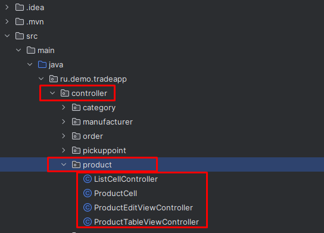

Предыдущее занятие | &nbsp; | Следующее занятие
:----------------:|:----------:|:----------------:
[Урок 6](Lesson6.md) | [Содержание](readme.md) | [Урок 8](Lesson8.md)

# Урок 7. Просмотр списка заказов и рефактор структуры приложения

Изучите задание на разработку приложения. 

[Задание на разработку.pdf](%C7%E0%E4%E0%ED%E8%E5%20%ED%E0%20%F0%E0%E7%F0%E0%E1%EE%F2%EA%F3.pdf)

1. [Работа с pom.xml](#работа-с-pomxml)
   * [pom.xml](#pomxml)
2. [Добавление репозиториев и папок](#добавление-репозиториев-и-папок)
3. [Перенос и добавление новых файлов в controller](#перенос-и-добавление-новых-файлов-в-controller)
   * category
     * [CategoryEditViewController](#categoryeditviewcontroller)
     * [CategoryTableViewController](#categorytableviewcontroller)
   * manufacturer
     * [ManufacturerEditViewController](#manufacturereditviewcontroller)
     * [ManufacturerTableViewController](#manufacturertableviewcontroller)
   * order
     * [OrderCell](#ordercell)
     * [OrderCellController](#ordercellcontroller)
     * [OrderEditViewController](#ordereditviewcontroller)
     * [OrderTableViewController](#ordertableviewcontroller)
     * [OrderViewController](#orderviewcontroller)
   * pickuppoint
     * [PickupPointEditViewController](#pickuppointeditviewcontroller)
     * [PickupPointTableViewController](#pickuppointtableviewcontroller)
   * product
     * [ListCellController](#listcellcontroller)
     * [ProductCell](#productcell)
     * [ProductEditViewController](#producteditviewcontroller)
     * [ProductTableViewController](#producttableviewcontroller)
   * role
     * [RoleEditViewController](#roleeditviewcontroller)
     * [RoleTableViewController](#roletableviewcontroller)
   * status
     * [StatusEditViewController](#statuseditviewcontroller)
     * [StatusTableViewController](#statustableviewcontroller) 
   * supplier
     * [SupplierEditViewController](#suppliereditviewcontroller)
     * [SupplierTableViewController](#suppliertableviewcontroller)
   * unittype
     * [UnittypeEditViewController](#unittypeeditviewcontroller)
     * [UnittypeTableViewController](#unittypetableviewcontroller)
   * user
      * [UserEditViewController](#usereditviewcontroller)
      * [UserTableViewController](#usertableviewcontroller)
   * [LoginController](#logincontroller)
   * [MainWindowController](#mainwindowcontroller)
4. [Добавление и изменение сущностей](#добавление-и-изменение-сущностей)
   * [Category](#класс-category)
   * [Manufacturer](#класс-manufacturer)
   * [Order](#класс-order)
   * [OrderProduct](#класс-orderproduct)
   * [OrderProductId](#класс-orderproductid)
   * [PickupPoint](#класс-pickuppoint)
   * [Product](#класс-product)
   * [Status](#класс-status)
   * [Role](#класс-role)
   * [Supllier](#класс-supllier)
   * [Unittype](#класс-unittype-)
   * [User](#класс-user-)
   * [hibernate.cfg.xml](#hibernatecfgxml)
5. [Добавление и изменение репозиториев](#добавление-репозиториев)
   * [BaseDao](#класс-basedao)
   * [CategoryDao](#класс-categorydao)
   * [ManufacturerDao](#класс-manufacturerdao)
   * [OrderDao](#класс-orderdao)
   * [OrderProductDao](#класс-orderproductdao)
   * [PickupPointDao](#класс-pickuppointdao)
   * [ProductDao](#класс-productdao)
   * [StatusDao](#класс-statusdao)
   * [SupplierDao](#класс-supplierdao)
   * [UnittypeDao](#класс-unittypedao)
   * [UserDao](#класс-userdao)
   * [RoleDao](#класс-roledao)
6. [Добавление и изменение сервисов](#добавление-сервисов)
   * [CategoryService](#класс-categoryservice)
   * [ManufacturerService](#класс-manufacturerservice)
   * [OrderProductService](#класс-orderproductservice)
   * [OrderService](#класс-orderservice)
   * [PickupPointService](#класс-pickuppointservice)
   * [ProductService](#класс-productservice)
   * [RoleService](#класс-roleservice)
   * [StatusService](#класс-statusservice)
   * [SupplierService](#класс-supplierservice)
   * [UnittypeService](#класс-unittypeservice)
   * [UserService](#класс-userservice)
7. [Пакет util](#пакет-util)
   * [Manager](#managerjava)
   * [Basket](#класс-basket)
   * [Item](#класс-item)
   * [HibernateSessionFactoryUtil](#класс-hibernatesessionfactoryutil)
   * [MakeCaptcha](#класс-makecaptcha)
8. [Создание и изменение существующих макетов fxml](#создание-и-изменение-существующих-макетов-fxml)
   * category
     * [category-edit-view.fxml](#category-edit-viewfxml)
     * [category-table-view.fxml](#category-table-viewfxml)
   * manufacturer
     * [manufacturer-edit-view.fxml](#manufacturer-edit-viewfxml)
     * [manufacturer-table-view.fxml](#manufacturer-table-viewfxml)
   * order
     * [ordercell-view.fxml](#ordercell-viewfxml)
     * [order-edit-view.fxml](#order-edit-viewfxml)
     * [orders-table-view.fxml](#orders-table-viewfxml)
     * [order-view.fxml](#order-viewfxml)
   * pickuppoint
     * [pickuppoint-edit-view.fxml](#pickuppoint-edit-viewfxml)
     * [pickuppoint-table-view.fxml](#pickuppoint-table-viewfxml)
   * product
     * [product-edit-view.fxml](#product-edit-viewfxml)
     * [productcell-view.fxml](#productcell-viewfxml)
     * [products-table-view.fxml](#products-table-viewfxml)
   * role
     * [role-edit-view.fxml](#role-edit-viewfxml)
     * [role-table-view.fxml](#role-table-viewfxml)
   * status
     * [status-edit-view.fxml](#status-edit-viewfxml)
     * [status-table-view.fxml](#status-table-viewfxml) 
   * supplier
     * [supplier-edit-view.fxml](#supplier-edit-viewfxml)
     * [supplier-table-view.fxml](#supplier-table-viewfxml)
   * unittype
     * [unittype-edit-view.fxml](#unittype-edit-viewfxml)
     * [unittype-table-view.fxml](#unittype-table-viewfxml)
   * user
      * [user-edit-view.fxml](#user-edit-viewfxml)
      * [user-table-view.fxml](#user-table-viewfxml)
   * [login-view.fxml](#login-viewfxml)
   * [main-view.fxml](#main-viewfxml)
9. [Настройка файла module-info.java](#настройка-файла-module-infojava)
10. [Добавление файла шрифта](#файл-шрифта-arialttf)
11. [файл стилей base-styles.css](#файл-стилей-base-stylescss)
12. [Запуск приложения](#запуск-приложения)
13. [Задания](#задания)


# Работа с pom.xml

1. Откройте файл pom.xml и замените его содержимое.
### pom.xml
```xml
<?xml version="1.0" encoding="UTF-8"?>
<project xmlns="http://maven.apache.org/POM/4.0.0"
         xmlns:xsi="http://www.w3.org/2001/XMLSchema-instance"
         xsi:schemaLocation="http://maven.apache.org/POM/4.0.0 https://maven.apache.org/xsd/maven-4.0.0.xsd">
    <modelVersion>4.0.0</modelVersion>

    <groupId>ru.trade</groupId>
    <artifactId>trade-app</artifactId>
    <version>1.0-SNAPSHOT</version>
    <name>trade-app</name>

    <properties>
        <project.build.sourceEncoding>UTF-8</project.build.sourceEncoding>
        <junit.version>5.9.2</junit.version>
    </properties>

    <dependencies>
        <!-- https://mvnrepository.com/artifact/com.gluonhq/charm-glisten -->
        <dependency>
            <groupId>org.hibernate.validator</groupId>
            <artifactId>hibernate-validator</artifactId>
            <version>8.0.1.Final</version>
        </dependency>
        <dependency>
            <groupId>org.hibernate.orm</groupId>
            <artifactId>hibernate-core</artifactId>
            <version>6.2.7.Final</version>
        </dependency>
        <dependency>
            <groupId>org.postgresql</groupId>
            <artifactId>postgresql</artifactId>
            <version>42.7.4</version>
        </dependency>
        <dependency>
            <groupId>org.openjfx</groupId>
            <artifactId>javafx-controls</artifactId>
            <version>21-ea+24</version>
        </dependency>
        <dependency>
            <groupId>org.openjfx</groupId>
            <artifactId>javafx-swing</artifactId>
            <version>13.0.2</version>
        </dependency>
        <dependency>
            <groupId>org.openjfx</groupId>
            <artifactId>javafx-fxml</artifactId>
            <version>21-ea+24</version>
        </dependency>
        <dependency>
            <groupId>org.junit.jupiter</groupId>
            <artifactId>junit-jupiter-api</artifactId>
            <version>${junit.version}</version>
            <scope>test</scope>
        </dependency>
        <dependency>
            <groupId>org.junit.jupiter</groupId>
            <artifactId>junit-jupiter-engine</artifactId>
            <version>${junit.version}</version>
            <scope>test</scope>
        </dependency>

    </dependencies>

    <build>
        <plugins>
            <plugin>
                <groupId>org.apache.maven.plugins</groupId>
                <artifactId>maven-compiler-plugin</artifactId>
                <version>3.11.0</version>
                <configuration>
                    <source>22</source>
                    <target>22</target>
                </configuration>
            </plugin>
            <plugin>
                <groupId>org.openjfx</groupId>
                <artifactId>javafx-maven-plugin</artifactId>
                <version>0.0.8</version>
                <executions>
                    <execution>
                        <!-- Default configuration for running with: mvn clean javafx:run -->
                        <id>default-cli</id>
                        <configuration>
                            <mainClass>ru.trade.tradeapp/ru.trade.tradeapp.TradeApp</mainClass>
                            <launcher>app</launcher>
                            <jlinkZipName>app</jlinkZipName>
                            <jlinkImageName>app</jlinkImageName>
                            <noManPages>true</noManPages>
                            <stripDebug>true</stripDebug>
                            <noHeaderFiles>true</noHeaderFiles>
                        </configuration>
                    </execution>
                </executions>
            </plugin>
            <plugin>
                <groupId>org.apache.maven.plugins</groupId>
                <artifactId>maven-checkstyle-plugin</artifactId>
                <version>3.3.1</version>
                <configuration>
                    <configLocation>checkstyle.xml</configLocation>
                    <includeTestSourceDirectory>true</includeTestSourceDirectory>
                    <failOnViolation>true</failOnViolation>
                    <logViolationsToConsole>true</logViolationsToConsole>
                </configuration>
                <executions>
                    <execution>
                        <goals>
                            <goal>check</goal>
                        </goals>
                        <phase>compile</phase>
                    </execution>
                </executions>
            </plugin>
        </plugins>
    </build>
</project>
```

# Добавление репозиториев и папок

1. Добавьте в репозиторий controller новые репозитории
   - category
   - manufacturer
   - order
   - pickuppoint
   - product
   - role
   - status
   - supplier
   - unittype
   - user
   
   
2. В папке ru.demo.tradeapp в папке resources добавьте следующие папки
   - category
   - manufacturer
   - order
   - pickuppoint
   - product
   - role
   - status
   - supplier
   - unittype
   - user
   
   
# Перенос и добавление новых файлов в controller
1. Создайте или переместите(если они были у вас созданы ранее) в репозиторий category два файла controller
  
### CategoryEditViewController
   ```
   package ru.demo.tradeapp.controller.category;
   import javafx.event.ActionEvent;
   import javafx.fxml.FXML;
   import javafx.fxml.Initializable;
   import javafx.scene.control.Alert;
   import javafx.scene.control.Button;
   import javafx.scene.control.TextField;
   import javafx.stage.Stage;
   import ru.demo.tradeapp.model.Category;
   import ru.demo.tradeapp.service.CategoryService;
   import ru.demo.tradeapp.util.Manager;

   import java.io.IOException;
   import java.net.URL;
   import java.util.ResourceBundle;

import static ru.demo.tradeapp.util.Manager.MessageBox;

public class CategoryEditViewController implements Initializable {
    boolean imageLoaded = false;
    @FXML
    private Button BtnCancel;
    @FXML
    private Button BtnLoadImage;
    @FXML
    private Button BtnSave;
    private CategoryService categoryService = new CategoryService();

    @FXML
    private TextField TextFieldTitle;

    @Override
    public void initialize(URL url, ResourceBundle resourceBundle) {
        if (Manager.currentCategory != null) {
              TextFieldTitle.setText(Manager.currentCategory.getTitle());
        } else {
            Manager.currentCategory = new Category();
        }
    }

    @FXML
    void BtnCancelAction(ActionEvent event) {
        Stage stage = (Stage) BtnCancel.getScene().getWindow();
        // do what you have to do
        stage.close();
    }

    @FXML
    void BtnSaveAction(ActionEvent event) throws IOException {
        String error = checkFields().toString();
        if (!error.isEmpty()) {
            MessageBox("Ошибка", "Заполните поля", error, Alert.AlertType.ERROR);
            return;
        }
        Manager.currentCategory.setTitle(TextFieldTitle.getText());
        if (Manager.currentCategory.getCategoryId() == null) {
            Manager.currentCategory.setTitle(TextFieldTitle.getText());
            categoryService.save(Manager.currentCategory);
            MessageBox("Информация", "", "Данные сохранены успешно", Alert.AlertType.INFORMATION);
        } else {
            categoryService.update(Manager.currentCategory);
            MessageBox("Информация", "", "Данные обновлены успешно", Alert.AlertType.INFORMATION);
        }
    }

    StringBuilder checkFields() {
        StringBuilder error = new StringBuilder();
        if (TextFieldTitle.getText().isEmpty()) {
            error.append("Укажите название категории\n");
            }
        return error;
    }
   }
   ```
   
### CategoryTableViewController
```java
package ru.demo.tradeapp.controller.category;


import javafx.beans.property.SimpleStringProperty;
import javafx.event.ActionEvent;
import javafx.fxml.FXML;
import javafx.fxml.FXMLLoader;
import javafx.fxml.Initializable;
import javafx.scene.Scene;
import javafx.scene.control.*;
import javafx.scene.input.InputMethodEvent;
import javafx.stage.Modality;
import javafx.stage.Stage;
import ru.demo.tradeapp.TradeApp;
import ru.demo.tradeapp.model.Category;
import ru.demo.tradeapp.model.Product;
import ru.demo.tradeapp.service.CategoryService;
import ru.demo.tradeapp.util.Manager;

import java.io.IOException;
import java.net.URL;
import java.util.List;
import java.util.Optional;
import java.util.ResourceBundle;
import java.util.stream.Collectors;

import static ru.demo.tradeapp.util.Manager.*;

public class CategoryTableViewController implements Initializable {

    @FXML
    private MenuItem MenuItemAdd;

    @FXML
    private MenuItem MenuItemBack;

    @FXML
    private MenuItem MenuItemDelete;


    @FXML
    private MenuItem MenuItemUpdate;


    @FXML
    private Label LabelInfo;

    @FXML
    private Label LabelUser;

    @FXML
    private TableColumn<Category, String> TableColumnId;

    @FXML
    private TableColumn<Category, String> TableColumnTitle;

    @FXML
    private TableView<Category> TableViewCategories;

    @FXML
    private TextField TextFieldSearch;
    private int itemsCount;
    private CategoryService categoryService = new CategoryService();


    @FXML
    void TextFieldSearchAction(ActionEvent event) {
        filterData();
    }


    @Override
    public void initialize(URL url, ResourceBundle resourceBundle) {
        initController();
    }

    public void initController() {
        LabelUser.setText("Вы вошли как " + currentUser.getSecondName() + " " + Manager.currentUser.getFirstName());
        setCellValueFactories();

        filterData();
    }

    void filterData() {
        List<Category> categories = categoryService.findAll();
        itemsCount = categories.size();

        String searchText = TextFieldSearch.getText();
        if (!searchText.isEmpty()) {
            categories = categories.stream().filter(product -> product.getTitle().toLowerCase().contains(searchText.toLowerCase())).collect(Collectors.toList());
        }
        TableViewCategories.getItems().clear();
        for (Category category : categories) {
            TableViewCategories.getItems().add(category);
        }

        int filteredItemsCount = categories.size();
        LabelInfo.setText("Всего записей " + filteredItemsCount + " из " + itemsCount);
        TableViewCategories.setColumnResizePolicy(TableView.CONSTRAINED_RESIZE_POLICY_FLEX_LAST_COLUMN);
    }

    private void setCellValueFactories() {

        TableColumnId.setCellValueFactory(cellData -> new SimpleStringProperty(cellData.getValue().getCategoryId().toString()));
        TableColumnTitle.setCellValueFactory(cellData -> new SimpleStringProperty(cellData.getValue().getTitle()));
    }

    @FXML
    void MenuItemAddAction(ActionEvent event) {
        currentCategory = null;
        ShowEditWindow("category/category-edit-view.fxml");
        filterData();
    }

    @FXML
    void MenuItemBackAction(ActionEvent event) {
        Manager.LoadSecondStageScene("product/products-table-view.fxml", "Товары");
    }


    @FXML
    void MenuItemDeleteAction(ActionEvent event) {
        Category category = TableViewCategories.getSelectionModel().getSelectedItem();
        if (!category.getProducts().isEmpty()) {
            ShowErrorMessageBox("Ошибка целостности данных, у данного товара есть зависимые заказы");
            return;
        }

        Optional<ButtonType> result = ShowConfirmPopup();
        if (result.get() == ButtonType.OK) {
            categoryService.delete(category);
            filterData();
        }
    }

    @FXML
    void MenuItemUpdateAction(ActionEvent event) {
        Category category = TableViewCategories.getSelectionModel().getSelectedItem();
        currentCategory = category;
        ShowEditWindow("category/category-edit-view.fxml");
        filterData();
    }

}

```

2. Создайте или переместите(если они были у вас созданы ранее) в репозиторий manufacturer два файла controller

### ManufacturerEditViewController
```java
package ru.demo.tradeapp.controller.manufacturer;

import javafx.event.ActionEvent;
import javafx.fxml.FXML;
import javafx.fxml.Initializable;
import javafx.scene.control.Alert;
import javafx.scene.control.Button;
import javafx.scene.control.TextField;
import javafx.stage.Stage;
import ru.demo.tradeapp.model.Manufacturer;
import ru.demo.tradeapp.service.ManufacturerService;
import ru.demo.tradeapp.util.Manager;

import java.io.IOException;
import java.net.URL;
import java.util.ResourceBundle;

import static ru.demo.tradeapp.util.Manager.MessageBox;

public class ManufacturerEditViewController implements Initializable {
    boolean imageLoaded = false;
    @FXML
    private Button BtnCancel;
    @FXML
    private Button BtnLoadImage;
    @FXML
    private Button BtnSave;
    private ManufacturerService manufacturerService = new ManufacturerService();

    @FXML
    private TextField TextFieldTitle;

    @Override
    public void initialize(URL url, ResourceBundle resourceBundle) {
        if (Manager.currentManufacturer != null) {
            TextFieldTitle.setText(Manager.currentManufacturer.getTitle());
        } else {
            Manager.currentManufacturer = new Manufacturer();
        }
    }

    @FXML
    void BtnCancelAction(ActionEvent event) {
        Stage stage = (Stage) BtnCancel.getScene().getWindow();
        // do what you have to do
        stage.close();
    }

    @FXML
    void BtnSaveAction(ActionEvent event) throws IOException {
        String error = checkFields().toString();
        if (!error.isEmpty()) {
            MessageBox("Ошибка", "Заполните поля", error, Alert.AlertType.ERROR);
            return;
        }
        Manager.currentManufacturer.setTitle(TextFieldTitle.getText());
        if (Manager.currentManufacturer.getManufacturerId() == null) {
            Manager.currentManufacturer.setTitle(TextFieldTitle.getText());
            manufacturerService.save(Manager.currentManufacturer);
            MessageBox("Информация", "", "Данные сохранены успешно", Alert.AlertType.INFORMATION);
        } else {
            manufacturerService.update(Manager.currentManufacturer);
            MessageBox("Информация", "", "Данные обновлены успешно", Alert.AlertType.INFORMATION);
        }
    }

    StringBuilder checkFields() {
        StringBuilder error = new StringBuilder();
        if (TextFieldTitle.getText().isEmpty()) {
            error.append("Укажите имя производителя\n");
        }
        return error;
    }
}

```
### ManufacturerTableViewController
```java
package ru.demo.tradeapp.controller.manufacturer;

import javafx.beans.property.SimpleStringProperty;
import javafx.collections.FXCollections;
import javafx.collections.ObservableList;
import javafx.event.ActionEvent;
import javafx.fxml.FXML;
import javafx.fxml.FXMLLoader;
import javafx.fxml.Initializable;
import javafx.scene.Scene;
import javafx.scene.control.*;
import javafx.scene.input.InputMethodEvent;
import javafx.stage.Modality;
import javafx.stage.Stage;
import ru.demo.tradeapp.TradeApp;
import ru.demo.tradeapp.model.Category;
import ru.demo.tradeapp.model.Manufacturer;
import ru.demo.tradeapp.service.ManufacturerService;
import ru.demo.tradeapp.util.Manager;

import java.io.IOException;
import java.net.URL;
import java.util.List;
import java.util.Optional;
import java.util.ResourceBundle;
import java.util.stream.Collectors;

import static ru.demo.tradeapp.util.Manager.*;
import static ru.demo.tradeapp.util.Manager.currentCategory;

public class ManufacturerTableViewController implements Initializable {

    private int itemsCount;
    private ManufacturerService manufacturerService = new ManufacturerService();

    @FXML
    private TableColumn<Manufacturer, String> TableColumnManufacturerId;

    @FXML
    private Button BtnAdd;

    @FXML
    private Button BtnDelete;

    @FXML
    private Button BtnUpdate;

    @FXML
    private TableColumn<Manufacturer, String> TableColumnTitle;
    @FXML
    private Label LabelInfo;
    @FXML
    private Label LabelUser;
    @FXML
    private TextField TextFieldSearch;


    @FXML
    private TableView<Manufacturer> TableViewManufacturers;

    @FXML
    void TextFieldSearchAction(ActionEvent event) {
        filterData();
    }

    @FXML
    void MenuItemAddAction(ActionEvent event) {
        currentManufacturer = null;
        ShowEditWindow("manufacturer/manufacturer-edit-view.fxml");
        filterData();
    }

    @FXML
    void MenuItemBackAction(ActionEvent event) {
        Manager.LoadSecondStageScene("product/products-table-view.fxml", "Товары");
    }


    @FXML
    void MenuItemDeleteAction(ActionEvent event) {
        Manufacturer manufacturer = TableViewManufacturers.getSelectionModel().getSelectedItem();
        if (!manufacturer.getProducts().isEmpty()) {
            ShowErrorMessageBox("Ошибка целостности данных, у данного товара есть зависимые товары");
            return;
        }

        Optional<ButtonType> result = ShowConfirmPopup();
        if (result.get() == ButtonType.OK) {
            manufacturerService.delete(manufacturer);
            filterData();
        }
    }


    @FXML
    void MenuItemUpdateAction(ActionEvent event) {
        Manufacturer manufacturer = TableViewManufacturers.getSelectionModel().getSelectedItem();
        currentManufacturer = manufacturer;
        ShowEditWindow("manufacturer/manufacturer-edit-view.fxml");
        filterData();
    }

   @Override
    public void initialize(URL url, ResourceBundle resourceBundle) {
        initController();
    }

    public void initController() {
        LabelUser.setText(Manager.currentUser.getFirstName());
        List<Manufacturer> manufacturerList = manufacturerService.findAll();
        manufacturerList.add(0, new Manufacturer(0L, "Все"));
        ObservableList<Manufacturer> manufacturers = FXCollections.observableArrayList(manufacturerList);
        TableViewManufacturers.setItems(manufacturers);
        setCellValueFactories();

        filterData();
    }

    void filterData() {
        List<Manufacturer> manufacturer = manufacturerService.findAll();
        itemsCount = manufacturer.size();

        String searchText = TextFieldSearch.getText();
        if (!searchText.isEmpty()) {
            manufacturer = manufacturer.stream().filter(manufacturers -> manufacturers.getTitle().toLowerCase().contains(searchText.toLowerCase())).collect(Collectors.toList());
        }
        TableViewManufacturers.getItems().clear();
        for (Manufacturer manufacturers : manufacturer) {
            TableViewManufacturers.getItems().add(manufacturers);
        }
        int filteredItemsCount = manufacturer.size();
        LabelInfo.setText("Всего записей " + filteredItemsCount + " из " + itemsCount);
        TableViewManufacturers.setColumnResizePolicy(TableView.CONSTRAINED_RESIZE_POLICY_FLEX_LAST_COLUMN);
    }

    private void setCellValueFactories() {
        TableColumnManufacturerId.setCellValueFactory(cellData ->
                new SimpleStringProperty(String.valueOf(cellData.getValue().getManufacturerId())));
        TableColumnTitle.setCellValueFactory(cellData -> new SimpleStringProperty(cellData.getValue().getTitle()));
    }
}

```

3. Создайте или переместите(если они были у вас созданы ранее) в репозиторий order пять файлов controller

### OrderCell
```java
package ru.demo.tradeapp.controller.order;

import javafx.fxml.FXMLLoader;
import javafx.scene.Parent;
import javafx.scene.control.ListCell;
import ru.demo.tradeapp.TradeApp;
import ru.demo.tradeapp.util.Item;

import java.io.IOException;

public class OrderCell extends ListCell<Item> {

    private final Parent root;
    private OrderCellController controller;

    public OrderCell() {
        try {
            FXMLLoader loader = new FXMLLoader(TradeApp.class.getResource("order/ordercell-view.fxml"));
            root = loader.load();
            root.getStylesheets().add("base-styles.css");
            controller = loader.getController();
        } catch (IOException exc) {
            throw new RuntimeException(exc);
        }
    }

    @Override
    protected void updateItem(Item item, boolean empty) {
        super.updateItem(item, empty);
        if (empty || item == null) {
            setGraphic(null);
        } else {
            try {
                controller.setItem(item);
            } catch (IOException e) {
                throw new RuntimeException(e);
            }
            setGraphic(root);
        }
    }
}

```
### OrderCellController
```java
package ru.demo.tradeapp.controller.order;

import javafx.event.ActionEvent;
import javafx.fxml.FXML;
import javafx.scene.control.Label;
import javafx.scene.image.ImageView;
import javafx.scene.layout.AnchorPane;
import ru.demo.tradeapp.model.Product;
import ru.demo.tradeapp.util.Item;

import java.io.IOException;
import java.util.Map;

public class OrderCellController {

    @FXML
    private AnchorPane CellAnchorPane;

    @FXML
    private ImageView ImageViewPhoto;

    @FXML
    private Label LabelBasePrice;

    @FXML
    private Label LabelCountInBasket;

    @FXML
    private Label LabelCountInStock;

    @FXML
    private Label LabelDescription;

    @FXML
    private Label LabelInfo;

    @FXML
    private Label LabelManufacturer;

    @FXML
    private Label LabelPercent;

    @FXML
    private Label LabelPriceWithDiscount;

    @FXML
    private Label LabelTitle;

    @FXML
    void AddProductInBasket(ActionEvent event) {

    }

    public void setItem(Item item) throws IOException {
        Product product = item.getProduct();
        ImageViewPhoto.setImage(product.getPhoto());
        LabelPercent.setText(product.getDiscountAmount().toString() + "%");
        LabelDescription.setText(product.getDescription());
        LabelTitle.setText(product.getTitle());
        LabelManufacturer.setText("Производитель: " + product.getManufacturer().getTitle());

        LabelCountInBasket.setText("Количество: " + item.getCount());
        LabelCountInStock.setText("В наличии на складе: " + product.getQuantityInStock());

        LabelInfo.setText("Итого: " + String.format("%.2f", item.getTotal()) + " руб.");
        if (product.getDiscountAmount() >= 15) {
            CellAnchorPane.setStyle("-fx-background-color: #7fff00;");
        } else {
            CellAnchorPane.setStyle("-fx-background-color: #fff;");
        }

        LabelBasePrice.setText(String.format("%.2f", product.getCost()) + " руб.");
        LabelPriceWithDiscount.setVisible(false);
        LabelBasePrice.setStyle("-fx-text-fill: #000000;");
        if (product.getDiscountAmount() > 0) {
            LabelPriceWithDiscount.setText(String.format("%.2f", product.getPriceWithDiscount()) + " руб.");
            LabelPriceWithDiscount.setVisible(true);
            LabelPriceWithDiscount.setStyle("-fx-text-fill: #0000FF;");
            LabelBasePrice.setStyle("-fx-text-fill: #FF0000;");
        }
    }
}

```
### OrderEditViewController
```java
package ru.demo.tradeapp.controller.order;

import com.itextpdf.text.DocumentException;
import javafx.beans.property.SimpleIntegerProperty;
import javafx.beans.property.SimpleLongProperty;
import javafx.beans.property.SimpleStringProperty;
import javafx.collections.FXCollections;
import javafx.event.ActionEvent;
import javafx.fxml.FXML;
import javafx.fxml.Initializable;
import javafx.scene.control.*;
import javafx.scene.layout.BorderPane;
import ru.demo.tradeapp.model.*;
import ru.demo.tradeapp.service.*;
import ru.demo.tradeapp.util.Basket;
import ru.demo.tradeapp.util.Item;
import ru.demo.tradeapp.util.Manager;

import java.io.IOException;
import java.net.URL;
import java.time.LocalDate;
import java.util.*;

import static ru.demo.tradeapp.util.Manager.*;
import static ru.demo.tradeapp.util.Manager.mainBasket;

public class OrderEditViewController implements Initializable {


    PickupPointService pickupPointService = new PickupPointService();
    StatusService statusService = new StatusService();
    OrderService orderService = new OrderService();
    ProductService productService = new ProductService();
    OrderProductService orderProductService = new OrderProductService();

    @FXML
    private Button BtnOk;

    @FXML
    private Button BtnPrintToPDF;

    @FXML
    private ComboBox<PickupPoint> ComboBoxPickupPoint;

    @FXML
    private ComboBox<Status> ComboStatus;

    @FXML
    private DatePicker DatePickerOrderCreateDate;

    @FXML
    private DatePicker DatePickerOrderDeliveryDate;

    @FXML
    private Label LabelBasketInfo;

    @FXML
    private Label LabelOrderGetCode;

    @FXML
    private Label LabelOrderNumber;

    @FXML
    private Label LabelUser;

    @FXML
    private TableColumn<OrderProduct, String> TableColumnCost;

    @FXML
    private TableColumn<OrderProduct, String> TableColumnCount;

    @FXML
    private TableColumn<OrderProduct, String> TableColumnDiscountAmount;

    @FXML
    private TableColumn<OrderProduct, String> TableColumnId;

    @FXML
    private TableColumn<OrderProduct, String> TableColumnPriceWithDiscount;

    @FXML
    private TableColumn<OrderProduct, String> TableColumnTitle;

    @FXML
    private TableColumn<OrderProduct, String> TableColumnTotal;

    @FXML
    private TableView<OrderProduct> TableViewOrderProduct;


    @FXML
    void BtnPrintToPDFAction(ActionEvent event) throws IOException, DocumentException {
        PrintOrderToPDF(currentOrder);
    }

    @FXML
    void BtnOkAction(ActionEvent event) {
        String error = checkFields().toString();
        if (!error.isEmpty()) {
            MessageBox("Ошибка", "Заполните поля", error, Alert.AlertType.ERROR);
            return;
        }
        currentOrder.setStatus(ComboStatus.getValue());
        currentOrder.setPickupPoint(ComboBoxPickupPoint.getValue());
        orderService.update(currentOrder);
        MessageBox("Информация", "", "Данные сохранены успешно", Alert.AlertType.INFORMATION);
    }
    @Override
    public void initialize(URL url, ResourceBundle resourceBundle) {

        LabelUser.setText("Вы вошли как " + currentUser.getSecondName() + " " + Manager.currentUser.getFirstName());
        ComboBoxPickupPoint.setItems(FXCollections.observableArrayList(pickupPointService.findAll()));
        ComboStatus.setItems(FXCollections.observableArrayList(statusService.findAll()));

        if (currentOrder.getUser() != null)
            LabelOrderNumber.setText("Заказ №" + currentOrder.getOrderId() + " на имя " + currentOrder.getUser().getSecondName() + " " + currentOrder.getUser().getFirstName());
        else
            LabelOrderNumber.setText("Заказ №" + currentOrder.getOrderId());
        DatePickerOrderCreateDate.setValue(currentOrder.getCreateDate());
        DatePickerOrderDeliveryDate.setValue(currentOrder.getDeliveryDate());
        LabelOrderGetCode.setText("Код выдачи: " + currentOrder.getGetCode());
        ComboStatus.setValue(currentOrder.getStatus());
        ComboBoxPickupPoint.setValue(currentOrder.getPickupPoint());
        setCellValueFactories();
        loadProducts();
    }

    public void loadProducts() {
        List<OrderProduct> orderProducts = orderService.findOne(currentOrder.getOrderId()).getOrderProducts();

        TableViewOrderProduct.getItems().clear();
        for (OrderProduct orderProduct : orderProducts) {
            TableViewOrderProduct.getItems().add(orderProduct);

        }

        LabelBasketInfo.setText("Общая сумма заказа: " + String.format("%.2f", currentOrder.getTotalCostWithDiscount())
                + ". Общий размер скидки: " + String.format("%.2f", currentOrder.getTotalDiscount()) + "%");
    }

    private void setCellValueFactories() {
        TableColumnTitle.setCellValueFactory(cellData -> new SimpleStringProperty(cellData.getValue().getProduct().getTitle()));
        TableColumnCount.setCellValueFactory(cellData -> new SimpleStringProperty(cellData.getValue().getCount().toString()));
        TableColumnCost.setCellValueFactory(cellData -> new SimpleStringProperty(String.format("%.2f", cellData.getValue().getProduct().getCost())));
        TableColumnDiscountAmount.setCellValueFactory(cellData -> new SimpleStringProperty(cellData.getValue().getProduct().getDiscountAmount().toString()));
        TableColumnPriceWithDiscount.setCellValueFactory(cellData -> new SimpleStringProperty(String.format("%.2f", cellData.getValue().getProduct().getPriceWithDiscount())));
        TableColumnTotal.setCellValueFactory(cellData -> new SimpleStringProperty(String.format("%.2f", cellData.getValue().getProduct().getPriceWithDiscount() * cellData.getValue().getCount())));
    }


    StringBuilder checkFields() {
        StringBuilder error = new StringBuilder();

        if (ComboStatus.getValue() == null) {
            error.append("Выберите статус\n");
        }
        if (ComboBoxPickupPoint.getValue() == null) {
            error.append("Выберите пункт выдачи\n");
        }


        return error;
    }


}

```
### OrderTableViewController
```java
package ru.demo.tradeapp.controller.order;

import com.itextpdf.text.DocumentException;
import javafx.beans.binding.Bindings;
import javafx.beans.binding.BooleanBinding;
import javafx.beans.property.*;
import javafx.collections.FXCollections;
import javafx.collections.ObservableList;
import javafx.event.ActionEvent;
import javafx.fxml.FXML;
import javafx.fxml.Initializable;
import javafx.scene.control.*;
import javafx.scene.input.InputMethodEvent;
import org.hibernate.boot.jaxb.internal.stax.JpaOrmXmlEventReader;
import ru.demo.tradeapp.model.Category;
import ru.demo.tradeapp.model.Order;
import ru.demo.tradeapp.model.PickupPoint;
import ru.demo.tradeapp.model.Product;
import ru.demo.tradeapp.service.OrderService;
import ru.demo.tradeapp.service.PickupPointService;
import ru.demo.tradeapp.service.ProductService;
import ru.demo.tradeapp.util.Manager;

import java.io.FileNotFoundException;
import java.net.URL;
import java.text.SimpleDateFormat;
import java.time.LocalDate;
import java.util.List;
import java.util.Optional;
import java.util.ResourceBundle;
import java.util.stream.Collectors;

import static ru.demo.tradeapp.util.Manager.*;

public class OrderTableViewController implements Initializable {
    private int itemsCount;
    private final OrderService orderService = new OrderService();
    private final PickupPointService pickupPointService = new PickupPointService();
    @FXML
    private ComboBox<PickupPoint> ComboBoxPickupPoint;
    @FXML
    private ComboBox<String> ComboBoxDiscount;
    @FXML
    private Label LabelInfo;

    @FXML
    private Label LabelUser;

    @FXML
    private MenuItem MenuItemAdd;

    @FXML
    private MenuItem MenuItemBack;

    @FXML
    private MenuItem MenuItemDelete;

    @FXML
    private MenuItem MenuItemUpdate;

    @FXML
    private TableColumn<Order, String> TableColumnCreateDate;

    @FXML
    private TableColumn<Order, String> TableColumnDeliveryDate;

    @FXML
    private TableColumn<Order, Integer> TableColumnGetCode;
    @FXML
    private MenuItem MenuItemPrintToPDF;
    @FXML
    private TableColumn<Order, Long> TableColumnId;

    @FXML
    private TableColumn<Order, String> TableColumnPickupPoint;

    @FXML
    private TableColumn<Order, String> TableColumnStatus;
    @FXML
    private TableColumn<Order, String> TableColumnDiscount;

    @FXML
    private TableColumn<Order, String> TableColumnUser;

    @FXML
    private TableView<Order> TableViewOrders;

    @FXML
    private TextField TextFieldSearch;


    @FXML
    void ComboBoxPickupPointAction(ActionEvent event) {
        filterData();
    }

    @FXML
    void MenuItemPrintToPDFAction(ActionEvent event) throws DocumentException, FileNotFoundException {
        Order order = TableViewOrders.getSelectionModel().getSelectedItem();

        if (order != null) {
            Manager.PrintOrderToPDF(order);
            MessageBox("Информация", "", "Данные сохранены успешно", Alert.AlertType.INFORMATION);
            return;
        }
    }

    @FXML
    void MenuItemAddAction(ActionEvent event) {

    }

    @FXML
    void ComboBoxDiscountAction(ActionEvent event) {
        filterData();
    }

    @FXML
    void MenuItemBackAction(ActionEvent event) {
        Manager.LoadSecondStageScene("main-view.fxml", "ООО Ручки");
    }

    @FXML
    void MenuItemDeleteAction(ActionEvent event) {
        Order order = TableViewOrders.getSelectionModel().getSelectedItem();


        Optional<ButtonType> result = ShowConfirmPopup();
        if (result.get() == ButtonType.OK) {
            orderService.delete(order);
            filterData();
        }
    }

    @FXML
    void MenuItemUsersAction(ActionEvent event) {
        Manager.LoadSecondStageScene("user/user-table-view.fxml", "Пользователи");
    }

    @FXML
    void MenuItemPickupPointsAction(ActionEvent event) {
        Manager.LoadSecondStageScene("pickuppoint/pickuppoint-table-view.fxml", "Пункты выдачи");
    }

    @FXML
    void MenuItemStatusesAction(ActionEvent event) {
        Manager.LoadSecondStageScene("status/status-table-view.fxml", "Статусы");
    }

    @FXML
    void MenuItemRolesAction(ActionEvent event) {
        Manager.LoadSecondStageScene("role/role-table-view.fxml", "Роли");
    }

    @FXML
    void MenuItemUpdateAction(ActionEvent event) {
        Order order = TableViewOrders.getSelectionModel().getSelectedItem();
        currentOrder = order;
        ShowEditWindow("order/order-edit-view.fxml");
        filterData();
    }

    @FXML
    void TextFieldTextChanged(InputMethodEvent event) {

    }

    @FXML
    void TextFieldSearchAction(ActionEvent event) {
        filterData();
    }


    @Override
    public void initialize(URL url, ResourceBundle resourceBundle) {
        initController();
    }

    public void initController() {
        List<PickupPoint> pickupPointList = pickupPointService.findAll();
        pickupPointList.add(0, new PickupPoint(0L, "Все"));
        ObservableList<PickupPoint> pickupPoints = FXCollections.observableArrayList(pickupPointList);
        ComboBoxPickupPoint.setItems(pickupPoints);
        ObservableList<String> discounts = FXCollections.observableArrayList("Все товары", "0-5.99%", "6-10.99%", "11% и более");
        ComboBoxDiscount.setItems(discounts);
        LabelUser.setText("Вы вошли как " + currentUser.getSecondName() + " " + Manager.currentUser.getFirstName());

        setCellValueFactories();

        filterData();
    }

    void filterData() {
        List<Order> orders = orderService.findAll();
        itemsCount = orders.size();

        String searchText = TextFieldSearch.getText();
        if (!searchText.isEmpty()) {
            orders = orders.stream().filter(product -> product.getOrderId().toString().contains(searchText.toLowerCase())).collect(Collectors.toList());
        }
        if (!ComboBoxPickupPoint.getSelectionModel().isEmpty()) {
            PickupPoint pickupPoint = ComboBoxPickupPoint.getValue();
            if (pickupPoint.getPickupPointId() != 0) {
                orders = orders.stream().filter(order -> order.getPickupPoint().getPickupPointId().equals(pickupPoint.getPickupPointId())).collect(Collectors.toList());
            }
        }
        if (!ComboBoxDiscount.getSelectionModel().isEmpty()) {
            String discount = ComboBoxDiscount.getValue();
            if (discount.equals("0-5.99%")) {
                orders = orders.stream().filter(order -> order.getTotalDiscount() < 6).collect(Collectors.toList());
            }
            if (discount.equals("6-10.99%")) {
                orders = orders.stream().filter(order -> order.getTotalDiscount() >= 6 && order.getTotalDiscount() < 11).collect(Collectors.toList());
            }
            if (discount.equals("11% и более")) {
                orders = orders.stream().filter(order -> order.getTotalDiscount() >= 11).collect(Collectors.toList());
            }
        }

        TableViewOrders.getItems().clear();
        for (Order order : orders) {
            TableViewOrders.getItems().add(order);
        }

        int filteredItemsCount = orders.size();
        LabelInfo.setText("Всего записей " + filteredItemsCount + " из " + itemsCount);
        TableViewOrders.setColumnResizePolicy(TableView.CONSTRAINED_RESIZE_POLICY_ALL_COLUMNS);


    }

    private void setCellValueFactories() {

        TableColumnId.setCellValueFactory(cellData -> new SimpleLongProperty(cellData.getValue().getOrderId()).asObject());
        TableColumnStatus.setCellValueFactory(cellData -> new SimpleStringProperty(cellData.getValue().getStatus().getTitle()));
        TableColumnPickupPoint.setCellValueFactory(cellData -> new SimpleStringProperty(cellData.getValue().getPickupPoint().getTitle()));
        TableColumnCreateDate.setCellValueFactory(cellData -> new SimpleStringProperty(cellData.getValue().getCreateDate().toString()));

        TableColumnDeliveryDate.setCellValueFactory(cellData -> new SimpleStringProperty(cellData.getValue().getDeliveryDate().toString()));
        TableColumnGetCode.setCellValueFactory(cellData -> new SimpleIntegerProperty(cellData.getValue().getGetCode()).asObject());

        TableColumnUser.setCellValueFactory(cellData -> {
            if (cellData.getValue().getUser() != null)
                return new SimpleStringProperty(cellData.getValue().getUser().getFirstName());
            else
                return new SimpleStringProperty("");
        });
        TableColumnDiscount.setCellValueFactory(cellData -> new SimpleStringProperty(String.format("%.2f", cellData.getValue().getTotalDiscount())));


    }
}

```
### OrderViewController
```java
package ru.demo.tradeapp.controller.order;

import com.itextpdf.text.*;
import javafx.collections.FXCollections;
import javafx.event.ActionEvent;
import javafx.fxml.FXML;
import javafx.fxml.Initializable;
import javafx.scene.control.*;
import javafx.scene.layout.BorderPane;
import ru.demo.tradeapp.model.*;
import ru.demo.tradeapp.service.*;
import ru.demo.tradeapp.util.Item;
import ru.demo.tradeapp.util.Manager;

import java.io.IOException;
import java.net.URL;
import java.time.LocalDate;
import java.util.*;

import static ru.demo.tradeapp.util.Manager.*;

public class OrderViewController implements Initializable {


    PickupPointService pickupPointService = new PickupPointService();
    StatusService statusService = new StatusService();
    OrderService orderService = new OrderService();
    ProductService productService = new ProductService();
    OrderProductService orderProductService = new OrderProductService();
    Order newOrder;
    @FXML
    private BorderPane BorderPaneMainFrame;

    @FXML
    private Button BtnDelete;

    @FXML
    private Button BtnPrintToPDF;
    @FXML
    private Button BtnOk;

    @FXML
    private ComboBox<PickupPoint> ComboBoxPickupPoint;

    @FXML
    private ComboBox<Status> ComboStatus;

    @FXML
    private DatePicker DatePickerOrderCreateDate;

    @FXML
    private DatePicker DatePickerOrderDeliveryDate;

    @FXML
    private Label LabelBasketInfo;

    @FXML
    private Label LabelOrderGetCode;

    @FXML
    private Label LabelOrderNumber;

    @FXML
    private Label LabelUser;

    @FXML
    private ListView<Item> ListViewProducts;

    @FXML
    void BtnDeleteAction(ActionEvent event) {
        Item item = ListViewProducts.getSelectionModel().getSelectedItem();
        Alert alert = new Alert(Alert.AlertType.CONFIRMATION);
        alert.setTitle("Удаление");
        alert.setHeaderText("Вы действительно хотите удалить товар " + item.getProduct().getTitle() + " из корзины?");
        Optional<ButtonType> result = alert.showAndWait();
        if (result.get() == ButtonType.OK) {
            mainBasket.deleteProductFromBasket(item.getProduct());
            loadProducts();
        }
    }

    @FXML
    void BtnPrintToPDFAction(ActionEvent event) throws IOException, DocumentException {
        PrintOrderToPDF(newOrder);
    }

    @FXML
    void BtnOkAction(ActionEvent event) {
        String error = checkFields().toString();
        if (!error.isEmpty()) {
            MessageBox("Ошибка", "Заполните поля", error, Alert.AlertType.ERROR);
            return;
        }
        newOrder.setUser(currentUser);
        newOrder.setStatus(ComboStatus.getValue());
        newOrder.setPickupPoint(ComboBoxPickupPoint.getValue());
        orderService.save(newOrder);
        MessageBox("Информация", "", "Данные сохранены успешно", Alert.AlertType.INFORMATION);
        BtnOk.setDisable(true);
        BtnDelete.setDisable(true);
        BtnPrintToPDF.setVisible(true);
        BtnPrintToPDF.setDisable(false);
    }

    @FXML
    void ComboBoxPickupPointAction(ActionEvent event) {

    }

    @Override
    public void initialize(URL url, ResourceBundle resourceBundle) {
        ComboStatus.setValue(new Status(1L, "Новый"));
        LabelUser.setText("Вы вошли как " + currentUser.getSecondName() + " " + Manager.currentUser.getFirstName());
        ComboBoxPickupPoint.setItems(FXCollections.observableArrayList(pickupPointService.findAll()));
        ComboStatus.setItems(FXCollections.observableArrayList(statusService.findAll()));
        newOrder = CreateNewOrder();
        LabelOrderNumber.setText("Заказ №" + newOrder.getOrderId() + " на имя " + currentUser.getSecondName() + " " + currentUser.getFirstName());
        DatePickerOrderCreateDate.setValue(newOrder.getCreateDate());
        DatePickerOrderDeliveryDate.setValue(newOrder.getDeliveryDate());
        LabelOrderGetCode.setText("Код выдачи: " + newOrder.getGetCode());
        BtnPrintToPDF.setVisible(false);
        BtnPrintToPDF.setDisable(true);
        loadProducts();
    }

    public void loadProducts() {
        ListViewProducts.getItems().clear();

        for (Map.Entry<Product, Item> entry : Manager.mainBasket.getBasket().entrySet()) {
            ListViewProducts.getItems().add(entry.getValue());
        }
        ListViewProducts.setCellFactory(lv -> new OrderCell());
        LabelBasketInfo.setText("Общая сумма заказа: " + String.format("%.2f", Manager.mainBasket.getTotalCost())
                + ". Общий размер скидки: " + mainBasket.getTotalDiscount() + "%");
    }

    public Order CreateNewOrder() {
        Order order = new Order();

        Optional<Order> maxOrder = orderService.findAll().stream().max(Comparator.comparing(Order::getOrderId));
        if (maxOrder.isPresent())
            order.setOrderId(maxOrder.get().getOrderId() + 1);
        else {
            order.setOrderId(1L);
        }
        order.setCreateDate(LocalDate.now());
        if (Manager.mainBasket.isOnStock())
            order.setDeliveryDate(order.getCreateDate().plusDays(3));
        else
            order.setDeliveryDate(order.getCreateDate().plusDays(6));

        Random rnd = new Random();
        order.setGetCode(rnd.nextInt(100, 1000));
        return order;
    }

    StringBuilder checkFields() {
        StringBuilder error = new StringBuilder();
        if (mainBasket.getCount() == 0) {
            error.append("Корзина пуста\n");
        }
        if (ComboStatus.getValue() == null) {
            error.append("Выберите статус\n");
        }
        if (ComboBoxPickupPoint.getValue() == null) {
            error.append("Выберите пункт выдачи\n");
        }


        return error;
    }
}
```

4. Создайте или переместите(если они были у вас созданы ранее) в репозиторий pickuppoint два файла controller

### PickupPointEditViewController
```java
package ru.demo.tradeapp.controller.pickuppoint;

import javafx.event.ActionEvent;
import javafx.fxml.FXML;
import javafx.fxml.Initializable;
import javafx.scene.control.Alert;
import javafx.scene.control.Button;
import javafx.scene.control.TextField;
import javafx.stage.Stage;
import ru.demo.tradeapp.model.PickupPoint;
import ru.demo.tradeapp.model.Role;
import ru.demo.tradeapp.service.PickupPointService;
import ru.demo.tradeapp.service.RoleService;
import ru.demo.tradeapp.util.Manager;

import java.io.IOException;
import java.net.URL;
import java.util.ResourceBundle;

import static ru.demo.tradeapp.util.Manager.MessageBox;

public class PickupPointEditViewController implements Initializable {
    @FXML
    private Button BtnSave;
    @FXML
    private Button BtnCancel;
    private PickupPointService pickupPointService = new PickupPointService();

    @FXML
    private TextField TextFieldTitle;

    @Override
    public void initialize(URL url, ResourceBundle resourceBundle) {
        if (Manager.currentPickupPoint != null) {
              TextFieldTitle.setText(Manager.currentPickupPoint.getTitle());
        } else {
            Manager.currentPickupPoint = new PickupPoint();
        }
    }

    @FXML
    void BtnCancelAction(ActionEvent event) {
        Stage stage = (Stage) BtnCancel.getScene().getWindow();
        // do what you have to do
        stage.close();
    }

    @FXML
    void BtnSaveAction(ActionEvent event) throws IOException {
        String error = checkFields().toString();
        if (!error.isEmpty()) {
            MessageBox("Ошибка", "Заполните поля", error, Alert.AlertType.ERROR);
            return;
        }
        Manager.currentPickupPoint.setTitle(TextFieldTitle.getText());
        if (Manager.currentPickupPoint.getPickupPointId() == null) {
            Manager.currentPickupPoint.setTitle(TextFieldTitle.getText());
            pickupPointService.save(Manager.currentPickupPoint);
            MessageBox("Информация", "", "Данные сохранены успешно", Alert.AlertType.INFORMATION);
        } else {
            pickupPointService.update(Manager.currentPickupPoint);
            MessageBox("Информация", "", "Данные обновлены успешно", Alert.AlertType.INFORMATION);
        }
    }

    StringBuilder checkFields() {
        StringBuilder error = new StringBuilder();
        if (TextFieldTitle.getText().isEmpty()) {
            error.append("Укажите название\n");
            }
        return error;
    }
}

```
### PickupPointTableViewController
```java
package ru.demo.tradeapp.controller.pickuppoint;


import javafx.beans.property.SimpleStringProperty;
import javafx.event.ActionEvent;
import javafx.fxml.FXML;
import javafx.fxml.Initializable;
import javafx.scene.control.*;
import ru.demo.tradeapp.model.PickupPoint;
import ru.demo.tradeapp.model.Role;
import ru.demo.tradeapp.service.PickupPointService;
import ru.demo.tradeapp.service.RoleService;
import ru.demo.tradeapp.util.Manager;

import java.net.URL;
import java.util.List;
import java.util.Optional;
import java.util.ResourceBundle;
import java.util.stream.Collectors;

import static ru.demo.tradeapp.util.Manager.*;

public class PickupPointTableViewController implements Initializable {

    @FXML
    private MenuItem MenuItemAdd;

    @FXML
    private MenuItem MenuItemBack;

    @FXML
    private MenuItem MenuItemDelete;


    @FXML
    private MenuItem MenuItemUpdate;


    @FXML
    private Label LabelInfo;

    @FXML
    private Label LabelUser;

    @FXML
    private TableColumn<PickupPoint, String> TableColumnId;

    @FXML
    private TableColumn<PickupPoint, String> TableColumnTitle;

    @FXML
    private TableView<PickupPoint> TableViewPickupPoints;

    @FXML
    private TextField TextFieldSearch;
    private int itemsCount;
    private PickupPointService pickupPointService = new PickupPointService();


    @FXML
    void TextFieldSearchAction(ActionEvent event) {
        filterData();
    }


    @Override
    public void initialize(URL url, ResourceBundle resourceBundle) {
        initController();
    }

    public void initController() {
        LabelUser.setText("Вы вошли как " + currentUser.getSecondName() + " " + Manager.currentUser.getFirstName());
        setCellValueFactories();

        filterData();
    }

    void filterData() {
        List<PickupPoint> items = pickupPointService.findAll();
        itemsCount = items.size();

        String searchText = TextFieldSearch.getText();
        if (!searchText.isEmpty()) {
            items = items.stream().filter(item -> item.getTitle().toLowerCase().contains(searchText.toLowerCase())).collect(Collectors.toList());
        }
        TableViewPickupPoints.getItems().clear();
        for (PickupPoint pickupPoint : items) {
            TableViewPickupPoints.getItems().add(pickupPoint);
        }

        int filteredItemsCount = items.size();
        LabelInfo.setText("Всего записей " + filteredItemsCount + " из " + itemsCount);
        TableViewPickupPoints.setColumnResizePolicy(TableView.CONSTRAINED_RESIZE_POLICY_FLEX_LAST_COLUMN);
    }

    private void setCellValueFactories() {

        TableColumnId.setCellValueFactory(cellData -> new SimpleStringProperty(cellData.getValue().getPickupPointId().toString()));
        TableColumnTitle.setCellValueFactory(cellData -> new SimpleStringProperty(cellData.getValue().getTitle()));
    }

    @FXML
    void MenuItemAddAction(ActionEvent event) {
        currentPickupPoint = null;
        ShowEditWindow("pickuppoint/pickuppoint-edit-view.fxml");
        filterData();
    }

    @FXML
    void MenuItemBackAction(ActionEvent event) {
        Manager.LoadSecondStageScene("order/orders-table-view.fxml", "Заказы");
    }


    @FXML
    void MenuItemDeleteAction(ActionEvent event) {
        PickupPoint pickupPoint = TableViewPickupPoints.getSelectionModel().getSelectedItem();
        if (!pickupPoint.getOrders().isEmpty()) {
            ShowErrorMessageBox("Ошибка целостности данных, у данного роли есть зависимые пользователи");
            return;
        }

        Optional<ButtonType> result = ShowConfirmPopup();
        if (result.get() == ButtonType.OK) {
            pickupPointService.delete(pickupPoint);
            filterData();
        }
    }

    @FXML
    void MenuItemUpdateAction(ActionEvent event) {
        PickupPoint pickupPoint = TableViewPickupPoints.getSelectionModel().getSelectedItem();
        currentPickupPoint = pickupPoint;
        ShowEditWindow("pickuppoint/pickuppoint-edit-view.fxml");
        filterData();
    }

}

```

5. Создайте или переместите(если они были у вас созданы ранее) в репозиторий product четыре файла controller

### ListCellController
```java
package ru.demo.tradeapp.controller.product;

import javafx.event.ActionEvent;
import javafx.fxml.FXML;
import javafx.scene.control.Alert;
import javafx.scene.control.Label;
import javafx.scene.image.ImageView;
import javafx.scene.layout.AnchorPane;
import ru.demo.tradeapp.model.Product;
import ru.demo.tradeapp.util.Manager;

import java.io.IOException;

import static ru.demo.tradeapp.util.Manager.*;

public class ListCellController {

    Product currentProduct;
    @FXML
    private ImageView ImageViewPhoto;
    @FXML
    private Label LabelDescription;
    @FXML
    private Label LabelManufacturer;
    @FXML
    private Label LabelBasePrice;
    @FXML
    private Label LabelPriceWithDiscount;
    @FXML
    private Label LabelPercent;
    @FXML
    private Label LabelTitle;
    @FXML
    private AnchorPane CellAnchorPane;

    @FXML
    void AddProductInBasket(ActionEvent event) {

        MessageBox("Информация", "Добавлен новый товар в корзину", currentProduct.getTitle(), Alert.AlertType.INFORMATION );
        Manager.mainBasket.addProductInBasket(currentProduct);
        if (mainBasket.getCount() > 0) {
            Manager.mainWindowController.BtnBasket.setVisible(true);
            Manager.mainWindowController.LabelBasketInfo.setVisible(true);
            Manager.mainWindowController.LabelBasketInfo.setText("В корзине " + mainBasket.getCount() + " товаров");
        }

    }

    public void setProduct(Product product) throws IOException {
        currentProduct = product;
        ImageViewPhoto.setImage(product.getPhoto());
        LabelPercent.setText(product.getDiscountAmount().toString() + "%");
        LabelDescription.setText(product.getDescription());
        LabelTitle.setText(product.getTitle());
        LabelManufacturer.setText("Производитель: " + product.getManufacturer().getTitle());
        if (product.getDiscountAmount() >= 15) {
            CellAnchorPane.setStyle("-fx-background-color: #7fff00;");
        } else {
            CellAnchorPane.setStyle("-fx-background-color: #fff;");
        }

        LabelBasePrice.setText(String.format("%.2f", product.getCost()) + " руб.");
        LabelPriceWithDiscount.setVisible(false);
        LabelBasePrice.setStyle("-fx-text-fill: #000000;");
        if (product.getDiscountAmount() > 0) {
            LabelPriceWithDiscount.setText(String.format("%.2f", product.getPriceWithDiscount()) + " руб.");
            LabelPriceWithDiscount.setVisible(true);
            LabelPriceWithDiscount.setStyle("-fx-text-fill: #0000FF;");
            LabelBasePrice.setStyle("-fx-text-fill: #FF0000;");
        }
    }
}
```
### ProductCell
```java
package ru.demo.tradeapp.controller.product;

import javafx.fxml.FXMLLoader;
import javafx.scene.Parent;
import javafx.scene.control.ListCell;
import ru.demo.tradeapp.TradeApp;
import ru.demo.tradeapp.controller.product.ListCellController;
import ru.demo.tradeapp.model.Product;

import java.io.IOException;

public class ProductCell extends ListCell<Product> {

    private final Parent root;
    private ListCellController controller;

    public ProductCell() {
        try {
            FXMLLoader loader = new FXMLLoader(TradeApp.class.getResource("product/productcell-view.fxml"));
            root = loader.load();
            root.getStylesheets().add("base-styles.css");
            controller = loader.getController();
        } catch (IOException exc) {
            throw new RuntimeException(exc);
        }
    }

    @Override
    protected void updateItem(Product product, boolean empty) {
        super.updateItem(product, empty);
        if (empty || product == null) {
            setGraphic(null);
        } else {
            try {
                controller.setProduct(product);
            } catch (IOException e) {
                throw new RuntimeException(e);
            }
            setGraphic(root);
        }
    }
}

```
### ProductEditViewController
```java
package ru.demo.tradeapp.controller.product;

import javafx.collections.FXCollections;
import javafx.event.ActionEvent;
import javafx.fxml.FXML;
import javafx.fxml.Initializable;
import javafx.scene.control.*;
import javafx.scene.image.Image;
import javafx.scene.image.ImageView;
import javafx.stage.FileChooser;
import javafx.stage.Stage;
import ru.demo.tradeapp.model.*;
import ru.demo.tradeapp.service.*;
import ru.demo.tradeapp.util.Manager;

import java.io.File;
import java.io.IOException;
import java.net.MalformedURLException;
import java.net.URL;
import java.util.ResourceBundle;

import static ru.demo.tradeapp.util.Manager.MessageBox;

public class ProductEditViewController implements Initializable {
    boolean imageLoaded = false;
    @FXML
    private Button BtnCancel;
    @FXML
    private Button BtnLoadImage;
    @FXML
    private Button BtnSave;
    private CategoryService categoryService = new CategoryService();
    private ManufacturerService manufacturerService = new ManufacturerService();
    private SupplierService supplierService = new SupplierService();
    private UnittypeService unittypeService = new UnittypeService();
    private ProductService productService = new ProductService();
    @FXML
    private ComboBox<Category> ComboBoxCategory;

    @FXML
    private ComboBox<Manufacturer> ComboBoxManufacturer;

    @FXML
    private ComboBox<Supplier> ComboBoxSupplier;

    @FXML
    private ComboBox<Unittype> ComboBoxUnittype;
    @FXML
    private ImageView ImageViewPhoto;
    @FXML
    private TextArea TextAreaDescription;

    @FXML
    private TextField TextFieldArtikul;

    @FXML
    private TextField TextFieldCost;

    @FXML
    private TextField TextFieldCountInStock;

    @FXML
    private TextField TextFieldDiscountAmount;

    @FXML
    private TextField TextFieldDiscountAmountMax;

    @FXML
    private TextField TextFieldTitle;

    @FXML
    void BtnLoadImageAction(ActionEvent event) throws MalformedURLException {
        FileChooser fileChooser = new FileChooser();
        fileChooser.getExtensionFilters().addAll(
                new FileChooser.ExtensionFilter("JPG", "*.jpg")
        );
        Stage stage = (Stage) BtnLoadImage.getScene().getWindow();
        File file = fileChooser.showOpenDialog(stage);

        if (file != null) {
            String imageUrl = file.toURI().toURL().toExternalForm();
            ImageViewPhoto.setImage(new Image(imageUrl));
            imageLoaded = true;
        }
    }

    @Override
    public void initialize(URL url, ResourceBundle resourceBundle) {
        ComboBoxCategory.setItems(FXCollections.observableArrayList(categoryService.findAll()));
        ComboBoxSupplier.setItems(FXCollections.observableArrayList(supplierService.findAll()));
        ComboBoxManufacturer.setItems(FXCollections.observableArrayList(manufacturerService.findAll()));
        ComboBoxUnittype.setItems(FXCollections.observableArrayList(unittypeService.findAll()));
        if (Manager.currentProduct != null) {
            TextFieldArtikul.setEditable(false);
            TextFieldArtikul.setText(Manager.currentProduct.getProductId());
            TextFieldTitle.setText(Manager.currentProduct.getTitle());
            TextAreaDescription.setText(Manager.currentProduct.getDescription());
            TextFieldCost.setText(String.format("%.2f", Manager.currentProduct.getCost()));
            TextFieldCountInStock.setText(Manager.currentProduct.getQuantityInStock().toString());
            TextFieldDiscountAmount.setText(Manager.currentProduct.getDiscountAmount().toString());
            TextFieldDiscountAmountMax.setText(Manager.currentProduct.getMaxDiscountAmount().toString());
            try {
                ImageViewPhoto.setImage(Manager.currentProduct.getPhoto());
            } catch (IOException e) {
                throw new RuntimeException(e);
            }
            ComboBoxCategory.setValue(Manager.currentProduct.getCategory());
            ComboBoxSupplier.setValue(Manager.currentProduct.getSupplier());
            ComboBoxManufacturer.setValue(Manager.currentProduct.getManufacturer());
            ComboBoxUnittype.setValue(Manager.currentProduct.getUnittype());
        } else {
            Manager.currentProduct = new Product();
        }
    }

    @FXML
    void BtnCancelAction(ActionEvent event) {
        Stage stage = (Stage) BtnCancel.getScene().getWindow();
        // do what you have to do
        stage.close();
    }

    @FXML
    void BtnSaveAction(ActionEvent event) throws IOException {
        String error = checkFields().toString();
        if (!error.isEmpty()) {
            MessageBox("Ошибка", "Заполните поля", error, Alert.AlertType.ERROR);
            return;
        }
        Manager.currentProduct.setTitle(TextFieldTitle.getText());
        Manager.currentProduct.setCategory(ComboBoxCategory.getValue());
        Manager.currentProduct.setSupplier(ComboBoxSupplier.getValue());
        Manager.currentProduct.setUnittype(ComboBoxUnittype.getValue());
        Manager.currentProduct.setManufacturer(ComboBoxManufacturer.getValue());
        if (imageLoaded) {
            Manager.currentProduct.setPhoto(ImageViewPhoto.getImage());
        }
        String number = TextFieldCost.getText();
        number = number.replace(',', '.');
        Manager.currentProduct.setCost(Double.parseDouble(number));
        Manager.currentProduct.setDiscountAmount(Integer.parseInt(TextFieldDiscountAmount.getText()));
        Manager.currentProduct.setMaxDiscountAmount(Integer.parseInt(TextFieldDiscountAmountMax.getText()));
        Manager.currentProduct.setQuantityInStock(Integer.parseInt(TextFieldCountInStock.getText()));
        if (Manager.currentProduct.getProductId() == null) {
            Manager.currentProduct.setProductId(TextFieldArtikul.getText());
            productService.save(Manager.currentProduct);
            MessageBox("Информация", "", "Данные сохранены успешно", Alert.AlertType.INFORMATION);
        } else {
            productService.update(Manager.currentProduct);
            MessageBox("Информация", "", "Данные обновлены успешно", Alert.AlertType.INFORMATION);
        }
    }

    StringBuilder checkFields() {
        StringBuilder error = new StringBuilder();
        if (TextFieldArtikul.getText().isEmpty()) {
            error.append("Укажите артикул товара\n");
        }
        if (TextFieldTitle.getText().isEmpty()) {
            error.append("Укажите название товара\n");
        }
        if (TextFieldCost.getText().isEmpty()) {
            error.append("Укажите стоимость товара\n");
        }
        if (ComboBoxCategory.getValue() == null) {
            error.append("Выберите категорию\n");
        }
        if (ComboBoxManufacturer.getValue() == null) {
            error.append("Выберите производителя\n");
        }
        if (ComboBoxSupplier.getValue() == null) {
            error.append("Выберите поставщика\n");
        }
        if (ComboBoxUnittype.getValue() == null) {
            error.append("Выберите единицу измерения\n");
        }

        if (!IsInteger(TextFieldDiscountAmount.getText())) {
            error.append("Действующая скидка должна быть целым числом в диапазоне от 0% до 100%\n");
        }
        if (IsInteger(TextFieldDiscountAmount.getText()) && (Integer.parseInt(TextFieldDiscountAmount.getText()) < 0 || Integer.parseInt(TextFieldDiscountAmount.getText()) > 100)) {
            error.append("Действующая скидка должна быть целым числом в диапазоне от 0% до 100%\n");
        }
        if (!IsInteger(TextFieldDiscountAmountMax.getText())) {
            error.append("Максимальная скидка должна быть целым числом в диапазоне от 0% до 100%\n");
        }
        if (IsInteger(TextFieldDiscountAmountMax.getText()) && (Integer.parseInt(TextFieldDiscountAmountMax.getText()) < 0 || Integer.parseInt(TextFieldDiscountAmountMax.getText()) > 100)) {
            error.append("Максимальная скидка должна быть целым числом в диапазоне от 0% до 100%\n");
        }
        if (IsInteger(TextFieldDiscountAmountMax.getText()) && IsInteger(TextFieldDiscountAmount.getText())) {
            int maxDiscount = Integer.parseInt(TextFieldDiscountAmountMax.getText());
            int discount = Integer.parseInt(TextFieldDiscountAmount.getText());
            if (discount > maxDiscount)
                error.append("Действующая скидка не может быть больше максимальной\n");
        }
        if (!IsInteger(TextFieldCountInStock.getText())) {
            error.append("Количество товара на складе должно быть целым числом\n");
        }
        if (IsInteger(TextFieldCountInStock.getText()) && Integer.parseInt(TextFieldCountInStock.getText()) < 0) {
            error.append("Количество товара на складе должно быть положительным целым числом\n");
        }

        if (!IsDouble(TextFieldCost.getText())) {
            error.append("Стоимость должна быть положительным числом\n");
        }
        if (IsDouble(TextFieldCost.getText()) && Double.parseDouble(TextFieldCost.getText().replace(',', '.')) < 0) {
            error.append("Стоимость должна быть положительным числом\n");
        }

        return error;
    }

    boolean IsInteger(String number) {
        if (number == null) {
            return false;
        }
        try {
            int d = Integer.parseInt(number);
        } catch (NumberFormatException nfe) {
            return false;
        }
        return true;
    }

    boolean IsDouble(String number) {
        if (number == null) {
            return false;
        }
        try {
            number = number.replace(',', '.');
            double d = Double.parseDouble(number);
        } catch (NumberFormatException nfe) {
            return false;
        }
        return true;
    }

}

```
### ProductTableViewController
```java
package ru.demo.tradeapp.controller.product;

import javafx.beans.property.SimpleIntegerProperty;
import javafx.beans.property.SimpleObjectProperty;
import javafx.beans.property.SimpleStringProperty;
import javafx.collections.FXCollections;
import javafx.collections.ObservableList;
import javafx.event.ActionEvent;
import javafx.fxml.FXML;
import javafx.fxml.FXMLLoader;
import javafx.fxml.Initializable;
import javafx.scene.Scene;
import javafx.scene.control.*;
import javafx.scene.image.ImageView;
import javafx.scene.input.InputMethodEvent;
import javafx.stage.Modality;
import javafx.stage.Stage;
import ru.demo.tradeapp.TradeApp;
import ru.demo.tradeapp.model.Category;
import ru.demo.tradeapp.model.OrderProduct;
import ru.demo.tradeapp.model.Product;
import ru.demo.tradeapp.service.CategoryService;
import ru.demo.tradeapp.service.OrderProductService;
import ru.demo.tradeapp.service.ProductService;
import ru.demo.tradeapp.util.Manager;

import java.io.IOException;
import java.net.URL;
import java.util.Comparator;
import java.util.List;
import java.util.Optional;
import java.util.ResourceBundle;
import java.util.stream.Collectors;

import static ru.demo.tradeapp.util.Manager.*;

public class ProductTableViewController implements Initializable {

    private int itemsCount;
    private OrderProductService orderProductService = new OrderProductService();
    private CategoryService categoryService = new CategoryService();
    private ProductService productService = new ProductService();
    @FXML
    private ComboBox<String> ComboBoxDiscount;

    @FXML
    private ComboBox<Category> ComboBoxProductType;

    @FXML
    private ComboBox<String> ComboBoxSort;
    @FXML
    private MenuItem MenuItemAdd;

    @FXML
    private MenuItem MenuItemBack;

    @FXML
    private MenuItem MenuItemCategories;

    @FXML
    private MenuItem MenuItemDelete;

    @FXML
    private MenuItem MenuItemManufacturers;

    @FXML
    private MenuItem MenuItemSuppliers;

    @FXML
    private MenuItem MenuItemUnittypes;

    @FXML
    private MenuItem MenuItemUpdate;


    @FXML
    private TableColumn<Product, ImageView> TableColumnPhoto;

    @FXML
    private TableColumn<Product, Integer> TableColumnCountInStock;

    @FXML
    private TableColumn<Product, Integer> TableColumnDiscount;

    @FXML
    private TableColumn<Product, String> TableColumnCost;

    @FXML
    private TableColumn<Product, String> TableColumnProductId;


    @FXML
    private TableColumn<Product, String> TableColumnTitle;
    @FXML
    private Label LabelInfo;
    @FXML
    private Label LabelUser;
    @FXML
    private TextField TextFieldSearch;


    @FXML
    private TableView<Product> TableViewProducts;

    @FXML
    void ComboBoxDiscountAction(ActionEvent event) {
        filterData();
    }

    @FXML
    void ComboBoxProductTypeAction(ActionEvent event) {
        filterData();
    }

    @FXML
    void ComboBoxSortAction(ActionEvent event) {
        filterData();
    }

    @FXML
    void TextFieldSearchAction(ActionEvent event) {
        filterData();
    }


    void ShowEditProductWindow() {
        Stage newWindow = new Stage();
        FXMLLoader fxmlLoader = new FXMLLoader(TradeApp.class.getResource("product/product-edit-view.fxml"));

        Scene scene = null;
        try {
            scene = new Scene(fxmlLoader.load());
            scene.getStylesheets().add("base-styles.css");
        } catch (IOException e) {
            throw new RuntimeException(e);
        }
        newWindow.setTitle("Изменить данные");
        newWindow.initOwner(Manager.secondStage);
        newWindow.initModality(Modality.WINDOW_MODAL);
        newWindow.setScene(scene);
        Manager.currentStage = newWindow;
        newWindow.showAndWait();
        Manager.currentStage = null;
        filterData();
    }

    @FXML
    void TextFieldTextChanged(InputMethodEvent event) {

    }

    @Override
    public void initialize(URL url, ResourceBundle resourceBundle) {
        initController();
    }

    public void initController() {
        LabelUser.setText("Вы вошли как " + currentUser.getSecondName()+ " "+ Manager.currentUser.getFirstName());
        List<Category> categoryList = categoryService.findAll();
        categoryList.add(0, new Category(0L, "Все"));
        ObservableList<Category> categories = FXCollections.observableArrayList(categoryList);
        ComboBoxProductType.setItems(categories);
        ObservableList<String> discounts = FXCollections.observableArrayList("Все товары", "0-9.99%", "10-14.99%", "15% и более");
        ComboBoxDiscount.setItems(discounts);
        ObservableList<String> orders = FXCollections.observableArrayList("по возрастанию цены", "по убыванию цены");
        ComboBoxSort.setItems(orders);
        setCellValueFactories();

        filterData();
    }

    void filterData() {
        List<Product> products = productService.findAll();
        itemsCount = products.size();
        if (!ComboBoxProductType.getSelectionModel().isEmpty()) {
            Category category = ComboBoxProductType.getValue();
            if (category.getCategoryId() != 0) {
                products = products.stream().filter(product -> product.getCategory().getCategoryId().equals(category.getCategoryId())).collect(Collectors.toList());
            }
        }
        if (!ComboBoxDiscount.getSelectionModel().isEmpty()) {
            String discount = ComboBoxDiscount.getValue();
            if (discount.equals("0-9.99%")) {
                products = products.stream().filter(product -> product.getDiscountAmount() < 10).collect(Collectors.toList());
            }
            if (discount.equals("10-14.99%")) {
                products = products.stream().filter(product -> product.getDiscountAmount() >= 10 && product.getDiscountAmount() < 15).collect(Collectors.toList());
            }
            if (discount.equals("15% и более")) {
                products = products.stream().filter(product -> product.getDiscountAmount() >= 15).collect(Collectors.toList());
            }
        }
        if (!ComboBoxSort.getSelectionModel().isEmpty()) {
            String order = ComboBoxSort.getValue();
            if (order.equals("по возрастанию цены")) {
                products = products.stream().sorted(Comparator.comparing(Product::getPriceWithDiscount)).collect(Collectors.toList());
            }
            if (order.equals("по убыванию цены")) {
                products = products.stream().sorted(Comparator.comparing(Product::getPriceWithDiscount)).collect(Collectors.toList()).reversed();
            }
        }

        String searchText = TextFieldSearch.getText();
        if (!searchText.isEmpty()) {
            products = products.stream().filter(product -> product.getTitle().toLowerCase().contains(searchText.toLowerCase())).collect(Collectors.toList());
        }
        TableViewProducts.getItems().clear();
        for (Product product : products) {
            TableViewProducts.getItems().add(product);
        }

        int filteredItemsCount = products.size();
        LabelInfo.setText("Всего записей " + filteredItemsCount + " из " + itemsCount);
        TableViewProducts.setColumnResizePolicy(TableView.CONSTRAINED_RESIZE_POLICY_ALL_COLUMNS);
    }

    private void setCellValueFactories() {

        TableColumnPhoto.setCellValueFactory(cellData -> {
            try {
                return new SimpleObjectProperty<ImageView>(cellData.getValue().getImage());
            } catch (IOException e) {
                throw new RuntimeException(e);
            }
        });
        TableColumnProductId.setCellValueFactory(cellData -> new SimpleStringProperty(cellData.getValue().getProductId()));
        TableColumnTitle.setCellValueFactory(cellData -> cellData.getValue().getPropertyTitle());
        TableColumnCountInStock.setCellValueFactory(cellData -> new SimpleIntegerProperty(cellData.getValue().getQuantityInStock()).asObject());
        TableColumnCost.setCellValueFactory(cellData -> new SimpleStringProperty(String.format(String.format("%.2f", cellData.getValue().getCost()) + " руб.")));
        TableColumnDiscount.setCellValueFactory(cellData -> new SimpleIntegerProperty(cellData.getValue().getDiscountAmount()).asObject());
    }

    @FXML
    void MenuItemAddAction(ActionEvent event) {
        Manager.currentProduct = null;
        ShowEditProductWindow();
        filterData();
    }

    @FXML
    void MenuItemBackAction(ActionEvent event) {
        Manager.LoadSecondStageScene("main-view.fxml", "ООО Ручки");
    }

    @FXML
    void MenuItemCategoriesAction(ActionEvent event) {
        Manager.LoadSecondStageScene("category/category-table-view.fxml", "Категории товаров");
    }

    @FXML
    void MenuItemDeleteAction(ActionEvent event) {
        Product product = TableViewProducts.getSelectionModel().getSelectedItem();

        if (orderProductService.getCount(product.getProductId()) > 0) {
            ShowErrorMessageBox("Ошибка целостности данных, у данного товара есть зависимые заказы");
            return;
        }

        Optional<ButtonType> result = ShowConfirmPopup();
        if (result.get() == ButtonType.OK) {
            productService.delete(product);
            filterData();
        }
    }

    @FXML
    void MenuItemManufacturersAction(ActionEvent event) {
        Manager.LoadSecondStageScene("manufacturer/manufacturer-table-view.fxml", "Производители");
    }

    @FXML
    void MenuItemSuppliersAction(ActionEvent event) {
        Manager.LoadSecondStageScene("supplier/supplier-table-view.fxml", "Поставщики");
    }

    @FXML
    void MenuItemUnittypesAction(ActionEvent event) {
        Manager.LoadSecondStageScene("unittype/unittype-table-view.fxml", "Единицы измерения");
    }

    @FXML
    void MenuItemUpdateAction(ActionEvent event) {
        Product product = TableViewProducts.getSelectionModel().getSelectedItem();
        Manager.currentProduct = product;
        ShowEditProductWindow();
        filterData();
    }
}


```

6. Создайте или переместите(если они были у вас созданы ранее) в репозиторий role два файла controller

### RoleEditViewController
```java
package ru.demo.tradeapp.controller.role;

import javafx.event.ActionEvent;
import javafx.fxml.FXML;
import javafx.fxml.Initializable;
import javafx.scene.control.Alert;
import javafx.scene.control.Button;
import javafx.scene.control.TextField;
import javafx.stage.Stage;
import ru.demo.tradeapp.model.Category;
import ru.demo.tradeapp.model.Role;
import ru.demo.tradeapp.service.CategoryService;
import ru.demo.tradeapp.service.RoleService;
import ru.demo.tradeapp.util.Manager;

import java.io.IOException;
import java.net.URL;
import java.util.ResourceBundle;

import static ru.demo.tradeapp.util.Manager.MessageBox;

public class RoleEditViewController implements Initializable {
    @FXML
    private Button BtnSave;
    @FXML
    private Button BtnCancel;
    private RoleService roleService = new RoleService();

    @FXML
    private TextField TextFieldTitle;

    @Override
    public void initialize(URL url, ResourceBundle resourceBundle) {
        if (Manager.currentRole != null) {
              TextFieldTitle.setText(Manager.currentRole.getTitle());
        } else {
            Manager.currentRole = new Role();
        }
    }

    @FXML
    void BtnCancelAction(ActionEvent event) {
        Stage stage = (Stage) BtnCancel.getScene().getWindow();
        // do what you have to do
        stage.close();
    }

    @FXML
    void BtnSaveAction(ActionEvent event) throws IOException {
        String error = checkFields().toString();
        if (!error.isEmpty()) {
            MessageBox("Ошибка", "Заполните поля", error, Alert.AlertType.ERROR);
            return;
        }
        Manager.currentRole.setTitle(TextFieldTitle.getText());
        if (Manager.currentRole.getRoleId() == null) {
            Manager.currentRole.setTitle(TextFieldTitle.getText());
            roleService.save(Manager.currentRole);
            MessageBox("Информация", "", "Данные сохранены успешно", Alert.AlertType.INFORMATION);
        } else {
            roleService.update(Manager.currentRole);
            MessageBox("Информация", "", "Данные обновлены успешно", Alert.AlertType.INFORMATION);
        }
    }

    StringBuilder checkFields() {
        StringBuilder error = new StringBuilder();
        if (TextFieldTitle.getText().isEmpty()) {
            error.append("Укажите название\n");
            }
        return error;
    }
}

```
### RoleTableViewController
```java
package ru.demo.tradeapp.controller.role;


import javafx.beans.property.SimpleStringProperty;
import javafx.event.ActionEvent;
import javafx.fxml.FXML;
import javafx.fxml.Initializable;
import javafx.scene.control.*;
import ru.demo.tradeapp.model.Role;
import ru.demo.tradeapp.service.RoleService;
import ru.demo.tradeapp.util.Manager;

import java.net.URL;
import java.util.List;
import java.util.Optional;
import java.util.ResourceBundle;
import java.util.stream.Collectors;

import static ru.demo.tradeapp.util.Manager.*;

public class RoleTableViewController implements Initializable {

    @FXML
    private MenuItem MenuItemAdd;

    @FXML
    private MenuItem MenuItemBack;

    @FXML
    private MenuItem MenuItemDelete;


    @FXML
    private MenuItem MenuItemUpdate;


    @FXML
    private Label LabelInfo;

    @FXML
    private Label LabelUser;

    @FXML
    private TableColumn<Role, String> TableColumnId;

    @FXML
    private TableColumn<Role, String> TableColumnTitle;

    @FXML
    private TableView<Role> TableViewRoles;

    @FXML
    private TextField TextFieldSearch;
    private int itemsCount;
    private RoleService roleService = new RoleService();


    @FXML
    void TextFieldSearchAction(ActionEvent event) {
        filterData();
    }


    @Override
    public void initialize(URL url, ResourceBundle resourceBundle) {
        initController();
    }

    public void initController() {
        LabelUser.setText("Вы вошли как " + currentUser.getSecondName() + " " + Manager.currentUser.getFirstName());
        setCellValueFactories();

        filterData();
    }

    void filterData() {
        List<Role> items = roleService.findAll();
        itemsCount = items.size();

        String searchText = TextFieldSearch.getText();
        if (!searchText.isEmpty()) {
            items = items.stream().filter(item -> item.getTitle().toLowerCase().contains(searchText.toLowerCase())).collect(Collectors.toList());
        }
        TableViewRoles.getItems().clear();
        for (Role role : items) {
            TableViewRoles.getItems().add(role);
        }

        int filteredItemsCount = items.size();
        LabelInfo.setText("Всего записей " + filteredItemsCount + " из " + itemsCount);
        TableViewRoles.setColumnResizePolicy(TableView.CONSTRAINED_RESIZE_POLICY_FLEX_LAST_COLUMN);
    }

    private void setCellValueFactories() {

        TableColumnId.setCellValueFactory(cellData -> new SimpleStringProperty(cellData.getValue().getRoleId().toString()));
        TableColumnTitle.setCellValueFactory(cellData -> new SimpleStringProperty(cellData.getValue().getTitle()));
    }

    @FXML
    void MenuItemAddAction(ActionEvent event) {
        currentRole = null;
        ShowEditWindow("role/role-edit-view.fxml");
        filterData();
    }

    @FXML
    void MenuItemBackAction(ActionEvent event) {
        Manager.LoadSecondStageScene("order/orders-table-view.fxml", "Заказы");
    }


    @FXML
    void MenuItemDeleteAction(ActionEvent event) {
        Role role = TableViewRoles.getSelectionModel().getSelectedItem();
        if (!role.getUsers().isEmpty()) {
            ShowErrorMessageBox("Ошибка целостности данных, у данного роли есть зависимые пользователи");
            return;
        }

        Optional<ButtonType> result = ShowConfirmPopup();
        if (result.get() == ButtonType.OK) {
            roleService.delete(role);
            filterData();
        }
    }

    @FXML
    void MenuItemUpdateAction(ActionEvent event) {
        Role role = TableViewRoles.getSelectionModel().getSelectedItem();
        currentRole = role;
        ShowEditWindow("role/role-edit-view.fxml");
        filterData();
    }

}

```

7. Создайте или переместите(если они были у вас созданы ранее) в репозиторий status два файла

### StatusEditViewController
```java
package ru.demo.tradeapp.controller.status;

import javafx.event.ActionEvent;
import javafx.fxml.FXML;
import javafx.fxml.Initializable;
import javafx.scene.control.Alert;
import javafx.scene.control.Button;
import javafx.scene.control.TextField;
import javafx.stage.Stage;
import ru.demo.tradeapp.model.Category;
import ru.demo.tradeapp.model.Status;
import ru.demo.tradeapp.service.CategoryService;
import ru.demo.tradeapp.service.StatusService;
import ru.demo.tradeapp.util.Manager;

import java.io.IOException;
import java.net.URL;
import java.util.ResourceBundle;

import static ru.demo.tradeapp.util.Manager.MessageBox;

public class StatusEditViewController implements Initializable {
    boolean imageLoaded = false;
    @FXML
    private Button BtnCancel;
    @FXML
    private Button BtnLoadImage;
    @FXML
    private Button BtnSave;
    private StatusService statusService = new StatusService();

    @FXML
    private TextField TextFieldTitle;

    @Override
    public void initialize(URL url, ResourceBundle resourceBundle) {
        if (Manager.currentStatus != null) {
              TextFieldTitle.setText(Manager.currentStatus.getTitle());
        } else {
            Manager.currentStatus = new Status();
        }
    }

    @FXML
    void BtnCancelAction(ActionEvent event) {
        Stage stage = (Stage) BtnCancel.getScene().getWindow();
        // do what you have to do
        stage.close();
    }

    @FXML
    void BtnSaveAction(ActionEvent event) throws IOException {
        String error = checkFields().toString();
        if (!error.isEmpty()) {
            MessageBox("Ошибка", "Заполните поля", error, Alert.AlertType.ERROR);
            return;
        }
        Manager.currentStatus.setTitle(TextFieldTitle.getText());
        if (Manager.currentStatus.getStatusId() == null) {
            Manager.currentStatus.setTitle(TextFieldTitle.getText());
            statusService.save(Manager.currentStatus);
            MessageBox("Информация", "", "Данные сохранены успешно", Alert.AlertType.INFORMATION);
        } else {
            statusService.update(Manager.currentStatus);
            MessageBox("Информация", "", "Данные обновлены успешно", Alert.AlertType.INFORMATION);
        }
    }

    StringBuilder checkFields() {
        StringBuilder error = new StringBuilder();
        if (TextFieldTitle.getText().isEmpty()) {
            error.append("Укажите название\n");
            }
        return error;
    }
}

```
### StatusTableViewController
```java
package ru.demo.tradeapp.controller.status;


import javafx.beans.property.SimpleStringProperty;
import javafx.event.ActionEvent;
import javafx.fxml.FXML;
import javafx.fxml.Initializable;
import javafx.scene.control.*;
import ru.demo.tradeapp.model.Category;
import ru.demo.tradeapp.model.Status;
import ru.demo.tradeapp.service.CategoryService;
import ru.demo.tradeapp.service.StatusService;
import ru.demo.tradeapp.util.Manager;

import java.net.URL;
import java.util.List;
import java.util.Optional;
import java.util.ResourceBundle;
import java.util.stream.Collectors;

import static ru.demo.tradeapp.util.Manager.*;

public class StatusTableViewController implements Initializable {

    @FXML
    private MenuItem MenuItemAdd;

    @FXML
    private MenuItem MenuItemBack;

    @FXML
    private MenuItem MenuItemDelete;


    @FXML
    private MenuItem MenuItemUpdate;


    @FXML
    private Label LabelInfo;

    @FXML
    private Label LabelUser;

    @FXML
    private TableColumn<Status, String> TableColumnId;

    @FXML
    private TableColumn<Status, String> TableColumnTitle;

    @FXML
    private TableView<Status> TableViewStatuses;

    @FXML
    private TextField TextFieldSearch;
    private int itemsCount;
    private StatusService statusService = new StatusService();


    @FXML
    void TextFieldSearchAction(ActionEvent event) {
        filterData();
    }


    @Override
    public void initialize(URL url, ResourceBundle resourceBundle) {
        initController();
    }

    public void initController() {
        LabelUser.setText("Вы вошли как " + currentUser.getSecondName() + " " + Manager.currentUser.getFirstName());
        setCellValueFactories();

        filterData();
    }

    void filterData() {
        List<Status> statuses = statusService.findAll();
        itemsCount = statuses.size();

        String searchText = TextFieldSearch.getText();
        if (!searchText.isEmpty()) {
            statuses = statuses.stream().filter(status -> status.getTitle().toLowerCase().contains(searchText.toLowerCase())).collect(Collectors.toList());
        }
        TableViewStatuses.getItems().clear();
        for (Status status : statuses) {
            TableViewStatuses.getItems().add(status);
        }

        int filteredItemsCount = statuses.size();
        LabelInfo.setText("Всего записей " + filteredItemsCount + " из " + itemsCount);
        TableViewStatuses.setColumnResizePolicy(TableView.CONSTRAINED_RESIZE_POLICY_FLEX_LAST_COLUMN);
    }

    private void setCellValueFactories() {

        TableColumnId.setCellValueFactory(cellData -> new SimpleStringProperty(cellData.getValue().getStatusId().toString()));
        TableColumnTitle.setCellValueFactory(cellData -> new SimpleStringProperty(cellData.getValue().getTitle()));
    }

    @FXML
    void MenuItemAddAction(ActionEvent event) {
        currentStatus = null;
        ShowEditWindow("status/status-edit-view.fxml");
        filterData();
    }

    @FXML
    void MenuItemBackAction(ActionEvent event) {
        Manager.LoadSecondStageScene("order/orders-table-view.fxml", "Заказы");
    }


    @FXML
    void MenuItemDeleteAction(ActionEvent event) {
        Status status = TableViewStatuses.getSelectionModel().getSelectedItem();
        if (!status.getOrders().isEmpty()) {
            ShowErrorMessageBox("Ошибка целостности данных, у данного статуса есть зависимые заказы");
            return;
        }

        Optional<ButtonType> result = ShowConfirmPopup();
        if (result.get() == ButtonType.OK) {
            statusService.delete(status);
            filterData();
        }
    }

    @FXML
    void MenuItemUpdateAction(ActionEvent event) {
        Status status = TableViewStatuses.getSelectionModel().getSelectedItem();
        currentStatus = status;
        ShowEditWindow("status/status-edit-view.fxml");
        filterData();
    }
}
```

8. Создайте или переместите(если они были у вас созданы ранее) в репозиторий supplier два файла

### SupplierEditViewController
```java
package ru.demo.tradeapp.controller.supplier;

import javafx.event.ActionEvent;
import javafx.fxml.FXML;
import javafx.fxml.Initializable;
import javafx.scene.control.Alert;
import javafx.scene.control.Button;
import javafx.scene.control.TextField;
import javafx.stage.Stage;
import ru.demo.tradeapp.model.Supplier;
import ru.demo.tradeapp.service.SupplierService;
import ru.demo.tradeapp.util.Manager;

import java.io.IOException;
import java.net.URL;
import java.util.ResourceBundle;

import static ru.demo.tradeapp.util.Manager.MessageBox;

public class SupplierEditViewController implements Initializable {
    boolean imageLoaded = false;
    @FXML
    private Button BtnCancel;
    @FXML
    private Button BtnLoadImage;
    @FXML
    private Button BtnSave;
    private SupplierService supplierService = new SupplierService();

    @FXML
    private TextField TextFieldTitle;

    @Override
    public void initialize(URL url, ResourceBundle resourceBundle) {
        if (Manager.currentSupllier != null) {
            TextFieldTitle.setText(Manager.currentSupllier.getTitle());
        } else {
            Manager.currentSupllier = new Supplier();
        }
    }

    @FXML
    void BtnCancelAction(ActionEvent event) {
        Stage stage = (Stage) BtnCancel.getScene().getWindow();
        // do what you have to do
        stage.close();
    }

    @FXML
    void BtnSaveAction(ActionEvent event) throws IOException {
        String error = checkFields().toString();
        if (!error.isEmpty()) {
            MessageBox("Ошибка", "Заполните поля", error, Alert.AlertType.ERROR);
            return;
        }
        Manager.currentSupllier.setTitle(TextFieldTitle.getText());
        if (Manager.currentSupllier.getSupplierId() == null) {
            Manager.currentSupllier.setTitle(TextFieldTitle.getText());
            supplierService.save(Manager.currentSupllier);
            MessageBox("Информация", "", "Данные сохранены успешно", Alert.AlertType.INFORMATION);
        } else {
            supplierService.update(Manager.currentSupllier);
            MessageBox("Информация", "", "Данные обновлены успешно", Alert.AlertType.INFORMATION);
        }
    }

    StringBuilder checkFields() {
        StringBuilder error = new StringBuilder();
        if (TextFieldTitle.getText().isEmpty()) {
            error.append("Укажите имя поставщика\n");
        }
        return error;
    }
}

```
### SupplierTableViewController
```java
package ru.demo.tradeapp.controller.supplier;

import javafx.beans.property.SimpleStringProperty;
import javafx.collections.FXCollections;
import javafx.collections.ObservableList;
import javafx.event.ActionEvent;
import javafx.fxml.FXML;
import javafx.fxml.FXMLLoader;
import javafx.fxml.Initializable;
import javafx.scene.Scene;
import javafx.scene.control.*;
import javafx.scene.input.InputMethodEvent;
import javafx.stage.Modality;
import javafx.stage.Stage;
import ru.demo.tradeapp.TradeApp;
import ru.demo.tradeapp.model.Manufacturer;
import ru.demo.tradeapp.model.Supplier;
import ru.demo.tradeapp.service.SupplierService;
import ru.demo.tradeapp.util.Manager;

import java.io.IOException;
import java.net.URL;
import java.util.List;
import java.util.Optional;
import java.util.ResourceBundle;
import java.util.stream.Collectors;

import static ru.demo.tradeapp.util.Manager.*;
import static ru.demo.tradeapp.util.Manager.ShowEditWindow;

public class SupplierTableViewController implements Initializable {

    private int itemsCount;
    private SupplierService supplierService = new SupplierService();

    @FXML
    private TableColumn<Supplier, String> TableColumnSupplierId;


    @FXML
    private TableColumn<Supplier, String> TableColumnTitle;
    @FXML
    private Label LabelInfo;
    @FXML
    private Label LabelUser;
    @FXML
    private TextField TextFieldSearch;


    @FXML
    private TableView<Supplier> TableViewSuppliers;

    @FXML
    void TextFieldSearchAction(ActionEvent event) {
        filterData();
    }

    @FXML
    void MenuItemAddAction(ActionEvent event) {
        currentSupllier = null;
        ShowEditWindow("supplier/supplier-edit-view.fxml");
        filterData();
    }

    @FXML
    void MenuItemBackAction(ActionEvent event) {
        Manager.LoadSecondStageScene("product/products-table-view.fxml", "Товары");
    }


    @FXML
    void MenuItemDeleteAction(ActionEvent event) {
        Supplier supplier = TableViewSuppliers.getSelectionModel().getSelectedItem();
        if (!supplier.getProducts().isEmpty()) {
            ShowErrorMessageBox("Ошибка целостности данных, у данного поставщика есть зависимые товары");
            return;
        }

        Optional<ButtonType> result = ShowConfirmPopup();
        if (result.get() == ButtonType.OK) {
            supplierService.delete(supplier);
            filterData();
        }
    }


    @FXML
    void MenuItemUpdateAction(ActionEvent event) {
        Supplier supplier = TableViewSuppliers.getSelectionModel().getSelectedItem();
        currentSupllier = supplier;
        ShowEditWindow("supplier/supplier-edit-view.fxml");
        filterData();
    }

    @Override
    public void initialize(URL url, ResourceBundle resourceBundle) {
        initController();
    }

    public void initController() {
        LabelUser.setText(Manager.currentUser.getFirstName());
        List<Supplier> supplierList = supplierService.findAll();
        supplierList.add(0, new Supplier(0L, "Все"));
        ObservableList<Supplier> suppliers = FXCollections.observableArrayList(supplierList);
        TableViewSuppliers.setItems(suppliers);
        setCellValueFactories();

        filterData();
    }

    void filterData() {
        List<Supplier> supplier = supplierService.findAll();
        itemsCount = supplier.size();

        String searchText = TextFieldSearch.getText();
        if (!searchText.isEmpty()) {
            supplier = supplier.stream().filter(suppliers -> suppliers.getTitle().toLowerCase().contains(searchText.toLowerCase())).collect(Collectors.toList());
        }
        TableViewSuppliers.getItems().clear();
        for (Supplier suppliers : supplier) {
            TableViewSuppliers.getItems().add(suppliers);
        }
        int filteredItemsCount = supplier.size();
        LabelInfo.setText("Всего записей " + filteredItemsCount + " из " + itemsCount);
        TableViewSuppliers.setColumnResizePolicy(TableView.CONSTRAINED_RESIZE_POLICY_FLEX_LAST_COLUMN);
    }

    private void setCellValueFactories() {
        TableColumnSupplierId.setCellValueFactory(cellData ->
                new SimpleStringProperty(String.valueOf(cellData.getValue().getSupplierId())));
        TableColumnTitle.setCellValueFactory(cellData -> new SimpleStringProperty(cellData.getValue().getTitle()));
    }
}

```

9. Создайте или переместите(если они были у вас созданы ранее) в репозиторий unittype два файла 

### UnittypeEditViewController
```java
package ru.demo.tradeapp.controller.unittype;

import javafx.event.ActionEvent;
import javafx.fxml.FXML;
import javafx.fxml.Initializable;
import javafx.scene.control.Alert;
import javafx.scene.control.Button;
import javafx.scene.control.TextField;
import javafx.stage.Stage;
import ru.demo.tradeapp.model.Unittype;
import ru.demo.tradeapp.service.UnittypeService;
import ru.demo.tradeapp.util.Manager;

import java.io.IOException;
import java.net.URL;
import java.util.ResourceBundle;

import static ru.demo.tradeapp.util.Manager.MessageBox;

public class UnittypeEditViewController implements Initializable {
    boolean imageLoaded = false;
    @FXML
    private Button BtnCancel;
    @FXML
    private Button BtnLoadImage;
    @FXML
    private Button BtnSave;
    private UnittypeService unittypeService = new UnittypeService();

    @FXML
    private TextField TextFieldTitle;

    @Override
    public void initialize(URL url, ResourceBundle resourceBundle) {
        if (Manager.currentUnittype != null) {
            TextFieldTitle.setText(Manager.currentUnittype.getTitle());
        } else {
            Manager.currentUnittype = new Unittype();
        }
    }

    @FXML
    void BtnCancelAction(ActionEvent event) {
        Stage stage = (Stage) BtnCancel.getScene().getWindow();
        // do what you have to do
        stage.close();
    }

    @FXML
    void BtnSaveAction(ActionEvent event) throws IOException {
        String error = checkFields().toString();
        if (!error.isEmpty()) {
            MessageBox("Ошибка", "Заполните поля", error, Alert.AlertType.ERROR);
            return;
        }
        Manager.currentUnittype.setTitle(TextFieldTitle.getText());
        if (Manager.currentUnittype.getUnittypeId() == null) {
            Manager.currentUnittype.setTitle(TextFieldTitle.getText());
            unittypeService.save(Manager.currentUnittype);
            MessageBox("Информация", "", "Данные сохранены успешно", Alert.AlertType.INFORMATION);
        } else {
            unittypeService.update(Manager.currentUnittype);
            MessageBox("Информация", "", "Данные обновлены успешно", Alert.AlertType.INFORMATION);
        }
    }

    StringBuilder checkFields() {
        StringBuilder error = new StringBuilder();
        if (TextFieldTitle.getText().isEmpty()) {
            error.append("Укажите единицу измерения\n");
        }
        return error;
    }
}

```
### UnittypeTableViewController
```java
package ru.demo.tradeapp.controller.unittype;

import javafx.beans.property.SimpleStringProperty;
import javafx.collections.FXCollections;
import javafx.collections.ObservableList;
import javafx.event.ActionEvent;
import javafx.fxml.FXML;
import javafx.fxml.Initializable;
import javafx.scene.control.*;
import ru.demo.tradeapp.model.Unittype;
import ru.demo.tradeapp.service.UnittypeService;
import ru.demo.tradeapp.util.Manager;

import java.net.URL;
import java.util.List;
import java.util.Optional;
import java.util.ResourceBundle;
import java.util.stream.Collectors;

import static ru.demo.tradeapp.util.Manager.*;

public class UnittypeTableViewController implements Initializable {

    private int itemsCount;
    private UnittypeService unittypeService = new UnittypeService();

    @FXML
    private TableColumn<Unittype, String> TableColumnUnittypeId;


    @FXML
    private TableColumn<Unittype, String> TableColumnTitle;
    @FXML
    private Label LabelInfo;
    @FXML
    private Label LabelUser;
    @FXML
    private TextField TextFieldSearch;


    @FXML
    private TableView<Unittype> TableViewUnittypes;

    @FXML
    void TextFieldSearchAction(ActionEvent event) {
        filterData();
    }

    @FXML
    void MenuItemAddAction(ActionEvent event) {
        currentUnittype = null;
        ShowEditWindow("unittype/unittype-edit-view.fxml");
        filterData();
    }

    @FXML
    void MenuItemBackAction(ActionEvent event) {
        Manager.LoadSecondStageScene("product/products-table-view.fxml", "Товары");
    }


    @FXML
    void MenuItemDeleteAction(ActionEvent event) {
        Unittype unittype = TableViewUnittypes.getSelectionModel().getSelectedItem();
        if (!unittype.getProducts().isEmpty()) {
            ShowErrorMessageBox("Ошибка целостности данных, у данной единицы измерения есть зависимые товары");
            return;
        }

        Optional<ButtonType> result = ShowConfirmPopup();
        if (result.get() == ButtonType.OK) {
            unittypeService.delete(unittype);
            filterData();
        }
    }


    @FXML
    void MenuItemUpdateAction(ActionEvent event) {
        Unittype unittype = TableViewUnittypes.getSelectionModel().getSelectedItem();
        currentUnittype = unittype;
        ShowEditWindow("unittype/unittype-edit-view.fxml");
        filterData();
    }


    @Override
    public void initialize(URL url, ResourceBundle resourceBundle) {
        initController();
    }

    public void initController() {
        LabelUser.setText(Manager.currentUser.getFirstName());
        List<Unittype> unittypeList = unittypeService.findAll();
        unittypeList.add(0, new Unittype(0L, "Все"));
        ObservableList<Unittype> unittypes = FXCollections.observableArrayList(unittypeList);
        TableViewUnittypes.setItems(unittypes);
        setCellValueFactories();

        filterData();
    }

    void filterData() {
        List<Unittype> unittype = unittypeService.findAll();
        itemsCount = unittype.size();

        String searchText = TextFieldSearch.getText();
        if (!searchText.isEmpty()) {
            unittype = unittype.stream().filter(unittypes -> unittypes.getTitle().toLowerCase().contains(searchText.toLowerCase())).collect(Collectors.toList());
        }
        TableViewUnittypes.getItems().clear();
        for (Unittype unittypes : unittype) {
            TableViewUnittypes.getItems().add(unittypes);
        }
        int filteredItemsCount = unittype.size();
        LabelInfo.setText("Всего записей " + filteredItemsCount + " из " + itemsCount);
        TableViewUnittypes.setColumnResizePolicy(TableView.CONSTRAINED_RESIZE_POLICY_FLEX_LAST_COLUMN);
    }

    private void setCellValueFactories() {
        TableColumnUnittypeId.setCellValueFactory(cellData ->
                new SimpleStringProperty(String.valueOf(cellData.getValue().getUnittypeId())));
        TableColumnTitle.setCellValueFactory(cellData -> new SimpleStringProperty(cellData.getValue().getTitle()));
    }
}

```

10. Создайте или переместите(если они были у вас созданы ранее) в репозиторий user два файла 

### UserEditViewController
```java
package ru.demo.tradeapp.controller.user;

import javafx.collections.FXCollections;
import javafx.collections.ObservableList;
import javafx.event.ActionEvent;
import javafx.fxml.FXML;
import javafx.fxml.Initializable;
import javafx.scene.control.Alert;
import javafx.scene.control.Button;
import javafx.scene.control.ComboBox;
import javafx.scene.control.TextField;
import javafx.stage.Stage;
import ru.demo.tradeapp.model.Category;
import ru.demo.tradeapp.model.Role;
import ru.demo.tradeapp.model.Supplier;
import ru.demo.tradeapp.model.User;
import ru.demo.tradeapp.service.RoleService;
import ru.demo.tradeapp.service.UserService;
import ru.demo.tradeapp.util.Manager;

import java.io.IOException;
import java.net.URL;
import java.util.List;
import java.util.ResourceBundle;

import static ru.demo.tradeapp.util.Manager.MessageBox;
import static ru.demo.tradeapp.util.Manager.currentEditUser;

public class UserEditViewController implements Initializable {
    boolean imageLoaded = false;
    @FXML
    private Button BtnCancel;
    @FXML
    private Button BtnLoadImage;
    @FXML
    private Button BtnSave;
    private UserService userService = new UserService();
    private RoleService roleService = new RoleService();

    @FXML
    private TextField TextFieldUserName;

    @FXML
    private TextField TextFieldFirstName;

    @FXML
    private TextField TextFieldSecondName;

    @FXML
    private TextField TextFieldMiddleName;

    @FXML
    private TextField TextFieldPassword;
    @FXML
    private ComboBox<Role> ComboBoxRole;


    @Override
    public void initialize(URL url, ResourceBundle resourceBundle) {

        ComboBoxRole.setItems(FXCollections.observableArrayList(roleService.findAll()));
        if (Manager.currentEditUser != null) {
            TextFieldUserName.setEditable(false);
            TextFieldUserName.setText(currentEditUser.getUsername());
            TextFieldFirstName.setText(currentEditUser.getFirstName());
            TextFieldSecondName.setText(currentEditUser.getSecondName());
            TextFieldMiddleName.setText(currentEditUser.getMiddleName());
            TextFieldPassword.setText(currentEditUser.getPassword());
            ComboBoxRole.setValue(currentEditUser.getRole());
        } else {
            currentEditUser = new User();
        }
    }

    @FXML
    void BtnCancelAction(ActionEvent event) {
        Stage stage = (Stage) BtnCancel.getScene().getWindow();
        // do what you have to do
        stage.close();
    }

    @FXML
    void BtnSaveAction(ActionEvent event) throws IOException {
        String error = checkFields().toString();
        if (!error.isEmpty()) {
            MessageBox("Ошибка", "Заполните поля", error, Alert.AlertType.ERROR);
            return;
        }
        currentEditUser.setFirstName(TextFieldFirstName.getText());
        currentEditUser.setSecondName(TextFieldSecondName.getText());
        currentEditUser.setMiddleName(TextFieldMiddleName.getText());
        currentEditUser.setPassword(TextFieldPassword.getText());
        currentEditUser.setRole(ComboBoxRole.getValue());
        if (currentEditUser.getUsername() == null) {
            currentEditUser.setUsername(TextFieldUserName.getText());
            userService.save(currentEditUser);
            MessageBox("Информация", "", "Данные сохранены успешно", Alert.AlertType.INFORMATION);
        } else {
            userService.update(currentEditUser);
            MessageBox("Информация", "", "Данные обновлены успешно", Alert.AlertType.INFORMATION);
        }
    }

    StringBuilder checkFields() {
        StringBuilder error = new StringBuilder();
        if (TextFieldUserName.getText().isEmpty()) {
            error.append("Укажите логин пользователя\n");
        }
        if (TextFieldFirstName.getText().isEmpty()) {
            error.append("Укажите имя пользователя\n");
        }
        if (TextFieldSecondName.getText().isEmpty()) {
            error.append("Укажите фамилию пользователя\n");
        }
        if (TextFieldMiddleName.getText().isEmpty()) {
            error.append("Укажите отчество пользователя\n");
        }
        if (TextFieldPassword.getText().isEmpty()) {
            error.append("Укажите пароль\n");
        }

        return error;
    }
}

```
### UserTableViewController
```java
package ru.demo.tradeapp.controller.user;

import javafx.beans.property.SimpleStringProperty;
import javafx.collections.FXCollections;
import javafx.collections.ObservableList;
import javafx.event.ActionEvent;
import javafx.fxml.FXML;
import javafx.fxml.FXMLLoader;
import javafx.fxml.Initializable;
import javafx.scene.Scene;
import javafx.scene.control.*;
import javafx.scene.input.InputMethodEvent;
import javafx.stage.Modality;
import javafx.stage.Stage;
import ru.demo.tradeapp.TradeApp;
import ru.demo.tradeapp.model.Unittype;
import ru.demo.tradeapp.model.User;
import ru.demo.tradeapp.service.UserService;
import ru.demo.tradeapp.util.Manager;

import java.io.IOException;
import java.net.URL;
import java.util.List;
import java.util.Optional;
import java.util.ResourceBundle;
import java.util.stream.Collectors;

import static ru.demo.tradeapp.util.Manager.*;

public class UserTableViewController implements Initializable {

    private int itemsCount;
    private UserService userService = new UserService();

    @FXML
    private Button BtnBack;

    @FXML
    private TableColumn<User, String> TableColumnUserName;

    @FXML
    private TableColumn<User, String> TableColumnFirstName;

    @FXML
    private TableColumn<User, String> TableColumnSecondName;

    @FXML
    private TableColumn<User, String> TableColumnMiddleName;

    @FXML
    private TableColumn<User, String> TableColumnRole;

    @FXML
    private TableColumn<User, String> TableColumnPassword;

    @FXML
    private Button BtnAdd;

    @FXML
    private Button BtnDelete;

    @FXML
    private Button BtnUpdate;

    @FXML
    private Label LabelInfo;
    @FXML
    private Label LabelUser;
    @FXML
    private TextField TextFieldSearch;


    @FXML
    private TableView<User> TableViewUsers;

    @FXML
    void TextFieldSearchAction(ActionEvent event) {
        filterData();
    }

    @FXML
    void MenuItemAddAction(ActionEvent event) {
        currentEditUser = null;
        ShowEditWindow("user/user-edit-view.fxml");
        filterData();
    }

    @FXML
    void MenuItemBackAction(ActionEvent event) {
        Manager.LoadSecondStageScene("order/orders-table-view.fxml","Заказы");
    }


    @FXML
    void MenuItemDeleteAction(ActionEvent event) {
        User user = TableViewUsers.getSelectionModel().getSelectedItem();
        if (!user.getOrders().isEmpty()) {
            ShowErrorMessageBox("Ошибка целостности данных, у данной пользователя есть заказы");
            return;
        }

        Optional<ButtonType> result = ShowConfirmPopup();
        if (result.get() == ButtonType.OK) {
            userService.delete(user);
            filterData();
        }
    }


    @FXML
    void MenuItemUpdateAction(ActionEvent event) {
        User user = TableViewUsers.getSelectionModel().getSelectedItem();
        currentEditUser = user;
        ShowEditWindow("user/user-edit-view.fxml");
        filterData();
    }


    @Override
    public void initialize(URL url, ResourceBundle resourceBundle) {
        initController();
    }

    public void initController() {
        LabelUser.setText(Manager.currentUser.getFirstName());
        List<User> userList = userService.findAll();
//        userList.add(0, new User(0L, "Все"));
        ObservableList<User> users = FXCollections.observableArrayList(userList);
        TableViewUsers.setItems(users);
        setCellValueFactories();

        filterData();

    }

    void filterData() {
        List<User> users = userService.findAll();
        itemsCount = users.size();

        String searchText = TextFieldSearch.getText();
        if (!searchText.isEmpty()) {
            users = users.stream().filter(user -> user.getUsername().toLowerCase().contains(searchText.toLowerCase())
            || user.getFirstName().toLowerCase().contains(searchText.toLowerCase())
                            || user.getSecondName().toLowerCase().contains(searchText.toLowerCase())
            ).collect(Collectors.toList());
        }
        TableViewUsers.getItems().clear();
        for (User user : users) {
            TableViewUsers.getItems().add(user);
        }
        int filteredItemsCount = users.size();
        LabelInfo.setText("Всего записей " + filteredItemsCount + " из " + itemsCount);
        TableViewUsers.setColumnResizePolicy(TableView.CONSTRAINED_RESIZE_POLICY_FLEX_LAST_COLUMN);

    }

    private void setCellValueFactories() {
        TableColumnUserName.setCellValueFactory(cellData -> new SimpleStringProperty(cellData.getValue().getUsername()));
        TableColumnFirstName.setCellValueFactory(cellData -> new SimpleStringProperty(cellData.getValue().getFirstName()));
        TableColumnSecondName.setCellValueFactory(cellData -> new SimpleStringProperty(cellData.getValue().getSecondName()));
        TableColumnMiddleName.setCellValueFactory(cellData -> new SimpleStringProperty(cellData.getValue().getMiddleName()));
        TableColumnPassword.setCellValueFactory(cellData -> new SimpleStringProperty(cellData.getValue().getPassword()));
        TableColumnRole.setCellValueFactory(cellData -> new SimpleStringProperty(cellData.getValue().getRole().toString()));
    }
}

```
11. В корне репозитория controller должны остататься два файла LoginController и MainWindowController
   
### LoginController
```java
package ru.demo.tradeapp.controller;

import jakarta.persistence.Query;
import javafx.event.ActionEvent;
import javafx.fxml.FXML;
import javafx.fxml.FXMLLoader;
import javafx.fxml.Initializable;
import javafx.scene.Scene;
import javafx.scene.control.Button;
import javafx.scene.control.PasswordField;
import javafx.scene.control.TextField;
import javafx.scene.image.ImageView;
import javafx.scene.layout.RowConstraints;
import javafx.stage.Stage;
import org.hibernate.Session;
import ru.demo.tradeapp.TradeApp;
import ru.demo.tradeapp.model.User;
import ru.demo.tradeapp.service.UserService;
import ru.demo.tradeapp.util.HibernateSessionFactoryUtil;
import ru.demo.tradeapp.util.MakeCaptcha;
import ru.demo.tradeapp.util.Manager;

import java.io.IOException;
import java.net.URL;
import java.util.*;

import static ru.demo.tradeapp.util.Manager.ShowErrorMessageBox;
import static ru.demo.tradeapp.util.Manager.screenSize;

public class LoginController implements Initializable {


    UserService userService = new UserService();
    boolean isWrongCaptha;
    boolean isShowCaptha;
    String captchaCode;
    int secondsLeft;
    @FXML
    RowConstraints ThirdRow;
    @FXML
    Button BtnRenewCaptcha;
    @FXML
    private Button BtnCancel;
    @FXML
    private Button BtnOk;
    @FXML
    private PasswordField PasswordField;
    @FXML
    private TextField TextFieldUsername;
    @FXML
    private TextField TextFieldCaptcha;
    @FXML
    private ImageView ImageViewCaptcha;

    @Override
    public void initialize(URL url, ResourceBundle resourceBundle) {
        initController();
    }

    @FXML
    void BtnRenewCaptchaAction(ActionEvent event) {
        generateCaptcha();
    }

    @FXML
    void BtnCancelAction(ActionEvent event) {
        Manager.ShowPopup();
    }

    @FXML
    void BtnOkActon(ActionEvent event) {

            List<User> users = userService.findAll();
            Optional<User> person = users.stream().filter(user -> user.getUsername().equals(TextFieldUsername.getText()) &&
                    user.getPassword().equals(PasswordField.getText())).findFirst();

            if (person.isEmpty() && isShowCaptha && !TextFieldCaptcha.getText().equals(captchaCode)) {
                System.out.println("Bad error");
                ShowErrorMessageBox("Не верный логин, пароль или текст капчи");
                blockButtons();
                return;
            }
            if (person.isEmpty() && (!isShowCaptha)) {
                System.out.println("Bad error");
                generateCaptcha();
                isShowCaptha = true;
                ThirdRow.setPrefHeight(50);
                ImageViewCaptcha.setVisible(true);
                TextFieldCaptcha.setVisible(true);
                BtnRenewCaptcha.setVisible(true);
                ShowErrorMessageBox("Не верный логин или пароль");
                return;
            }
            if (person.isPresent() && isShowCaptha && !TextFieldCaptcha.getText().equals(captchaCode)) {
                blockButtons();
                ShowErrorMessageBox("Не верный логин, пароль или текст капчи");
                return;
            }

            if (person.isPresent() && isShowCaptha && TextFieldCaptcha.getText().equals(captchaCode)) {
                showMainWindow(person.get());
                return;
            }

            if (person.isPresent() && !isShowCaptha) {
                showMainWindow(person.get());
            }
    }

    public void generateCaptcha() {
        try {
            ImageViewCaptcha.setImage(MakeCaptcha.CreateImage(150, 40, 4));
            captchaCode = MakeCaptcha.captchaCode();
            System.out.println(captchaCode);
        } catch (IOException e) {
            System.out.println(e.getMessage());
        }
    }


    public void showMainWindow(User person) {
        Manager.currentUser = person;
        System.out.println(Manager.currentUser);
        Manager.mainStage.hide();
        Stage newWindow = new Stage();

        FXMLLoader fxmlLoader = new FXMLLoader(TradeApp.class.getResource("main-view.fxml"));
        Scene scene = null;
        try {
            scene = new Scene(fxmlLoader.load(), screenSize.getWidth(), screenSize.getHeight());
            scene.getStylesheets().add("base-styles.css");
        } catch (IOException e) {
            throw new RuntimeException(e);
        }
        newWindow.setTitle("ООО РУЧКИ");
        newWindow.setMaximized(true);
        newWindow.setScene(scene);
        newWindow.setOnCloseRequest(e -> {
            Manager.mainStage.show();
        });
        Manager.secondStage = newWindow;

        newWindow.show();
    }

    public void initTimer() {
        TimerTask task = new TimerTask() {
            public void run() {
                System.out.println("Task performed on: " + new Date() + "n" +
                        "Thread's name: " + Thread.currentThread().getName());
                secondsLeft--;
                if (secondsLeft == 0) ;
                {
                    BtnOk.setDisable(false);
                    BtnCancel.setDisable(false);
                    this.cancel();
                }
            }
        };
        Timer timer = new Timer("Timer");

        long delay = 10000L;
        timer.schedule(task, delay);
    }

    public void blockButtons() {
        initTimer();
        secondsLeft = 10;
        BtnOk.setDisable(true);
        BtnCancel.setDisable(true);
    }

    public void initController() {
        ThirdRow.setPrefHeight(0);
        TextFieldUsername.setText("damir");
        PasswordField.setText("2");
        TextFieldCaptcha.setVisible(false);
        BtnRenewCaptcha.setVisible(false);
        ImageViewCaptcha.setVisible(false);
        isWrongCaptha = false;
        isShowCaptha = false;
        captchaCode = "";
        secondsLeft = 0;
    }


}
```
### MainWindowController
```java
package ru.demo.tradeapp.controller;

import javafx.collections.FXCollections;
import javafx.collections.ObservableList;
import javafx.event.ActionEvent;
import javafx.fxml.FXML;
import javafx.fxml.FXMLLoader;
import javafx.fxml.Initializable;
import javafx.scene.Scene;
import javafx.scene.control.*;
import javafx.scene.layout.BorderPane;
import javafx.stage.Modality;
import javafx.stage.Stage;
import ru.demo.tradeapp.TradeApp;
import ru.demo.tradeapp.controller.product.ProductCell;
import ru.demo.tradeapp.model.Category;
import ru.demo.tradeapp.model.Product;
import ru.demo.tradeapp.service.CategoryService;
import ru.demo.tradeapp.service.ProductService;
import ru.demo.tradeapp.util.Manager;

import java.io.IOException;
import java.net.URL;
import java.util.Comparator;
import java.util.List;
import java.util.ResourceBundle;
import java.util.stream.Collectors;

import static ru.demo.tradeapp.util.Manager.*;

public class MainWindowController implements Initializable {

    @FXML
    public ComboBox<String> ComboBoxDiscount;
    @FXML
    public Label LabelBasketInfo;
    @FXML
    private MenuItem MenuItemOrders;

    @FXML
    private MenuItem MenuItemProducts;
    @FXML
    private MenuBar MenuBarFile;


    @FXML
    public Button BtnBasket;


    private int itemsCount;
    private CategoryService categoryService = new CategoryService();
    private ProductService productService = new ProductService();
    @FXML
    private ListView<Product> ListViewProducts;
    @FXML
    private ComboBox<Category> ComboBoxCategory;
    @FXML
    private ComboBox<String> ComboBoxSort;
    @FXML
    private Label LabelInfo;
    @FXML
    private Label LabelUser;
    @FXML
    private TextField TextFieldSearch;
    @FXML
    private BorderPane BorderPaneMainFrame;

    @FXML
    void TextFieldTextChanged(ActionEvent event) {
        filterData();
    }

    @FXML
    void ComboBoxCategoryAction(ActionEvent event) {
        filterData();
    }

    @FXML
    void ComboBoxDiscountAction(ActionEvent event) {
        filterData();
    }


    @FXML
    void MenuItemProductsAction(ActionEvent event) {
        Manager.LoadSecondStageScene("product/products-table-view.fxml", "Товары");

    }

    @FXML
    void MenuItemOrdersAction(ActionEvent event) {
        Manager.LoadSecondStageScene("order/orders-table-view.fxml", "Заказы");
    }

    @FXML
    void ComboBoxSortAction(ActionEvent event) {
        filterData();
    }

    @FXML
    void TextFieldSearchAction(ActionEvent event) {
        filterData();
    }

    @FXML
    void BtnBasketAction(ActionEvent event) {
        Stage newWindow = new Stage();
        FXMLLoader fxmlLoader = new FXMLLoader(TradeApp.class.getResource("order/order-view.fxml"));
        Scene scene = null;
        try {
            scene = new Scene(fxmlLoader.load(), screenSize.getWidth(), screenSize.getHeight());
            scene.getStylesheets().add("base-styles.css");

        } catch (IOException e) {
            throw new RuntimeException(e);
        }
        newWindow.initOwner(Manager.mainStage);
        newWindow.initModality(Modality.WINDOW_MODAL);
        newWindow.setMaximized(true);
        newWindow.setScene(scene);
        newWindow.showAndWait();
        System.out.println(mainBasket.getCount());
        if (mainBasket.getCount() <= 0) {
            mainWindowController.BtnBasket.setVisible(false);
            mainWindowController.LabelBasketInfo.setVisible(false);
            mainWindowController.LabelBasketInfo.setText("В корзине " + mainBasket.getCount() + " товаров");
        }
    }

    @Override
    public void initialize(URL url, ResourceBundle resourceBundle) {


        mainWindowController = this;
        LabelUser.setText("Вы вошли как " + currentUser.getSecondName() + " " + Manager.currentUser.getFirstName());
        List<Category> categoryList = categoryService.findAll();
        categoryList.add(0, new Category(0L, "Все"));
        ObservableList<Category> categories = FXCollections.observableArrayList(categoryList);
        ComboBoxCategory.setItems(categories);
        ObservableList<String> discounts = FXCollections.observableArrayList("Все товары", "0-9.99%", "10-14.99%", "15% и более");
        ComboBoxDiscount.setItems(discounts);
        ObservableList<String> orders = FXCollections.observableArrayList("по возрастанию цены", "по убыванию цены");
        ComboBoxSort.setItems(orders);
        BtnBasket.setVisible(false);
        LabelBasketInfo.setVisible(false);
        loadRole();
        filterData();
    }

    void filterData() {
        List<Product> products = productService.findAll();
        itemsCount = products.size();
        if (!ComboBoxCategory.getSelectionModel().isEmpty()) {
            Category category = ComboBoxCategory.getValue();
            if (category.getCategoryId() != 0) {
                products = products.stream().filter(product -> product.getCategory().getCategoryId().equals(category.getCategoryId())).collect(Collectors.toList());
            }
        }
        if (!ComboBoxDiscount.getSelectionModel().isEmpty()) {
            String discount = ComboBoxDiscount.getValue();
            if (discount.equals("0-9.99%")) {
                products = products.stream().filter(product -> product.getDiscountAmount() < 10).collect(Collectors.toList());
            }
            if (discount.equals("10-14.99%")) {
                products = products.stream().filter(product -> product.getDiscountAmount() >= 10 && product.getDiscountAmount() < 15).collect(Collectors.toList());
            }
            if (discount.equals("15% и более")) {
                products = products.stream().filter(product -> product.getDiscountAmount() >= 15).collect(Collectors.toList());
            }
        }
        if (!ComboBoxSort.getSelectionModel().isEmpty()) {
            String order = ComboBoxSort.getValue();
            if (order.equals("по возрастанию цены")) {
                products = products.stream().sorted(Comparator.comparing(Product::getPriceWithDiscount)).collect(Collectors.toList());
            }
            if (order.equals("по убыванию цены")) {
                products = products.stream().sorted(Comparator.comparing(Product::getPriceWithDiscount)).collect(Collectors.toList()).reversed();
            }
        }

        String searchText = TextFieldSearch.getText();
        if (!searchText.isEmpty()) {
            products = products.stream().filter(product -> product.getTitle().toLowerCase().contains(searchText.toLowerCase())).collect(Collectors.toList());
        }
        ListViewProducts.getItems().clear();
        for (Product product : products) {
            ListViewProducts.getItems().add(product);
        }
        ListViewProducts.setCellFactory(lv -> new ProductCell());
        int filteredItemsCount = products.size();
        LabelInfo.setText("Всего записей " + filteredItemsCount + " из " + itemsCount);
    }

    public void loadRole() {
        MenuBarFile.setVisible(false);
        if (currentUser.getRole().getTitle().equals("Администратор")) {
            MenuBarFile.setVisible(true);
        }
        if (currentUser.getRole().getTitle().equals("Менеджер")) {
            MenuBarFile.setVisible(true);
            MenuItemProducts.setVisible(false);
        }
    }
}

```
12. Должно получиться вот такое дерево репозиториев с файлами в репозитории controller


## Добавление и изменение сущностей

1. В папке models создайте или замените следующие классы


### класс Category
```java
package ru.demo.tradeapp.model;


import jakarta.persistence.*;

import java.util.HashSet;
import java.util.Objects;
import java.util.Set;

@Entity
@Table(name = "categories", schema = "public")
public class Category {

    @Id
    @Column(name = "category_id")
    @GeneratedValue(strategy = GenerationType.IDENTITY)
    private Long categoryId;
    @Column(name = "title", nullable = false, length = 200)
    private String title;
    @OneToMany(fetch = FetchType.EAGER, mappedBy = "category")
    private Set<Product> products = new HashSet<Product>();

    public Category() {

    }

    public Category(Long categoryId, String title) {
        this.categoryId = categoryId;
        this.title = title;

    }

    public Set<Product> getProducts() {
        return products;
    }

    @Override
    public boolean equals(Object o) {
        if (this == o) return true;
        if (!(o instanceof Category category)) return false;
        return Objects.equals(categoryId, category.categoryId) && Objects.equals(title, category.title);
    }

    @Override
    public int hashCode() {
        final int hashCode = 17 * categoryId.hashCode() + 31 * title.hashCode();
        return hashCode;
    }

    public Long getCategoryId() {
        return categoryId;
    }

    public void setCategoryId(Long categoryId) {
        this.categoryId = categoryId;
    }

    public String getTitle() {
        return title;
    }

    public void setTitle(String title) {
        this.title = title;
    }

    @Override
    public String toString() {
        return title;
    }
}


```
### класс Manufacturer
```java
package ru.demo.tradeapp.model;


import jakarta.persistence.*;

import java.util.HashSet;
import java.util.Objects;
import java.util.Set;

@Entity
@Table(name = "manufacturers", schema = "public")
public class Manufacturer {


    @Id
    @Column(name = "manufacturer_id")
    @GeneratedValue(strategy = GenerationType.IDENTITY)
    private Long manufacturerId;

    @Column(name = "title", nullable = false, length = 200)
    private String title;
    @OneToMany(fetch = FetchType.EAGER, mappedBy = "manufacturer")
    private Set<Product> products = new HashSet<Product>();

    public Manufacturer() {

    }

    public Manufacturer(Long manufacturerId, String title) {
        this.manufacturerId = manufacturerId;
        this.title = title;

    }

    @Override
    public boolean equals(Object o) {
        if (this == o) return true;
        if (!(o instanceof Manufacturer that)) return false;
        return Objects.equals(manufacturerId, that.manufacturerId) && Objects.equals(title, that.title);
    }

    @Override
    public int hashCode() {
        final int hashCode = 17 * manufacturerId.hashCode() + 31 * title.hashCode();
        return hashCode;
    }

    public Long getManufacturerId() {
        return manufacturerId;
    }

    public void setManufacturerId(Long manufacturerId) {
        this.manufacturerId = manufacturerId;
    }

    public String getTitle() {
        return title;
    }

    public void setTitle(String title) {
        this.title = title;
    }

    @Override
    public String toString() {
        return title;
    }

    public Set<Product> getProducts() {
        return products;
    }

    public void setProducts(Set<Product> products) {
        this.products = products;
    }
}


```
### класс Order
```java
package ru.demo.tradeapp.model;

import jakarta.persistence.*;

import java.time.LocalDate;
import java.util.*;

import static java.lang.Math.abs;

@Entity
@Table(name = "orders", schema = "public")

public class Order {

    @Id
    @Column(name = "order_id")
    private Long orderId;

    @Override
    public boolean equals(Object o) {
        if (this == o) return true;
        if (!(o instanceof Order order)) return false;
        return Objects.equals(orderId, order.orderId) && Objects.equals(status, order.status) && Objects.equals(pickupPoint, order.pickupPoint) && Objects.equals(createDate, order.createDate) && Objects.equals(deliveryDate, order.deliveryDate) && Objects.equals(user, order.user) && Objects.equals(getCode, order.getCode) && Objects.equals(orderProducts, order.orderProducts);
    }

    @Override
    public int hashCode() {
        return Objects.hash(orderId, status,
                pickupPoint, createDate, deliveryDate,
                user, getCode, orderProducts);
    }

    @ManyToOne
    @JoinColumn(name = "status_id", nullable = false)
    private Status status;

    @ManyToOne
    @JoinColumn(name = "pickuppoint_id", nullable = false)
    private PickupPoint pickupPoint;

    @Column(name = "create_date", nullable = false)
    private LocalDate createDate;

    @Column(name = "delivery_date", nullable = false)
    private LocalDate deliveryDate;

    @ManyToOne
    @JoinColumn(name = "username", nullable = true)
    private User user;
    @Column(name = "get_code", nullable = false)
    private Integer getCode;

    @OneToMany(fetch = FetchType.EAGER, mappedBy = "order", cascade = {CascadeType.PERSIST, CascadeType.REMOVE})
    private List<OrderProduct> orderProducts = new ArrayList<>();

    public Order() {
    }

    public Double getTotalCostWithDiscount() {
        double total = 0.;
        for (OrderProduct orderProduct : orderProducts) {
            total += orderProduct.getProduct().getPriceWithDiscount() * orderProduct.getCount();
        }
        return total;
    }
    public Double getTotalCostWithoutDiscount() {
        double total = 0.;
        for (OrderProduct orderProduct : orderProducts) {
            total += orderProduct.getProduct().getCost() * orderProduct.getCount();
        }
        return total;
    }

    public Double getTotalDiscount() {
        return abs(getTotalCostWithDiscount() - getTotalCostWithoutDiscount()) / getTotalCostWithoutDiscount() * 100;
    }

    public List<OrderProduct> getOrderProducts() {
        return orderProducts;
    }

    public void setOrderProducts(List<OrderProduct> orderProducts) {
        this.orderProducts = orderProducts;
    }

    public Long getOrderId() {
        return orderId;
    }

    public void setOrderId(Long orderId) {
        this.orderId = orderId;
    }

    public Status getStatus() {
        return status;
    }

    public void setStatus(Status status) {
        this.status = status;
    }

    public PickupPoint getPickupPoint() {
        return pickupPoint;
    }

    public void setPickupPoint(PickupPoint pickupPoint) {
        this.pickupPoint = pickupPoint;
    }

    public LocalDate getCreateDate() {
        return createDate;
    }

    public void setCreateDate(LocalDate createDate) {
        this.createDate = createDate;
    }

    public LocalDate getDeliveryDate() {
        return deliveryDate;
    }

    public void setDeliveryDate(LocalDate deliveryDate) {
        this.deliveryDate = deliveryDate;
    }

    public User getUser() {
        return user;
    }

    public void setUser(User user) {
        this.user = user;
    }

    public Integer getGetCode() {
        return getCode;
    }

    public void setGetCode(Integer getCode) {
        this.getCode = getCode;
    }
}

```
### класс OrderProduct
```java
package ru.demo.tradeapp.model;

import jakarta.persistence.*;

import java.util.Objects;


@Entity
@IdClass(OrderProductId.class)
@Table(name = "order_products", schema = "public")
public class OrderProduct {

    @Id
    @ManyToOne
    @JoinColumn(name = "order_id", nullable = false)
    private Order order;

    @Id
    @ManyToOne
    @JoinColumn(name = "product_id", nullable = false)
    private Product product;

    @Column(name = "count", nullable = false)
    private Long count;

    public OrderProduct(Order order, Product product, Long count) {
        this.order = order;
        this.product = product;
        this.count = count;
    }

    public OrderProduct(Product product, Long count) {
        this.product = product;
        this.count = count;
    }
    public OrderProduct() {
        this.product = product;
        this.count = count;
    }

    public Order getOrder() {
        return order;
    }

    public void setOrder(Order order) {
        this.order = order;
    }

    public Product getProduct() {
        return product;
    }

    public void setProduct(Product product) {
        this.product = product;
    }

    @Override
    public boolean equals(Object o) {
        if (this == o) return true;
        if (!(o instanceof OrderProduct that)) return false;
        return Objects.equals(order, that.order) && Objects.equals(product, that.product) && Objects.equals(count, that.count);
    }

    @Override
    public int hashCode() {
        return 17 * order.getOrderId().hashCode() +
                31 * product.getProductId().hashCode() +
                17 * count.hashCode();
    }

    public Long getCount() {
        return count;
    }

    public void setCount(Long count) {
        this.count = count;
    }
}

```
### класс OrderProductId
```java
package ru.demo.tradeapp.model;

import java.io.Serializable;
import java.util.Objects;

public class OrderProductId implements Serializable {
    private Order order;

    private Product product;

    public OrderProductId() {
    }

    public OrderProductId(Order order, Product product) {
        this.order = order;
        this.product = product;
    }

    @Override
    public boolean equals(Object o) {
        if (this == o) return true;
        if (!(o instanceof OrderProductId that)) return false;
        return Objects.equals(order, that.order) && Objects.equals(product, that.product);
    }

    @Override
    public int hashCode() {
        return Objects.hash(order, product);
    }

    // equals() and hashCode()
}

```
### класс PickupPoint
```java
package ru.demo.tradeapp.model;

import jakarta.persistence.*;

import java.util.HashSet;
import java.util.Objects;
import java.util.Set;


@Entity
@Table(name = "pickup_points", schema = "public")
public class PickupPoint {

    @Id
    @Column(name = "pickup_point_id")
    @GeneratedValue(strategy = GenerationType.IDENTITY)
    private Long pickupPointId;
    @Column(name = "address", nullable = false)
    private String address;

    public PickupPoint() {
    }

    public PickupPoint(Long pickupPointId, String address) {
        this.pickupPointId = pickupPointId;
        this.address = address;
    }
    @OneToMany(fetch = FetchType.EAGER, mappedBy = "pickupPoint")
    private Set<Order> orders = new HashSet<Order>();
    @Override
    public boolean equals(Object o) {
        if (this == o) return true;
        if (!(o instanceof PickupPoint that)) return false;
        return Objects.equals(pickupPointId, that.pickupPointId) && Objects.equals(address, that.address);
    }

    @Override
    public int hashCode() {
        final int hashCode = 17 * pickupPointId.hashCode() + 31 * address.hashCode();
        return hashCode;
    }

    @Override
    public String toString() {
        return address;
    }

    public Long getPickupPointId() {
        return pickupPointId;
    }

    public void setPickupPointId(Long pickupPointId) {
        this.pickupPointId = pickupPointId;
    }

    public String getTitle() {
        return address;
    }

    public void setTitle(String address) {
        this.address = address;
    }

    public Set<Order> getOrders() {
        return orders;
    }

    public void setOrders(Set<Order> orders) {
        this.orders = orders;
    }
}


```
### класс Product
```java
package ru.demo.tradeapp.model;


import jakarta.persistence.*;
import javafx.beans.property.SimpleStringProperty;
import javafx.beans.property.StringProperty;
import javafx.embed.swing.SwingFXUtils;
import javafx.scene.image.Image;
import javafx.scene.image.ImageView;
import ru.demo.tradeapp.TradeApp;

import javax.imageio.ImageIO;
import java.awt.image.BufferedImage;
import java.io.ByteArrayInputStream;
import java.io.ByteArrayOutputStream;
import java.io.IOException;
import java.util.*;

@Entity
@Table(name = "products", schema = "public")

public class Product {

    @Id
    @Column(name = "product_id", nullable = false, length = 100)
    private String productId;
    @Column(name = "title", nullable = false, length = 100)
    private String title;
    @Column(name = "description")
    private String description;
    @Column(name = "cost", nullable = false)
    private Double cost;
    @Column(name = "max_discount_amount")
    private Integer maxDiscountAmount;
    @Column(name = "discount_amount")
    private Integer discountAmount;
    @Column(name = "quantity_in_stock", nullable = false)
    private Integer quantityInStock;
    @OneToMany(fetch = FetchType.EAGER, mappedBy = "product")
    private List<OrderProduct> orderProducts = new ArrayList<>();

    @ManyToOne
    @JoinColumn(name = "unittype_id", nullable = false)
    private Unittype unittype;
    @ManyToOne
    @JoinColumn(name = "manufacturer_id", nullable = false)
    private Manufacturer manufacturer;
    @ManyToOne
    @JoinColumn(name = "supplier_id", nullable = false)
    private Supplier supplier;
    @ManyToOne
    @JoinColumn(name = "category_id", nullable = false)
    private Category category;
    @Column(name = "photo")
    private byte[] photo;
    public Product() {
    }

    @Override
    public boolean equals(Object o) {
        if (this == o) return true;
        if (!(o instanceof Product product)) return false;
        return Objects.equals(productId, product.productId)
                && Objects.equals(title, product.title)
                && Objects.equals(description, product.description)
                && Objects.equals(cost, product.cost)
                && Objects.equals(maxDiscountAmount, product.maxDiscountAmount) && Objects.equals(discountAmount, product.discountAmount) && Objects.equals(quantityInStock, product.quantityInStock) && Objects.equals(unittype, product.unittype) && Objects.equals(manufacturer, product.manufacturer) && Objects.equals(supplier, product.supplier) && Objects.equals(category, product.category);
    }

    @Override
    public int hashCode() {
        return Objects.hash(productId,
                title, description, cost,
                maxDiscountAmount, discountAmount, quantityInStock, unittype, manufacturer, supplier, category);
    }

    public StringProperty getPropertyTitle() {
        return new SimpleStringProperty(this.title);
    }

    public List<OrderProduct> getOrderProducts() {
        return orderProducts;
    }

    public String getProductId() {
        return productId;
    }

    public void setProductId(String productId) {
        this.productId = productId;
    }

    public String getTitle() {
        return title;
    }

    public void setTitle(String title) {
        this.title = title;
    }

    public String getDescription() {
        return description;
    }

    public void setDescription(String description) {
        this.description = description;
    }

    public Double getCost() {
        return cost;
    }

    public void setCost(Double cost) {
        this.cost = cost;
    }

    public Integer getMaxDiscountAmount() {
        return maxDiscountAmount;
    }

    public void setMaxDiscountAmount(Integer maxDiscountAmount) {
        this.maxDiscountAmount = maxDiscountAmount;
    }

    public Integer getDiscountAmount() {
        return discountAmount;
    }

    public void setDiscountAmount(Integer discountAmount) {
        this.discountAmount = discountAmount;
    }

    public Integer getQuantityInStock() {
        return quantityInStock;
    }

    public void setQuantityInStock(Integer quantityInStock) {
        this.quantityInStock = quantityInStock;
        if (quantityInStock < 0)
            this.quantityInStock = 0;
    }

    public Unittype getUnittype() {
        return unittype;
    }

    public void setUnittype(Unittype unittype) {
        this.unittype = unittype;
    }

    public Manufacturer getManufacturer() {
        return manufacturer;
    }

    public void setManufacturer(Manufacturer manufacturer) {
        this.manufacturer = manufacturer;
    }

    public Supplier getSupplier() {
        return supplier;
    }

    public void setSupplier(Supplier supplier) {
        this.supplier = supplier;
    }

    public Category getCategory() {
        return category;
    }

    public void setCategory(Category category) {
        this.category = category;
    }

    public boolean isHasPhoto() {
        return photo != null;
    }

    public Image getPhoto() throws IOException {
        if (photo == null)
            return new Image(TradeApp.class.getResourceAsStream("picture.png"));
        BufferedImage capture = ImageIO.read(new ByteArrayInputStream(photo));
        return SwingFXUtils.toFXImage(capture, null);
    }

    public void setPhoto(Image img) throws IOException {
        BufferedImage buf = SwingFXUtils.fromFXImage(img, null);
        ByteArrayOutputStream baos = new ByteArrayOutputStream();
        ImageIO.write(buf, "jpg", baos);
        byte[] bytes = baos.toByteArray();
        this.photo = bytes;
    }

    public ImageView getImage() throws IOException {
        ImageView image = new ImageView();
        image.setImage(getPhoto());
        image.setFitHeight(60);
        image.setPreserveRatio(true);
        return image;
    }

    public Double getPriceWithDiscount() {
        return cost * (1 - discountAmount / 100.0);
    }
}


```
### класс Status
```java
package ru.demo.tradeapp.model;

import jakarta.persistence.*;

import java.util.HashSet;
import java.util.Objects;
import java.util.Set;

@Entity
@Table(name = "statuses", schema = "public")
public class Status {

    @Id
    @Column(name = "status_id")
    @GeneratedValue(strategy = GenerationType.IDENTITY)
    private Long statusId;
    @Column(name = "title", nullable = false, length = 200)
    private String title;
    @OneToMany(fetch = FetchType.EAGER, mappedBy = "status")
    private Set<Order> orders = new HashSet<Order>();

    public Status() {

    }

    public Status(Long statusId, String title) {
        this.statusId = statusId;
        this.title = title;

    }

    @Override
    public String toString() {
        return title;
    }

    @Override
    public boolean equals(Object o) {
        if (this == o) return true;
        if (!(o instanceof Status status)) return false;
        return Objects.equals(statusId, status.statusId) && Objects.equals(title, status.title);
    }

    @Override
    public int hashCode() {
        final int hashCode = 17 * statusId.hashCode() + 31 * title.hashCode();
        return hashCode;
    }

    public Long getStatusId() {
        return statusId;
    }

    public void setStatusId(Long statusId) {
        this.statusId = statusId;
    }

    public String getTitle() {
        return title;
    }

    public void setTitle(String title) {
        this.title = title;
    }

    public Set<Order> getOrders() {
        return orders;
    }

    public void setOrders(Set<Order> orders) {
        this.orders = orders;
    }
}

```
### класс Role
```java
package ru.demo.tradeapp.model;

import jakarta.persistence.*;

import java.util.HashSet;
import java.util.Objects;
import java.util.Set;

@Entity
@Table(name = "roles", schema = "public")
public class Role {

    @Id
    @Column(name = "role_id")
    @GeneratedValue(strategy = GenerationType.IDENTITY)
    private Long roleId;
    @Column(name = "title", nullable = false, length = 200)
    private String title;
    @OneToMany(fetch = FetchType.EAGER, mappedBy = "role")
    private Set<User> users = new HashSet<User>();

    public Role() {
    }

    public Role(Long categoryId, String title) {
        this.roleId = categoryId;
        this.title = title;
    }

    @Override
    public boolean equals(Object o) {
        if (this == o) return true;
        if (!(o instanceof Role role)) return false;
        return Objects.equals(roleId, role.roleId) && Objects.equals(title, role.title);
    }

    @Override
    public int hashCode() {
        final int hashCode = 17 * roleId.hashCode() + 31 * title.hashCode();
        return hashCode;
    }


    public Long getRoleId() {
        return roleId;
    }

    public void setRoleId(Long categoryId) {
        this.roleId = categoryId;
    }

    public String getTitle() {
        return title;
    }

    public void setTitle(String title) {
        this.title = title;
    }

    public Set<User> getUsers() {
        return users;
    }

    public void setUsers(Set<User> users) {
        this.users = users;
    }

    @Override
    public String toString() {
        return title ;
    }

}
```

### класс Supllier
```java
package ru.demo.tradeapp.model;


import jakarta.persistence.*;

import java.util.HashSet;
import java.util.Objects;
import java.util.Set;

@Entity
@Table(name = "suppliers", schema = "public")
public class Supplier {


    @Id
    @Column(name = "supplier_id")
    @GeneratedValue(strategy = GenerationType.IDENTITY)
    private Long supplierId;

    @Column(name = "title", nullable = false, length = 200)
    private String title;
    @OneToMany(fetch = FetchType.EAGER, mappedBy = "supplier")
    private Set<Product> products = new HashSet<Product>();

    public Supplier() {

    }
    public Supplier(Long supplierId, String title) {
        this.supplierId = supplierId;
        this.title = title;

    }

    public Long getSupplierId() {
        return supplierId;
    }

    public void setSupplierId(Long supplierId) {
        this.supplierId = supplierId;
    }

    public String getTitle() {
        return title;
    }

    public void setTitle(String title) {
        this.title = title;
    }

    @Override
    public String toString() {
        return title;
    }

    @Override
    public boolean equals(Object o) {
        if (this == o) return true;
        if (!(o instanceof Supplier supplier)) return false;
        return Objects.equals(supplierId, supplier.supplierId) && Objects.equals(title, supplier.title);
    }

    @Override
    public int hashCode() {
        final int hashCode = 17 * supplierId.hashCode() + 31 * title.hashCode();
        return hashCode;
    }

    public Set<Product> getProducts() {
        return products;
    }

    public void setProducts(Set<Product> products) {
        this.products = products;
    }
}


```


### класс Unittype 

```java
package ru.demo.tradeapp.model;

import jakarta.persistence.*;

import java.util.HashSet;
import java.util.Objects;
import java.util.Set;

@Entity
@Table(name = "unittypes", schema = "public")
public class Unittype {


    @Id
    @Column(name = "unittype_id")
    @GeneratedValue(strategy = GenerationType.IDENTITY)
    private Long unittypeId;

    @Column(name = "title", nullable = false, length = 200)
    private String title;
    @OneToMany(fetch = FetchType.EAGER, mappedBy = "unittype")
    private Set<Product> products = new HashSet<Product>();
    public Unittype() {

    }

    public Unittype(Long unittypeId, String title) {
        this.unittypeId = unittypeId;
        this.title = title;

    }

    public Long getUnittypeId() {
        return unittypeId;
    }

    public void setUnittypeId(Long categoryId) {
        this.unittypeId = unittypeId;
    }

    public String getTitle() {
        return title;
    }

    public void setTitle(String title) {
        this.title = title;
    }

    @Override
    public String toString() {
        return title;
    }

    @Override
    public boolean equals(Object o) {
        if (this == o) return true;
        if (!(o instanceof Unittype unittype)) return false;
        return Objects.equals(unittypeId, unittype.unittypeId) && Objects.equals(title, unittype.title);
    }

    @Override
    public int hashCode() {
        final int hashCode = 17 * unittypeId.hashCode() + 31 * title.hashCode();
        return hashCode;
    }

    public Set<Product> getProducts() {
        return products;
    }

    public void setProducts(Set<Product> products) {
        this.products = products;
    }
}
```

### класс User 

```java
package ru.demo.tradeapp.model;

// Java Program to Illustrate Creation of Simple POJO Class

// Importing required classes

import jakarta.persistence.*;

import java.util.ArrayList;
import java.util.List;
import java.util.Objects;

@Entity
@Table(name = "users", schema = "public")
// POJO class
public class User {
    @Id
    @Column(name = "username")
    private String username;

    @Column(name = "first_name")
    private String firstName;
    @Column(name = "second_name")
    private String secondName;
    @Column(name = "middle_name")
    private String middleName;

    @Column(name = "password")
    private String password;
    @ManyToOne
    @JoinColumn(name = "role_id", nullable = false)
    private Role role;

    @OneToMany(fetch = FetchType.EAGER, mappedBy = "user", cascade = CascadeType.PERSIST)
    private List<Order> orders = new ArrayList<>();

    public String getUsername() {
        return username;
    }

    public void setUsername(String username) {
        this.username = username;
    }

    public String getFirstName() {
        return firstName;
    }

    public void setFirstName(String firstName) {
        this.firstName = firstName;
    }

    public String getSecondName() {
        return secondName;
    }

    public void setSecondName(String secondName) {
        this.secondName = secondName;
    }

    public String getMiddleName() {
        return middleName;
    }

    public void setMiddleName(String middleName) {
        this.middleName = middleName;
    }

    public String getPassword() {
        return password;
    }

    public void setPassword(String password) {
        this.password = password;
    }

    public Role getRole() {
        return role;
    }

    public void setRole(Role role) {
        this.role = role;
    }

    @Override
    public boolean equals(Object o) {
        if (this == o) return true;
        if (!(o instanceof User user)) return false;
        return Objects.equals(username, user.username) && Objects.equals(firstName, user.firstName) && Objects.equals(secondName, user.secondName) && Objects.equals(middleName, user.middleName) && Objects.equals(password, user.password);
    }

    @Override
    public int hashCode() {
        final int hashCode = 17 * username.hashCode() + 31 * firstName.hashCode() + 17 * secondName.hashCode() + 31 * middleName.hashCode() + 17 * password.hashCode();
        return hashCode;
    }


    public List<Order> getOrders() {
        return orders;
    }

    public void setOrders(List<Order> orders) {
        this.orders = orders;
    }
}

```


4. Измените содержимое файла hibernate.cfg.xml(Мы добавили mapping на новые добавленные классы)
### hibernate.cfg.xml
```xml
<?xml version = "1.0" encoding = "utf-8"?>
<!DOCTYPE hibernate-configuration PUBLIC
        "-//Hibernate/Hibernate Configuration DTD 3.0//EN"
        "http://www.hibernate.org/dtd/hibernate-configuration-3.0.dtd">
<hibernate-configuration>
    <session-factory>
        <!-- Set URL -->
        <property name="hibernate.connection.url">jdbc:postgresql://192.168.2.202:5432/trade</property>
        <!-- Set User Name -->
        <property name="hibernate.connection.username">postgres</property>
        <!-- Set Password -->
        <property name="hibernate.connection.password">root</property>
        <!-- Set Driver Name -->
        <property name="hibernate.connection.driver_class">org.postgresql.Driver</property>
        <property name="hibernate.current_session_context_class">thread</property>
        <property name="hibernate.show_sql">true</property>
        <!-- Optional: Auto-generate schema -->
        <!-- <property name = "hibernate.hbm2ddl.auto">create</property> -->
        <mapping class="ru.demo.tradeapp.model.Category"/>
        <mapping class="ru.demo.tradeapp.model.Manufacturer"/>
        <mapping class="ru.demo.tradeapp.model.OrderProduct"/>
        <mapping class="ru.demo.tradeapp.model.Order"/>
        <mapping class="ru.demo.tradeapp.model.PickupPoint"/>
        <mapping class="ru.demo.tradeapp.model.Product"/>
        <mapping class="ru.demo.tradeapp.model.Role"/>
        <mapping class="ru.demo.tradeapp.model.Status"/>
        <mapping class="ru.demo.tradeapp.model.Supplier"/>
        <mapping class="ru.demo.tradeapp.model.Unittype"/>
        <mapping class="ru.demo.tradeapp.model.User"/>
    </session-factory>
</hibernate-configuration>


```

## Добавление и изменение репозиториев
1. Добавьте или измените классы из папки repository

### Класс BaseDao
```java
package ru.demo.tradeapp.repository;

import org.hibernate.Session;
import org.hibernate.Transaction;
import ru.demo.tradeapp.util.HibernateSessionFactoryUtil;

import java.util.List;

public abstract class BaseDao<T> {
    private Class<T> clazz;

    public BaseDao(Class<T> clazz) {
        this.clazz = clazz;
    }

    protected Session getCurrentSession() {
        return HibernateSessionFactoryUtil.getSessionFactory().getCurrentSession();
    }


    public void save(final T entity) {
        Session session = getCurrentSession();
        Transaction tx1 = session.beginTransaction();
        session.persist(entity);
        tx1.commit();
        session.close();
    }

    public void update(final T entity) {
        Session session = getCurrentSession();
        Transaction tx1 = session.beginTransaction();
        session.merge(entity);
        tx1.commit();
        session.close();
    }

    public void delete(final T entity) {
        Session session = getCurrentSession();
        Transaction tx1 = session.beginTransaction();
        session.remove(entity);
        tx1.commit();
        session.close();
    }

    public void deleteById(final long entityId) {
        final T entity = findOne(entityId);
        delete(entity);
    }

    public T findOne(final long id) {
        Session session = getCurrentSession();
        session.beginTransaction();
        T item = session.get(clazz, id);
        session.close();
        return item;
    }


    public List<T> findAll() {
        Session session = getCurrentSession();
        session.beginTransaction();
        List<T> items = (List<T>) session.createQuery("from " + clazz.getName()).list();
        session.close();
        return items;
    }
}


```

### Класс CategoryDao
```java
package ru.demo.tradeapp.repository;

import ru.demo.tradeapp.model.Category;

public class CategoryDao extends BaseDao<Category> {
    public CategoryDao() {
        super(Category.class);
    }
}

```
### Класс ManufacturerDao
```java
package ru.demo.tradeapp.repository;

import ru.demo.tradeapp.model.Manufacturer;

public class ManufacturerDao extends BaseDao<Manufacturer> {
    public ManufacturerDao() {
        super(Manufacturer.class);
    }
}

```
### Класс OrderDao
```java
package ru.demo.tradeapp.repository;

import org.hibernate.Session;
import org.hibernate.Transaction;
import ru.demo.tradeapp.model.Order;
import ru.demo.tradeapp.model.OrderProduct;
import ru.demo.tradeapp.model.Product;
import ru.demo.tradeapp.util.Item;

import java.util.ArrayList;
import java.util.List;

import static ru.demo.tradeapp.util.Manager.mainBasket;

public class OrderDao extends BaseDao<Order> {
    public OrderDao() {
        super(Order.class);
    }

    @Override
    public void save(Order entity) {
        Session session = getCurrentSession();
        Transaction tx1 = session.beginTransaction();
        List<OrderProduct> orderProducts = new ArrayList<>();
        for (Item item : mainBasket.getBasket().values()) {
            Product currentProduct = session.get(Product.class, item.getProduct().getProductId());
            currentProduct.setQuantityInStock(currentProduct.getQuantityInStock() - item.getCount());
            session.merge(currentProduct);
            OrderProduct orderProduct = new OrderProduct(entity, currentProduct, Long.valueOf(item.getCount()));
            orderProducts.add(orderProduct);
        }
        session.flush();
        entity.setOrderProducts(orderProducts);
        session.persist(entity);
        tx1.commit();
        session.close();
        mainBasket.getBasket().clear();
    }

}


```
### Класс OrderProductDao
```java
package ru.demo.tradeapp.repository;

import ru.demo.tradeapp.model.OrderProduct;

import java.util.Objects;

public class OrderProductDao  extends BaseDao<OrderProduct> {
    public OrderProductDao() {
        super(OrderProduct.class);
    }

    public int getCount(String productId)
    {
        int k = findAll().stream().filter(o -> Objects.equals(o.getProduct().getProductId(), productId)).toList().size();
        return k;
    }
}


```
### Класс PickupPointDao
```java
package ru.demo.tradeapp.repository;

import ru.demo.tradeapp.model.PickupPoint;

public class PickupPointDao extends BaseDao<PickupPoint> {
    public PickupPointDao() {
        super(PickupPoint.class);
    }
}

```
### Класс ProductDao
```java
package ru.demo.tradeapp.repository;

import ru.demo.tradeapp.model.Product;

public class ProductDao extends BaseDao<Product> {
    public ProductDao() {
        super(Product.class);

    }
    public Product findOne(final String id) {
        return getCurrentSession().get(Product.class, id);
    }
}


```
### Класс StatusDao
```java
package ru.demo.tradeapp.repository;

import ru.demo.tradeapp.model.Status;

public class StatusDao extends BaseDao<Status> {
    public StatusDao() {
        super(Status.class);
    }
}

```
### Класс SupplierDao
```java
package ru.demo.tradeapp.repository;

import ru.demo.tradeapp.model.Supplier;

public class SupplierDao extends BaseDao<Supplier> {
    public SupplierDao() {
        super(Supplier.class);
    }
}

```
### Класс UnittypeDao
```java
package ru.demo.tradeapp.repository;

import ru.demo.tradeapp.model.Unittype;

public class UnittypeDao extends BaseDao<Unittype> {
    public UnittypeDao() {
        super(Unittype.class);
    }
}

```
### Класс UserDao
```java
package ru.demo.tradeapp.repository;

import ru.demo.tradeapp.model.User;

public class UserDao extends BaseDao<User>{
    public UserDao() {
        super(User.class);
    }
}

```
### Класс RoleDao
```java
package ru.demo.tradeapp.repository;

import ru.demo.tradeapp.model.Role;

public class RoleDao extends BaseDao<Role> {
    public RoleDao() {
        super(Role.class);
    }
}

```

## Добавление сервисов
1. Добавьте или измените классы сервисов из папки service

### класс CategoryService
```java
package ru.demo.tradeapp.service;

import ru.demo.tradeapp.model.Category;
import ru.demo.tradeapp.repository.CategoryDao;

import java.util.List;

public class CategoryService {
    private CategoryDao categoryDao = new CategoryDao();

    public CategoryService() {
    }

    public List<Category> findAll() {
        return categoryDao.findAll();
    }

    public Category findOne(final long id) {
        return categoryDao.findOne(id);
    }

    public void save(final Category entity)
    {
        if (entity == null)
            return;
        categoryDao.save(entity);
    }

    public void update(final Category entity)
    {
        if (entity == null)
            return;
        categoryDao.update(entity);
    }

    public void delete(final Category entity)
    {
        if (entity == null)
            return;
        categoryDao.delete(entity);
    }

    public void deleteById(final Long id)
    {
        if (id == null)
            return;
        categoryDao.deleteById(id);
    }
}

```

### класс ManufacturerService
```java
package ru.demo.tradeapp.service;

import ru.demo.tradeapp.model.Manufacturer;
import ru.demo.tradeapp.repository.ManufacturerDao;

import java.util.List;

public class ManufacturerService {
    private ManufacturerDao manufacturerDao = new ManufacturerDao();

    public ManufacturerService() {
    }

    public List<Manufacturer> findAll() {
        return manufacturerDao.findAll();
    }

    public Manufacturer findOne(final long id) {
        return manufacturerDao.findOne(id);
    }

    public void save(final Manufacturer entity) {
        if (entity == null)
            return;
        manufacturerDao.save(entity);
    }

    public void update(final Manufacturer entity) {
        if (entity == null)
            return;
        manufacturerDao.update(entity);
    }

    public void delete(final Manufacturer entity) {
        if (entity == null)
            return;
        manufacturerDao.delete(entity);
    }

    public void deleteById(final Long id) {
        if (id == null)
            return;
        manufacturerDao.deleteById(id);
    }
}
```

### класс OrderProductService
```java
package ru.demo.tradeapp.service;

import ru.demo.tradeapp.model.OrderProduct;
import ru.demo.tradeapp.repository.OrderProductDao;

import java.util.List;

public class OrderProductService {
    private OrderProductDao orderProductDao = new OrderProductDao();

    public OrderProductService() {
    }

    public List<OrderProduct> findAll() {
        return orderProductDao.findAll();
    }

    public OrderProduct findOne(final long id) {
        return orderProductDao.findOne(id);
    }

    public void save(final OrderProduct entity) {
        if (entity == null)
            return;
        orderProductDao.save(entity);
    }

    public void update(final OrderProduct entity) {
        if (entity == null)
            return;
        orderProductDao.update(entity);
    }

    public void delete(final OrderProduct entity) {
        if (entity == null)
            return;
        orderProductDao.delete(entity);
    }

    public void deleteById(final Long id) {
        if (id == null)
            return;
        orderProductDao.deleteById(id);
    }
    
    public int getCount(String productId) {
        if (productId == null)
            return 0;
        return orderProductDao.getCount(productId);
    }
}

```

### класс OrderService
```java
package ru.demo.tradeapp.service;

import ru.demo.tradeapp.model.Order;
import ru.demo.tradeapp.repository.OrderDao;

import java.util.List;

public class OrderService {
    private OrderDao orderDao = new OrderDao();

    public OrderService() {
    }

    public List<Order> findAll() {
        return orderDao.findAll();
    }

    public Order findOne(final long id) {
        return orderDao.findOne(id);
    }

    public void save(final Order entity) {
        if (entity == null)
            return;
        orderDao.save(entity);
    }

    public void update(final Order entity) {
        if (entity == null)
            return;
        orderDao.update(entity);
    }

    public void delete(final Order entity) {
        if (entity == null)
            return;
        orderDao.delete(entity);
    }

    public void deleteById(final Long id) {
        if (id == null)
            return;
        orderDao.deleteById(id);
    }
}


```
### класс PickupPointService
```java
package ru.demo.tradeapp.service;

import ru.demo.tradeapp.model.PickupPoint;
import ru.demo.tradeapp.repository.PickupPointDao;

import java.util.List;

public class PickupPointService {
    private PickupPointDao pickupPointDao = new PickupPointDao();

    public PickupPointService() {
    }

    public List<PickupPoint> findAll() {
        return pickupPointDao.findAll();
    }

    public PickupPoint findOne(final long id) {
        return pickupPointDao.findOne(id);
    }

    public void save(final PickupPoint entity) {
        if (entity == null)
            return;
        pickupPointDao.save(entity);
    }

    public void update(final PickupPoint entity) {
        if (entity == null)
            return;
        pickupPointDao.update(entity);
    }

    public void delete(final PickupPoint entity) {
        if (entity == null)
            return;
        pickupPointDao.delete(entity);
    }

    public void deleteById(final Long id) {
        if (id == null)
            return;
        pickupPointDao.deleteById(id);
    }
}

```

### класс ProductService
```java
package ru.demo.tradeapp.service;

import ru.demo.tradeapp.model.Product;
import ru.demo.tradeapp.repository.ProductDao;

import java.util.List;

public class ProductService {
    private ProductDao productDao = new ProductDao();

    public ProductService() {
    }

    public List<Product> findAll() {
        return productDao.findAll();
    }

    public Product findOne(final long id) {
        return productDao.findOne(id);
    }

    public void save(final Product entity) {
        if (entity == null)
            return;
        productDao.save(entity);
    }

    public void update(final Product entity) {
        if (entity == null)
            return;
        productDao.update(entity);
    }

    public void delete(final Product entity) {
        if (entity == null)
            return;
        productDao.delete(entity);
    }

    public void deleteById(final Long id) {
        if (id == null)
            return;
        productDao.deleteById(id);
    }
}


```

### класс RoleService
```java
package ru.demo.tradeapp.service;

import ru.demo.tradeapp.model.Role;
import ru.demo.tradeapp.repository.RoleDao;

import java.util.List;

public class RoleService {
    private RoleDao roleDao = new RoleDao();

    public RoleService() {
    }

    public List<Role> findAll() {
        return roleDao.findAll();
    }

    public Role findOne(final long id) {
        return roleDao.findOne(id);
    }

    public void save(final Role entity) {
        if (entity == null)
            return;
        roleDao.save(entity);
    }

    public void update(final Role entity) {
        if (entity == null)
            return;
        roleDao.update(entity);
    }

    public void delete(final Role entity) {
        if (entity == null)
            return;
        roleDao.delete(entity);
    }

    public void deleteById(final Long id) {
        if (id == null)
            return;
        roleDao.deleteById(id);
    }
}

```

### класс StatusService
```java
package ru.demo.tradeapp.service;

import ru.demo.tradeapp.model.Status;
import ru.demo.tradeapp.repository.StatusDao;

import java.util.List;

public class StatusService {
    private StatusDao statusDao = new StatusDao();

    public StatusService() {
    }

    public List<Status> findAll() {
        return statusDao.findAll();
    }

    public Status findOne(final long id) {
        return statusDao.findOne(id);
    }

    public void save(final Status entity) {
        if (entity == null)
            return;
        statusDao.save(entity);
    }

    public void update(final Status entity) {
        if (entity == null)
            return;
        statusDao.update(entity);
    }

    public void delete(final Status entity) {
        if (entity == null)
            return;
        statusDao.delete(entity);
    }

    public void deleteById(final Long id) {
        if (id == null)
            return;
        statusDao.deleteById(id);
    }
}

```

### класс SupplierService
```java
package ru.demo.tradeapp.service;

import ru.demo.tradeapp.model.Supplier;
import ru.demo.tradeapp.repository.SupplierDao;

import java.util.List;

public class SupplierService {
    private SupplierDao supplierDao = new SupplierDao();

    public SupplierService() {
    }

    public List<Supplier> findAll() {
        return supplierDao.findAll();
    }

    public Supplier findOne(final long id) {
        return supplierDao.findOne(id);
    }

    public void save(final Supplier entity) {
        if (entity == null)
            return;
        supplierDao.save(entity);
    }

    public void update(final Supplier entity) {
        if (entity == null)
            return;
        supplierDao.update(entity);
    }

    public void delete(final Supplier entity) {
        if (entity == null)
            return;
        supplierDao.delete(entity);
    }

    public void deleteById(final Long id) {
        if (id == null)
            return;
        supplierDao.deleteById(id);
    }
}


```

### класс UnittypeService
```java
package ru.demo.tradeapp.service;

import ru.demo.tradeapp.model.Unittype;
import ru.demo.tradeapp.repository.UnittypeDao;

import java.util.List;

public class UnittypeService {
    private UnittypeDao unittypeDao = new UnittypeDao();

    public UnittypeService() {
    }

    public List<Unittype> findAll() {
        return unittypeDao.findAll();
    }

    public Unittype findOne(final long id) {
        return unittypeDao.findOne(id);
    }

    public void save(final Unittype entity) {
        if (entity == null)
            return;
        unittypeDao.save(entity);
    }

    public void update(final Unittype entity) {
        if (entity == null)
            return;
        unittypeDao.update(entity);
    }

    public void delete(final Unittype entity) {
        if (entity == null)
            return;
        unittypeDao.delete(entity);
    }

    public void deleteById(final Long id) {
        if (id == null)
            return;
        unittypeDao.deleteById(id);
    }
}


```

### класс UserService
```java
package ru.demo.tradeapp.service;

import ru.demo.tradeapp.model.User;
import ru.demo.tradeapp.repository.UserDao;

import java.util.List;

public class UserService {
    private UserDao userDao = new UserDao();

    public UserService() {
    }

    public List<User> findAll() {
        return userDao.findAll();
    }

    public User findOne(final long id) {
        return userDao.findOne(id);
    }

    public void save(final User entity) {
        if (entity == null)
            return;
        userDao.save(entity);
    }

    public void update(final User entity) {
        if (entity == null)
            return;
        userDao.update(entity);
    }

    public void delete(final User entity) {
        if (entity == null)
            return;
        userDao.delete(entity);
    }

    public void deleteById(final Long id) {
        if (id == null)
            return;
        userDao.deleteById(id);
    }
}
```

## Пакет util
1. Добавьте или измените код существующих классов

### Manager.java
```java
package ru.demo.tradeapp.util;

import com.itextpdf.text.*;
import com.itextpdf.text.pdf.BaseFont;
import com.itextpdf.text.pdf.PdfPCell;
import com.itextpdf.text.pdf.PdfPTable;
import com.itextpdf.text.pdf.PdfWriter;
import javafx.application.Platform;
import javafx.fxml.FXMLLoader;
import javafx.geometry.Rectangle2D;
import javafx.scene.Scene;
import javafx.scene.control.Alert;
import javafx.scene.control.ButtonType;
import javafx.stage.FileChooser;
import javafx.stage.Modality;
import javafx.stage.Screen;
import javafx.stage.Stage;
import ru.demo.tradeapp.TradeApp;
import ru.demo.tradeapp.controller.MainWindowController;
import ru.demo.tradeapp.model.*;
import ru.demo.tradeapp.service.OrderService;
import ru.demo.tradeapp.service.StatusService;
import javafx.scene.control.*;
import java.io.File;
import java.io.FileNotFoundException;
import java.io.FileOutputStream;
import java.io.IOException;
import java.util.List;
import java.util.Optional;

public class Manager {
    public static Rectangle2D screenSize = Screen.getPrimary().getVisualBounds();
    public static OrderService orderService = new OrderService();

    public static MainWindowController mainWindowController;
    public static User currentUser = null;
    public static Stage mainStage;
    public static Stage secondStage;
    public static Stage currentStage;
    public static Product currentProduct;
    public static Category currentCategory;
    public static Supplier currentSupllier;
    public static Status currentStatus;
    public static Order currentOrder;
    public static Role currentRole;
    public static PickupPoint currentPickupPoint;

    public static Manufacturer currentManufacturer;
    public static Unittype currentUnittype;
    public static User currentEditUser;

    public static Basket mainBasket = new Basket();

    public static void ShowPopup() {
        Alert alert = new Alert(Alert.AlertType.CONFIRMATION);
        alert.setTitle("Закрыть приложение");
        alert.setHeaderText("Вы хотите выйти из приложения?");
        alert.setContentText("Все несохраненные данные, будут утеряны");

        Optional<ButtonType> result = alert.showAndWait();
        if (result.get() == ButtonType.OK) {
            Platform.exit();
        }
    }

    public static void ShowErrorMessageBox(String message) {
        Alert alert = new Alert(Alert.AlertType.ERROR);
        alert.setTitle("Ошибка");
        alert.setHeaderText(message);
        alert.showAndWait();
    }

    public static void MessageBox(String title, String header, String message, Alert.AlertType alertType) {
        Alert alert = new Alert(alertType);
        alert.setTitle(title);
        alert.setHeaderText(header);
        alert.setContentText(message);
        alert.showAndWait();

    }

    public static Optional<ButtonType> ShowConfirmPopup() {
        Alert alert = new Alert(Alert.AlertType.CONFIRMATION);
        alert.setTitle("Удаление");
        alert.setHeaderText("Вы действительно хотите удалить запись?");
        alert.setContentText("Также будут удалены все зависимые от этой записи данные");
        Optional<ButtonType> result = alert.showAndWait();
        return result;
    }

    public static void LoadSecondStageScene(String fxmlFileName, String title)
    {

        FXMLLoader fxmlLoader = new FXMLLoader(TradeApp.class.getResource(fxmlFileName));
        Scene scene = null;
        try {
            scene = new Scene(fxmlLoader.load(), screenSize.getWidth(), screenSize.getHeight()- 50);
            scene.getStylesheets().add("base-styles.css");
            Manager.secondStage.setScene(scene);
            Manager.secondStage.setMaximized(true);
            Manager.secondStage.setTitle(title);
        } catch (IOException e) {
            throw new RuntimeException(e);
        }
    }

    public static void ShowEditWindow(String fxmlFileName) {
        Stage newWindow = new Stage();
        FXMLLoader fxmlLoader = new FXMLLoader(TradeApp.class.getResource(fxmlFileName));

        Scene scene = null;
        try {
            scene = new Scene(fxmlLoader.load());
            scene.getStylesheets().add("base-styles.css");
        } catch (IOException e) {
            throw new RuntimeException(e);
        }
        newWindow.setTitle("Изменить данные");
        newWindow.initOwner(Manager.secondStage);
        newWindow.setResizable(false);
        newWindow.initModality(Modality.WINDOW_MODAL);
        newWindow.setScene(scene);
        Manager.currentStage = newWindow;
        newWindow.showAndWait();
        Manager.currentStage = null;
    }


    public static void LoadOrderScene(String fxmlFileName)
    {

    }

    public static void PrintOrderToPDF(Order order) throws FileNotFoundException, DocumentException {
        String FONT = "src/main/resources/fonts/arial.ttf";
        List<OrderProduct> orderProducts = orderService.findOne(order.getOrderId()).getOrderProducts();


        FileChooser fileChooser = new FileChooser();

        //Set extension filter for text files
        FileChooser.ExtensionFilter extFilter = new FileChooser.ExtensionFilter("PDF files (*.PDF)", "*.pdf");
        fileChooser.getExtensionFilters().add(extFilter);

        //Show save file dialog
        File file = fileChooser.showSaveDialog(mainStage);

        if (file != null) {
            Document document = new Document();
            PdfWriter.getInstance(document, new FileOutputStream(file));
            Font font = FontFactory.getFont(FONT, "cp1251", BaseFont.EMBEDDED, 10);
            document.open();
            document.add(new Paragraph("Заказ №: " + order.getOrderId(), font));
            if (order.getUser() != null)
                document.add(new Paragraph("на имя " + order.getUser().getSecondName() + " " + order.getUser().getFirstName(), font));
            document.add(new Paragraph("Дата заказа: " + order.getCreateDate(), font));
            document.add(new Paragraph("Дата получения заказа: " + order.getDeliveryDate(), font));
            document.add(new Paragraph("Пункт выдачи заказа: " + order.getPickupPoint().getTitle(), font));
            document.add(new Paragraph("Код получения: " + order.getGetCode(), font));
            document.add( Chunk.NEWLINE );
            PdfPTable table = new PdfPTable(new float[] { 10, 30,12,12,12,12,12});
            PdfPCell header = new PdfPCell();
            header.setBackgroundColor(BaseColor.LIGHT_GRAY);
            header.setBorderWidth(2);
            header.setPhrase(new Phrase("№", font));
            table.addCell(header);
            header.setPhrase(new Phrase("Наименование товара", font));
            table.addCell(header);
            header.setPhrase(new Phrase("Количество", font));
            table.addCell(header);
            header.setPhrase(new Phrase("Стоимость без скидки", font));
            table.addCell(header);
            header.setPhrase(new Phrase("Скидка", font));
            table.addCell(header);
            header.setPhrase(new Phrase("Стоимость с учетом скидки", font));
            table.addCell(header);
            header.setPhrase(new Phrase("ИТОГО:", font));
            table.addCell(header);
            table.setWidthPercentage(100);

            int k = 1;
            for (OrderProduct item : orderProducts) {
                table.addCell(String.valueOf(k));
                PdfPCell title = new PdfPCell();
                title.setPhrase(new Phrase(item.getProduct().getTitle(), font));
                table.addCell(title);
                table.addCell(String.valueOf(item.getCount()));
                table.addCell(String.format("%.2f", item.getProduct().getCost()));
                table.addCell(item.getProduct().getDiscountAmount() + "%");
                table.addCell(String.format(String.format("%.2f", item.getProduct().getPriceWithDiscount())));
                table.addCell(String.format("%.2f", item.getProduct().getPriceWithDiscount() * item.getCount()));
                k++;
            }

            document.add(table);
            document.add(new Paragraph("Общая сумма заказа: " + String.format("%.2f руб.", order.getTotalCostWithDiscount()), font));
            document.add(new Paragraph("Общий размер скидки: " + String.format("%.2f", order.getTotalDiscount()) + "%", font));
            document.close();
        }
    }
}
```

5. Добавьте или измените код класса Basket в папке util
### Класс Basket
```java
package ru.demo.tradeapp.util;

import ru.demo.tradeapp.model.Product;

import java.util.HashMap;
import java.util.Map;

public class Basket
{
    protected HashMap<Product, Item> basket  = new  HashMap<Product, Item>();
    /// <summary>
    /// Value словаря - количество товара и стоимость
    /// </summary>
    public HashMap<Product, Item> getBasket()
    {
        return basket;
    }


    /// <summary>
    /// Словарь хранит товар в качестве ключа и BuyItem в качестве значения
    /// </summary>


    // очистка корзины
    public void clearBasket()
    {
        this.basket.clear();
    }
    /// <summary>
    /// Добавление товара в корзину
    /// </summary>
    /// <param name="product">Добавляемый товар</param>
    public void addProductInBasket(Product product)
    {
        // если такой товар есть в корзине
        if (this.basket.containsKey(product))
        {
            // увеличиваем его количество на +1
            int k = this.basket.get(product).count + 1;
            // пересчистваем стоимость
            double p = product.getPriceWithDiscount() * k;
            double c = product.getCost() * k;
            this.basket.put(product, new Item (product, k,c, p));
        }

        else
        {
            // добавляем новый товар в корзину в количесьве 1 шт
            double p = product.getPriceWithDiscount();
            double c = product.getCost();
            this.basket.put(product, new Item (product,1,c, p));
        }
    }
    /// <summary>
    /// Изменяет количество товара product в корзине
    /// </summary>
    /// <param name="product">Товар</param>
    /// <param name="count">количество товара</param>
    public  void setCount(Product product, int count)
    {
        if (this.basket.containsKey(product))
        {
            int k = count;
            double p = product.getPriceWithDiscount() * k;
            double c = product.getCost() * k;
            this.basket.put(product, new Item (product, k,c, p));
            // если количество 0 или меньше 0 удаляем товар из корзины
            if (k <= 0)
            {
                getBasket().remove(product);
            }
        }
    }
    /// <summary>
    /// Удаляем товар product из корзины
    /// </summary>
    /// <param name="product">Удаляемый товар</param>
    public  void deleteProductFromBasket(Product product)
    {
        if (this.basket.containsKey(product))
        {
            basket.remove(product);
        }
    }
    /// <summary>
    /// Cтоимость всех товаров в корзине
    /// </summary>
    public  double getTotalCost()
    {

            double sum = 0;
            for (Item item : basket.values())
            {
                sum += item.total;
            }
            return sum;
    }

    public  double getCostWithoutDiscont()
    {
        double sum = 0;
        for (Item item : basket.values())
        {
            sum += item.cost;
        }
        return sum;
    }

    public int getTotalDiscount()
    {
            int discount = (int) Math.round((getCostWithoutDiscont() - getTotalCost()) / getTotalCost() * 100);
            if (discount < 0)
                discount = 0;
            return discount;
    }
    /// <summary>
    /// Количество товаров в корзине
    /// </summary>
    public  int getCount()
    {
            return basket.size();

    }
    /// <summary>
    /// Возвращает true, если на складе каждого товара не меньше 3 единиц
    /// </summary>
    public boolean isOnStock()
    {
            for (Product item: basket.keySet())
            {
                if (item.getQuantityInStock() < 3)
                {
                    return false;
                }
            }    return true;
    }
}

```

6. Добавьте или замените код класса Item в папке util
### Класс Item
```java
package ru.demo.tradeapp.util;

import ru.demo.tradeapp.model.Product;

public class Item {

    public Product getProduct() {
        return product;
    }

    public Integer getCount() {
        return count;
    }

    public Double getCost() {
        return cost;
    }

    public Double getTotal() {
        return total;
    }

    Product product;
    Integer count;
    Double cost;
    Double total;

    Item(Product product, Integer count, Double cost, Double total) {
        this.product = product;
        this.count = count;
        this.cost = cost;
        this.total = total;
    }


}
```

7. Добавьте или замените код класса HibernateSessionFactoryUtil в папке util
### Класс HibernateSessionFactoryUtil
```java
package ru.demo.tradeapp.util;

import org.hibernate.SessionFactory;
import org.hibernate.cfg.Configuration;

public class HibernateSessionFactoryUtil {

private static SessionFactory sessionFactory;

private HibernateSessionFactoryUtil() {}

public static SessionFactory getSessionFactory() {
    if (sessionFactory == null) {
        try {
            Configuration configuration = new Configuration();
            configuration.configure("hibernate.cfg.xml");
            sessionFactory = configuration.buildSessionFactory();

        } catch (Exception e) {
            System.out.println("Исключение!" + e);
        }
    }
    return sessionFactory;
}
}
```

8. Добавьте или замените код класса MakeCaptcha в папке util
### Класс MakeCaptcha
```java
package ru.demo.tradeapp.util;

import javafx.embed.swing.SwingFXUtils;
import javafx.scene.image.Image;

import java.awt.*;
import java.awt.image.BufferedImage;
import java.io.IOException;
import java.util.Random;


public class MakeCaptcha {

    private static String captchaCode;

    public static Image CreateImage(int width, int height, int symbolCount) throws IOException {
        Random rnd = new Random();
        //Создадим изображение
        BufferedImage result = new BufferedImage(width, height, BufferedImage.TYPE_INT_RGB);
        Graphics2D g2d = result.createGraphics();
        g2d.setColor(Color.lightGray);
        g2d.fillRect(0, 0, width, height);
        //draw a string

        //Сгенерируем текст
        char symbol;
        // нбор допустимых символов
        String alphabet = "23456789QWERTYUPASDFGHJKLZXCVBNM";
        // текст капчи
        String captcha = "";
        // размер поля для одного символа
        int h = width / symbolCount;
        for (int i = 0; i < symbolCount; ++i) {
            // генерируем размер буквы
            int size = rnd.nextInt(20) + 20;
            g2d.setFont(new Font("Arial", Font.BOLD, size));
            // выбираем любой символ из допустимого набора
            symbol = alphabet.charAt(rnd.nextInt(alphabet.length()));

            g2d.setPaint(getRandomColor());
            // текст капчи
            captcha += symbol;
            // генерируем позиции рисования символа
            int Xpos = rnd.nextInt(h / 2) + h * i;
            int Ypos = rnd.nextInt(height / 2) + 20;
            g2d.drawString(String.valueOf(symbol), Xpos, Ypos);
        }
        // add lines
        for (int i = 0; i < 10; ++i) {
            g2d.setPaint(getRandomColor());
            int x1 = rnd.nextInt(width / 10);
            int y1 = rnd.nextInt(height);

            int x2 = rnd.nextInt(width);
            int y2 = rnd.nextInt(height);
            g2d.drawLine(x1, y1, x2, y2);
        }

        for (int i = 0; i < 100; ++i) {
            g2d.setPaint(getRandomColor());
            int x1 = rnd.nextInt(width);
            int y1 = rnd.nextInt(height);
            g2d.draw(new Rectangle(x1, y1, 1, 1));
        }

        captchaCode = captcha;
        //disposes of this graphics context and releases any system resources that it is using
        g2d.dispose();
        return SwingFXUtils.toFXImage(result, null);
    }

    public static String captchaCode() {
        return captchaCode;
    }

    public static Color getRandomColor() {
        Random rnd = new Random();
        int red = rnd.nextInt(256);
        int green = rnd.nextInt(256);
        int blue = rnd.nextInt(256);
        return new Color(red, green, blue);
    }
}

```

## Создание и изменение существующих макетов fxml
1. Переместите или создайте в папке resources/ru.demo.tradeapp/category два файла


### category-edit-view.fxml
```fxml
<?xml version="1.0" encoding="UTF-8"?>

<?import javafx.geometry.*?>
<?import javafx.scene.control.*?>
<?import javafx.scene.layout.*?>

<AnchorPane maxHeight="-Infinity" maxWidth="-Infinity" minHeight="-Infinity" minWidth="-Infinity" prefHeight="120.0"
            prefWidth="550.0" xmlns="http://javafx.com/javafx/17.0.2-ea" xmlns:fx="http://javafx.com/fxml/1"
            fx:controller="ru.demo.tradeapp.controller.category.CategoryEditViewController">
    <children>
        <BorderPane layoutX="170.0" layoutY="47.0" prefHeight="200.0" prefWidth="200.0" AnchorPane.bottomAnchor="0.0" AnchorPane.leftAnchor="0.0" AnchorPane.rightAnchor="0.0" AnchorPane.topAnchor="0.0">
            <bottom>
                <ButtonBar prefHeight="40.0" prefWidth="200.0" BorderPane.alignment="CENTER">
                    <buttons>
                        <Button fx:id="BtnSave" defaultButton="true" mnemonicParsing="false" onAction="#BtnSaveAction" text="Сохранить" />
                        <Button fx:id="BtnCancel" cancelButton="true" mnemonicParsing="false" onAction="#BtnCancelAction" text="Отмена" />
                    </buttons>
                    <padding>
                        <Insets right="20.0" />
                    </padding>
                </ButtonBar>
            </bottom>
            <center>
                <VBox BorderPane.alignment="CENTER">
                        <Label maxHeight="1.7976931348623157E308" maxWidth="1.7976931348623157E308" text="Название" GridPane.rowIndex="0" />
                        <TextField fx:id="TextFieldTitle" GridPane.columnIndex="1" GridPane.rowIndex="0" />
               <BorderPane.margin>
                  <Insets left="5.0" right="5.0" top="20.0" />
               </BorderPane.margin>

                </VBox>
            </center>
        </BorderPane>
    </children>
</AnchorPane>

```
### category-table-view.fxml
```fxml
<?xml version="1.0" encoding="UTF-8"?>

<?import javafx.geometry.Insets?>
<?import javafx.scene.control.Label?>
<?import javafx.scene.control.Menu?>
<?import javafx.scene.control.MenuBar?>
<?import javafx.scene.control.MenuItem?>
<?import javafx.scene.control.TableColumn?>
<?import javafx.scene.control.TableView?>
<?import javafx.scene.control.TextField?>
<?import javafx.scene.layout.AnchorPane?>
<?import javafx.scene.layout.BorderPane?>
<?import javafx.scene.layout.FlowPane?>
<?import javafx.scene.layout.HBox?>

<AnchorPane maxHeight="-Infinity" maxWidth="-Infinity" minHeight="-Infinity" minWidth="-Infinity" prefHeight="400.0" prefWidth="600.0" xmlns="http://javafx.com/javafx/22" xmlns:fx="http://javafx.com/fxml/1" fx:controller="ru.demo.tradeapp.controller.category.CategoryTableViewController">
   <children>
      <BorderPane prefHeight="200.0" prefWidth="200.0" AnchorPane.bottomAnchor="0.0" AnchorPane.leftAnchor="0.0" AnchorPane.rightAnchor="0.0" AnchorPane.topAnchor="0.0">
         <center>
            <BorderPane BorderPane.alignment="CENTER">
               <top>
                  <FlowPane nodeOrientation="LEFT_TO_RIGHT" rowValignment="TOP" BorderPane.alignment="CENTER">
                     <children>
                        <TextField fx:id="TextFieldSearch" onAction="#TextFieldSearchAction" prefHeight="25.0" prefWidth="262.0" promptText="Введите название для поиска" />
                     </children>
                  </FlowPane>
               </top>
               <center>
                  <TableView fx:id="TableViewCategories" prefHeight="200.0" prefWidth="200.0" tableMenuButtonVisible="true" BorderPane.alignment="CENTER">
                    <columns>
                        <TableColumn id="TableColumnCountInStock" fx:id="TableColumnId" prefWidth="82.0" text="Id" />
                      <TableColumn id="TableColumnTitle" fx:id="TableColumnTitle" editable="false" maxWidth="1.7976931348623157E308" prefWidth="300.0" text="Наименование" />
                    </columns>
                  </TableView>
               </center>
            </BorderPane>
         </center>
         <bottom>
            <Label fx:id="LabelInfo" text="Label" BorderPane.alignment="CENTER_LEFT" />
         </bottom>
         <top>
            <HBox BorderPane.alignment="CENTER">
               <children>
                  <MenuBar prefHeight="25.0" prefWidth="381.0" HBox.hgrow="ALWAYS">
                     <menus>
                        <Menu mnemonicParsing="false" text="Файл">
                           <items>
                              <MenuItem fx:id="MenuItemBack" mnemonicParsing="false" onAction="#MenuItemBackAction" text="Назад" />
                           </items>
                        </Menu>
                        <Menu mnemonicParsing="false" text="Правка">
                           <items>
                              <MenuItem fx:id="MenuItemAdd" mnemonicParsing="false" onAction="#MenuItemAddAction" text="Добавить" />
                              <MenuItem fx:id="MenuItemUpdate" mnemonicParsing="false" onAction="#MenuItemUpdateAction" text="Изменить" />
                              <MenuItem fx:id="MenuItemDelete" mnemonicParsing="false" onAction="#MenuItemDeleteAction" text="Удалить" />
                           </items>
                        </Menu>

                           </menus>
                  </MenuBar>
                  <Label fx:id="LabelUser" alignment="CENTER_RIGHT" maxHeight="1.7976931348623157E308" maxWidth="1.7976931348623157E308" prefWidth="120.0" styleClass="user-label" text="Label" HBox.hgrow="ALWAYS">
                     <padding>
                        <Insets right="20.0" />
                     </padding>
                  </Label>
               </children>
            </HBox>
         </top>
      </BorderPane>
   </children>
</AnchorPane>

```

2. Переместите или создайте в папке resources/ru.demo.tradeapp/manufacturer два файла


### manufacturer-edit-view.fxml
```fxml
<?xml version="1.0" encoding="UTF-8"?>

<?import javafx.geometry.Insets?>
<?import javafx.scene.control.Button?>
<?import javafx.scene.control.ButtonBar?>
<?import javafx.scene.control.ComboBox?>
<?import javafx.scene.control.Label?>
<?import javafx.scene.control.TextArea?>
<?import javafx.scene.control.TextField?>
<?import javafx.scene.image.ImageView?>
<?import javafx.scene.layout.AnchorPane?>
<?import javafx.scene.layout.BorderPane?>
<?import javafx.scene.layout.ColumnConstraints?>
<?import javafx.scene.layout.GridPane?>
<?import javafx.scene.layout.RowConstraints?>

<?import javafx.scene.layout.VBox?>
<AnchorPane maxHeight="-Infinity" maxWidth="-Infinity" minHeight="-Infinity" minWidth="-Infinity" prefHeight="150.0" prefWidth="550.0" xmlns="http://javafx.com/javafx/22" xmlns:fx="http://javafx.com/fxml/1" fx:controller="ru.demo.tradeapp.controller.manufacturer.ManufacturerEditViewController">
    <children>
        <BorderPane layoutX="170.0" layoutY="47.0" prefHeight="200.0" prefWidth="200.0" AnchorPane.bottomAnchor="0.0" AnchorPane.leftAnchor="0.0" AnchorPane.rightAnchor="0.0" AnchorPane.topAnchor="0.0">
            <bottom>
                <ButtonBar prefHeight="40.0" prefWidth="200.0" BorderPane.alignment="CENTER">
                    <buttons>
                        <Button fx:id="BtnSave" defaultButton="true" mnemonicParsing="false" onAction="#BtnSaveAction" text="Сохранить" />
                        <Button fx:id="BtnCancel" cancelButton="true" mnemonicParsing="false" onAction="#BtnCancelAction" text="Отмена" />
                    </buttons>
                    <padding>
                        <Insets right="20.0" />
                    </padding>
                </ButtonBar>
            </bottom>
            <center>
                <VBox BorderPane.alignment="CENTER">
                    <Label maxHeight="1.7976931348623157E308" maxWidth="1.7976931348623157E308" text="Название" GridPane.rowIndex="0" />
                    <TextField fx:id="TextFieldTitle" GridPane.columnIndex="1" GridPane.rowIndex="0" />
                    <BorderPane.margin>
                        <Insets left="5.0" right="5.0" top="20.0" />
                    </BorderPane.margin>

                </VBox>
            </center>
        </BorderPane>
    </children>
</AnchorPane>

```
### manufacturer-table-view.fxml
```fxml
<?xml version="1.0" encoding="UTF-8"?>

<?import javafx.geometry.*?>
<?import javafx.scene.control.*?>
<?import javafx.scene.layout.*?>

<AnchorPane maxHeight="-Infinity" maxWidth="-Infinity" minHeight="400" minWidth="650" prefHeight="500.0" prefWidth="650.0" xmlns="http://javafx.com/javafx/17.0.2-ea" xmlns:fx="http://javafx.com/fxml/1" fx:controller="ru.demo.tradeapp.controller.manufacturer.ManufacturerTableViewController">
    <children>
        <BorderPane prefHeight="200.0" prefWidth="200.0" AnchorPane.bottomAnchor="0.0" AnchorPane.leftAnchor="0.0" AnchorPane.rightAnchor="0.0" AnchorPane.topAnchor="0.0">
            <top>
                <HBox BorderPane.alignment="CENTER">
                    <children>
                        <MenuBar prefHeight="25.0" prefWidth="381.0" HBox.hgrow="ALWAYS">
                            <menus>
                                <Menu mnemonicParsing="false" text="Файл">
                                    <items>
                                        <MenuItem fx:id="MenuItemBack" mnemonicParsing="false" onAction="#MenuItemBackAction" text="Назад" />
                                    </items>
                                </Menu>
                                <Menu mnemonicParsing="false" text="Правка">
                                    <items>
                                        <MenuItem fx:id="MenuItemAdd" mnemonicParsing="false" onAction="#MenuItemAddAction" text="Добавить" />
                                        <MenuItem fx:id="MenuItemUpdate" mnemonicParsing="false" onAction="#MenuItemUpdateAction" text="Изменить" />
                                        <MenuItem fx:id="MenuItemDelete" mnemonicParsing="false" onAction="#MenuItemDeleteAction" text="Удалить" />
                                    </items>
                                </Menu>

                            </menus>
                        </MenuBar>
                        <Label fx:id="LabelUser" alignment="CENTER_RIGHT" maxHeight="1.7976931348623157E308" maxWidth="1.7976931348623157E308" prefWidth="120.0" styleClass="user-label" text="Label" HBox.hgrow="ALWAYS">
                            <padding>
                                <Insets right="20.0" />
                            </padding>
                        </Label>
                    </children>
                </HBox>
            </top>
            <center>
                <BorderPane BorderPane.alignment="CENTER">
                    <top>
                        <FlowPane minHeight="-Infinity" nodeOrientation="LEFT_TO_RIGHT" prefHeight="25.0" prefWidth="200.0" rowValignment="TOP" BorderPane.alignment="CENTER">
                            <children>
                                <TextField fx:id="TextFieldSearch" onAction="#TextFieldSearchAction" prefWidth="262.0" promptText="Введите название для поиска" />
                            </children>
                        </FlowPane>
                    </top>
                    <center>
                        <TableView fx:id="TableViewManufacturers" prefHeight="200.0" prefWidth="200.0" tableMenuButtonVisible="true" BorderPane.alignment="CENTER">
                            <columns>
                                <TableColumn id="TableColumnManufacturerId" fx:id="TableColumnManufacturerId" minWidth="0.0" prefWidth="93.0" text="Id" />
                                <TableColumn id="TableColumnTitle" fx:id="TableColumnTitle" maxWidth="1.7976931348623157E308" prefWidth="396.0" text="Наименование" />
                            </columns>
                        </TableView>
                    </center>
                </BorderPane>
            </center>
            <bottom>
                <Label fx:id="LabelInfo" text="Label" BorderPane.alignment="CENTER_LEFT" />
            </bottom>
        </BorderPane>
    </children>
</AnchorPane>

```

3. Переместите или создайте в папке resources/ru.demo.tradeapp/order четыре файла


### order-edit-view.fxml
```fxml
<?xml version="1.0" encoding="UTF-8"?>

<?import javafx.geometry.Insets?>
<?import javafx.scene.control.Button?>
<?import javafx.scene.control.ComboBox?>
<?import javafx.scene.control.DatePicker?>
<?import javafx.scene.control.Label?>
<?import javafx.scene.control.TableColumn?>
<?import javafx.scene.control.TableView?>
<?import javafx.scene.layout.AnchorPane?>
<?import javafx.scene.layout.BorderPane?>
<?import javafx.scene.layout.FlowPane?>
<?import javafx.scene.layout.HBox?>
<?import javafx.scene.layout.VBox?>

<AnchorPane maxHeight="-Infinity" maxWidth="-Infinity" minHeight="-Infinity" minWidth="-Infinity" prefHeight="600.0" prefWidth="800.0" xmlns="http://javafx.com/javafx/22" xmlns:fx="http://javafx.com/fxml/1" fx:controller="ru.demo.tradeapp.controller.order.OrderEditViewController">
    <children>
        <BorderPane prefHeight="200.0" prefWidth="200.0" AnchorPane.bottomAnchor="0.0" AnchorPane.leftAnchor="0.0" AnchorPane.rightAnchor="0.0" AnchorPane.topAnchor="0.0">
            <center>
                <BorderPane fx:id="BorderPaneMainFrame" BorderPane.alignment="CENTER">
                    <top>
                  <VBox BorderPane.alignment="CENTER">
                     <children>
                        <ComboBox fx:id="ComboStatus" prefWidth="150.0" promptText="статус заказа" />
                        <DatePicker fx:id="DatePickerOrderCreateDate" prefHeight="25.0" prefWidth="249.0" promptText="дата заказа" />
                                <ComboBox fx:id="ComboBoxPickupPoint"  prefHeight="25.0" prefWidth="249.0" promptText="пункт выдачи" />
                        <DatePicker fx:id="DatePickerOrderDeliveryDate" prefHeight="25.0" prefWidth="249.0" promptText="дата доставки" />
                        <Label fx:id="LabelOrderGetCode" text="Label" />
                     </children>
                  </VBox>
                    </top>
               <bottom>
                  <FlowPane BorderPane.alignment="CENTER">
                     <children>
                        <Label fx:id="LabelBasketInfo" prefHeight="17.0" prefWidth="579.0" text="Label" />
                        <Button fx:id="BtnOk" mnemonicParsing="false" onAction="#BtnOkAction" text="Сохранить" />
                        <Button fx:id="BtnPrintToPDF" mnemonicParsing="false" onAction="#BtnPrintToPDFAction" text="Распечатать" />
                     </children>
                  </FlowPane>
               </bottom>
               <center>
                  <TableView fx:id="TableViewOrderProduct" prefHeight="200.0" prefWidth="200.0" BorderPane.alignment="CENTER">
                    <columns>
                      <TableColumn fx:id="TableColumnId" prefWidth="51.0" text="Id" />
                      <TableColumn fx:id="TableColumnTitle" prefWidth="175.0" text="Наименование товара" />
                        <TableColumn fx:id="TableColumnCount" prefWidth="109.0" text="Количество" />
                        <TableColumn fx:id="TableColumnCost" prefWidth="129.0" text="Стоимость без скидки" />
                        <TableColumn fx:id="TableColumnDiscountAmount" prefWidth="68.0" text="Скидка" />
                        <TableColumn fx:id="TableColumnPriceWithDiscount" prefWidth="167.0" text="Стоимость с учетом скидки" />
                        <TableColumn fx:id="TableColumnTotal" prefWidth="61.0" text="Итого" />
                    </columns>
                  </TableView>
               </center>
                </BorderPane>
            </center>
         <top>
            <HBox BorderPane.alignment="CENTER">
               <children>
                  <Label fx:id="LabelOrderNumber" prefHeight="17.0" prefWidth="366.0" text="Label" />
                        <Label fx:id="LabelUser" alignment="CENTER_RIGHT" maxHeight="1.7976931348623157E308" maxWidth="1.7976931348623157E308" styleClass="user-label" text="Label" HBox.hgrow="ALWAYS">
                     <padding>
                        <Insets right="20.0" />
                     </padding></Label>
               </children>
            </HBox>
         </top>
        </BorderPane>
    </children>
</AnchorPane>

```
### order-view.fxml
```fxml
<?xml version="1.0" encoding="UTF-8"?>

<?import javafx.geometry.*?>
<?import javafx.scene.control.*?>
<?import javafx.scene.layout.*?>

<AnchorPane maxHeight="-Infinity" maxWidth="-Infinity" minHeight="-Infinity" minWidth="-Infinity" prefHeight="600.0" prefWidth="800.0" xmlns="http://javafx.com/javafx/17.0.2-ea" xmlns:fx="http://javafx.com/fxml/1" fx:controller="ru.demo.tradeapp.controller.order.OrderViewController">
    <children>
        <BorderPane prefHeight="200.0" prefWidth="200.0" AnchorPane.bottomAnchor="0.0" AnchorPane.leftAnchor="0.0" AnchorPane.rightAnchor="0.0" AnchorPane.topAnchor="0.0">
            <center>
                <BorderPane fx:id="BorderPaneMainFrame" BorderPane.alignment="CENTER">
                    <top>
                  <VBox BorderPane.alignment="CENTER">
                     <children>
                        <ComboBox fx:id="ComboStatus" prefWidth="150.0" promptText="статус заказа" />
                        <DatePicker fx:id="DatePickerOrderCreateDate" prefHeight="25.0" prefWidth="249.0" promptText="дата заказа" />
                                <ComboBox fx:id="ComboBoxPickupPoint" onAction="#ComboBoxPickupPointAction" prefHeight="25.0" prefWidth="249.0" promptText="пункт выдачи" />
                        <DatePicker fx:id="DatePickerOrderDeliveryDate" prefHeight="25.0" prefWidth="249.0" promptText="дата доставки" />
                        <Label fx:id="LabelOrderGetCode" text="Label" />
                     </children>
                  </VBox>
                    </top>
                    <center>
                        <ListView fx:id="ListViewProducts" maxHeight="1.7976931348623157E308" maxWidth="1.7976931348623157E308" prefHeight="201.0" prefWidth="600.0" BorderPane.alignment="CENTER" />
                    </center>
               <bottom>
                  <FlowPane BorderPane.alignment="CENTER">
                     <children>
                        <Label fx:id="LabelBasketInfo" prefHeight="17.0" prefWidth="579.0" text="Label" />
                        <Button fx:id="BtnDelete" mnemonicParsing="false" onAction="#BtnDeleteAction" text="Удалить" />
                        <Button fx:id="BtnOk" mnemonicParsing="false" onAction="#BtnOkAction" text="Оформить" />
                        <Button fx:id="BtnPrintToPDF" mnemonicParsing="false" onAction="#BtnPrintToPDFAction" text="Распечатать" />
                     </children>
                  </FlowPane>
               </bottom>
                </BorderPane>
            </center>
         <top>
            <HBox BorderPane.alignment="CENTER">
               <children>
                  <Label fx:id="LabelOrderNumber" prefHeight="17.0" prefWidth="366.0" text="Label" />
                        <Label fx:id="LabelUser" alignment="CENTER_RIGHT" maxHeight="1.7976931348623157E308" maxWidth="1.7976931348623157E308" styleClass="user-label" text="Label" HBox.hgrow="ALWAYS">
                     <padding>
                        <Insets right="20.0" />
                     </padding></Label>
               </children>
            </HBox>
         </top>
        </BorderPane>
    </children>
</AnchorPane>

```
### ordercell-view.fxml
```fxml
<?xml version="1.0" encoding="UTF-8"?>

<?import javafx.geometry.*?>
<?import javafx.scene.control.*?>
<?import javafx.scene.image.*?>
<?import javafx.scene.layout.*?>
<?import javafx.scene.text.*?>

<AnchorPane fx:id="CellAnchorPane" maxHeight="-Infinity" maxWidth="1.7976931348623157E308" minHeight="-Infinity" minWidth="-Infinity" prefHeight="142.0" prefWidth="600.0" xmlns="http://javafx.com/javafx/17.0.2-ea" xmlns:fx="http://javafx.com/fxml/1" fx:controller="ru.demo.tradeapp.controller.order.OrderCellController">
   <children>
      <GridPane layoutY="14.0" AnchorPane.bottomAnchor="0.0" AnchorPane.leftAnchor="0.0" AnchorPane.rightAnchor="0.0" AnchorPane.topAnchor="0.0">
        <columnConstraints>
          <ColumnConstraints minWidth="100.0" prefWidth="100.0" />
            <ColumnConstraints hgrow="ALWAYS" maxWidth="1.7976931348623157E308" minWidth="10.0" prefWidth="100.0" />
          <ColumnConstraints hgrow="SOMETIMES" minWidth="10.0" prefWidth="100.0" />
        </columnConstraints>
        <rowConstraints>
          <RowConstraints maxHeight="-Infinity" minHeight="10.0" prefHeight="30.0" vgrow="SOMETIMES" />
          <RowConstraints maxHeight="-Infinity" minHeight="10.0" prefHeight="30.0" vgrow="SOMETIMES" />
            <RowConstraints maxHeight="-Infinity" minHeight="10.0" prefHeight="30.0" vgrow="SOMETIMES" />
          <RowConstraints minHeight="10.0" prefHeight="30.0" vgrow="SOMETIMES" />
            <RowConstraints minHeight="10.0" prefHeight="30.0" vgrow="SOMETIMES" />
            <RowConstraints minHeight="10.0" prefHeight="30.0" vgrow="SOMETIMES" />
        </rowConstraints>
         <children>
            <ImageView fx:id="ImageViewPhoto" fitHeight="140.0" fitWidth="90.0" pickOnBounds="true" preserveRatio="true" GridPane.rowSpan="6">
               <GridPane.margin>
                  <Insets bottom="5.0" left="5.0" right="5.0" top="5.0" />
               </GridPane.margin></ImageView>
            <Label fx:id="LabelPercent" alignment="CENTER" maxHeight="1.7976931348623157E308" maxWidth="1.7976931348623157E308" styleClass="percent-label" text="Label" textAlignment="CENTER" GridPane.columnIndex="2" GridPane.rowSpan="4">
               <font>
                  <Font size="14.0" />
               </font>
               <contextMenu>
                  <ContextMenu>
                    <items>
                      <MenuItem mnemonicParsing="false" onAction="#AddProductInBasket" text="Добавить в корзину" />
                    </items>
                  </ContextMenu>
               </contextMenu></Label>
            <Label fx:id="LabelTitle" maxHeight="1.7976931348623157E308" maxWidth="1.7976931348623157E308" styleClass="title-label" text="Label" GridPane.columnIndex="1" GridPane.hgrow="ALWAYS">
               <padding>
                  <Insets left="10.0" />
               </padding>
               <font>
                  <Font size="14.0" />
               </font>
               <contextMenu>
                  <ContextMenu>
                     <items>
                        <MenuItem mnemonicParsing="false" onAction="#AddProductInBasket" text="Добавить в корзину" />
                     </items>
                  </ContextMenu>
               </contextMenu>
            </Label>
            <Label fx:id="LabelDescription" maxHeight="1.7976931348623157E308" maxWidth="1.7976931348623157E308" styleClass="product-cell" text="Label" GridPane.columnIndex="1" GridPane.rowIndex="1">
               <padding>
                  <Insets left="10.0" />
               </padding>
               <font>
                  <Font size="14.0" />
               </font>
               <contextMenu>
                  <ContextMenu>
                     <items>
                        <MenuItem mnemonicParsing="false" onAction="#AddProductInBasket" text="Добавить в корзину" />
                     </items>
                  </ContextMenu>
               </contextMenu>
            </Label>
            <Label fx:id="LabelManufacturer" maxHeight="1.7976931348623157E308" maxWidth="1.7976931348623157E308" styleClass="product-cell" text="Label" GridPane.columnIndex="1" GridPane.rowIndex="2">
               <padding>
                  <Insets left="10.0" />
               </padding>
               <font>
                  <Font size="14.0" />
               </font>
               <contextMenu>
                  <ContextMenu>
                     <items>
                        <MenuItem mnemonicParsing="false" onAction="#AddProductInBasket" text="Добавить в корзину" />
                     </items>
                  </ContextMenu>
               </contextMenu>
            </Label>
            <HBox alignment="CENTER_LEFT" prefHeight="100.0" prefWidth="200.0" spacing="10.0" GridPane.columnIndex="1" GridPane.halignment="CENTER" GridPane.hgrow="ALWAYS" GridPane.rowIndex="3" GridPane.valignment="CENTER" GridPane.vgrow="ALWAYS">
               <children>
                  <Label fx:id="LabelBasePrice" lineSpacing="10.0" maxHeight="1.7976931348623157E308" maxWidth="-Infinity" prefHeight="18.0" prefWidth="102.0" text="Label" HBox.hgrow="ALWAYS">
                     <opaqueInsets>
                        <Insets />
                     </opaqueInsets>
                     <contextMenu>
                        <ContextMenu>
                           <items>
                              <MenuItem mnemonicParsing="false" onAction="#AddProductInBasket" text="Добавить в корзину" />
                           </items>
                        </ContextMenu>
                     </contextMenu>
                  </Label>
                  <Label fx:id="LabelPriceWithDiscount" maxHeight="1.7976931348623157E308" maxWidth="-Infinity" prefWidth="100.0" text="Label" HBox.hgrow="ALWAYS">
                     <contextMenu>
                        <ContextMenu>
                           <items>
                              <MenuItem mnemonicParsing="false" onAction="#AddProductInBasket" text="Добавить в корзину" />
                           </items>
                        </ContextMenu>
                     </contextMenu></Label>
               </children>
               <GridPane.margin>
                  <Insets bottom="10.0" left="10.0" right="10.0" top="10.0" />
               </GridPane.margin>
            </HBox>
            <HBox alignment="CENTER_LEFT" layoutX="120.0" layoutY="100.0" prefHeight="100.0" prefWidth="200.0" spacing="10.0" GridPane.columnIndex="1" GridPane.rowIndex="4">
               <children>
                  <Label fx:id="LabelCountInBasket" lineSpacing="10.0" maxHeight="1.7976931348623157E308" maxWidth="-Infinity" prefHeight="24.0" prefWidth="329.0" text="Label" HBox.hgrow="ALWAYS">
                     <opaqueInsets>
                        <Insets />
                     </opaqueInsets>
                     <contextMenu>
                        <ContextMenu>
                           <items>
                              <MenuItem mnemonicParsing="false" onAction="#AddProductInBasket" text="Добавить в корзину" />
                           </items>
                        </ContextMenu>
                     </contextMenu>
                     <padding>
                        <Insets left="10.0" />
                     </padding>
                  </Label>
                  <Label fx:id="LabelCountInStock" maxHeight="1.7976931348623157E308" maxWidth="-Infinity" prefHeight="24.0" prefWidth="293.0" text="Label" HBox.hgrow="ALWAYS">
                     <contextMenu>
                        <ContextMenu>
                           <items>
                              <MenuItem mnemonicParsing="false" onAction="#AddProductInBasket" text="Добавить в корзину" />
                           </items>
                        </ContextMenu>
                     </contextMenu>
                     <padding>
                        <Insets left="10.0" />
                     </padding>
                  </Label>
               </children>
            </HBox>
            <Label fx:id="LabelInfo" maxHeight="1.7976931348623157E308" maxWidth="1.7976931348623157E308" styleClass="product-cell" text="Label" GridPane.columnIndex="1" GridPane.rowIndex="5">
               <padding>
                  <Insets left="10.0" />
               </padding>
               <font>
                  <Font size="14.0" />
               </font>
               <contextMenu>
                  <ContextMenu>
                     <items>
                        <MenuItem mnemonicParsing="false" onAction="#AddProductInBasket" text="Добавить в корзину" />
                     </items>
                  </ContextMenu>
               </contextMenu>
            </Label>
         </children>
      </GridPane>
   </children>
</AnchorPane>

```
### orders-table-view.fxml
```fxml
<?xml version="1.0" encoding="UTF-8"?>

<?import javafx.geometry.Insets?>
<?import javafx.scene.control.CheckBox?>
<?import javafx.scene.control.ComboBox?>
<?import javafx.scene.control.Label?>
<?import javafx.scene.control.Menu?>
<?import javafx.scene.control.MenuBar?>
<?import javafx.scene.control.MenuItem?>
<?import javafx.scene.control.TableColumn?>
<?import javafx.scene.control.TableView?>
<?import javafx.scene.control.TextField?>
<?import javafx.scene.layout.AnchorPane?>
<?import javafx.scene.layout.BorderPane?>
<?import javafx.scene.layout.FlowPane?>
<?import javafx.scene.layout.HBox?>

<AnchorPane maxHeight="-Infinity" maxWidth="-Infinity" minHeight="-Infinity" minWidth="-Infinity" prefHeight="600.0" prefWidth="800.0" xmlns="http://javafx.com/javafx/22" xmlns:fx="http://javafx.com/fxml/1" fx:controller="ru.demo.tradeapp.controller.order.OrderTableViewController">
   <children>
      <BorderPane prefHeight="200.0" prefWidth="200.0" AnchorPane.bottomAnchor="0.0" AnchorPane.leftAnchor="0.0" AnchorPane.rightAnchor="0.0" AnchorPane.topAnchor="0.0">
         <top>
            <HBox BorderPane.alignment="CENTER_LEFT">
               <children>
                  <MenuBar maxWidth="1.7976931348623157E308" prefHeight="25.0" prefWidth="381.0" HBox.hgrow="ALWAYS">
                    <menus>
                      <Menu mnemonicParsing="false" text="Файл">
                        <items>
                          <MenuItem fx:id="MenuItemBack" mnemonicParsing="false" onAction="#MenuItemBackAction" text="Назад" />
                              <MenuItem fx:id="MenuItemPrintToPDF" mnemonicParsing="false" onAction="#MenuItemPrintToPDFAction" text="Распечатать в PDF" />
                        </items>
                      </Menu>
                      <Menu mnemonicParsing="false" text="Правка">
                        <items>
                              <MenuItem fx:id="MenuItemUpdate" mnemonicParsing="false" onAction="#MenuItemUpdateAction" text="Изменить" />
                              <MenuItem fx:id="MenuItemDelete" mnemonicParsing="false" onAction="#MenuItemDeleteAction" text="Удалить" />
                        </items>
                      </Menu>
                        <Menu mnemonicParsing="false" text="Справочники">
                            <items>
                                <MenuItem fx:id="MenuItemUsers" mnemonicParsing="false" onAction="#MenuItemUsersAction" text="Пользователи" />
                                <MenuItem fx:id="MenuItemPickupPoints" mnemonicParsing="false" onAction="#MenuItemPickupPointsAction" text="Пункты выдачи" />
                                <MenuItem fx:id="MenuItemStatuses" mnemonicParsing="false" onAction="#MenuItemStatusesAction" text="Статусы заказов" />
                              <MenuItem fx:id="MenuItemRoles" mnemonicParsing="false" onAction="#MenuItemRolesAction" text="Роли" />

                            </items>
                        </Menu>
                    </menus>
                  </MenuBar>
                  <Label fx:id="LabelUser" alignment="CENTER_RIGHT" maxHeight="1.7976931348623157E308" maxWidth="1.7976931348623157E308" prefWidth="120.0" styleClass="user-label" text="Label" textAlignment="RIGHT" HBox.hgrow="ALWAYS">
                     <padding>
                        <Insets right="20.0" />
                     </padding>
                  </Label>
               </children>
            </HBox>
         </top>
         <center>
            <BorderPane BorderPane.alignment="CENTER">
               <top>
                  <FlowPane nodeOrientation="LEFT_TO_RIGHT" rowValignment="TOP" BorderPane.alignment="CENTER">
                     <children>
                        <TextField fx:id="TextFieldSearch" onAction="#TextFieldSearchAction" onInputMethodTextChanged="#TextFieldTextChanged" prefHeight="25.0" prefWidth="262.0" promptText="Введите номер заказа для поиска" />
                        <ComboBox fx:id="ComboBoxPickupPoint" onAction="#ComboBoxPickupPointAction" prefHeight="25.0" prefWidth="163.0" promptText="пункт выдачи" />
                         <ComboBox fx:id="ComboBoxDiscount" onAction="#ComboBoxDiscountAction" promptText="скидка" />
                     </children>
                  </FlowPane>
               </top>
               <center>
                  <TableView fx:id="TableViewOrders" prefHeight="200.0" prefWidth="200.0" tableMenuButtonVisible="true" BorderPane.alignment="CENTER">
                    <columns>
                        <TableColumn id="TableColumnPhoto" fx:id="TableColumnId" prefWidth="43.0" resizable="false" text="#" />
                      <TableColumn id="TableColumnProductId" fx:id="TableColumnStatus" minWidth="0.0" prefWidth="59.0" text="Статус" />
                      <TableColumn id="TableColumnTitle" fx:id="TableColumnPickupPoint" maxWidth="1.7976931348623157E308" prefWidth="152.0" text="Пункт выдачи" />
                        <TableColumn id="TableColumnCountInStock" fx:id="TableColumnCreateDate" minWidth="0.0" prefWidth="109.0" text="Дата создания заказа" />
                        <TableColumn fx:id="TableColumnDeliveryDate" prefWidth="152.0" text="Дата получения" />
                        <TableColumn fx:id="TableColumnGetCode" prefWidth="115.0" text="Код получения" />
                        <TableColumn fx:id="TableColumnUser" prefWidth="77.0" text="Клиент" />
                        <TableColumn fx:id="TableColumnDiscount" prefWidth="132.0" text="Скидка" />
                    </columns>
                  </TableView>
               </center>
            </BorderPane>
         </center>
         <bottom>
            <Label fx:id="LabelInfo" text="Label" BorderPane.alignment="CENTER_LEFT" />
         </bottom>
      </BorderPane>
      <CheckBox layoutX="-196.0" layoutY="-157.0" mnemonicParsing="false" text="CheckBox" />
   </children>
</AnchorPane>

```

4. Переместите или создайте в папке resources/ru.demo.tradeapp/pickuppoint два файла


### pickuppoint-edit-view.fxml
```fxml
<?xml version="1.0" encoding="UTF-8"?>

<?import javafx.geometry.*?>
<?import javafx.scene.control.*?>
<?import javafx.scene.layout.*?>

<AnchorPane maxHeight="-Infinity" maxWidth="-Infinity" minHeight="-Infinity" minWidth="-Infinity" prefHeight="120.0"
            prefWidth="550.0" xmlns="http://javafx.com/javafx/17.0.2-ea" xmlns:fx="http://javafx.com/fxml/1"
            fx:controller="ru.demo.tradeapp.controller.pickuppoint.PickupPointEditViewController">
    <children>
        <BorderPane layoutX="170.0" layoutY="47.0" prefHeight="200.0" prefWidth="200.0" AnchorPane.bottomAnchor="0.0" AnchorPane.leftAnchor="0.0" AnchorPane.rightAnchor="0.0" AnchorPane.topAnchor="0.0">
            <bottom>
                <ButtonBar prefHeight="40.0" prefWidth="200.0" BorderPane.alignment="CENTER">
                    <buttons>
                        <Button fx:id="BtnSave" defaultButton="true" mnemonicParsing="false" onAction="#BtnSaveAction" text="Сохранить" />
                        <Button fx:id="BtnCancel" cancelButton="true" mnemonicParsing="false" onAction="#BtnCancelAction" text="Отмена" />
                    </buttons>
                    <padding>
                        <Insets right="20.0" />
                    </padding>
                </ButtonBar>
            </bottom>
            <center>
                <VBox BorderPane.alignment="CENTER">
                        <Label maxHeight="1.7976931348623157E308" maxWidth="1.7976931348623157E308" text="Адрес" GridPane.rowIndex="0" />
                        <TextField fx:id="TextFieldTitle" GridPane.columnIndex="1" GridPane.rowIndex="0" />
               <BorderPane.margin>
                  <Insets left="5.0" right="5.0" top="20.0" />
               </BorderPane.margin>

                </VBox>
            </center>
        </BorderPane>
    </children>
</AnchorPane>

```
### pickuppoint-table-view.fxml
```fxml
<?xml version="1.0" encoding="UTF-8"?>

<?import javafx.geometry.Insets?>
<?import javafx.scene.control.Label?>
<?import javafx.scene.control.Menu?>
<?import javafx.scene.control.MenuBar?>
<?import javafx.scene.control.MenuItem?>
<?import javafx.scene.control.TableColumn?>
<?import javafx.scene.control.TableView?>
<?import javafx.scene.control.TextField?>
<?import javafx.scene.layout.AnchorPane?>
<?import javafx.scene.layout.BorderPane?>
<?import javafx.scene.layout.FlowPane?>
<?import javafx.scene.layout.HBox?>

<AnchorPane maxHeight="-Infinity" maxWidth="-Infinity" minHeight="-Infinity" minWidth="-Infinity"
            prefHeight="400.0" prefWidth="600.0" xmlns="http://javafx.com/javafx/22"
            xmlns:fx="http://javafx.com/fxml/1" fx:controller="ru.demo.tradeapp.controller.pickuppoint.PickupPointTableViewController">
   <children>
      <BorderPane prefHeight="200.0" prefWidth="200.0" AnchorPane.bottomAnchor="0.0" AnchorPane.leftAnchor="0.0" AnchorPane.rightAnchor="0.0" AnchorPane.topAnchor="0.0">
         <center>
            <BorderPane BorderPane.alignment="CENTER">
               <top>
                  <FlowPane nodeOrientation="LEFT_TO_RIGHT" rowValignment="TOP" BorderPane.alignment="CENTER">
                     <children>
                        <TextField fx:id="TextFieldSearch" onAction="#TextFieldSearchAction" prefHeight="25.0" prefWidth="262.0" promptText="Введите название для поиска" />
                     </children>
                  </FlowPane>
               </top>
               <center>
                  <TableView fx:id="TableViewPickupPoints" prefHeight="200.0" prefWidth="200.0" tableMenuButtonVisible="true" BorderPane.alignment="CENTER">
                    <columns>
                        <TableColumn  fx:id="TableColumnId" prefWidth="82.0" text="Id" />
                      <TableColumn  fx:id="TableColumnTitle" editable="false" maxWidth="1.7976931348623157E308" prefWidth="300.0" text="Наименование" />
                    </columns>
                  </TableView>
               </center>
            </BorderPane>
         </center>
         <bottom>
            <Label fx:id="LabelInfo" text="Label" BorderPane.alignment="CENTER_LEFT" />
         </bottom>
         <top>
            <HBox BorderPane.alignment="CENTER">
               <children>
                  <MenuBar prefHeight="25.0" prefWidth="381.0" HBox.hgrow="ALWAYS">
                     <menus>
                        <Menu mnemonicParsing="false" text="Файл">
                           <items>
                              <MenuItem fx:id="MenuItemBack" mnemonicParsing="false" onAction="#MenuItemBackAction" text="Назад" />
                           </items>
                        </Menu>
                        <Menu mnemonicParsing="false" text="Правка">
                           <items>
                              <MenuItem fx:id="MenuItemAdd" mnemonicParsing="false" onAction="#MenuItemAddAction" text="Добавить" />
                              <MenuItem fx:id="MenuItemUpdate" mnemonicParsing="false" onAction="#MenuItemUpdateAction" text="Изменить" />
                              <MenuItem fx:id="MenuItemDelete" mnemonicParsing="false" onAction="#MenuItemDeleteAction" text="Удалить" />
                           </items>
                        </Menu>

                           </menus>
                  </MenuBar>
                  <Label fx:id="LabelUser" alignment="CENTER_RIGHT" maxHeight="1.7976931348623157E308" maxWidth="1.7976931348623157E308" prefWidth="120.0" styleClass="user-label" text="Label" HBox.hgrow="ALWAYS">
                     <padding>
                        <Insets right="20.0" />
                     </padding>
                  </Label>
               </children>
            </HBox>
         </top>
      </BorderPane>
   </children>
</AnchorPane>

```

5. Переместите или создайте в папке resources/ru.demo.tradeapp/product три файла


### product-edit-view.fxml
```fxml
<?xml version="1.0" encoding="UTF-8"?>

<?import javafx.geometry.Insets?>
<?import javafx.scene.control.Button?>
<?import javafx.scene.control.ButtonBar?>
<?import javafx.scene.control.ComboBox?>
<?import javafx.scene.control.Label?>
<?import javafx.scene.control.TextArea?>
<?import javafx.scene.control.TextField?>
<?import javafx.scene.image.ImageView?>
<?import javafx.scene.layout.AnchorPane?>
<?import javafx.scene.layout.BorderPane?>
<?import javafx.scene.layout.ColumnConstraints?>
<?import javafx.scene.layout.GridPane?>
<?import javafx.scene.layout.RowConstraints?>

<AnchorPane maxHeight="-Infinity" maxWidth="-Infinity" minHeight="-Infinity" minWidth="-Infinity"
            prefHeight="600.0" prefWidth="800.0" xmlns="http://javafx.com/javafx/22"
            xmlns:fx="http://javafx.com/fxml/1" fx:controller="ru.demo.tradeapp.controller.product.ProductEditViewController">
   <children>
      <BorderPane layoutX="170.0" layoutY="47.0" prefHeight="200.0" prefWidth="200.0" AnchorPane.bottomAnchor="0.0" AnchorPane.leftAnchor="0.0" AnchorPane.rightAnchor="0.0" AnchorPane.topAnchor="0.0">
         <bottom>
            <ButtonBar prefHeight="40.0" prefWidth="200.0" BorderPane.alignment="CENTER">
              <buttons>
                <Button fx:id="BtnSave" defaultButton="true" mnemonicParsing="false" onAction="#BtnSaveAction" text="Сохранить" />
                  <Button fx:id="BtnCancel" cancelButton="true" mnemonicParsing="false" onAction="#BtnCancelAction" text="Отмена" />
              </buttons>
               <padding>
                  <Insets right="20.0" />
               </padding>
            </ButtonBar>
         </bottom>
         <center>
            <GridPane BorderPane.alignment="CENTER">
              <columnConstraints>
                <ColumnConstraints hgrow="SOMETIMES" maxWidth="190.0" minWidth="10.0" prefWidth="190.0" />
                <ColumnConstraints hgrow="SOMETIMES" maxWidth="680.0" minWidth="10.0" prefWidth="610.0" />
              </columnConstraints>
              <rowConstraints>
                <RowConstraints minHeight="10.0" prefHeight="30.0" />
                  <RowConstraints minHeight="10.0" prefHeight="30.0" vgrow="ALWAYS" />
                <RowConstraints minHeight="10.0" prefHeight="30.0" />
                  <RowConstraints minHeight="10.0" prefHeight="30.0" />
                  <RowConstraints minHeight="10.0" prefHeight="100.0" />
                  <RowConstraints minHeight="10.0" prefHeight="30.0" />
                  <RowConstraints minHeight="10.0" prefHeight="30.0" />
                <RowConstraints minHeight="10.0" prefHeight="30.0" />
                  <RowConstraints minHeight="10.0" prefHeight="30.0" />
                  <RowConstraints minHeight="10.0" prefHeight="30.0" />
                  <RowConstraints minHeight="10.0" prefHeight="30.0" />
                  <RowConstraints minHeight="10.0" prefHeight="30.0" />
              </rowConstraints>
               <children>
                  <TextField fx:id="TextFieldArtikul" GridPane.columnIndex="1" />
                  <Label maxHeight="1.7976931348623157E308" maxWidth="1.7976931348623157E308" text="Артикул" />
                  <Label maxHeight="1.7976931348623157E308" maxWidth="1.7976931348623157E308" text="Название" GridPane.rowIndex="2" />
                  <TextField fx:id="TextFieldTitle" GridPane.columnIndex="1" GridPane.rowIndex="2" />
                  <TextArea fx:id="TextAreaDescription" prefHeight="200.0" prefWidth="200.0" GridPane.columnIndex="1" GridPane.rowIndex="4" />
                  <Label maxHeight="1.7976931348623157E308" maxWidth="1.7976931348623157E308" text="Описание" GridPane.rowIndex="4" />
                  <Label maxHeight="1.7976931348623157E308" maxWidth="1.7976931348623157E308" text="Стоимость за единицу" GridPane.rowIndex="5" />
                  <TextField fx:id="TextFieldCost" GridPane.columnIndex="1" GridPane.rowIndex="5" />
                  <ComboBox fx:id="ComboBoxCategory" prefHeight="25.0" prefWidth="300.0" GridPane.columnIndex="1" GridPane.rowIndex="3" />
                  <Label maxHeight="1.7976931348623157E308" maxWidth="1.7976931348623157E308" text="Категория товара" GridPane.rowIndex="3" />
                  <ComboBox fx:id="ComboBoxUnittype" prefHeight="25.0" prefWidth="300.0" GridPane.columnIndex="1" GridPane.rowIndex="7" />
                  <Label maxHeight="1.7976931348623157E308" maxWidth="1.7976931348623157E308" text="Единицы измерения" GridPane.rowIndex="7" />
                  <ComboBox fx:id="ComboBoxManufacturer" prefHeight="25.0" prefWidth="300.0" GridPane.columnIndex="1" GridPane.rowIndex="8" />
                  <Label maxHeight="1.7976931348623157E308" maxWidth="1.7976931348623157E308" text="Производитель" GridPane.rowIndex="8" />
                  <Label maxHeight="1.7976931348623157E308" maxWidth="1.7976931348623157E308" text="Поставщик" GridPane.rowIndex="9" />
                  <ComboBox fx:id="ComboBoxSupplier" prefHeight="25.0" prefWidth="300.0" GridPane.columnIndex="1" GridPane.rowIndex="9" />
                  <Label maxHeight="1.7976931348623157E308" maxWidth="1.7976931348623157E308" prefHeight="17.0" prefWidth="184.0" text="Размер максимальной скидки" GridPane.rowIndex="10" />
                  <Label maxHeight="1.7976931348623157E308" maxWidth="1.7976931348623157E308" text="Количество на складе" GridPane.rowIndex="6" />
                  <Label maxHeight="1.7976931348623157E308" maxWidth="1.7976931348623157E308" text="Изображение" GridPane.rowIndex="1" />
                  <Label maxHeight="1.7976931348623157E308" maxWidth="1.7976931348623157E308" prefHeight="17.0" prefWidth="184.0" text="Размер действующей скидки" GridPane.rowIndex="11" />
                  <ImageView fx:id="ImageViewPhoto" fitHeight="150.0" fitWidth="200.0" pickOnBounds="true" preserveRatio="true" GridPane.columnIndex="1" GridPane.rowIndex="1" />
                  <Button fx:id="BtnLoadImage" mnemonicParsing="false" onAction="#BtnLoadImageAction" text="Загрузить" GridPane.columnIndex="1" GridPane.rowIndex="1" GridPane.valignment="BOTTOM">
                     <GridPane.margin>
                        <Insets left="200.0" />
                     </GridPane.margin>
                  </Button>
                  <TextField fx:id="TextFieldCountInStock" GridPane.columnIndex="1" GridPane.rowIndex="6" />
                  <TextField fx:id="TextFieldDiscountAmountMax" GridPane.columnIndex="1" GridPane.rowIndex="10" />
                  <TextField fx:id="TextFieldDiscountAmount" GridPane.columnIndex="1" GridPane.rowIndex="11" />
               </children>
            </GridPane>
         </center>
      </BorderPane>
   </children>
</AnchorPane>

```
### productcell-view.fxml
```fxml
<?xml version="1.0" encoding="UTF-8"?>

<?import javafx.geometry.Insets?>
<?import javafx.scene.control.ContextMenu?>
<?import javafx.scene.control.Label?>
<?import javafx.scene.control.MenuItem?>
<?import javafx.scene.image.ImageView?>
<?import javafx.scene.layout.AnchorPane?>
<?import javafx.scene.layout.ColumnConstraints?>
<?import javafx.scene.layout.GridPane?>
<?import javafx.scene.layout.HBox?>
<?import javafx.scene.layout.RowConstraints?>
<?import javafx.scene.text.Font?>

<AnchorPane fx:id="CellAnchorPane" maxHeight="-Infinity" maxWidth="1.7976931348623157E308" minHeight="-Infinity" minWidth="-Infinity" prefHeight="142.0" prefWidth="600.0" xmlns="http://javafx.com/javafx/22" xmlns:fx="http://javafx.com/fxml/1" fx:controller="ru.demo.tradeapp.controller.product.ListCellController">
   <children>
      <GridPane layoutY="14.0" AnchorPane.bottomAnchor="0.0" AnchorPane.leftAnchor="0.0" AnchorPane.rightAnchor="0.0" AnchorPane.topAnchor="0.0">
        <columnConstraints>
          <ColumnConstraints minWidth="100.0" prefWidth="100.0" />
            <ColumnConstraints hgrow="ALWAYS" maxWidth="1.7976931348623157E308" minWidth="10.0" prefWidth="100.0" />
          <ColumnConstraints hgrow="SOMETIMES" minWidth="10.0" prefWidth="100.0" />
        </columnConstraints>
        <rowConstraints>
          <RowConstraints maxHeight="-Infinity" minHeight="10.0" prefHeight="30.0" vgrow="SOMETIMES" />
          <RowConstraints maxHeight="-Infinity" minHeight="10.0" prefHeight="30.0" vgrow="SOMETIMES" />
            <RowConstraints maxHeight="-Infinity" minHeight="10.0" prefHeight="30.0" vgrow="SOMETIMES" />
          <RowConstraints minHeight="10.0" prefHeight="30.0" vgrow="SOMETIMES" />
        </rowConstraints>
         <children>
            <ImageView fx:id="ImageViewPhoto" fitHeight="140.0" fitWidth="90.0" pickOnBounds="true" preserveRatio="true" GridPane.rowSpan="4">
               <GridPane.margin>
                  <Insets bottom="5.0" left="5.0" right="5.0" top="5.0" />
               </GridPane.margin></ImageView>
            <Label fx:id="LabelPercent" alignment="CENTER" maxHeight="1.7976931348623157E308" maxWidth="1.7976931348623157E308" styleClass="percent-label" text="Label" textAlignment="CENTER" GridPane.columnIndex="2" GridPane.rowSpan="4">
               <font>
                  <Font size="14.0" />
               </font>
               <contextMenu>
                  <ContextMenu>
                    <items>
                      <MenuItem mnemonicParsing="false" onAction="#AddProductInBasket" text="Добавить в корзину" />
                    </items>
                  </ContextMenu>
               </contextMenu></Label>
            <Label fx:id="LabelTitle" maxHeight="1.7976931348623157E308" maxWidth="1.7976931348623157E308" styleClass="title-label" text="Label" GridPane.columnIndex="1" GridPane.hgrow="ALWAYS">
               <padding>
                  <Insets left="10.0" />
               </padding>
               <font>
                  <Font size="14.0" />
               </font>
               <contextMenu>
                  <ContextMenu>
                     <items>
                        <MenuItem mnemonicParsing="false" onAction="#AddProductInBasket" text="Добавить в корзину" />
                     </items>
                  </ContextMenu>
               </contextMenu>
            </Label>
            <Label fx:id="LabelDescription" maxHeight="1.7976931348623157E308" maxWidth="1.7976931348623157E308" styleClass="product-cell" text="Label" GridPane.columnIndex="1" GridPane.rowIndex="1">
               <padding>
                  <Insets left="10.0" />
               </padding>
               <font>
                  <Font size="14.0" />
               </font>
               <contextMenu>
                  <ContextMenu>
                     <items>
                        <MenuItem mnemonicParsing="false" onAction="#AddProductInBasket" text="Добавить в корзину" />
                     </items>
                  </ContextMenu>
               </contextMenu>
            </Label>
            <Label fx:id="LabelManufacturer" maxHeight="1.7976931348623157E308" maxWidth="1.7976931348623157E308" styleClass="product-cell" text="Label" GridPane.columnIndex="1" GridPane.rowIndex="2">
               <padding>
                  <Insets left="10.0" />
               </padding>
               <font>
                  <Font size="14.0" />
               </font>
               <contextMenu>
                  <ContextMenu>
                     <items>
                        <MenuItem mnemonicParsing="false" onAction="#AddProductInBasket" text="Добавить в корзину" />
                     </items>
                  </ContextMenu>
               </contextMenu>
            </Label>
            <HBox alignment="CENTER_LEFT" prefHeight="100.0" prefWidth="200.0" spacing="10.0" GridPane.columnIndex="1" GridPane.halignment="CENTER" GridPane.hgrow="ALWAYS" GridPane.rowIndex="3" GridPane.valignment="CENTER" GridPane.vgrow="ALWAYS">
               <children>
                  <Label fx:id="LabelBasePrice" lineSpacing="10.0" maxHeight="1.7976931348623157E308" maxWidth="-Infinity" prefWidth="100.0" text="Label" HBox.hgrow="ALWAYS">
                     <opaqueInsets>
                        <Insets />
                     </opaqueInsets>
                     <contextMenu>
                        <ContextMenu>
                           <items>
                              <MenuItem mnemonicParsing="false" onAction="#AddProductInBasket" text="Добавить в корзину" />
                           </items>
                        </ContextMenu>
                     </contextMenu>
                  </Label>
                  <Label fx:id="LabelPriceWithDiscount" maxHeight="1.7976931348623157E308" maxWidth="-Infinity" prefWidth="100.0" text="Label" HBox.hgrow="ALWAYS">
                     <contextMenu>
                        <ContextMenu>
                           <items>
                              <MenuItem mnemonicParsing="false" onAction="#AddProductInBasket" text="Добавить в корзину" />
                           </items>
                        </ContextMenu>
                     </contextMenu></Label>
               </children>
               <GridPane.margin>
                  <Insets bottom="10.0" left="10.0" right="10.0" top="10.0" />
               </GridPane.margin>
            </HBox>
         </children>
      </GridPane>
   </children>
</AnchorPane>

```
### products-table-view.fxml
```fxml
<?xml version="1.0" encoding="UTF-8"?>

<?import javafx.geometry.Insets?>
<?import javafx.scene.control.CheckBox?>
<?import javafx.scene.control.ComboBox?>
<?import javafx.scene.control.Label?>
<?import javafx.scene.control.Menu?>
<?import javafx.scene.control.MenuBar?>
<?import javafx.scene.control.MenuItem?>
<?import javafx.scene.control.TableColumn?>
<?import javafx.scene.control.TableView?>
<?import javafx.scene.control.TextField?>
<?import javafx.scene.layout.AnchorPane?>
<?import javafx.scene.layout.BorderPane?>
<?import javafx.scene.layout.FlowPane?>
<?import javafx.scene.layout.HBox?>

<AnchorPane maxHeight="-Infinity" maxWidth="-Infinity" minHeight="-Infinity" minWidth="-Infinity" prefHeight="600.0" prefWidth="800.0" xmlns="http://javafx.com/javafx/22" xmlns:fx="http://javafx.com/fxml/1" fx:controller="ru.demo.tradeapp.controller.product.ProductTableViewController">
   <children>
      <BorderPane prefHeight="200.0" prefWidth="200.0" AnchorPane.bottomAnchor="0.0" AnchorPane.leftAnchor="0.0" AnchorPane.rightAnchor="0.0" AnchorPane.topAnchor="0.0">
         <top>
            <HBox BorderPane.alignment="CENTER_LEFT">
               <children>
                  <MenuBar maxWidth="1.7976931348623157E308" prefHeight="25.0" prefWidth="381.0" HBox.hgrow="ALWAYS">
                    <menus>
                      <Menu mnemonicParsing="false" text="Файл">
                        <items>
                          <MenuItem fx:id="MenuItemBack" mnemonicParsing="false" onAction="#MenuItemBackAction" text="Назад" />
                        </items>
                      </Menu>
                      <Menu mnemonicParsing="false" text="Правка">
                        <items>
                          <MenuItem fx:id="MenuItemAdd" mnemonicParsing="false" onAction="#MenuItemAddAction" text="Добавить" />
                              <MenuItem fx:id="MenuItemUpdate" mnemonicParsing="false" onAction="#MenuItemUpdateAction" text="Изменить" />
                              <MenuItem fx:id="MenuItemDelete" mnemonicParsing="false" onAction="#MenuItemDeleteAction" text="Удалить" />
                        </items>
                      </Menu>
                      <Menu mnemonicParsing="false" text="Справочники">
                        <items>
                          <MenuItem fx:id="MenuItemCategories" mnemonicParsing="false" onAction="#MenuItemCategoriesAction" text="Категории" />
                              <MenuItem fx:id="MenuItemManufacturers" mnemonicParsing="false" onAction="#MenuItemManufacturersAction" text="Производители" />
                              <MenuItem fx:id="MenuItemSuppliers" mnemonicParsing="false" onAction="#MenuItemSuppliersAction" text="Поставщики" />
                              <MenuItem fx:id="MenuItemUnittypes" mnemonicParsing="false" onAction="#MenuItemUnittypesAction" text="Единицы измерения" />
                        </items>
                      </Menu>
                    </menus>
                  </MenuBar>
                  <Label fx:id="LabelUser" alignment="CENTER_RIGHT" maxHeight="1.7976931348623157E308" maxWidth="1.7976931348623157E308" prefWidth="120.0" styleClass="user-label" text="Label" textAlignment="RIGHT" HBox.hgrow="ALWAYS">
                     <padding>
                        <Insets right="20.0" />
                     </padding>
                  </Label>
               </children>
            </HBox>
         </top>
         <center>
            <BorderPane BorderPane.alignment="CENTER">
               <top>
                  <FlowPane nodeOrientation="LEFT_TO_RIGHT" rowValignment="TOP" BorderPane.alignment="CENTER">
                     <children>
                        <TextField fx:id="TextFieldSearch" onAction="#TextFieldSearchAction" onInputMethodTextChanged="#TextFieldTextChanged" prefHeight="25.0" prefWidth="262.0" promptText="Введите название для поиска" />
                        <ComboBox fx:id="ComboBoxProductType" onAction="#ComboBoxProductTypeAction" prefWidth="150.0" promptText="тип продукта" />
                        <ComboBox fx:id="ComboBoxDiscount" onAction="#ComboBoxDiscountAction" prefHeight="26.0" prefWidth="143.0" promptText="скидка" />
                        <ComboBox fx:id="ComboBoxSort" onAction="#ComboBoxSortAction" prefWidth="150.0" promptText="сортировка" />
                     </children>
                  </FlowPane>
               </top>
               <center>
                  <TableView fx:id="TableViewProducts" prefHeight="200.0" prefWidth="200.0" tableMenuButtonVisible="true" BorderPane.alignment="CENTER">
                    <columns>
                        <TableColumn id="TableColumnPhoto" fx:id="TableColumnPhoto" prefWidth="96.0" resizable="false" text="Фото" />
                      <TableColumn id="TableColumnProductId" fx:id="TableColumnProductId" minWidth="0.0" prefWidth="86.0" text="Артикул" />
                      <TableColumn id="TableColumnTitle" fx:id="TableColumnTitle" maxWidth="1.7976931348623157E308" prefWidth="142.0" resizable="false" text="Наименование" />
                        <TableColumn id="TableColumnCountInStock" fx:id="TableColumnCountInStock" minWidth="0.0" prefWidth="179.0" text="Количество на складе" />
                        <TableColumn fx:id="TableColumnDiscount" prefWidth="81.0" text="Скидка" />
                        <TableColumn fx:id="TableColumnCost" prefWidth="133.0" text="Цена со скидкой" />
                    </columns>
                  </TableView>
               </center>
            </BorderPane>
         </center>
         <bottom>
            <Label fx:id="LabelInfo" text="Label" BorderPane.alignment="CENTER_LEFT" />
         </bottom>
      </BorderPane>
      <CheckBox layoutX="-196.0" layoutY="-157.0" mnemonicParsing="false" text="CheckBox" />
   </children>
</AnchorPane>

```

6. Переместите или создайте в папке resources/ru.demo.tradeapp/role два файла


### role-edit-view.fxml
```fxml
<?xml version="1.0" encoding="UTF-8"?>

<?import javafx.geometry.*?>
<?import javafx.scene.control.*?>
<?import javafx.scene.layout.*?>

<AnchorPane maxHeight="-Infinity" maxWidth="-Infinity" minHeight="-Infinity" minWidth="-Infinity" prefHeight="120.0"
            prefWidth="550.0" xmlns="http://javafx.com/javafx/17.0.2-ea" xmlns:fx="http://javafx.com/fxml/1"
            fx:controller="ru.demo.tradeapp.controller.role.RoleEditViewController">
    <children>
        <BorderPane layoutX="170.0" layoutY="47.0" prefHeight="200.0" prefWidth="200.0" AnchorPane.bottomAnchor="0.0" AnchorPane.leftAnchor="0.0" AnchorPane.rightAnchor="0.0" AnchorPane.topAnchor="0.0">
            <bottom>
                <ButtonBar prefHeight="40.0" prefWidth="200.0" BorderPane.alignment="CENTER">
                    <buttons>
                        <Button fx:id="BtnSave" defaultButton="true" mnemonicParsing="false" onAction="#BtnSaveAction" text="Сохранить" />
                        <Button fx:id="BtnCancel" cancelButton="true" mnemonicParsing="false" onAction="#BtnCancelAction" text="Отмена" />
                    </buttons>
                    <padding>
                        <Insets right="20.0" />
                    </padding>
                </ButtonBar>
            </bottom>
            <center>
                <VBox BorderPane.alignment="CENTER">
                        <Label maxHeight="1.7976931348623157E308" maxWidth="1.7976931348623157E308" text="Название" GridPane.rowIndex="0" />
                        <TextField fx:id="TextFieldTitle" GridPane.columnIndex="1" GridPane.rowIndex="0" />
               <BorderPane.margin>
                  <Insets left="5.0" right="5.0" top="20.0" />
               </BorderPane.margin>

                </VBox>
            </center>
        </BorderPane>
    </children>
</AnchorPane>

```
### role-table-view.fxml
```fxml
<?xml version="1.0" encoding="UTF-8"?>

<?import javafx.geometry.Insets?>
<?import javafx.scene.control.Label?>
<?import javafx.scene.control.Menu?>
<?import javafx.scene.control.MenuBar?>
<?import javafx.scene.control.MenuItem?>
<?import javafx.scene.control.TableColumn?>
<?import javafx.scene.control.TableView?>
<?import javafx.scene.control.TextField?>
<?import javafx.scene.layout.AnchorPane?>
<?import javafx.scene.layout.BorderPane?>
<?import javafx.scene.layout.FlowPane?>
<?import javafx.scene.layout.HBox?>

<AnchorPane maxHeight="-Infinity" maxWidth="-Infinity" minHeight="-Infinity" minWidth="-Infinity"
            prefHeight="400.0" prefWidth="600.0" xmlns="http://javafx.com/javafx/22"
            xmlns:fx="http://javafx.com/fxml/1" fx:controller="ru.demo.tradeapp.controller.role.RoleTableViewController">
   <children>
      <BorderPane prefHeight="200.0" prefWidth="200.0" AnchorPane.bottomAnchor="0.0" AnchorPane.leftAnchor="0.0" AnchorPane.rightAnchor="0.0" AnchorPane.topAnchor="0.0">
         <center>
            <BorderPane BorderPane.alignment="CENTER">
               <top>
                  <FlowPane nodeOrientation="LEFT_TO_RIGHT" rowValignment="TOP" BorderPane.alignment="CENTER">
                     <children>
                        <TextField fx:id="TextFieldSearch" onAction="#TextFieldSearchAction" prefHeight="25.0" prefWidth="262.0" promptText="Введите название для поиска" />
                     </children>
                  </FlowPane>
               </top>
               <center>
                  <TableView fx:id="TableViewRoles" prefHeight="200.0" prefWidth="200.0" tableMenuButtonVisible="true" BorderPane.alignment="CENTER">
                    <columns>
                        <TableColumn id="TableColumnId" fx:id="TableColumnId" prefWidth="82.0" text="Id" />
                      <TableColumn id="TableColumnTitle" fx:id="TableColumnTitle" editable="false" maxWidth="1.7976931348623157E308" prefWidth="300.0" text="Наименование" />
                    </columns>
                  </TableView>
               </center>
            </BorderPane>
         </center>
         <bottom>
            <Label fx:id="LabelInfo" text="Label" BorderPane.alignment="CENTER_LEFT" />
         </bottom>
         <top>
            <HBox BorderPane.alignment="CENTER">
               <children>
                  <MenuBar prefHeight="25.0" prefWidth="381.0" HBox.hgrow="ALWAYS">
                     <menus>
                        <Menu mnemonicParsing="false" text="Файл">
                           <items>
                              <MenuItem fx:id="MenuItemBack" mnemonicParsing="false" onAction="#MenuItemBackAction" text="Назад" />
                           </items>
                        </Menu>
                        <Menu mnemonicParsing="false" text="Правка">
                           <items>
                              <MenuItem fx:id="MenuItemAdd" mnemonicParsing="false" onAction="#MenuItemAddAction" text="Добавить" />
                              <MenuItem fx:id="MenuItemUpdate" mnemonicParsing="false" onAction="#MenuItemUpdateAction" text="Изменить" />
                              <MenuItem fx:id="MenuItemDelete" mnemonicParsing="false" onAction="#MenuItemDeleteAction" text="Удалить" />
                           </items>
                        </Menu>

                           </menus>
                  </MenuBar>
                  <Label fx:id="LabelUser" alignment="CENTER_RIGHT" maxHeight="1.7976931348623157E308" maxWidth="1.7976931348623157E308" prefWidth="120.0" styleClass="user-label" text="Label" HBox.hgrow="ALWAYS">
                     <padding>
                        <Insets right="20.0" />
                     </padding>
                  </Label>
               </children>
            </HBox>
         </top>
      </BorderPane>
   </children>
</AnchorPane>

```


7. Переместите или создайте в папке resources/ru.demo.tradeapp/status два файла


### status-edit-view.fxml
```fxml
<?xml version="1.0" encoding="UTF-8"?>

<?import javafx.geometry.*?>
<?import javafx.scene.control.*?>
<?import javafx.scene.layout.*?>

<AnchorPane maxHeight="-Infinity" maxWidth="-Infinity" minHeight="-Infinity" minWidth="-Infinity" prefHeight="120.0"
            prefWidth="550.0" xmlns="http://javafx.com/javafx/17.0.2-ea" xmlns:fx="http://javafx.com/fxml/1"
            fx:controller="ru.demo.tradeapp.controller.status.StatusEditViewController">
    <children>
        <BorderPane layoutX="170.0" layoutY="47.0" prefHeight="200.0" prefWidth="200.0" AnchorPane.bottomAnchor="0.0" AnchorPane.leftAnchor="0.0" AnchorPane.rightAnchor="0.0" AnchorPane.topAnchor="0.0">
            <bottom>
                <ButtonBar prefHeight="40.0" prefWidth="200.0" BorderPane.alignment="CENTER">
                    <buttons>
                        <Button fx:id="BtnSave" defaultButton="true" mnemonicParsing="false" onAction="#BtnSaveAction" text="Сохранить" />
                        <Button fx:id="BtnCancel" cancelButton="true" mnemonicParsing="false" onAction="#BtnCancelAction" text="Отмена" />
                    </buttons>
                    <padding>
                        <Insets right="20.0" />
                    </padding>
                </ButtonBar>
            </bottom>
            <center>
                <VBox BorderPane.alignment="CENTER">
                        <Label maxHeight="1.7976931348623157E308" maxWidth="1.7976931348623157E308" text="Название" GridPane.rowIndex="0" />
                        <TextField fx:id="TextFieldTitle" GridPane.columnIndex="1" GridPane.rowIndex="0" />
               <BorderPane.margin>
                  <Insets left="5.0" right="5.0" top="20.0" />
               </BorderPane.margin>

                </VBox>
            </center>
        </BorderPane>
    </children>
</AnchorPane>

```
### status-table-view.fxml
```fxml
<?xml version="1.0" encoding="UTF-8"?>

<?import javafx.geometry.Insets?>
<?import javafx.scene.control.Label?>
<?import javafx.scene.control.Menu?>
<?import javafx.scene.control.MenuBar?>
<?import javafx.scene.control.MenuItem?>
<?import javafx.scene.control.TableColumn?>
<?import javafx.scene.control.TableView?>
<?import javafx.scene.control.TextField?>
<?import javafx.scene.layout.AnchorPane?>
<?import javafx.scene.layout.BorderPane?>
<?import javafx.scene.layout.FlowPane?>
<?import javafx.scene.layout.HBox?>

<AnchorPane maxHeight="-Infinity" maxWidth="-Infinity" minHeight="-Infinity" minWidth="-Infinity"
            prefHeight="400.0" prefWidth="600.0" xmlns="http://javafx.com/javafx/22" xmlns:fx="http://javafx.com/fxml/1"
            fx:controller="ru.demo.tradeapp.controller.status.StatusTableViewController">
   <children>
      <BorderPane prefHeight="200.0" prefWidth="200.0" AnchorPane.bottomAnchor="0.0"
                  AnchorPane.leftAnchor="0.0" AnchorPane.rightAnchor="0.0" AnchorPane.topAnchor="0.0">
         <center>
            <BorderPane BorderPane.alignment="CENTER">
               <top>
                  <FlowPane nodeOrientation="LEFT_TO_RIGHT" rowValignment="TOP" BorderPane.alignment="CENTER">
                     <children>
                        <TextField fx:id="TextFieldSearch" onAction="#TextFieldSearchAction" prefHeight="25.0" prefWidth="262.0" promptText="Введите название для поиска" />
                     </children>
                  </FlowPane>
               </top>
               <center>
                  <TableView fx:id="TableViewStatuses" prefHeight="200.0" prefWidth="200.0" tableMenuButtonVisible="true" BorderPane.alignment="CENTER">
                    <columns>
                        <TableColumn id="TableColumnCountInStock" fx:id="TableColumnId" prefWidth="82.0" text="Id" />
                      <TableColumn id="TableColumnTitle" fx:id="TableColumnTitle" editable="false" maxWidth="1.7976931348623157E308" prefWidth="300.0" text="Наименование" />
                    </columns>
                  </TableView>
               </center>
            </BorderPane>
         </center>
         <bottom>
            <Label fx:id="LabelInfo" text="Label" BorderPane.alignment="CENTER_LEFT" />
         </bottom>
         <top>
            <HBox BorderPane.alignment="CENTER">
               <children>
                  <MenuBar prefHeight="25.0" prefWidth="381.0" HBox.hgrow="ALWAYS">
                     <menus>
                        <Menu mnemonicParsing="false" text="Файл">
                           <items>
                              <MenuItem fx:id="MenuItemBack" mnemonicParsing="false" onAction="#MenuItemBackAction" text="Назад" />
                           </items>
                        </Menu>
                        <Menu mnemonicParsing="false" text="Правка">
                           <items>
                              <MenuItem fx:id="MenuItemAdd" mnemonicParsing="false" onAction="#MenuItemAddAction" text="Добавить" />
                              <MenuItem fx:id="MenuItemUpdate" mnemonicParsing="false" onAction="#MenuItemUpdateAction" text="Изменить" />
                              <MenuItem fx:id="MenuItemDelete" mnemonicParsing="false" onAction="#MenuItemDeleteAction" text="Удалить" />
                           </items>
                        </Menu>

                           </menus>
                  </MenuBar>
                  <Label fx:id="LabelUser" alignment="CENTER_RIGHT" maxHeight="1.7976931348623157E308" maxWidth="1.7976931348623157E308" prefWidth="120.0" styleClass="user-label" text="Label" HBox.hgrow="ALWAYS">
                     <padding>
                        <Insets right="20.0" />
                     </padding>
                  </Label>
               </children>
            </HBox>
         </top>
      </BorderPane>
   </children>
</AnchorPane>

```
8. Переместите или создайте в папке resources/ru.demo.tradeapp/supplier два файла


### supplier-edit-view.fxml
```fxml
<?xml version="1.0" encoding="UTF-8"?>

<?import javafx.geometry.Insets?>
<?import javafx.scene.control.Button?>
<?import javafx.scene.control.ButtonBar?>
<?import javafx.scene.control.ComboBox?>
<?import javafx.scene.control.Label?>
<?import javafx.scene.control.TextArea?>
<?import javafx.scene.control.TextField?>
<?import javafx.scene.image.ImageView?>
<?import javafx.scene.layout.AnchorPane?>
<?import javafx.scene.layout.BorderPane?>
<?import javafx.scene.layout.ColumnConstraints?>
<?import javafx.scene.layout.GridPane?>
<?import javafx.scene.layout.RowConstraints?>

<?import javafx.scene.layout.VBox?>
<AnchorPane maxHeight="-Infinity" maxWidth="-Infinity" minHeight="-Infinity" minWidth="-Infinity" prefHeight="150.0" prefWidth="550.0" xmlns="http://javafx.com/javafx/22" xmlns:fx="http://javafx.com/fxml/1" fx:controller="ru.demo.tradeapp.controller.supplier.SupplierEditViewController">
    <children>
        <BorderPane layoutX="170.0" layoutY="47.0" prefHeight="200.0" prefWidth="200.0" AnchorPane.bottomAnchor="0.0" AnchorPane.leftAnchor="0.0" AnchorPane.rightAnchor="0.0" AnchorPane.topAnchor="0.0">
            <bottom>
                <ButtonBar prefHeight="40.0" prefWidth="200.0" BorderPane.alignment="CENTER">
                    <buttons>
                        <Button fx:id="BtnSave" defaultButton="true" mnemonicParsing="false" onAction="#BtnSaveAction" text="Сохранить" />
                        <Button fx:id="BtnCancel" cancelButton="true" mnemonicParsing="false" onAction="#BtnCancelAction" text="Отмена" />
                    </buttons>
                    <padding>
                        <Insets right="20.0" />
                    </padding>
                </ButtonBar>
            </bottom>
            <center>
                <VBox BorderPane.alignment="CENTER">
                    <Label maxHeight="1.7976931348623157E308" maxWidth="1.7976931348623157E308" text="Название" GridPane.rowIndex="0" />
                    <TextField fx:id="TextFieldTitle" GridPane.columnIndex="1" GridPane.rowIndex="0" />
                    <BorderPane.margin>
                        <Insets left="5.0" right="5.0" top="20.0" />
                    </BorderPane.margin>

                </VBox>
            </center>
        </BorderPane>
    </children>
</AnchorPane>

```
### supplier-table-view.fxml
```fxml
<?xml version="1.0" encoding="UTF-8"?>

<?import javafx.geometry.*?>
<?import javafx.scene.control.*?>
<?import javafx.scene.layout.*?>

<AnchorPane maxHeight="-Infinity" maxWidth="-Infinity" minHeight="400" minWidth="650" prefHeight="500.0" prefWidth="650.0" xmlns="http://javafx.com/javafx/17.0.2-ea" xmlns:fx="http://javafx.com/fxml/1" fx:controller="ru.demo.tradeapp.controller.supplier.SupplierTableViewController">
    <children>
        <BorderPane prefHeight="200.0" prefWidth="200.0" AnchorPane.bottomAnchor="0.0" AnchorPane.leftAnchor="0.0" AnchorPane.rightAnchor="0.0" AnchorPane.topAnchor="0.0">
            <top>
                <HBox BorderPane.alignment="CENTER">
                    <children>
                        <MenuBar prefHeight="25.0" prefWidth="381.0" HBox.hgrow="ALWAYS">
                            <menus>
                                <Menu mnemonicParsing="false" text="Файл">
                                    <items>
                                        <MenuItem fx:id="MenuItemBack" mnemonicParsing="false" onAction="#MenuItemBackAction" text="Назад" />
                                    </items>
                                </Menu>
                                <Menu mnemonicParsing="false" text="Правка">
                                    <items>
                                        <MenuItem fx:id="MenuItemAdd" mnemonicParsing="false" onAction="#MenuItemAddAction" text="Добавить" />
                                        <MenuItem fx:id="MenuItemUpdate" mnemonicParsing="false" onAction="#MenuItemUpdateAction" text="Изменить" />
                                        <MenuItem fx:id="MenuItemDelete" mnemonicParsing="false" onAction="#MenuItemDeleteAction" text="Удалить" />
                                    </items>
                                </Menu>

                            </menus>
                        </MenuBar>
                        <Label fx:id="LabelUser" alignment="CENTER_RIGHT" maxHeight="1.7976931348623157E308" maxWidth="1.7976931348623157E308" prefWidth="120.0" styleClass="user-label" text="Label" HBox.hgrow="ALWAYS">
                            <padding>
                                <Insets right="20.0" />
                            </padding>
                        </Label>
                    </children>
                </HBox>
            </top>
            <center>
                <BorderPane BorderPane.alignment="CENTER">
                    <top>
                        <FlowPane minHeight="-Infinity" nodeOrientation="LEFT_TO_RIGHT" prefWidth="200.0" rowValignment="TOP" BorderPane.alignment="CENTER">
                            <children>
                                <TextField fx:id="TextFieldSearch" onAction="#TextFieldSearchAction" prefHeight="25.0" prefWidth="262.0" promptText="Введите название для поиска" />
                            </children>
                        </FlowPane>
                    </top>
                    <center>
                        <TableView fx:id="TableViewSuppliers" prefHeight="200.0" prefWidth="200.0" tableMenuButtonVisible="true" BorderPane.alignment="CENTER">
                            <columns>
                                <TableColumn id="TableColumnSupplierId" fx:id="TableColumnSupplierId" minWidth="0.0" prefWidth="93.0" text="Id" />
                                <TableColumn id="TableColumnTitle" fx:id="TableColumnTitle" maxWidth="1.7976931348623157E308" prefWidth="121.0" resizable="false" text="Наименование" />
                            </columns>
                        </TableView>
                    </center>
                </BorderPane>
            </center>
            <bottom>
                <Label fx:id="LabelInfo" text="Label" BorderPane.alignment="CENTER_LEFT" />
            </bottom>
        </BorderPane>
    </children>
</AnchorPane>

```
9. Переместите или создайте в папке resources/ru.demo.tradeapp/unittype два файла


### unittype-edit-view.fxml
```fxml
<?xml version="1.0" encoding="UTF-8"?>

<?import javafx.geometry.Insets?>
<?import javafx.scene.control.Button?>
<?import javafx.scene.control.ButtonBar?>
<?import javafx.scene.control.ComboBox?>
<?import javafx.scene.control.Label?>
<?import javafx.scene.control.TextArea?>
<?import javafx.scene.control.TextField?>
<?import javafx.scene.image.ImageView?>
<?import javafx.scene.layout.AnchorPane?>
<?import javafx.scene.layout.BorderPane?>
<?import javafx.scene.layout.ColumnConstraints?>
<?import javafx.scene.layout.GridPane?>
<?import javafx.scene.layout.RowConstraints?>

<?import javafx.scene.layout.VBox?>
<AnchorPane maxHeight="-Infinity" maxWidth="-Infinity" minHeight="-Infinity" minWidth="-Infinity" prefHeight="150.0" prefWidth="550.0" xmlns="http://javafx.com/javafx/22" xmlns:fx="http://javafx.com/fxml/1" fx:controller="ru.demo.tradeapp.controller.unittype.UnittypeEditViewController">
    <children>
        <BorderPane layoutX="170.0" layoutY="47.0" prefHeight="200.0" prefWidth="200.0" AnchorPane.bottomAnchor="0.0" AnchorPane.leftAnchor="0.0" AnchorPane.rightAnchor="0.0" AnchorPane.topAnchor="0.0">
            <bottom>
                <ButtonBar prefHeight="40.0" prefWidth="200.0" BorderPane.alignment="CENTER">
                    <buttons>
                        <Button fx:id="BtnSave" defaultButton="true" mnemonicParsing="false" onAction="#BtnSaveAction" text="Сохранить" />
                        <Button fx:id="BtnCancel" cancelButton="true" mnemonicParsing="false" onAction="#BtnCancelAction" text="Отмена" />
                    </buttons>
                    <padding>
                        <Insets right="20.0" />
                    </padding>
                </ButtonBar>
            </bottom>
            <center>
                <VBox BorderPane.alignment="CENTER">
                    <Label maxHeight="1.7976931348623157E308" maxWidth="1.7976931348623157E308" text="Название" GridPane.rowIndex="0" />
                    <TextField fx:id="TextFieldTitle" GridPane.columnIndex="1" GridPane.rowIndex="0" />
                    <BorderPane.margin>
                        <Insets left="5.0" right="5.0" top="20.0" />
                    </BorderPane.margin>

                </VBox>
            </center>
        </BorderPane>
    </children>
</AnchorPane>

```
### unittype-table-view.fxml
```fxml
<?xml version="1.0" encoding="UTF-8"?>

<?import javafx.geometry.*?>
<?import javafx.scene.control.*?>
<?import javafx.scene.layout.*?>

<AnchorPane maxHeight="-Infinity" maxWidth="-Infinity" minHeight="400" minWidth="650" prefHeight="500.0" prefWidth="650.0" xmlns="http://javafx.com/javafx/17.0.2-ea" xmlns:fx="http://javafx.com/fxml/1" fx:controller="ru.demo.tradeapp.controller.unittype.UnittypeTableViewController">
    <children>
        <BorderPane prefHeight="200.0" prefWidth="200.0" AnchorPane.bottomAnchor="0.0" AnchorPane.leftAnchor="0.0" AnchorPane.rightAnchor="0.0" AnchorPane.topAnchor="0.0">
            <top>
                <HBox BorderPane.alignment="CENTER">
                    <children>
                        <MenuBar prefHeight="25.0" prefWidth="381.0" HBox.hgrow="ALWAYS">
                            <menus>
                                <Menu mnemonicParsing="false" text="Файл">
                                    <items>
                                        <MenuItem fx:id="MenuItemBack" mnemonicParsing="false" onAction="#MenuItemBackAction" text="Назад" />
                                    </items>
                                </Menu>
                                <Menu mnemonicParsing="false" text="Правка">
                                    <items>
                                        <MenuItem fx:id="MenuItemAdd" mnemonicParsing="false" onAction="#MenuItemAddAction" text="Добавить" />
                                        <MenuItem fx:id="MenuItemUpdate" mnemonicParsing="false" onAction="#MenuItemUpdateAction" text="Изменить" />
                                        <MenuItem fx:id="MenuItemDelete" mnemonicParsing="false" onAction="#MenuItemDeleteAction" text="Удалить" />
                                    </items>
                                </Menu>

                            </menus>
                        </MenuBar>
                        <Label fx:id="LabelUser" alignment="CENTER_RIGHT" maxHeight="1.7976931348623157E308" maxWidth="1.7976931348623157E308" prefWidth="120.0" styleClass="user-label" text="Label" HBox.hgrow="ALWAYS">
                            <padding>
                                <Insets right="20.0" />
                            </padding>
                        </Label>
                    </children>
                </HBox>
            </top>
            <center>
                <BorderPane BorderPane.alignment="CENTER">
                    <top>
                        <FlowPane minHeight="-Infinity" nodeOrientation="LEFT_TO_RIGHT" prefWidth="200.0" rowValignment="TOP" BorderPane.alignment="CENTER">
                            <children>
                                <TextField fx:id="TextFieldSearch" onAction="#TextFieldSearchAction" prefHeight="25.0" prefWidth="262.0" promptText="Введите название для поиска" />
                            </children>
                        </FlowPane>
                    </top>
                    <center>
                        <TableView fx:id="TableViewUnittypes" prefHeight="200.0" prefWidth="200.0" tableMenuButtonVisible="true" BorderPane.alignment="CENTER">
                            <columns>
                                <TableColumn id="TableColumnUnittypeId" fx:id="TableColumnUnittypeId" minWidth="0.0" prefWidth="93.0" text="Id" />
                                <TableColumn id="TableColumnTitle" fx:id="TableColumnTitle" maxWidth="1.7976931348623157E308" prefWidth="121.0" resizable="false" text="Наименование" />
                            </columns>
                        </TableView>
                    </center>
                </BorderPane>
            </center>
            <bottom>
                <Label fx:id="LabelInfo" text="Label" BorderPane.alignment="CENTER_LEFT" />
            </bottom>
        </BorderPane>
    </children>
</AnchorPane>

```

10. Переместите или создайте в папке resources/ru.demo.tradeapp/user два файла


### user-edit-view.fxml
```fxml
<?xml version="1.0" encoding="UTF-8"?>

<?import javafx.geometry.*?>
<?import javafx.scene.control.*?>
<?import javafx.scene.layout.*?>

<AnchorPane maxHeight="-Infinity" maxWidth="-Infinity" minHeight="-Infinity" minWidth="-Infinity" prefHeight="300.0" prefWidth="600.0" xmlns="http://javafx.com/javafx/17.0.2-ea" xmlns:fx="http://javafx.com/fxml/1" fx:controller="ru.demo.tradeapp.controller.user.UserEditViewController">
    <children>
        <BorderPane layoutX="170.0" layoutY="47.0" prefHeight="200.0" prefWidth="200.0" AnchorPane.bottomAnchor="0.0" AnchorPane.leftAnchor="0.0" AnchorPane.rightAnchor="0.0" AnchorPane.topAnchor="0.0">
            <bottom>
                <ButtonBar prefHeight="40.0" prefWidth="200.0" BorderPane.alignment="CENTER">
                    <buttons>
                        <Button fx:id="BtnSave" defaultButton="true" mnemonicParsing="false" onAction="#BtnSaveAction" text="Сохранить" />
                        <Button fx:id="BtnCancel" cancelButton="true" mnemonicParsing="false" onAction="#BtnCancelAction" text="Отмена" />
                    </buttons>
                    <padding>
                        <Insets right="20.0" />
                    </padding>
                </ButtonBar>
            </bottom>
            <center>
                <GridPane BorderPane.alignment="CENTER">
                    <columnConstraints>
                        <ColumnConstraints hgrow="SOMETIMES" maxWidth="190.0" minWidth="10.0" prefWidth="190.0" />
                        <ColumnConstraints hgrow="SOMETIMES" maxWidth="680.0" minWidth="10.0" prefWidth="610.0" />
                    </columnConstraints>
                    <rowConstraints>
                        <RowConstraints minHeight="10.0" prefHeight="30.0" />
                        <RowConstraints minHeight="10.0" prefHeight="30.0" />
                        <RowConstraints minHeight="10.0" prefHeight="30.0" />
                        <RowConstraints minHeight="10.0" prefHeight="30.0" />
                        <RowConstraints minHeight="10.0" prefHeight="30.0" />
                        <RowConstraints minHeight="10.0" prefHeight="30.0" />
                        <RowConstraints minHeight="10.0" prefHeight="30.0" />
                    </rowConstraints>
                    <children>
                        <TextField fx:id="TextFieldUserName" GridPane.columnIndex="1" />
                        <Label maxHeight="1.7976931348623157E308" maxWidth="1.7976931348623157E308" text="Логин" />
                        <Label maxHeight="1.7976931348623157E308" maxWidth="1.7976931348623157E308" text="Имя" GridPane.rowIndex="1" />
                        <TextField fx:id="TextFieldFirstName" GridPane.columnIndex="1" GridPane.rowIndex="1" />
                        <Label maxHeight="1.7976931348623157E308" maxWidth="1.7976931348623157E308" text="Фамилия" GridPane.rowIndex="2" />
                        <TextField fx:id="TextFieldSecondName" GridPane.columnIndex="1" GridPane.rowIndex="2" />
                        <Label maxHeight="1.7976931348623157E308" maxWidth="1.7976931348623157E308" text="Отчество" GridPane.rowIndex="3" />
                        <TextField fx:id="TextFieldMiddleName" GridPane.columnIndex="1" GridPane.rowIndex="3" />
                        <Label maxHeight="1.7976931348623157E308" maxWidth="1.7976931348623157E308" text="Пароль" GridPane.rowIndex="4" />
                        <TextField fx:id="TextFieldPassword" GridPane.columnIndex="1" GridPane.rowIndex="4" />
                  <ComboBox fx:id="ComboBoxRole" prefHeight="26.0" prefWidth="475.0" GridPane.columnIndex="1" GridPane.rowIndex="5" />
                  <Label text="Роль" GridPane.rowIndex="5" />
                    </children>
                </GridPane>
            </center>
        </BorderPane>
    </children>
</AnchorPane>

```
### user-table-view.fxml
```fxml
<?xml version="1.0" encoding="UTF-8"?>

<?import javafx.geometry.*?>
<?import javafx.scene.control.*?>
<?import javafx.scene.layout.*?>

<AnchorPane maxHeight="-Infinity" maxWidth="-Infinity" minHeight="400" minWidth="650" prefHeight="500.0" prefWidth="650.0" xmlns="http://javafx.com/javafx/17.0.2-ea" xmlns:fx="http://javafx.com/fxml/1" fx:controller="ru.demo.tradeapp.controller.user.UserTableViewController">
    <children>
        <BorderPane prefHeight="200.0" prefWidth="200.0" AnchorPane.bottomAnchor="0.0" AnchorPane.leftAnchor="0.0" AnchorPane.rightAnchor="0.0" AnchorPane.topAnchor="0.0">
            <top>
                <HBox BorderPane.alignment="CENTER">
                    <children>
                        <MenuBar prefHeight="25.0" prefWidth="381.0" HBox.hgrow="ALWAYS">
                            <menus>
                                <Menu mnemonicParsing="false" text="Файл">
                                    <items>
                                        <MenuItem fx:id="MenuItemBack" mnemonicParsing="false" onAction="#MenuItemBackAction" text="Назад" />
                                    </items>
                                </Menu>
                                <Menu mnemonicParsing="false" text="Правка">
                                    <items>
                                        <MenuItem fx:id="MenuItemAdd" mnemonicParsing="false" onAction="#MenuItemAddAction" text="Добавить" />
                                        <MenuItem fx:id="MenuItemUpdate" mnemonicParsing="false" onAction="#MenuItemUpdateAction" text="Изменить" />
                                        <MenuItem fx:id="MenuItemDelete" mnemonicParsing="false" onAction="#MenuItemDeleteAction" text="Удалить" />
                                    </items>
                                </Menu>

                            </menus>
                        </MenuBar>
                        <Label fx:id="LabelUser" alignment="CENTER_RIGHT" maxHeight="1.7976931348623157E308" maxWidth="1.7976931348623157E308" prefWidth="120.0" styleClass="user-label" text="Label" HBox.hgrow="ALWAYS">
                            <padding>
                                <Insets right="20.0" />
                            </padding>
                        </Label>
                    </children>
                </HBox>
            </top>
            <center>
                <BorderPane BorderPane.alignment="CENTER">
                    <top>
                        <FlowPane minHeight="-Infinity" nodeOrientation="LEFT_TO_RIGHT" prefWidth="200.0" rowValignment="TOP" BorderPane.alignment="CENTER">
                            <children>
                                <TextField fx:id="TextFieldSearch" onAction="#TextFieldSearchAction" prefHeight="25.0" prefWidth="262.0" promptText="Введите логин для поиска" />
                            </children>
                        </FlowPane>
                    </top>
                    <center>
                        <TableView fx:id="TableViewUsers" prefHeight="200.0" prefWidth="200.0" tableMenuButtonVisible="true" BorderPane.alignment="CENTER">
                            <columns>
                                <TableColumn id="TableColumnUserName" fx:id="TableColumnUserName" prefWidth="96.0" resizable="false" text="Логин" />
                                <TableColumn id="TableColumnFirstName" fx:id="TableColumnFirstName" minWidth="0.0" prefWidth="93.0" text="Имя" />
                                <TableColumn id="TableColumnSecondName" fx:id="TableColumnSecondName" maxWidth="1.7976931348623157E308" prefWidth="121.0" resizable="false" text="Фамилия" />
                                <TableColumn id="TableColumnMiddleName" fx:id="TableColumnMiddleName" prefWidth="121.0" text="Отчество" />
                                <TableColumn id="TableColumnPassword" fx:id="TableColumnPassword" prefWidth="82.0" text="Пароль" />
                        <TableColumn fx:id="TableColumnRole" prefWidth="75.0" text="Роль" />
                            </columns>
                        </TableView>
                    </center>
                </BorderPane>
            </center>
            <bottom>
                <Label fx:id="LabelInfo" text="Label" BorderPane.alignment="CENTER_LEFT" />
            </bottom>
        </BorderPane>
    </children>
</AnchorPane>

```
11. В папке resources/ru.demo.tradeapp замените код файлов

### login-view.fxml
```java
<?xml version="1.0" encoding="UTF-8"?>

<?import javafx.geometry.*?>
<?import javafx.scene.control.*?>
<?import javafx.scene.image.*?>
<?import javafx.scene.layout.*?>

<AnchorPane maxHeight="200.0" maxWidth="350.0" minHeight="200.0" minWidth="350.0" prefHeight="200.0" prefWidth="350.0" xmlns="http://javafx.com/javafx/17.0.2-ea" xmlns:fx="http://javafx.com/fxml/1" fx:controller="ru.demo.tradeapp.controller.LoginController">
    <children>
        <GridPane layoutX="25.0" layoutY="34.0" AnchorPane.bottomAnchor="0.0" AnchorPane.leftAnchor="0.0" AnchorPane.rightAnchor="0.0" AnchorPane.topAnchor="0.0">
            <columnConstraints>
                <ColumnConstraints hgrow="SOMETIMES" maxWidth="100.0" minWidth="100.0" prefWidth="100.0" />
                <ColumnConstraints hgrow="SOMETIMES" minWidth="10.0" prefWidth="100.0" />
            </columnConstraints>
            <rowConstraints>
                <RowConstraints maxHeight="40.0" minHeight="40.0" prefHeight="40.0" vgrow="SOMETIMES" />
                <RowConstraints maxHeight="30.0" minHeight="30.0" prefHeight="30.0" vgrow="SOMETIMES" />
                <RowConstraints maxHeight="30.0" minHeight="30.0" prefHeight="30.0" vgrow="SOMETIMES" />
                <RowConstraints fx:id="ThirdRow" maxHeight="-Infinity" minHeight="0.0" prefHeight="50.0" vgrow="SOMETIMES" />
                <RowConstraints maxHeight="1.7976931348623157E308" minHeight="50.0" prefHeight="50.0" vgrow="SOMETIMES" />
            </rowConstraints>
            <children>
                <HBox alignment="CENTER" fillHeight="false" nodeOrientation="LEFT_TO_RIGHT" prefHeight="100.0" prefWidth="200.0" spacing="10.0" GridPane.columnSpan="2" GridPane.hgrow="ALWAYS" GridPane.rowIndex="4" GridPane.vgrow="SOMETIMES">
                    <children>
                        <Button fx:id="BtnOk" alignment="CENTER" defaultButton="true" maxHeight="-Infinity" maxWidth="-Infinity" mnemonicParsing="false" onAction="#BtnOkActon" prefHeight="34.0" prefWidth="100.0" text="OK" textAlignment="CENTER" HBox.hgrow="ALWAYS" />
                        <Button fx:id="BtnCancel" alignment="CENTER" cancelButton="true" maxHeight="-Infinity" maxWidth="-Infinity" mnemonicParsing="false" onAction="#BtnCancelAction" prefHeight="34.0" prefWidth="100.0" text="Cancel" textAlignment="CENTER" HBox.hgrow="ALWAYS" />
                    </children>
                    <opaqueInsets>
                        <Insets bottom="5.0" left="5.0" right="5.0" top="5.0" />
                    </opaqueInsets>
                    <padding>
                        <Insets bottom="5.0" left="5.0" right="5.0" top="5.0" />
                    </padding>
                    <GridPane.margin>
                        <Insets />
                    </GridPane.margin>
                </HBox>
                <Label alignment="CENTER" prefHeight="40.0" prefWidth="374.0" styleClass="header-label" text="ООО РУЧКИ" textAlignment="CENTER" GridPane.columnSpan="2" GridPane.vgrow="SOMETIMES" />
                <PasswordField fx:id="PasswordField" promptText="Пароль" GridPane.columnSpan="2" GridPane.rowIndex="2" GridPane.vgrow="ALWAYS">
                    <GridPane.margin>
                        <Insets left="30.0" right="30.0" />
                    </GridPane.margin></PasswordField>
                <TextField fx:id="TextFieldUsername" promptText="Логин" GridPane.columnSpan="2" GridPane.rowIndex="1" GridPane.vgrow="ALWAYS">
                    <GridPane.margin>
                        <Insets left="30.0" right="30.0" />
                    </GridPane.margin></TextField>
                <ImageView fitHeight="33.0" fitWidth="85.0" pickOnBounds="true" preserveRatio="true" GridPane.halignment="CENTER" GridPane.valignment="CENTER">
                    <image>
                        <Image url="@pen.png" />
                    </image>
                </ImageView>
                <ImageView fx:id="ImageViewCaptcha" fitHeight="40.0" fitWidth="150.0" pickOnBounds="true" preserveRatio="true" GridPane.columnSpan="2" GridPane.rowIndex="3">
                    <GridPane.margin>
                        <Insets bottom="5.0" left="60.0" top="5.0" />
                    </GridPane.margin></ImageView>
                <TextField fx:id="TextFieldCaptcha" maxHeight="-Infinity" maxWidth="-Infinity" prefHeight="26.0" prefWidth="125.0" promptText="Введите капчу" GridPane.columnIndex="1" GridPane.rowIndex="3">
                    <GridPane.margin>
                        <Insets left="130.0" right="5.0" />
                    </GridPane.margin>
                </TextField>
                <Button fx:id="BtnRenewCaptcha" alignment="CENTER" contentDisplay="CENTER" mnemonicParsing="false" onAction="#BtnRenewCaptchaAction" prefHeight="41.0" prefWidth="21.0" text="O" textAlignment="CENTER" GridPane.rowIndex="3">
                    <GridPane.margin>
                        <Insets bottom="5.0" left="5.0" top="5.0" />
                    </GridPane.margin></Button>
            </children>
        </GridPane>
    </children>
</AnchorPane>

```
### main-view.fxml
```java
<?xml version="1.0" encoding="UTF-8"?>

<?import javafx.geometry.Insets?>
<?import javafx.scene.control.Button?>
<?import javafx.scene.control.ComboBox?>
<?import javafx.scene.control.Label?>
<?import javafx.scene.control.ListView?>
<?import javafx.scene.control.Menu?>
<?import javafx.scene.control.MenuBar?>
<?import javafx.scene.control.MenuItem?>
<?import javafx.scene.control.TextField?>
<?import javafx.scene.layout.AnchorPane?>
<?import javafx.scene.layout.BorderPane?>
<?import javafx.scene.layout.FlowPane?>
<?import javafx.scene.layout.HBox?>

<AnchorPane maxHeight="-Infinity" maxWidth="-Infinity" minHeight="-Infinity" minWidth="-Infinity" prefHeight="400.0" prefWidth="600.0" xmlns="http://javafx.com/javafx/22" xmlns:fx="http://javafx.com/fxml/1" fx:controller="ru.demo.tradeapp.controller.MainWindowController">
    <children>
        <BorderPane prefHeight="200.0" prefWidth="200.0" AnchorPane.bottomAnchor="0.0" AnchorPane.leftAnchor="0.0" AnchorPane.rightAnchor="0.0" AnchorPane.topAnchor="0.0">
            <center>
                <BorderPane fx:id="BorderPaneMainFrame" BorderPane.alignment="CENTER">
                    <top>
                        <FlowPane minHeight="-Infinity" nodeOrientation="LEFT_TO_RIGHT" rowValignment="TOP" BorderPane.alignment="CENTER">
                            <children>
                                <TextField fx:id="TextFieldSearch" onAction="#TextFieldSearchAction" prefHeight="25.0" prefWidth="262.0" promptText="Введите название для поиска" />
                                <ComboBox fx:id="ComboBoxCategory" onAction="#ComboBoxCategoryAction" promptText="тип продукта" />
                                <ComboBox fx:id="ComboBoxDiscount" onAction="#ComboBoxDiscountAction" promptText="скидка" />
                                <ComboBox fx:id="ComboBoxSort" onAction="#ComboBoxSortAction" promptText="сортировка" />
                            </children>
                        </FlowPane>
                    </top>
                    <center>
                        <ListView fx:id="ListViewProducts" maxHeight="1.7976931348623157E308" maxWidth="1.7976931348623157E308" prefHeight="201.0" prefWidth="600.0" BorderPane.alignment="CENTER" />
                    </center>
               <bottom>
                  <FlowPane BorderPane.alignment="CENTER">
                     <children>
                        <Button fx:id="BtnBasket" mnemonicParsing="false" onAction="#BtnBasketAction" text="Корзина" />
                        <Label fx:id="LabelBasketInfo" prefHeight="17.0" prefWidth="182.0" text="Label" />
                     </children>
                  </FlowPane>
               </bottom>
                </BorderPane>
            </center>
            <bottom>
                <Label fx:id="LabelInfo" text="Label" BorderPane.alignment="CENTER_LEFT" />
            </bottom>
         <top>
            <HBox BorderPane.alignment="CENTER">
               <children>
                        <MenuBar fx:id="MenuBarFile" maxWidth="1.7976931348623157E308" prefHeight="25.0" prefWidth="381.0" HBox.hgrow="ALWAYS">
                            <menus>
                                <Menu mnemonicParsing="false" text="Файл">
                                    <items>
                                        <MenuItem fx:id="MenuItemProducts" mnemonicParsing="false" onAction="#MenuItemProductsAction" text="Товары" />
                                        <MenuItem fx:id="MenuItemOrders" mnemonicParsing="false" onAction="#MenuItemOrdersAction" text="Заказы" />
                                    </items>
                                </Menu>


                            </menus>
                        </MenuBar>
                        <Label fx:id="LabelUser" alignment="CENTER_RIGHT" maxHeight="1.7976931348623157E308" maxWidth="1.7976931348623157E308" styleClass="user-label" text="Label" HBox.hgrow="ALWAYS">
                     <padding>
                        <Insets right="20.0" />
                     </padding></Label>
               </children>
            </HBox>
         </top>
        </BorderPane>
    </children>
</AnchorPane>

```

## Настройка файла module-info.java
1. Перейдите в папку src/main/java и откройте файл module-info.java

2. Замените код файла
```java
 module ru.trade.tradeapp {
    requires javafx.controls;
    requires javafx.fxml;
    requires jakarta.persistence;
    requires org.hibernate.orm.core;
    requires java.naming;
    requires java.desktop;
    requires javafx.swing;
    requires org.hibernate.validator;
    requires org.postgresql.jdbc;
    requires itextpdf;
    opens ru.demo.tradeapp to javafx.fxml;
    opens ru.demo.tradeapp.model to org.hibernate.orm.core, javafx.base;
    exports ru.demo.tradeapp;
    exports ru.demo.tradeapp.controller;
    opens ru.demo.tradeapp.controller to javafx.fxml;
    opens ru.demo.tradeapp.util to org.hibernate.orm.core;
    exports ru.demo.tradeapp.controller.category;
    opens ru.demo.tradeapp.controller.category to javafx.fxml;
    exports ru.demo.tradeapp.controller.order;
    opens ru.demo.tradeapp.controller.order to javafx.fxml;
    exports ru.demo.tradeapp.controller.status;
    opens ru.demo.tradeapp.controller.status to javafx.fxml;
    exports ru.demo.tradeapp.controller.supplier;
    opens ru.demo.tradeapp.controller.supplier to javafx.fxml;
    exports ru.demo.tradeapp.controller.unittype;
    opens ru.demo.tradeapp.controller.unittype to javafx.fxml;
    exports ru.demo.tradeapp.controller.manufacturer;
    opens ru.demo.tradeapp.controller.manufacturer to javafx.fxml;
    exports ru.demo.tradeapp.controller.product;
    opens ru.demo.tradeapp.controller.product to javafx.fxml;
    exports ru.demo.tradeapp.controller.user;
    opens ru.demo.tradeapp.controller.user to javafx.fxml;
    exports ru.demo.tradeapp.controller.role;
    opens ru.demo.tradeapp.controller.role to javafx.fxml;
    exports ru.demo.tradeapp.controller.pickuppoint;
    opens ru.demo.tradeapp.controller.pickuppoint to javafx.fxml;
}
```

### файл шрифта arial.ttf
1. Добавьте в папку resources подкаталог fonts и поместите туда файл [arial.ttf](Lesson6Images%2Farial.ttf)


### файл стилей base-styles.css
Откройте файл base-styles.css и измените его содержимое


```css
 .root {
     -fx-main-bg-color: #FFF;
     -fx-additional-bg-color: #76E383;
     -fx-akcent-bg-color: #498C51;
 }


.button {

  -fx-border-style: solid; /* Green */
  -fx-border-color: -fx-additional-bg-color;
  -fx-background-color: -fx-additional-bg-color;
  -fx-padding: 5 5;
  -fx-text-fill: -fx-main-bg-color;
  -fx-text-align: center;
  -fx-display: inline-block;
  -fx-font-size: 16px;
  -fx-font-weight: bold;

}

.button:hover {
  -fx-background-color: white;
  -fx-border-color: none;
  -fx-text-fill: #000000;
}

.text-field
{
  -fx-border-style: solid; /* Green */
  -fx-border-width: 0.1px; /* Green */
  -fx-border-color: black;

}

.label
{
  -fx-font-weight: bold;
}

.percent-label
{
  -fx-text-fill: black;
  -fx-font-weight: bold;
  -fx-font-size: 28px;
}
.title-label
{
  -fx-font-weight: bold;
  -fx-font-size: 18px;
  -fx-text-fill: -fx-akcent-bg-color
}

.header-label
{

    -fx-font-size: 18px;
    -fx-font-weight: bold;
    -fx-background-color: -fx-akcent-bg-color; /* Green */
    -fx-text-fill: #FFF;
}
.user-label
{

    -fx-font-size: 14px;
    -fx-font-weight: bold;
    -fx-background-color: -fx-akcent-bg-color; /* Green */
    -fx-text-fill: #FFF;
}
.product-cell{
  -fx-text-fill: black;
    -fx-font-size: 11px;
}


.table-view {
    -fx-base: -fx-main-bg-color;
    -fx-table-cell-border-color: -fx-akcent-bg-color;
    -fx-table-header-border-color: -fx-akcent-bg-color;
    -fx-padding: 5;
}
.table-view .column-header {
    -fx-size: 35;
    -fx-border-width: 0 0 1 0;
    -fx-background-color: -fx-akcent-bg-color;
    -fx-border-color:
        transparent
        transparent
        derive(-fx-base, 80%)
        transparent;
    -fx-border-insets: 0 10 1 0;
}

.table-view .column-header .label {
    -fx-font-size: 12pt;
    -fx-text-fill: -fx-main-bg-color;
    -fx-alignment: center-left;
    -fx-opacity: 1;
}

.table-view .table-cell{
    -fx-text-fill: white;
     -fx-font-size: 10pt;
                -fx-text-fill: black;
                -fx-font-weight: bold;
}

.table-row-cell{
    -fx-background-color: derive(-fx-akcent-bg-color, 90%);
    -fx-background-insets: 0, 0 0 1 0;
    -fx-padding: 0.0em; /* 0 */

}

.table-row-cell:odd{
    -fx-background-color: derive(-fx-additional-bg-color, 90%);
    -fx-background-insets: 0, 0 0 1 0;
    -fx-padding: 0.0em; /* 0 */
}
.table-row-cell:selected {
    -fx-background-color: #005797;
    -fx-background-insets: 0;
    -fx-background-radius: 1;
}

.menu-bar {
    -fx-background-color:-fx-akcent-bg-color;
}

.context-menu {
    -fx-background-color: derive(-fx-akcent-bg-color, 50%);
}
.menu-bar .label {
    -fx-font-size: 11pt;
    -fx-text-fill: white;
    -fx-opacity: 0.9;
}

.combo-box-popup .list-view .list-cell
{
    -fx-font-size: 10pt;
    -fx-padding: 4 0 4 5;
    -fx-background-color: -fx-main-bg-color;
     -fx-text-fill: -fx-akcent-bg-color;
    -fx-font-weight: bold;

}
.combo-box-base
{
 -fx-font-size: 10pt;

    -fx-background-color: -fx-main-bg-color;
    -fx-text-fill: -fx-akcent-bg-color;
    -fx-font-weight: bold;
}
.text-field
{
    -fx-font-size: 10pt;
    -fx-background-color: -fx-main-bg-color;
    -fx-text-fill: black;
    -fx-font-weight: bold;
}


```

# Запуск приложения
1. Запуcтите приложение. Введите учетные данные, например логин: ```maia``` , пароль: ```1```.

2. Просмотрите работу приложения. Приложение разработано на основании задания на разработку:
   * реализован вход ля разных учетных записей:
     - администратор
     - клиент
     - менеджер

3. Имена для входа и пароли для проверки:

   1. ('Майя','Высоцкая','Давидовна','maia','1',1) - Логин: ```maia```, пароль: ```1``` (Клиент)
   2. ('Дамир','Агеев','Давидович','damir','2',2),- Логин: ```damir```, пароль: ```2``` (Админ)
   3. ('Филипп','Терентьев','Богданович','filip','3',3),- Логин: ```filip```, пароль: ```3``` (Менеджер)


# Задания
1. Добавьте вывод списков в PDF:
   * список товаров
   * список пользователей
   * список заказов
   * список ролей
   * список статусов
   * список пунктов выдачи
   * список производителей
   * список поставщиков
   * список единиц измерения
   * список категорий товаров


Предыдущее занятие | &nbsp; | Следующее занятие
:----------------:|:----------:|:----------------:
[Урок 6](Lesson6.md) | [Содержание](readme.md) | [Урок 8](Lesson8.md)